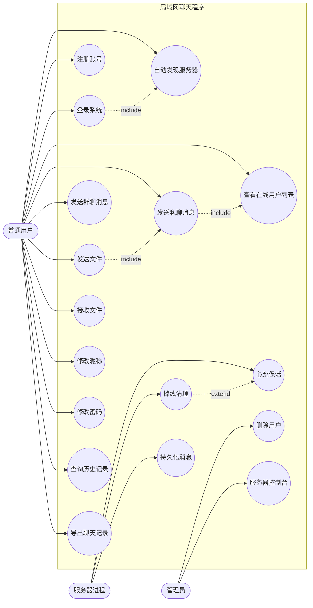

# 局域网聊天程序（题目 13：网络聊天程序）需求分析说明书

| 项目名称 | 局域网聊天程序（LanChat） |
| --- | --- |
| 项目编号 | 题目 13 —— 网络聊天程序 |
| 版本号 | v1.0 |
| 文档类型 | 需求分析说明书 |
| 编写语言 | Java SE（JDK 17 及以上，实际验证环境 JDK 21） |
| 界面技术 | Swing（Java 自带，无第三方框架） |

---

## 一、引言

### 1.1 编写目的

本文档面向 Java 课程设计的评审教师、项目开发者与后续维护者，用于完整描述「局域网聊天程序」的业务背景、功能边界、非功能指标与验收标准。文档是后续《系统设计说明书》《数据库与持久化设计说明书》以及测试用例设计的唯一需求来源（Single Source of Truth）：凡本文档未列出的功能，均视为本期不做范围。

本文档的具体用途如下：

1. 明确系统要做什么、不做什么，防止开发过程中的范围蔓延；
2. 为架构设计与模块划分提供可追溯的需求编号（FR / NFR）；
3. 为验收测试提供逐条可判定的验收标准与需求追踪矩阵；
4. 记录业务规则的具体量化约束（长度上限、超时阈值、并发上限等）。

### 1.2 项目背景

在机房、实训室、办公室等小型局域网环境中，用户之间经常需要快速交换文字信息与文件。公网即时通信软件在该类场景下存在明显不足：

1. 依赖互联网出口，机房断网或限制外网时完全不可用；
2. 聊天内容经由第三方服务器中转，不适合内部资料传输；
3. 需要注册公网账号，临时协作场景下账号体系冗余；
4. 无法在无外网环境下做教学演示与协议抓包分析。

因此本项目设计并实现一套运行于局域网内部的即时通信程序：在一台机器上启动服务器，同网段的其他机器启动客户端后即可自动发现服务器、注册账号、实时聊天与互传文件，整体交互体验对标 QQ 的局域网简化版。项目全程只使用 Java SE 标准库（含 Swing、NIO 基础类、JDBC），不使用任何第三方框架与构建工具，可用 `javac` 直接编译，符合课程设计对「语言基础能力覆盖度」的考核要求。

### 1.3 术语与缩写

| 术语 | 说明 |
| --- | --- |
| 客户端（Client） | 运行 `com.chat.client.ChatClientApp` 的用户端程序，提供 Swing 图形界面 |
| 服务器（Server） | 运行 `com.chat.server.ChatServer` 的中心节点，负责转发、在线管理与持久化 |
| 自动发现 | 客户端通过 UDP 广播查找同一局域网内可用服务器的机制 |
| 心跳 | 客户端周期性发送的存活探测消息，用于服务器判定连接是否掉线 |
| 私聊 | 一对一文本消息，接收者必须在线 |
| 群聊 | 一对多广播文本消息，所有在线用户均可见 |
| 文件传输 | 发送方将文件分块经服务器中继给接收方的过程，服务器不落盘 |
| 在线用户列表 | 服务器维护并推送给全部客户端的当前在线账号快照 |
| 凭据 | 用户密码的存储形式，由随机盐与 SHA-256 散列拼接而成 |
| SHA-256 | 安全散列算法，用于密码散列与文件完整性校验 |
| 分块 | 文件传输的最小数据单位，默认 64KB |
| 中继 | 服务器仅转发文件数据块，不在服务器磁盘留存文件内容 |

### 1.4 参考资料

1. 《Java 课程设计任务书》题目 13：网络聊天程序；
2. 项目内部设计约定：`docs/superpowers/specs/lanchat-core-design.md`；
3. 项目配置文件：`config/chat.properties`；
4. JDK 21 官方 API 文档（`java.net`、`java.io`、`java.util.concurrent`、`javax.swing`、`java.security`、`java.sql`）。

---

## 二、项目概述

### 2.1 建设目标

构建一个可在一台普通 PC 上零依赖启动、在同网段多机之间稳定运行的局域网即时通信系统，具体目标如下：

1. **零配置接入**：客户端启动后自动发现服务器，用户无需手工输入 IP 地址即可登录；
2. **完整的账号体系**：支持注册、登录、昵称修改、密码修改，用户名全局唯一且同一账号不允许重复登录；
3. **实时消息交互**：提供私聊与群聊两类文本通信，消息在局域网内端到端延迟低于 200 毫秒；
4. **可靠的文件互传**：支持最大 200MB 的文件传输，具备进度展示、完整性校验与断点异常处理；
5. **可追溯的聊天记录**：消息按天落盘，可按用户与时间范围查询、可按关键字检索、可导出为文本文件；
6. **可观测的服务器**：提供 Swing 控制台展示运行日志、在线用户表与服务启停控制；
7. **规范的安全基线**：密码加盐散列存储、身份不可伪造、路径不可穿越、SQL 不可注入；
8. **良好的工程结构**：按 `common / exception / util / dao / service / server / client` 分层，依赖方向单向，常量零硬编码。

### 2.2 系统范围

**本期包含（In Scope）**

1. 单服务器、多客户端的 C/S 结构局域网聊天；
2. 纯文本消息（私聊 / 群聊）与文件传输；
3. 文件型持久化（默认），以及可选的 MySQL 持久化；
4. Swing 图形界面（登录窗口、主窗口、私聊窗口、群聊窗口、文件传输窗口）；
5. UDP 自动发现、心跳保活、掉线清理、服务器控制台。

**本期不做（Non-Goals）**

1. 不实现音视频通话、屏幕共享、语音消息；
2. 不实现消息撤回、正在输入提示、已读回执、气泡表情与富媒体排版；
3. 不实现跨网段 / 公网穿透，不支持 NAT 后的服务器发现；
4. 不实现多服务器集群、负载均衡与数据库主从；
5. 不实现端到端加密通信（仅在口令存储与完整性校验层面做安全处理）；
6. 不实现移动端与 Web 端，仅提供 Java Swing 桌面客户端；
7. 不实现离线消息投递（接收者不在线时，私聊直接返回错误回执）。

### 2.3 用户角色

| 角色 | 描述 | 主要权限 |
| --- | --- | --- |
| 普通用户（USER） | 使用客户端进行日常通信的账号 | 注册、登录、私聊、群聊、文件收发、改昵称、改密码、查历史、导出记录 |
| 管理员（ADMIN） | 具备管理权限的账号，系统首次启动自动创建 `admin` | 普通用户全部权限，额外可删除其他用户 |
| 服务器运行者 | 启动并维护服务器进程的人员 | 启停服务器、查看日志、查看在线用户、观察连接数 |

说明：管理员不具备查看他人密码的能力，服务器数据库中仅保存不可逆散列，符合最小权限原则。

---

## 三、功能需求

功能需求编号规则为 `FR-序号`，优先级分为「高」（核心必做）、「中」（课程设计要求）、「低」（增强项）。验收方式列给出可判定的验收口径。

| 编号 | 功能名 | 描述 | 优先级 | 验收方式 |
| --- | --- | --- | --- | --- |
| FR-1 | 局域网自动发现 | 客户端向 UDP 广播端口发送 `LANCHAT_DISCOVER`，服务器以 `LANCHAT_ANNOUNCE\|服务器IP\|TCP端口\|在线人数` 应答；客户端枚举本机全部网卡广播地址逐一发送，自动填入服务器地址 | 高 | 服务器与客户端在同一网段时，客户端点击「自动发现」后 3 秒内填入服务器 IP 与端口 |
| FR-2 | 用户注册 | 校验用户名格式 `^[A-Za-z][A-Za-z0-9_]{2,15}$`、密码长度 6 至 32 位、昵称不超过 20 字符；用户名唯一；密码以随机盐 + SHA-256 散列后存储 | 高 | 合法信息注册成功并可立即登录；重名、格式非法、密码过短均返回明确中文错误 |
| FR-3 | 用户登录 | 校验用户名与密码（常量时间比较）；校验通过后将连接与用户名绑定，记录最近登录时间；同一账号重复登录被拒绝 | 高 | 正确凭据登录成功；错误密码提示「用户名或密码错误」；重复登录返回「该账号已在线」 |
| FR-4 | 在线用户列表实时刷新 | 服务器维护在线用户表，用户上线、下线、资料变更时向所有客户端推送最新快照；客户端支持手工刷新 | 高 | 任一客户端上线或下线后，其余客户端列表在 1 秒内自动更新 |
| FR-5 | 私聊 | 发送者选择在线用户发送文本，服务器校验接收者在线后定向转发，并回执发送方；对不在线的接收者返回错误提示 | 高 | 双向私聊消息可达，接收方离线时发送方收到失败回执 |
| FR-6 | 群聊 | 发送者发送群聊文本，服务器广播给除发送者外的全部在线用户，同时记录历史 | 高 | 三个客户端同时在线时，任一客户端发送的群消息在其余两个窗口全部可见 |
| FR-7 | 文件传输 | 发送方选择文件后发出 `FILE_REQUEST` 元信息（传输编号、文件名、大小、分块总数、SHA-256）；接收方确认后按 64KB 分块经服务器中继传输，结束后按 SHA-256 校验；服务器只中继不落盘 | 高 | 200MB 以内文件可完整传输并通过校验；接收方拒绝或传输中断时发送方收到明确结果 |
| FR-8 | 消息持久化与历史查询 | 所有文本与文件类消息按天写入 `data/history/yyyy-MM-dd.log`，支持按用户与时间范围查询、按关键字检索 | 中 | 重启服务器后仍可查询到历史消息；关键字检索返回命中记录 |
| FR-9 | 聊天记录导出 | 将查询结果导出为 UTF-8 文本文件，写入 `data/export/` 目录，文件名形如 `chat-用户名-时间戳.txt` | 中 | 导出文件存在、可打开、条数与提示一致 |
| FR-10 | 用户资料修改 | 支持修改昵称（不超过 20 字符）与修改密码（校验旧密码，新密码 6 至 32 位）；修改后广播资料变更通知 | 中 | 修改成功后重新登录生效，列表昵称同步刷新 |
| FR-11 | 管理员删除用户 | 仅管理员可删除指定用户；管理员不可删除自身，不可删除不存在的用户 | 中 | 管理员删除普通用户成功后该用户无法登录；普通用户调用该功能被拒绝 |
| FR-12 | 心跳检测与掉线清理 | 客户端每 15 秒发送心跳，服务器每 20 秒扫描一次，超过 60 秒无活跃的连接判定掉线并清理资源、广播下线通知 | 高 | 客户端进程被强制结束后，60 至 80 秒内服务器在线列表移除该用户 |
| FR-13 | 服务器控制台 | Swing 控制台展示服务器状态、监听地址与端口、在线用户表、实时日志，并提供启动与停止按钮 | 中 | 启动后控制台可见日志滚动与在线用户表更新，停止按钮可正常释放端口 |
| FR-14 | 默认管理员自动创建 | 服务器首次启动时若不存在 `admin` 账号则按配置密码创建管理员 | 中 | 首次启动后可用 `admin` 与配置口令登录，且具备删除用户权限 |
| FR-15 | 异常回执与错误提示 | 所有可预期的业务失败（未登录操作、接收者不存在、文件超限、校验失败等）返回带原因的中文提示，不抛裸异常到界面 | 高 | 各异常场景界面提示可读，进程不崩溃 |
| FR-16 | 消息长度与格式约束 | 单条消息最长 2000 字符，超长消息被拒绝并提示 | 低 | 输入 2001 字符消息时提示超出长度限制 |
| FR-17 | 命令行启动模式 | 客户端支持 `--local-server`（本机同时启动服务器）与 `--help`；服务器支持 `--console` 控制台模式 | 低 | 三个参数均按预期工作 |

### 3.1 关键业务规则

| 编号 | 规则 | 判定方式 |
| --- | --- | --- |
| BR-1 | 用户名唯一，格式为 3 至 16 位、以字母开头、仅含字母数字与下划线 | 正则 `^[A-Za-z][A-Za-z0-9_]{2,15}$` |
| BR-2 | 同一账号在同一时刻只允许一个在线连接 | 在线表 `putIfAbsent` 原子注册，失败即拒绝 |
| BR-3 | 私聊接收者必须在线，否则回执错误 | 在线表查询为空即返回失败 |
| BR-4 | 单文件不超过 200MB | 传输前校验 `file.length()` |
| BR-5 | 单条消息不超过 2000 字符 | 发送前长度校验 |
| BR-6 | 昵称不超过 20 字符，允许为空时回退为用户名 | 修改资料时校验 |
| BR-7 | 密码长度 6 至 32 位，存储时加随机盐做 SHA-256 | 注册与改密时校验 |
| BR-8 | 消息发送者以服务器侧登录身份为准，客户端传入的发送者字段被强制覆盖 | 服务器处理文本消息时覆盖并校验 |
| BR-9 | 接收文件名必须去除路径成分，禁止目录穿越 | `sanitizeFileName` 清洗，重名自动追加序号 |
| BR-10 | 管理员默认账号 `admin`，初始口令由配置文件提供，首次启动自动创建 | 初始化逻辑 |
| BR-11 | 文件接收必须逐块连续，块序号错乱即终止并删除残缺文件 | 接收端块序号连续性校验 |

---

## 四、非功能需求

非功能需求编号规则为 `NFR-序号`，每项均给出可量化、可测量的指标。

| 编号 | 类别 | 需求描述 | 量化指标 | 验证方式 |
| --- | --- | --- | --- | --- |
| NFR-1 | 性能 | 局域网内消息端到端延迟 | 千兆局域网下私聊与群聊消息单向延迟不超过 200 毫秒 | 集成测试计时统计 |
| NFR-2 | 性能 | 并发在线能力 | 单服务器支持不少于 200 个并发连接，业务线程池核心 8 线程、队列容量 1000 | 连接数压测与配置核对 |
| NFR-3 | 性能 | 文件传输吞吐 | 64KB 分块传输，100MB 文件在千兆局域网下 30 秒内完成 | 传输计时 |
| NFR-4 | 性能 | 历史查询响应 | 查询最近 7 天记录在 10 万条消息规模下不超过 2 秒 | 历史查询计时 |
| NFR-5 | 性能 | 客户端启动时间 | 从执行命令到登录窗口可见不超过 3 秒 | 人工计时 |
| NFR-6 | 可靠性 | 掉线检测时效 | 连接异常断开后 60 至 80 秒内完成清理与列表广播 | 杀进程实验 |
| NFR-7 | 可靠性 | 数据写入原子性 | 用户表刷盘采用「临时文件 + ATOMIC_MOVE」，任意时刻磁盘上均为完整文件 | 写入中断实验与代码审查 |
| NFR-8 | 可靠性 | 文件完整性 | 接收端 SHA-256 与发送端一致率 100%，不一致时删除残缺文件 | 篡改分块实验 |
| NFR-9 | 可靠性 | 长连接稳定性 | 连续在线 8 小时无内存增长导致的 OOM，对象流定期 `reset()` | 长稳观察与内存采样 |
| NFR-10 | 可靠性 | 单点异常隔离 | 单个客户端异常不导致服务器退出，accept 循环对瞬时异常具备容错 | 异常客户端注入测试 |
| NFR-11 | 易用性 | 操作步骤 | 首次使用从启动到发送首条消息不超过 3 步（发现、登录、发送） | 用户操作走查 |
| NFR-12 | 易用性 | 界面语言与提示 | 全部界面文案与错误提示为中文，不使用技术术语堆砌 | 界面走查 |
| NFR-13 | 易用性 | 状态可见性 | 连接状态、传输进度、在线人数在界面上实时可见 | 界面走查 |
| NFR-14 | 安全性 | 口令存储 | 一律加随机盐做 SHA-256 存储，禁止明文或裸散列 | 数据文件检查 |
| NFR-15 | 安全性 | 口令比对 | 使用常量时间比较，避免响应时间侧信道 | 代码审查 |
| NFR-16 | 安全性 | 身份不可伪造 | 服务器以连接绑定的登录名覆盖消息发送者字段 | 伪造发送者实验 |
| NFR-17 | 安全性 | 输入与注入防护 | 用户名与消息长度白名单校验；JDBC 全部使用 `PreparedStatement`；文件路径做目录穿越清洗 | 恶意输入实验与代码审查 |
| NFR-18 | 安全性 | 敏感信息脱敏 | 密码散列与盐不随在线列表下发（`clearCredential`），日志不输出口令与散列 | 抓包与日志检查 |
| NFR-19 | 可维护性 | 分层结构 | 按 common / exception / util / dao / service / server / client 分层，依赖方向单向 | 架构走查 |
| NFR-20 | 可维护性 | 零硬编码 | 端口、路径、阈值、格式串集中在 `Constants` 与 `Config`，业务代码不出现魔法值 | 代码审查 |
| NFR-21 | 可维护性 | 注释完备 | 公开类与方法具备 Javadoc，复杂逻辑有「为什么」注释，全中文 | 代码审查 |
| NFR-22 | 可移植性 | 运行环境 | JDK 17 及以上均可编译运行，在 JDK 21 验证 | 编译运行 |
| NFR-23 | 可移植性 | 跨平台 | 支持 Windows、Linux、macOS，路径使用 `File.separator`，文本统一 UTF-8 | 多平台启动 |
| NFR-24 | 可移植性 | 依赖零外置 | 默认文件型持久化不依赖数据库与任何第三方 jar，`javac` 直接编译 | 全新环境编译 |
| NFR-25 | 可测试性 | 自动化测试 | 单元测试覆盖工具类、DAO、Service，集成测试覆盖端到端流程 | 测试报告 |

---

## 五、用例模型

### 5.1 用例图

下图给出系统的参与者与用例关系。普通用户与管理员共享绝大部分用例，管理员额外拥有「删除用户」用例；服务器进程作为被动参与者承载心跳扫描、掉线清理与持久化等后台用例。



### 5.2 用例描述

#### 5.2.1 UC-03 用户登录

| 项目 | 内容 |
| --- | --- |
| 用例编号 | UC-03 |
| 用例名称 | 用户登录 |
| 参与者 | 普通用户、管理员、服务器 |
| 目标 | 用户通过凭据认证进入系统，并获得在线状态 |
| 前置条件 | 服务器已启动并监听 TCP 端口；客户端已完成自动发现或手工填写服务器地址；账号已注册 |
| 触发条件 | 用户在登录窗口点击「登录」按钮 |
| 基本流程 | 1. 客户端建立 TCP 连接，而后先构造对象输出流并 flush，再构造对象输入流；2. 客户端发送 `LOGIN` 消息，携带用户名与明文密码；3. 服务器读取该连接的首个登录帧，调用 `UserService.login`；4. 服务层按用户名查询持久化数据，取出盐与散列；5. 以相同盐重新计算 SHA-256 并使用常量时间比较校验；6. 校验通过后由 `UserManager` 以 `putIfAbsent` 注册在线连接；7. 更新最近登录时间并刷盘；8. 服务器返回 `LOGIN_RESULT`，内容编码为「成功标志\|说明\|用户名\|昵称\|角色」；9. 服务器向全部在线用户广播用户列表快照与上线系统通知；10. 客户端解析结果，关闭登录窗口并打开主窗口 |
| 异常流程 | A1 用户名不存在或密码错误：返回失败结果，前端统一提示「用户名或密码错误」，不区分具体原因以防账号枚举；A2 账号已在线：返回失败结果「该账号已在线，请勿重复登录」；A3 服务器未启动：连接超时 3 秒后提示「无法连接服务器」；A4 连接在认证前断开：服务器释放连接，不产生在线记录 |
| 后置条件 | 成功时该账号出现在在线用户列表中，`lastLoginTime` 已更新，客户端进入主界面；失败时连接保持或关闭，不改变在线表 |
| 业务规则 | BR-1、BR-2、BR-7、BR-10 |
| 关联需求 | FR-3、FR-4、FR-14、FR-15、NFR-14、NFR-15、NFR-16 |

#### 5.2.2 UC-05 发送私聊消息

| 项目 | 内容 |
| --- | --- |
| 用例编号 | UC-05 |
| 用例名称 | 发送私聊消息 |
| 参与者 | 发送者、接收者、服务器 |
| 目标 | 将一条文本消息仅投递给指定在线用户 |
| 前置条件 | 发送者与接收者均已登录；双方存在于服务器在线用户表 |
| 触发条件 | 发送者在私聊窗口输入内容并按回车或点击「发送」 |
| 基本流程 | 1. 客户端校验内容非空且不超过 2000 字符；2. 通过界面的富文本渲染区先本地回显自己发送的消息；3. 客户端发送 `TEXT_PRIVATE` 类型的 `TextMessage`；4. 服务器连接处理线程校验连接已登录；5. 服务器以连接绑定的用户名强制覆盖消息的 `sender` 字段；6. 服务器查询在线用户表确认接收者在线；7. 服务器将消息定向转发给接收者的连接；8. 服务器将消息追加写入当天的历史日志文件；9. 服务器向发送方回执系统提示；10. 接收方客户端接收线程解析后交给私聊窗口渲染，并在需要时闪烁提示 |
| 异常流程 | A1 接收者不在线：服务器返回错误回执「用户不在线」，消息不转发；A2 发送者未登录即发送：服务器拒绝并返回未登录错误；A3 内容为空或超长：客户端与服务器双重校验并提示；A4 接收方连接在转发瞬间断开：发送失败被记录并计入服务器事件日志，发送方收到失败提示 |
| 后置条件 | 成功时双方界面均可见该消息，历史日志新增一条记录 |
| 业务规则 | BR-3、BR-5、BR-8 |
| 关联需求 | FR-5、FR-8、FR-15、NFR-1、NFR-16 |

#### 5.2.3 UC-07 发送文件

| 项目 | 内容 |
| --- | --- |
| 用例编号 | UC-07 |
| 用例名称 | 发送文件 |
| 参与者 | 发送者、接收者、服务器 |
| 目标 | 将本地文件完整、可校验地传输到接收方并落盘 |
| 前置条件 | 双方均已登录；发送者已选定一个存在、可读、体积不超过 200MB 的普通文件；接收者在线 |
| 触发条件 | 发送者在文件传输窗口选择文件并点击「发送」 |
| 基本流程 | 1. 客户端计算文件大小、分块总数与 SHA-256，生成传输编号（UUID）；2. 客户端发送 `FILE_REQUEST` 元信息消息；3. 服务器校验接收者在线后中继该请求；4. 接收方弹出确认窗口，用户点击「接收」；5. 接收方创建接收会话并在接收目录生成不重名的目标文件；6. 接收方返回 `FILE_ACCEPT`；7. 发送方在独立线程中按块序号顺序读取 64KB 数据并发送 `FILE_CHUNK`；8. 每块经服务器中继到接收方，接收方校验块序号连续性后顺序落盘并更新进度条；9. 全部块发送完毕后发送 `FILE_END`，携带总大小与 SHA-256；10. 接收方关闭文件流，重新计算 SHA-256 并与期望值比对；11. 接收方返回 `FILE_RESULT` 表示成功；12. 双方更新界面提示，服务器在事件日志记录传输信息 |
| 异常流程 | A1 文件超过 200MB 或不可读：发送前直接拒绝并提示；A2 接收者拒绝：接收方返回 `FILE_REJECT` 与原因，发送方停止传输；A3 接收者不在线：服务器返回错误回执，传输不建立；A4 块序号不连续或写入失败：接收方立即取消会话并删除残缺文件，返回失败结果；A5 SHA-256 校验不一致：接收方删除残缺文件并回执校验失败；A6 传输过程中连接断开：双方会话被清理，临时文件被删除 |
| 后置条件 | 成功时文件完整保存在接收目录且校验通过；失败时不残留残缺文件 |
| 业务规则 | BR-4、BR-9、BR-11 |
| 关联需求 | FR-7、FR-15、NFR-3、NFR-8、NFR-17 |

### 5.3 需求追踪矩阵

| 需求编号 | 对应用例 | 设计落点 | 测试覆盖 |
| --- | --- | --- | --- |
| FR-1 | UC-01 | `DiscoveryClient`、`DiscoveryResponder` | 集成测试（发现与连接） |
| FR-2 | UC-02 | `UserService.register`、`UserDaoImpl` | `UserServiceTest`、`UserDaoTest` |
| FR-3 | UC-03 | `ClientHandler.handleLogin`、`UserManager.register` | `UserServiceTest`、集成测试 |
| FR-4 | UC-04 | `UserManager.broadcastUserList`、`UserListCodec` | 集成测试（列表刷新） |
| FR-5 | UC-05 | `ClientHandler.handleTextMessage`、`PrivateChatUI` | 集成测试（私聊） |
| FR-6 | UC-06 | `UserManager.broadcastText`、`GroupChatUI` | 集成测试（群聊） |
| FR-7 | UC-07 | `FileService`、`FileTransferUI` | `FileServiceTest`、集成测试（文件传输） |
| FR-8 | UC-11 | `MessageService`、`MessageDaoImpl` | `MessageServiceTest` |
| FR-9 | UC-12 | `MessageService.exportHistory`、`MessageDaoImpl.exportTo` | `MessageServiceTest` |
| FR-10 | UC-09、UC-10 | `UserService.updateNickname` / `updatePassword` | `UserServiceTest` |
| FR-11 | UC-13 | `UserService.deleteUser` | `UserServiceTest` |
| FR-12 | UC-14、UC-15 | `ChatServer.scanIdleConnections`、`ClientHandler.isTimeout` | 集成测试（掉线刷新） |
| FR-13 | UC-17 | `ServerUI`、`ServerObserver` | 人工验证 |
| FR-14 | UC-03 | `UserService.initAdminIfAbsent` | `UserServiceTest` |
| FR-15 | 全部异常流程 | `Result`、`ChatException` 体系 | `UserServiceTest`、集成测试（异常场景） |
| FR-16 | UC-05、UC-06 | `Constants.MESSAGE_MAX_LENGTH` | `MessageServiceTest` |
| FR-17 | 启动流程 | `ChatClientApp`、`ChatServer.main` | 人工验证 |

---

## 六、运行环境要求

### 6.1 软硬件环境

| 项目 | 最低要求 | 建议配置 | 说明 |
| --- | --- | --- | --- |
| 操作系统 | Windows 10 / Ubuntu 20.04 / macOS 11 | 同左 | 纯 Java 实现，不依赖平台特性 |
| JDK | JDK 17 | JDK 21 | 实际编译与测试在 JDK 21 完成，源码未使用 17 以上预览特性 |
| 内存 | 512MB 可用堆 | 2GB 以上 | 文件分块缓冲为 64KB，内存占用随连接数线性缓慢增长 |
| 磁盘 | 300MB | 5GB 以上 | 需容纳聊天日志、接收文件与导出文件，单文件上限 200MB |
| 网络 | 支持广播的以太网或 Wi-Fi 局域网 | 千兆局域网 | 客户端与服务器需在同一二层网段，UDP 广播可直达 |
| 端口 | TCP 9527、UDP 30000 | 可配置 | 若被占用或被防火墙拦截，需在 `config/chat.properties` 中调整并放行 |

### 6.2 编译与运行命令

环境要求只使用 JDK 自带工具链，无需 Maven 或 Gradle。

```bash
# 1. 编译全部主源码（UTF-8 编码，输出到 build/classes）
find src/main/java -name "*.java" > build/sources.txt
javac -encoding UTF-8 -d build/classes @build/sources.txt

# 2. 启动服务器（默认图形控制台）
java -cp build/classes com.chat.server.ChatServer

# 3. 启动服务器（纯控制台模式，适合无图形界面的 Linux 服务器）
java -cp build/classes com.chat.server.ChatServer --console

# 4. 启动客户端（自动发现服务器）
java -cp build/classes com.chat.client.ChatClientApp

# 5. 启动客户端并在本机同时拉起服务器，适合单机演示
java -cp build/classes com.chat.client.ChatClientApp --local-server

# 6. 查看客户端帮助
java -cp build/classes com.chat.client.ChatClientApp --help
```

### 6.3 配置项要求

配置文件为 `config/chat.properties`（UTF-8 编码），全部配置项均可选，缺省时使用 `Constants` 内置默认值。数据目录可通过配置项 `data.dir` 或系统属性 `lanchat.data.dir` 覆盖，便于在只读目录或多实例场景下隔离数据。

| 配置项 | 默认值 | 作用 |
| --- | --- | --- |
| `server.port` | 9527 | 服务器 TCP 监听端口 |
| `discovery.port` | 30000 | UDP 自动发现端口 |
| `heartbeat.interval.ms` | 15000 | 客户端心跳间隔 |
| `file.received.dir` | `./data/received` | 接收文件保存目录 |
| `file.max.size` | 209715200 | 单文件大小上限（字节） |
| `admin.password` | `admin123` | 首次启动创建管理员的初始口令，登录后应立即修改 |
| `db.enabled` | false | 是否启用 MySQL 持久化 |
| `db.driver` / `db.url` / `db.username` / `db.password` | MySQL 默认值 | JDBC 连接参数，仅在 `db.enabled=true` 时生效 |

### 6.4 防火墙与网络注意事项

1. 服务器所在主机需放行 TCP 9527 入站；若客户端使用自动发现，还需放行 UDP 30000；
2. 部分操作系统默认拦截 UDP 广播，需在首次运行时允许 Java 程序通过防火墙；
3. 多网卡主机（同时连接有线与无线）由客户端枚举全部网卡广播地址逐一发送发现报文，避免只广播到错误网卡；
4. 服务器应答报文中的回环地址会被客户端过滤，防止把 `127.0.0.1` 当作可用服务器地址。

---

## 七、需求验收标准

系统通过验收需同时满足以下条件：

1. 全部 46 个主源码文件在 JDK 21 下编译零错误、零警告阻塞；
2. 47 个单元测试用例全部通过，覆盖 `SecurityUtilTest`、`UserDaoTest`、`UserServiceTest`、`MessageServiceTest`、`FileServiceTest`；
3. 7 个集成测试用例全部通过，覆盖真实启动服务器与多客户端下的登录、用户列表刷新、私聊、群聊、文件传输、下线刷新与异常场景；
4. 本文档第三章全部「高」优先级功能需求可现场演示通过；
5. 全部非功能需求指标可通过现场实验或代码走查确认；
6. 三个典型用例（登录、私聊、文件传输）的异常流程可复现且提示可读，进程不崩溃。

---

## 八、风险与假设

| 编号 | 风险或假设 | 触发条件 | 应对策略 |
| --- | --- | --- | --- |
| R-1 | 局域网广播被防火墙或交换机隔离 | 客户端自动发现超时 | 提供手工填写服务器地址的兜底输入框；文档说明需放行 UDP 端口 |
| R-2 | 多网卡导致广播发送到错误网段 | 主机同时接入有线与无线 | 枚举全部网卡广播地址逐一发送，并以服务器应答中的回环过滤保证地址可用 |
| R-3 | 长连接对象流持有已发送对象引用导致内存增长 | 长时间高频发送消息 | 每次写入后 `out.reset()`，断开对象引用缓存 |
| R-4 | 文件传输过程中断产生残缺文件 | 客户端崩溃或网络抖动 | 接收侧严格校验块序号与 SHA-256，失败即删除残缺文件并回执 |
| R-5 | 用户表写入过程中断电导致文件损坏 | 刷盘期间进程被终止 | 临时文件 + `ATOMIC_MOVE` 原子替换，保证读到的始终是完整文件 |
| R-6 | UDP 广播不可靠导致发现失败 | 丢包 | 客户端支持多次发送与手工输入地址，不把发现作为唯一入口 |
| R-7 | 服务端口被其他程序占用 | 服务器启动抛绑定异常 | 启动失败时回滚资源并在控制台与事件日志给出明确提示，可通过配置换端口 |
| R-8 | 历史日志按天切分在跨天时写入 | 消息时间戳跨零时 | 以消息时间戳决定目标文件，查询时按日期范围选择文件列表 |
