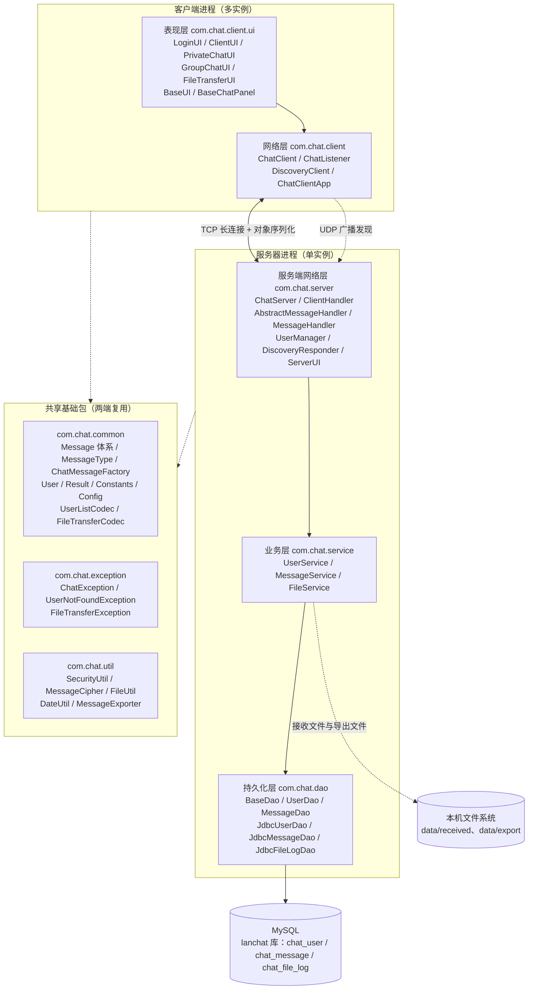
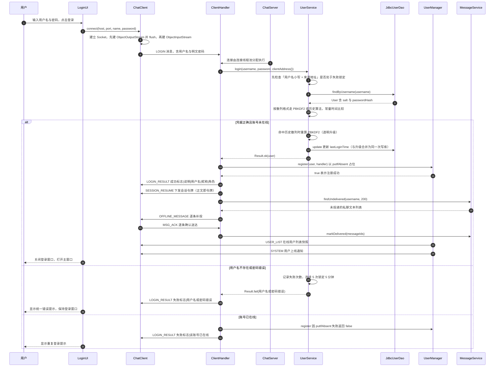
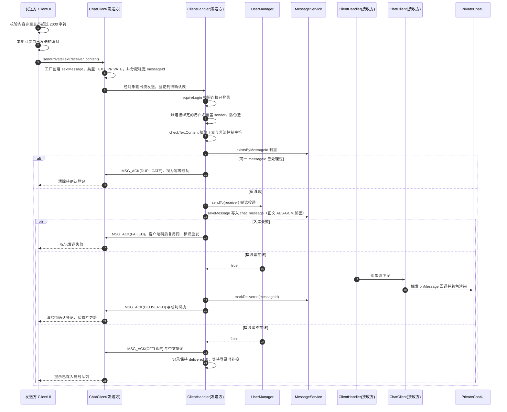
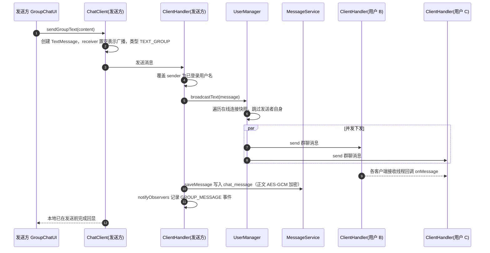
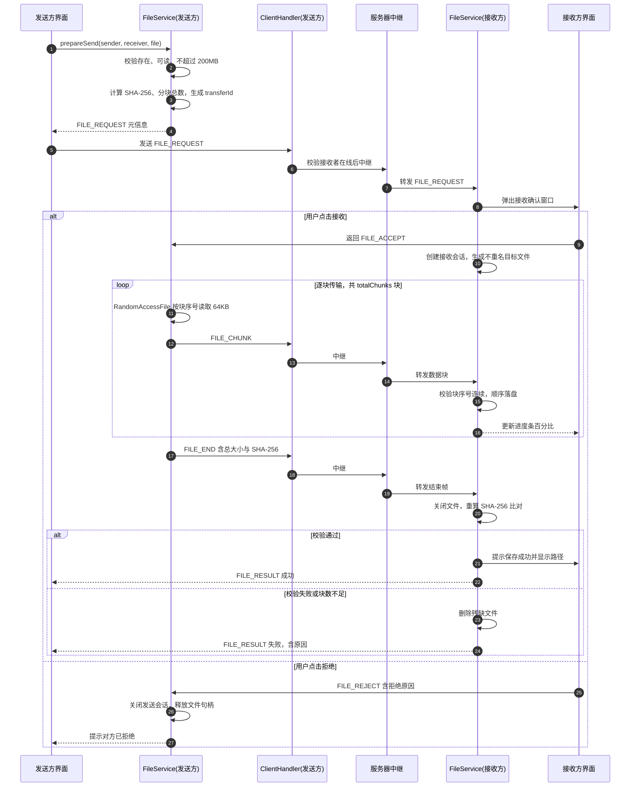
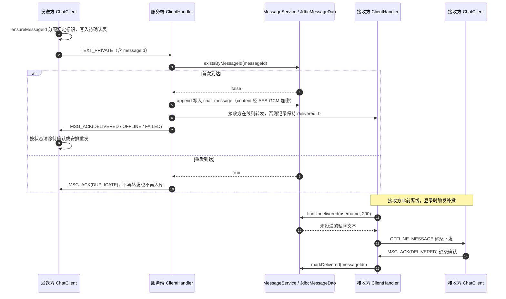
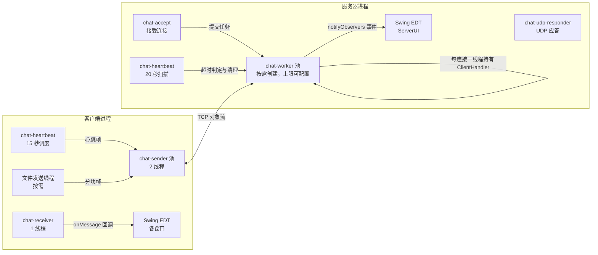
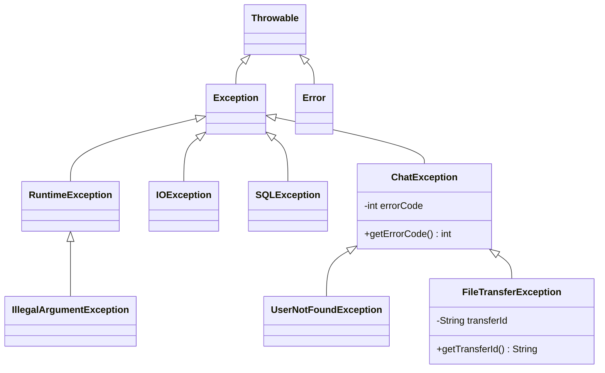

# 局域网聊天程序（题目 13：网络聊天程序）系统设计说明书

| 项目名称 | 局域网聊天程序（LanChat） |
| --- | --- |
| 版本号 | v1.0 |
| 文档类型 | 系统设计说明书（概要设计 + 详细设计） |
| 依据文档 | `docs/design/01-需求分析.md` |
| 主源码规模 | 59 个文件，18894 行（其中界面皮肤包 6 个文件、1305 行） |
| 测试结论 | 47 个单元测试、7 个集成测试与界面组件级离屏渲染校验全部通过 |

---

## 一、设计目标与原则

### 1.1 设计目标

在满足《需求分析说明书》全部功能与非功能指标的前提下，追求结构清晰、职责单一、易于演示与讲解的工程实现。设计目标按优先级排列如下：

1. **正确性优先**：消息不丢、不串号、不伪造；文件传输必须可校验、可回滚；
2. **依赖最小化**：仅使用 Java SE 标准库与 JDBC，`javac` 直接编译，持久化只走 MySQL（数据库不可用或加密口令缺失时拒绝启动）；
3. **分层解耦**：网络、业务、持久化、界面互不越界，依赖方向严格单向；
4. **可观察可讲解**：服务器侧有事件回调与控制台，关键路径有中文日志，便于课程答辩演示；
5. **可扩展**：新增消息类型、新增 DAO 实现均不需改动网络层与界面层。

### 1.2 设计原则

| 原则 | 落地方式 |
| --- | --- |
| 单一职责 | 每个类只做一件事：`ChatClient` 只管网络、`UserService` 只管业务、`JdbcUserDao` 只管数据库读写 |
| 依赖倒置 | 业务层依赖 `UserDao` / `MessageDao` 接口，不依赖具体实现，更换存储实现时业务规则零改动 |
| 开闭原则 | 新增消息类型只需扩展枚举与模板方法分支；新增存储只需实现 DAO 接口 |
| 最少知识 | 服务器只暴露必要方法；客户端不感知持久化细节 |
| 恒定无魔法值 | 端口、路径、阈值、格式串集中在 `Constants`，运行期可覆盖项集中在 `Config` |
| 安全默认收紧 | 口令走 PBKDF2、正文落盘加密、反序列化白名单、登录失败限流；安全关键配置缺失时拒绝启动而非降级 |
| 失败快速且可读 | 业务失败统一用 `Result` 表达并携带中文原因；基础设施故障抛 `ChatException` 体系 |

---

## 二、总体架构

### 2.1 架构图

系统采用经典 C/S（Client/Server）分层架构。客户端与服务器共享 `common`、`exception`、`util` 三个基础包，网络传输统一使用 Java 原生对象序列化承载 `Message` 对象；`dao` 层负责持久化，`service` 层承载业务规则，`server` 与 `client` 分列两端。

### 2.2 分层职责与依赖方向

依赖方向严格单向：`client/server -> service -> dao -> common/util/exception`，`common/util/exception` 不依赖任何上层包。反向依赖被明确禁止。

| 层次 | 包名 | 职责 | 不允许做的事 |
| --- | --- | --- | --- |
| 通信模型层 | `com.chat.common` | 定义消息模型、用户实体、协议枚举、编解码器、常量与配置、通用返回封装 | 不允许出现 Socket、JDBC、Swing 相关代码 |
| 异常层 | `com.chat.exception` | 定义业务异常体系与错误码 | 不允许依赖上层包 |
| 工具层 | `com.chat.util` | 口令散列与常量时间比较、正文加解密、文件工具、导出渲染、时间格式化等无状态工具 | 不允许持有可变全局状态 |
| 持久化层 | `com.chat.dao` | 用户、消息与文件传输日志的数据库读写（全部为 JDBC 实现） | 不允许写业务规则（如密码校验、在线判定） |
| 业务层 | `com.chat.service` | 注册、登录（含失败限流与散列透明升级）、改密、删除用户、历史查询与导出渲染、文件分块与校验、传输日志登记 | 不允许直接操作 Socket 与 Swing |
| 服务端网络层 | `com.chat.server` | 监听连接、连接会话管理、消息分派与转发、在线表维护、会话令牌、UDP 应答、控制台 | 不允许直接操作数据库（经 service） |
| 客户端表现层 | `com.chat.client` 与 `com.chat.client.ui` | 网络收发、监听回调、Swing 界面与消息渲染 | 不允许直接访问 DAO |

通信与数据流可概括为：客户端界面产生用户意图 -> `ChatClient` 组装 `Message` -> TCP 对象流 -> 服务器 `ClientHandler` 分派 -> `UserManager` 转发或 `Service` 处理 -> `DAO` 写库 -> 结果沿原路回执。服务器在整个链路中始终是唯一可信的仲裁者。

---

## 三、模块划分

| 模块 | 职责 | 关键类 | 主要协作对象 |
| --- | --- | --- | --- |
| 消息模型模块 | 定义可序列化的消息家族与类型枚举 | `Message`、`TextMessage`、`FileMessage`、`SystemMessage`、`MessageType` | 全部网络传输路径 |
| 消息工厂模块 | 统一生成消息编号与稳定消息 ID、装配类型、校验字段边界，并提供反序列化白名单 | `ChatMessageFactory`（`AtomicLong` 生成编号、`checkTextContent`、`splitFields`、`serializationFilter`） | 服务端、客户端、DAO 读写 |
| 用户实体模块 | 承载账号资料与凭据，支持序列化与脱敏 | `User`、`UserListCodec` | `UserService`、`UserManager` |
| 配置与常量模块 | 集中管理默认值、路径、端口、阈值与运行期配置 | `Constants`、`Config` | 全部模块 |
| 通用返回模块 | 以泛型封装「成功标志 + 消息 + 数据」 | `Result<T>` | `Service` 层全部公开方法 |
| 文件传输编码模块 | 文件请求元信息的文本编解码，用于界面与回执展示 | `FileTransferCodec` | `ChatClient`、`ClientHandler` |
| 异常模块 | 业务异常基类与两个具体异常，携带错误码与传输编号 | `ChatException`、`UserNotFoundException`、`FileTransferException` | `Service`、`DAO` |
| 工具模块 | 口令 PBKDF2 散列与常量时间比较、正文 AES-GCM 加解密、文件大小与校验、导出文本渲染、时间格式化 | `SecurityUtil`、`MessageCipher`、`FileUtil`、`MessageExporter`、`DateUtil` | 业务层、DAO |
| 用户持久化模块 | 用户表的数据库读写（JDBC 实现），构造时探测可用性 | `BaseDao<T,ID>`、`UserDao`、`JdbcUserDao` | `UserService` |
| 消息持久化模块 | 消息入库与查询、按消息 ID 去重、未投递记录查询与标记、分页查询、导出文本落盘 | `MessageDao`、`JdbcMessageDao`、`MessageExporter` | `MessageService` |
| 文件传输日志模块 | 每次文件传输结果写入 `chat_file_log` | `JdbcFileLogDao`、`FileLogService` | `ClientHandler` |
| 用户业务模块 | 注册、登录（限流与透明升级）、改昵称、改密码、删除用户、查询与初始化管理员 | `UserService` | `UserDao` |
| 消息业务模块 | 消息保存与去重、历史查询、检索、未投递补投、导出渲染 | `MessageService` | `MessageDao` |
| 文件业务模块 | 发送准备、分块构造、接收会话、断点校验、进度计算 | `FileService` | `FileUtil`、`SecurityUtil` |
| 服务器核心模块 | 单例服务器、端口监听、线程池、心跳扫描、业务服务延迟初始化 | `ChatServer` | `UserManager`、`ClientHandler` |
| 连接处理模块 | 每连接一线程的会话，负责流初始化、登录认证、消息分派与转发、身份覆盖 | `ClientHandler`、`AbstractMessageHandler`、`MessageHandler` | `ChatServer`、`UserManager` |
| 在线管理模块 | 在线表维护、定向发送、广播、观察者通知 | `UserManager`、`ServerObserver` | `ClientHandler`、`ServerUI` |
| 自动发现模块 | UDP 广播应答与客户端广播探测 | `DiscoveryResponder`、`DiscoveryClient` | `ChatServer`、`ChatClient` |
| 服务器控制台模块 | Swing 控制台展示日志与在线用户，控制启停 | `ServerUI` | `ChatServer`、`UserManager` |
| 客户端网络模块 | 连接、发送线程池、接收线程、心跳调度、监听器回调、文件发送线程 | `ChatClient`、`ChatListener` | `common`、`service`（仅 `FileService` 用于组块） |
| 客户端界面模块 | 登录、主窗口、私聊、群聊、文件传输、富文本渲染基类，以及界面轮次进行中的消息块渲染组件 | `BaseUI`、`BaseChatPanel`、`MessageBubble`（进行中）、`LoginUI`、`ClientUI`、`PrivateChatUI`、`PrivateChatPanel`、`GroupChatUI`、`GroupChatPanel`、`FileTransferUI` | `ChatClient` |
| 客户端入口模块 | 参数解析、可选本机服务器、启动登录界面 | `ChatClientApp` | `ChatServer`、`LoginUI` |

---

## 四、类设计

### 4.1 完整类图

```mermaid
classDiagram
    direction LR

    %% ========== 消息模型 ==========
    class Message {
        <<abstract>>
        -long id
        -String messageId
        -MessageType type
        -String sender
        -String receiver
        -LocalDateTime timestamp
        +getId() long
        +setId(long) void
        +getMessageId() String
        +ensureMessageId() String
        +getType() MessageType
        +setType(MessageType) void
        +getSender() String
        +setSender(String) void
        +getReceiver() String
        +setReceiver(String) void
        +getTimestamp() LocalDateTime
        +getSummary()* String
        +isBroadcast() boolean
    }
    class TextMessage {
        -String content
        +getContent() String
        +getSummary() String
    }
    class FileMessage {
        -String transferId
        -String fileName
        -long fileSize
        -int totalChunks
        -int chunkIndex
        -byte[] data
        -String sha256
        -boolean accepted
        -String message
        +getFileName() String
        +getSha256() String
        +failReason() String
        +getSummary() String
    }
    class SystemMessage {
        -String content
        +getContent() String
        +getSummary() String
    }
    class MessageType {
        <<enumeration>>
        REGISTER
        LOGIN
        LOGIN_RESULT
        TEXT_PRIVATE
        TEXT_GROUP
        USER_LIST
        FILE_REQUEST
        FILE_CHUNK
        FILE_END
        FILE_RESULT
        HEARTBEAT
        SYSTEM
        +fromName(String) MessageType
    }
    class ChatMessageFactory {
        <<utility>>
        -AtomicLong SEQUENCE
        +int MAX_FIELD_COUNT
        +checkTextContent(String) String
        +splitFields(String) String[]
        +hasIllegalControlChar(String) boolean
        +serializationFilter() ObjectInputFilter
        +text(String, String, String, MessageType) TextMessage
        +system(String, String) SystemMessage
        +error(String, String) SystemMessage
        +file(String, String, MessageType) FileMessage
        +control(String, String, MessageType) SystemMessage
    }

    Message <|-- TextMessage
    Message <|-- FileMessage
    Message <|-- SystemMessage
    Message --> MessageType
    ChatMessageFactory ..> Message

    %% ========== 通用返回与实体 ==========
    class Result~T~ {
        -boolean success
        -String message
        -T data
        +ok(T) Result~T~
        +fail(String) Result~T~
        +isSuccess() boolean
        +getData() T
    }
    class User {
        -String username
        -String nickname
        -String passwordHash
        -String salt
        -String role
        -LocalDateTime createTime
        -LocalDateTime lastLoginTime
        -boolean online
        +isAdmin() boolean
        +clearCredential() void
        +getDisplayName() String
    }
    class UserListCodec {
        <<utility>>
        +encode(List~User~) String
        +decode(String) List~User~
    }
    class FileTransferCodec {
        <<utility>>
        +encode(FileMessage) String
        +decode(String, String, String) FileMessage
    }
    UserListCodec ..> User
    FileTransferCodec ..> FileMessage

    %% ========== 异常 ==========
    class Exception
    class ChatException {
        -int errorCode
        +getErrorCode() int
    }
    class UserNotFoundException
    class FileTransferException {
        -String transferId
        +getTransferId() String
    }
    Exception <|-- ChatException
    ChatException <|-- UserNotFoundException
    ChatException <|-- FileTransferException

    %% ========== 工具 ==========
    class SecurityUtil {
        <<utility>>
        +generateSalt() String
        +hashPassword(String, String) String
        +encode(String) String
        +verifyPassword(String, String, String) boolean
        +isLegacyHash(String) boolean
        +extractSalt(String) String
        +extractHash(String) String
        +sha256Hex(byte[]) String
    }
    class MessageCipher {
        <<utility>>
        +encrypt(String) String
        +decrypt(String) String
        +isEncrypted(String) boolean
    }
    class FileUtil {
        <<utility>>
        +humanSize(long) String
        +sha256(File) String
        +chunkCount(long, int) int
        +offsetOf(int, int) long
        +uniqueTarget(String, String) File
        +sanitizeFileName(String) String
        +ensureDir(String) File
    }
    class DateUtil {
        <<utility>>
        +format(LocalDateTime) String
        +parse(String) LocalDateTime
        +dayKey(LocalDateTime) String
        +formatDuration(long) String
    }

    %% ========== DAO ==========
    class BaseDao~T,ID~ {
        <<interface>>
        +save(T) boolean
        +update(T) boolean
        +deleteById(ID) boolean
        +findById(ID) T
        +findAll() List~T~
        +count() long
    }
    class UserDao {
        <<interface>>
        +findByUsername(String) User
        +exists(String) boolean
        +deleteByUsername(String) boolean
        +saveOrUpdate(User) boolean
    }
    class MessageDao {
        <<interface>>
        +append(Message) boolean
        +query(String, LocalDateTime, LocalDateTime) List~Message~
        +queryPage(String, String, LocalDateTime, LocalDateTime, Long, int) List~Message~
        +existsByMessageId(String) boolean
        +findUndelivered(String, int) List~Message~
        +markDelivered(Collection~String~) int
        +search(String) List~Message~
        +exportTo(List~Message~, File) int
    }
    class JdbcUserDao {
        -String url
        +isAvailable() boolean
        +failureReason() String
        +fromConfig() JdbcUserDao
    }
    class JdbcMessageDao {
        -String url
        +isAvailable() boolean
        +failureReason() String
        +queryPage(String, String, LocalDateTime, LocalDateTime, Long, int) List~Message~
        +existsByMessageId(String) boolean
        +findUndelivered(String, int) List~Message~
        +markDelivered(Collection~String~) int
        +fromConfig() JdbcMessageDao
    }
    class JdbcFileLogDao {
        +append(String, String, String, String, long, String, String, String, LocalDateTime) boolean
        +fromConfig() JdbcFileLogDao
    }

    BaseDao <|.. UserDao
    BaseDao <|.. MessageDao
    UserDao <|.. JdbcUserDao
    MessageDao <|.. JdbcMessageDao
    UserDao ..> User
    MessageDao ..> Message
    JdbcMessageDao ..> MessageCipher
    JdbcMessageDao ..> MessageExporter
    JdbcMessageDao ..> ChatMessageFactory

    %% ========== Service ==========
    class UserService {
        -UserDao userDao
        +register(String, String, String) Result~User~
        +login(String, String) Result~User~
        +login(String, String, String) Result~User~
        +updateNickname(String, String) Result~User~
        +updatePassword(String, String, String) Result~Boolean~
        +deleteUser(String, String) Result~Boolean~
        +initAdminIfAbsent() boolean
        +listAll() Result~List~User~~
    }
    class MessageService {
        -MessageDao messageDao
        +saveMessage(Message) Result~Boolean~
        +queryHistory(String, LocalDate, LocalDate) Result~List~Message~~
        +search(String) Result~List~Message~~
        +existsByMessageId(String) boolean
        +findUndelivered(String, int) List~Message~
        +markDelivered(Collection~String~) int
        +queryPage(String, String, LocalDateTime, LocalDateTime, Long, int) List~Message~
        +exportMessages(List~Message~, File) Result~File~
        +defaultFromTime() LocalDateTime
    }
    class FileService {
        -Map~String,SendingFile~ sendingFiles
        -Map~String,ReceivingFile~ receivingFiles
        +prepareSend(String, String, File) FileMessage
        +createChunkMessage(String, String, FileMessage, int) FileMessage
        +createEndMessage(String, String, FileMessage) FileMessage
        +openReceive(String, FileMessage) String
        +appendChunk(FileMessage) long
        +finishReceive(FileMessage) File
        +cancelReceive(String) void
        +progressOf(String) double
    }
    UserService ..> UserDao
    UserService ..> SecurityUtil
    MessageService ..> MessageDao
    FileService ..> FileUtil
    FileService ..> SecurityUtil

    %% ========== 服务端 ==========
    class ChatServer {
        -ServerSocket serverSocket
        -ExecutorService connectionPool
        -ScheduledExecutorService heartbeatScanner
        -UserManager userManager
        -UserService userService
        -MessageService messageService
        -DiscoveryResponder discoveryResponder
        +getInstance() ChatServer
        +start() boolean
        +stop() void
        +addObserver(ServerObserver) void
        +notify(EventType, String) void
    }
    class MessageHandler {
        <<interface>>
        +handleTextMessage(Message, Socket) void
        +handleUserList(Message, Socket) void
        +handleFileMessage(Message, Socket) void
        +handleSystemMessage(Message, Socket) void
        +onUserOnline(String, Socket) void
        +onUserOffline(String) void
        +onConnectionClosed() void
    }
    class AbstractMessageHandler {
        <<abstract>>
        +dispatch(Message, Socket) void
    }
    class ClientHandler {
        -Socket socket
        -ObjectInputStream in
        -ObjectOutputStream out
        -Object sendLock
        -volatile String username
        -volatile long lastActiveTime
        -clientAddress() String
        +send(Message) boolean
        +touch() void
        +isTimeout(long) boolean
        +close() void
        +run() void
    }
    class UserManager {
        -Map~String,ClientHandler~ onlineUsers
        -Map~String,User~ userProfiles
        -List~ServerObserver~ observers
        +register(User, ClientHandler) boolean
        +unregister(String) boolean
        +sendTo(String, Message) boolean
        +broadcast(Message) int
        +broadcastUserList() void
        +addObserver(ServerObserver) void
        +notifyObservers(EventType, String) void
    }
    class ServerObserver {
        <<interface>>
        +onEvent(EventType, String) void
    }
    class DiscoveryResponder {
        -DatagramSocket socket
        +start() void
        +shutdown() void
        +parseAnnouncement(String) String[]
    }
    class ServerUI {
        +onEvent(EventType, String) void
    }

    MessageHandler <|.. AbstractMessageHandler
    AbstractMessageHandler <|-- ClientHandler
    ClientHandler --> UserManager
    ClientHandler ..> MessageService
    ClientHandler ..> UserService
    ChatServer --> UserManager
    ChatServer --> DiscoveryResponder
    ChatServer ..> ClientHandler
    ChatServer ..> UserService
    ChatServer ..> MessageService
    UserManager --> ClientHandler
    UserManager ..> UserListCodec
    UserManager o-- ServerObserver
    ServerUI ..|> ServerObserver
    ChatServer o-- ServerObserver

    %% ========== 客户端 ==========
    class ChatListener {
        <<interface>>
        +onMessage(Message) void
        +onConnectionChanged(boolean, String) void
    }
    class ChatClient {
        -ObjectOutputStream out
        -ObjectInputStream in
        -Thread receiverThread
        -ExecutorService senderPool
        -ScheduledExecutorService heartbeatScheduler
        -List~ChatListener~ listeners
        +connect(String, int, String, String) boolean
        +send(Message) boolean
        +sendPrivateText(String, String) boolean
        +sendGroupText(String) boolean
        +sendFile(String, File) String
        +respondFileRequest(FileMessage, boolean, String) boolean
        +addListener(ChatListener) void
        +requestHistory(String, String, String) boolean
        +close() void
    }
    class DiscoveryClient {
        +discover(int) String[]
    }
    class ChatClientApp {
        +main(String[]) void
    }
    ChatClient o-- ChatListener
    ChatClient ..> DiscoveryClient
    ChatClient ..> FileService
    ChatClientApp ..> ChatClient
    ChatClientApp ..> ChatServer

    %% ========== 界面 ==========
    class BaseUI {
        <<abstract>>
        -String title
        +initStyle() void
        +center() void
        +runOnEdt(Runnable) void
    }
    class BaseChatPanel {
        <<abstract>>
        -JTextPane messagePane
        +appendMessage(Message) void
        +appendText(String, Color) void
        +sendCurrentInput() void
    }
    class LoginUI {
        +onMessage(Message) void
        +onConnectionChanged(boolean, String) void
    }
    class ClientUI {
        -OnlineUserTree userTree
        +onMessage(Message) void
        +handlePrivateMessage(TextMessage) void
        +routeFileMessage(Message) void
    }
    class OnlineUserTree {
        +update(List~User~) int
        +selectedUser() User
        +onlineCount() int
    }
    class Theme {
        +installDefaults() void
        +styleProgressBar(JProgressBar) void
    }
    class PrivateChatUI
    class GroupChatUI
    class FileTransferUI {
        -JProgressBar progressBar
        +updateProgress(String, double) void
    }
    class PrivateChatPanel {
        -String peer
        +appendMessage(Message) void
    }
    class GroupChatPanel {
        +appendMessage(Message) void
    }

    BaseUI <|-- LoginUI
    BaseUI <|-- ClientUI
    BaseUI <|-- PrivateChatUI
    BaseUI <|-- GroupChatUI
    BaseUI <|-- FileTransferUI
    BaseChatPanel <|-- PrivateChatPanel
    BaseChatPanel <|-- GroupChatPanel
    PrivateChatUI *-- PrivateChatPanel
    GroupChatUI *-- GroupChatPanel
    LoginUI ..|> ChatListener
    ClientUI ..|> ChatListener
    ClientUI ..> PrivateChatUI
    ClientUI ..> GroupChatUI
    ClientUI ..> FileTransferUI
```

说明：`PrivateChatPanel` 与 `GroupChatPanel` 是包级私有的聊天面板类，分别服务于私聊窗口与群聊窗口，均继承 `BaseChatPanel`，复用富文本着色渲染与输入发送逻辑；两个窗口类各自持有对应的面板实例，构成组合关系。

### 4.2 继承与实现关系汇总

| 关系类型 | 参与类型 | 设计意图 |
| --- | --- | --- |
| 抽象类继承 | `Message` -> `TextMessage` / `FileMessage` / `SystemMessage` | 以抽象方法 `getSummary()` 体现多态，调用方无需判断子类型 |
| 泛型接口实现 | `BaseDao<T,ID>` -> `UserDao` / `MessageDao` | 统一 CRUD 契约，新增实体只需新增接口与实现 |
| 接口实现 | `UserDao` -> `JdbcUserDao`、`MessageDao` -> `JdbcMessageDao` | 业务层只依赖接口，更换存储实现时业务规则零改动 |
| 接口实现 | `MessageHandler` -> `AbstractMessageHandler` -> `ClientHandler` | 模板方法固定分派骨架，子类只填业务分支 |
| 观察者 | `ServerObserver` <- `ServerUI`、`ChatServer` 内部注册 | 服务器事件与界面解耦，网络线程不直接触碰 Swing |
| 监听器 | `ChatListener` <- `LoginUI`、`ClientUI`、`BaseChatPanel` | 网络回调与界面解耦，支持多监听者 |
| Swing 继承 | `BaseUI` -> 五个窗口；`BaseChatPanel` -> 私聊与群聊面板 | 复用外观设置、居中、EDT 调度与富文本渲染逻辑 |
| 无状态工具 | `SecurityUtil`、`MessageCipher`、`FileUtil`、`MessageExporter`、`DateUtil` 均为 `final` 类加私有构造 | 无实例状态、可独立编译与测试，安全逻辑集中不分散 |

---

## 五、核心时序图

### 5.1 用户登录时序

### 5.2 私聊消息时序

### 5.3 群聊广播时序

### 5.4 文件传输时序

### 5.5 可靠投递与会话恢复时序

私聊消息的「不丢、不重」由三处配合实现：客户端为每条消息分配稳定 `messageId` 并登记待确认；服务端以 `message_id` 唯一索引加 `existsByMessageId` 判重实现幂等；接收方离线时记录保持未投递，登录时补投并由客户端逐条回 `MSG_ACK` 落库为已送达。任一步失败都由客户端复用同一标识重发，服务端不会因重发产生重复记录。

会话恢复共用 `SESSION_RESUME` 类型承载两种语义：登录成功后服务端下发令牌（正文即令牌），重连时客户端携带令牌请求恢复，服务端回 `OK` 或 `EXPIRED|原因`；令牌无效时客户端回退为重新登录。令牌只保存在内存中，不落盘、不写日志。需要说明的是，这部分可靠性能力与离线补投目前只落地在客户端网络层与服务端，界面侧仅做状态提示，展示形态随界面轮次继续完善；历史记录分页与消息搜索的界面入口、消息撤回与已读回执尚未实现，属于后续扩展方向。

---

## 六、设计模式应用

### 6.1 单例模式（Singleton）

| 项目 | 内容 |
| --- | --- |
| 意图 | 保证一个进程内只存在一个服务器实例，并为其提供全局访问点 |
| 本项目落点 | `ChatServer.getInstance()`，使用静态内部持有 + 同步的懒加载方式创建唯一实例；`UserManager` 也随服务器唯一持有在线表 |
| 实现要点 | 构造器私有；`start()` 与 `stop()` 均为 `synchronized`，避免界面按钮与命令行同时操作；重复启动直接返回成功而不重复绑定端口 |
| 收益 | 端口、线程池、在线表等稀缺资源不会因重复实例化被多次占用；控制台与命令行入口共享同一实例 |

### 6.2 工厂模式（Factory）

| 项目 | 内容 |
| --- | --- |
| 意图 | 把消息对象的构造与编号分配集中到一处，调用方不关心具体子类与类型装配 |
| 本项目落点 | `ChatMessageFactory` 提供 `text` / `system` / `error` / `file` / `control` 五个静态工厂方法；编号由 `AtomicLong` 自增生成 |
| 实现要点 | 子类构造器只填充数据，`MessageType` 由工厂统一设置；`control` 方法用于生成心跳、登录结果等控制类文本帧；同一入口还提供 `checkTextContent` / `splitFields` 字段边界校验与 `serializationFilter` 反序列化白名单，协议约束不散落到各处理分支 |
| 收益 | 消息编号全局唯一且线程安全；校验与白名单只有一份实现；新增消息类型时只需扩展工厂，调用方代码稳定；历史记录读档时也能复用工厂恢复对象 |

### 6.3 模板方法模式（Template Method）

| 项目 | 内容 |
| --- | --- |
| 意图 | 在父类中固定算法骨架，把可变步骤延迟到子类实现 |
| 本项目落点 | `AbstractMessageHandler.dispatch` 为 `final` 方法，先统一更新活跃时间，再按 `MessageType` 分派到 `handleTextMessage` / `handleFileMessage` / `handleUserList` / `handleSystemMessage`；未登录时的守卫逻辑集中在父类 |
| 实现要点 | 父类为四个处理分支与三个生命周期回调提供默认空实现，`ClientHandler` 只覆写真正关心的分支；分派使用 `switch` 覆盖全部枚举，编译期即可发现遗漏 |
| 收益 | 协议分派逻辑只有一份，避免每个子类各写一套 `if-else`；新增消息类型时集中修改一处并得到编译器提示 |

### 6.4 策略思想（Strategy）

| 项目 | 内容 |
| --- | --- |
| 意图 | 把「对同一请求的不同处理方式」抽象为可替换的算法 |
| 本项目落点 | `MessageHandler` 接口定义统一处理契约，`AbstractMessageHandler` 提供骨架，未来若需要为管理员会话提供差异化策略（如审计增强），可实现新的 `MessageHandler` 并在 `ChatServer` 中按连接角色注入 |
| 实现要点 | 服务器持有的是 `MessageHandler` 抽象类型，`ClientHandler` 只是当前唯一实现；新增策略不修改 `dispatch` 调用方 |
| 收益 | 为「按角色或场景切换处理策略」预留了扩展位，同时避免为假设需求过早引入额外抽象层 |

### 6.5 DAO 模式（Data Access Object）

| 项目 | 内容 |
| --- | --- |
| 意图 | 把数据访问细节与业务逻辑隔离，使存储介质可替换 |
| 本项目落点 | 泛型接口 `BaseDao<T,ID>` 定义 `save` / `update` / `deleteById` / `findById` / `findAll` / `count`；`UserDao`、`MessageDao` 扩展出领域方法；`JdbcUserDao`、`JdbcMessageDao` 为 MySQL 实现，`JdbcFileLogDao` 单独承载文件传输日志 |
| 实现要点 | 业务层仅依赖接口；JDBC 实现全部使用 `PreparedStatement`，构造时探测可用性，不可用时由服务器启动自检拒绝启动；消息正文在 DAO 内调用 `MessageCipher` 加解密，业务层无感知 |
| 收益 | 更换存储实现不改业务代码；单元测试可注入其他实现或独立测试库；泛型消除了 `Object` 强转 |

### 6.6 观察者模式（Observer）

| 项目 | 内容 |
| --- | --- |
| 意图 | 定义一对多依赖，当一个对象状态变化时自动通知所有观察者 |
| 本项目落点 | `ServerObserver` 定义 `onEvent(EventType, String)`；`UserManager` 与 `ChatServer` 各持有一份 `CopyOnWriteArrayList<ServerObserver>`；`ServerUI` 作为观察者接收服务器启动、用户上下线、登录、私聊、群聊、文件传输、错误等事件 |
| 实现要点 | 观察者列表使用写时复制集合，通知时无需加锁且遍历安全；回调在网络线程触发，界面侧通过 `SwingUtilities` 切回 EDT；`onEvent` 约定快速返回且不抛异常，避免拖慢网络线程 |
| 收益 | 网络层完全不依赖 Swing；日志、界面、未来的监控模块都可以注册为观察者而不改动服务器核心 |

### 6.7 监听器模式（Listener / Callback）

| 项目 | 内容 |
| --- | --- |
| 意图 | 以回调方式把「网络事件到达」通知给界面，避免界面轮询 |
| 本项目落点 | `ChatListener` 定义 `onMessage(Message)` 与 `onConnectionChanged(boolean, String)`；`ChatClient` 维护监听器列表，接收线程收到消息后逐一回调；`LoginUI`、`ClientUI` 与 `BaseChatPanel` 均实现该接口 |
| 实现要点 | 监听器列表在遍历前做防御性快照，避免回调中增删监听器导致并发修改异常；回调内只做消息投递，实际渲染由各窗口在 EDT 上完成 |
| 收益 | 一个连接可同时服务多个窗口；界面开关不影响网络线程；`BaseChatPanel` 复用同一套回调实现，五个窗口的渲染逻辑一致 |

---

## 七、线程模型

### 7.1 线程清单

| 线程或线程池 | 归属 | 数量 | 职责 | 生命周期 |
| --- | --- | --- | --- | --- |
| `chat-accept` | `ChatServer` | 1 | 阻塞在 `accept()` 上接受新连接，超过 200 连接上限时直接拒绝并关闭套接字 | 随服务器启停 |
| `chat-worker-*` | `ChatServer` | 按需创建，上限为 `server.max.connections`（默认 200），空闲 60 秒回收 | 执行每个 `ClientHandler` 的连接生命周期，包括流初始化与接收循环 | 随服务器启停，`stop()` 时先 `shutdown` 再限时 `shutdownNow` |
| `chat-heartbeat-*` | `ChatServer` | 1（单线程调度） | 每 20 秒扫描一次连接表，将超过 60 秒无活跃的连接判定掉线并清理 | 随服务器启停 |
| `chat-udp-responder` | `DiscoveryResponder` | 1 | 循环接收 UDP 广播并回送公告 | 随服务器启停 |
| `chat-stop` | `ChatClientApp` | 1 | 以 `--local-server` 启动客户端内置服务器时注册的 JVM 关闭钩子，保证进程退出时释放端口 | JVM 退出时触发 |
| `chat-receiver` | `ChatClient` | 1 | 独占 `ObjectInputStream`，循环读取消息并回调监听器 | 随连接建立与关闭 |
| `chat-sender` | `ChatClient` | 固定 2 线程 | 串行化 `ObjectOutputStream` 写入，避免多线程交错写坏对象流 | 随连接建立与关闭 |
| `chat-heartbeat` | `ChatClient` | 1（单线程调度） | 每 15 秒发送一次心跳 | 随连接建立与关闭 |
| 文件发送线程 | `ChatClient` | 每次传输 1 个 | 逐块读取文件并发送，避免阻塞界面与发送线程池 | 单次传输结束时退出 |
| Swing EDT | `javax.swing` | 1 | 全部界面创建与刷新；网络回调通过 `SwingUtilities.invokeLater` 切入 | JVM 生命周期 |
| 客户端 `SwingWorker` | `LoginUI` | 按需 | 登录、注册、自动发现等耗时操作后台执行，结果回 EDT 渲染 | 单次任务 |

### 7.2 线程协作关系

### 7.3 并发安全设计

| 共享状态 | 所在类 | 保护手段 | 理由 |
| --- | --- | --- | --- |
| 在线用户表 | `UserManager` | `ConcurrentHashMap` + `putIfAbsent` | 原子地实现「同一账号只允许一个连接」，避免先查后插的竞态 |
| 在线用户资料 | `UserManager` | `ConcurrentHashMap` | 读多写少，广播列表时弱一致性可接受 |
| 观察者列表 | `UserManager`、`ChatServer` | `CopyOnWriteArrayList` | 通知频繁且遍历期间可能增删观察者，写时复制避免加锁 |
| 登录失败计数与锁定 | `UserService` | `ConcurrentHashMap` + `merge` | 限流状态按「用户名小写 + 来源地址」维护，需支持并发累加与到期自动清理 |
| 待确认的离线补投 | `ClientHandler` | 每连接独立的待确认集合 | 只允许确认本连接确实补投出去的消息，防止越权把他人积压记录标记为已送达 |
| 连接发送 | `ClientHandler` | 每个连接一把 `sendLock` | `ObjectOutputStream` 非线程安全，转发与回执并发写必须串行 |
| 客户端发送 | `ChatClient` | 固定 2 线程发送池 | 与服务器同样的对象流写入串行化需求 |
| 发送中的文件句柄 | `FileService` | `ConcurrentHashMap` | 支持多文件并发传输，按 `transferId` 隔离会话 |

---

## 八、关键技术实现说明

### 8.1 TCP 对象流的头部握手顺序

Java 原生对象流在构造 `ObjectInputStream` 时会先读取对方写入的流头部（魔数与版本号）。若通信两端都先构造输入流再构造输出流，双方会同时阻塞在读取头部上，形成死锁。本项目的处理方式是：

1. 连接建立后，**先构造 `ObjectOutputStream` 并立即 `flush()`**，把流头部先推送到对端；
2. 之后再构造 `ObjectInputStream`。

客户端 `ChatClient.connect` 与服务器 `ClientHandler.initStreams` 均严格遵循该顺序。此外，`ClientHandler.initStreams` 在构造完成后立即调用一次 `out.reset()`，把新连接的流状态归零，保证后续每帧的引用表从干净状态开始。

### 8.2 `ObjectOutputStream.reset()` 防止内存泄漏

对象流会缓存所有已写出的对象引用，用于后续帧的引用复用。长连接持续发送消息时，这个引用表只增不减，会持续持有已发送对象（尤其是文件数据块）造成内存增长。本项目在每次写入并 flush 之后调用 `out.reset()`，清空引用缓存，使后续帧完整重写对象内容。代价是少量带宽增加，收益是连接可以长期稳定运行，满足 NFR-9 的 8 小时在线要求。

### 8.3 服务器强制覆盖发送者身份

客户端提交的消息中的 `sender` 字段不可信。服务器在处理文本类消息时，一律以「该连接登录时绑定的用户名」覆盖消息的 `sender` 字段，然后再进入转发或持久化流程。这样即使攻击者构造了一个声称发送者是管理员的 `TextMessage`，服务器转发出去的仍是攻击者自己的用户名。该设计直接对应 NFR-16，并作为 BR-8 写入业务规则。

### 8.4 心跳超时清理

超时清理由三个常量共同决定：客户端每 15 秒发一次心跳（`HEARTBEAT_INTERVAL_MS`），服务器每 20 秒扫描一次（`SCAN_INTERVAL_MS`），空闲超过 60 秒（`HEARTBEAT_TIMEOUT_MS`）判定掉线。判定依据是 `ClientHandler.lastActiveTime`，任何一条来自该连接的消息都会通过 `touch()` 刷新它，因此不仅心跳，正常聊天也会续期。清理动作包括：从在线表移除、关闭套接字与流、从服务器连接表移除、向其余客户端广播下线通知与最新用户列表。该机制保证客户端进程被强制结束（不发送 FIN）时，服务器仍能在 60 至 80 秒内回收资源。

### 8.5 分块传输与断点校验

文件传输的可靠性由四道校验共同保证：

1. **发送前校验**：文件必须存在、可读且不超过 200MB，否则直接拒绝，不产生网络流量；
2. **元信息校验**：`FILE_REQUEST` 携带 `totalChunks` 与 `sha256`，`FileMessage.failReason()` 依次校验传输编号非空且不超过 64 字符、文件名非空且不超过 255 字符、不得含路径分隔符与 `..`、不得含控制字符、文件大小非负、块数与文件大小精确自洽（`totalChunks == ceil(fileSize / 块大小)`，0 字节按 1 块）、SHA-256 为 64 位十六进制，任一不合法即拒绝并返回中文原因；
3. **块序号连续性校验**：接收方维护期望块序号，若收到的块序号与期望不符，立即抛 `FileTransferException` 并删除残缺文件，绝不写入错位数据；
4. **结束校验**：收到 `FILE_END` 后关闭文件流，重新以流式方式计算 SHA-256 并与元信息比对，同时校验累计字节数与分块总数，任一不符即删除残缺文件并回执失败。

发送端通过 `RandomAccessFile` 按 `chunkIndex * 64KB` 偏移随机读取，无需把整个文件读入内存，因此 200MB 文件的发送端内存占用仍保持在常数级别。服务器在整个过程中只做消息中继，不写任何文件内容到磁盘，只在 `chat_file_log` 表登记传输结果，既降低了服务器 IO 压力，也避免服务器成为文件内容的存储方。

### 8.6 UDP 广播的多网卡处理

客户端主机可能同时接入有线与无线网卡，若只向默认广播地址发送，报文可能从错误网卡发出而无法到达服务器。`DiscoveryClient` 的做法是：枚举本机所有网络接口，过滤掉未启用与回环接口，计算每个接口对应的广播地址，逐一发送 `LANCHAT_DISCOVER` 报文，并在总超时内等待任一服务器应答。为加快响应，多个网卡的发送与接收在并行任务中完成。

服务器侧 `DiscoveryResponder` 收到请求后返回 `LANCHAT_ANNOUNCE|服务器IP|TCP端口|在线人数`。客户端解析该公告后会把回环地址过滤掉，避免在「服务器与客户端同机但用户想给其他机器用」的场景下把 `127.0.0.1` 当作服务器地址填入。

### 8.7 服务器启停顺序

停止服务器时资源释放顺序很关键：先置 `running=false` 阻止新连接，再关闭 `ServerSocket` 以解除 `accept()` 阻塞，随后关闭 UDP 应答器，逐个关闭在线连接，最后 `shutdown` 线程池并限时 `awaitTermination`，超时则 `shutdownNow`。若顺序颠倒（先关线程池再关套接字），接受线程可能永久阻塞在 `accept()` 上无法退出，导致端口未释放。

### 8.8 口令散列与历史散列透明升级

口令散列由 `SecurityUtil` 统一负责，算法为 JDK 自带的 `PBKDF2WithHmacSHA256`，迭代 12 万次、派生 256 位，存储格式为 `pbkdf2$120000$<64 位十六进制>`。把迭代次数写进结果，是为了将来提高迭代数时旧散列仍能被正确校验。

升级前写入的历史账号存的是单轮加盐 SHA-256（64 位十六进制）。`SecurityUtil.verifyPassword` 按格式分流：`pbkdf2$` 前缀按其中记录的迭代数重新派生，其余按历史算法计算；两者都使用常量时间比较。`UserService.login(username, password, source)` 在校验成功后调用 `SecurityUtil.isLegacyHash` 判断是否为历史散列，若是则重新生成盐并按 PBKDF2 重算，与最近登录时间的更新合并为同一次写库（不额外增加数据库往返），用户无需改密。同一「用户名小写 + 来源地址」的失败次数达到 5 次即锁定 5 分钟，锁定状态按「用户名小写 + 来源地址」维度保存在内存中，到期自动清除；账号不存在与密码错误的提示文案完全一致，日志中仍分别记录。

### 8.9 正文落盘加密与加密口令必填

`MessageCipher` 对写入 `chat_message.content` 的正文做加密：

1. 算法为 `AES/GCM/NoPadding`，GCM 自带完整性校验，密文被改动会在解密时直接失败；
2. 每次加密随机生成 12 字节初始向量，相同明文两次加密结果不同；
3. 密钥由配置项 `security.message.secret` 经 `PBKDF2WithHmacSHA256`（固定盐 `LANChat.chat_message.v1`、65536 次迭代）派生，派生结果惰性缓存，避免每条记录重复计算；
4. 密文带固定前缀 `enc:v1:`，读出时无该前缀即按历史明文处理，因此加密前写入的旧记录仍可读；
5. 解密失败（如口令已变更）返回占位文本并记警告，不让异常冒泡到界面；`Config.messageSecret()` 刻意不提供默认口令，为空时 `ChatServer.start()` 在启动自检阶段直接报错退出，避免“忘记配置”退化为使用公开弱密钥。

边界必须如实说明：本机制只保护落盘后的正文，不改变网络传输方式——协议仍是 Java 原生对象序列化的明文 TCP 报文，局域网内抓包可见。客户端不需要数据库配置，导出由服务端查库并渲染成文本回传，客户端只负责落盘。

### 8.10 反序列化白名单与协议字段边界

`ChatMessageFactory.serializationFilter()` 生成的对象输入过滤器同时绑定到服务端 `ClientHandler.initStreams` 与客户端 `ChatClient`，白名单为 `com.chat.common.*;java.lang.*;java.time.*;java.util.*;!*`：

1. 放行的只有协议真正用到的消息类与业务类（`com.chat.common`）、字符串与包装类型（`java.lang`）、时间戳（`java.time`）以及为扩展预留的 `java.util`；末尾 `!*` 表示其余一律拒绝，阻断依赖链 gadget 类被加载；
2. 另有限制 `maxdepth=8`、`maxrefs=1000`、`maxbytes=4MB`、`maxarray=65536`，抵御深度嵌套与超长数组造成的资源耗尽；文件数据块使用的基本类型数组不受类名白名单约束，其长度由 `maxarray` 单独限制，因此仍可正常传输；
3. 被拒对象会导致该连接断开并记 warning，不会污染其他连接。

协议字段边界由 `ChatMessageFactory` 提供：`checkTextContent` 校验正文非空、不超过 2000 字符且不含非法控制字符（放行 `\n` 与 `\t`）；`splitFields` 按竖线切分控制报文并限制字段数不超过 16，超限或字段含非法控制字符时返回 null，由调用方回执中文错误。消息类型分派显式列举全部类型，未纳入分派的类型记 warning 并拒绝，不再以 `default` 分支静默按控制消息处理。

---

## 九、接口说明

### 9.1 通信模型层

| 类 / 接口 | 方法签名 | 语义 |
| --- | --- | --- |
| `Message` | `long getId()` | 返回消息编号，由工厂生成 |
| `Message` | `MessageType getType()` | 返回消息类型，决定分派分支 |
| `Message` | `void setSender(String)` | 设置发送者；服务器转发前会强制覆盖 |
| `Message` | `boolean isBroadcast()` | 接收者为空即视为广播 |
| `Message` | `String getSummary()` | 抽象方法，子类返回单行摘要，体现多态 |
| `MessageType` | `static MessageType fromName(String)` | 安全反查类型，未知名称回退为 `SYSTEM`，保证读档不中断 |
| `Message` | `String ensureMessageId()` | 返回稳定消息标识，缺失时补一个，用于去重与送达确认 |
| `ChatMessageFactory` | `static String checkTextContent(String content)` / `static String[] splitFields(String text)` / `static boolean hasIllegalControlChar(String value)` | 正文与协议字段边界校验；非法时分别返回中文原因、null、true |
| `ChatMessageFactory` | `static ObjectInputFilter serializationFilter()` | 生成反序列化白名单过滤器，绑定到两端对象输入流 |
| `ChatMessageFactory` | `static TextMessage text(String sender, String receiver, String content, MessageType type)` | 创建文本消息并分配全局唯一编号 |
| `ChatMessageFactory` | `static FileMessage file(String sender, String receiver, MessageType type)` | 创建文件消息骨架，随后由业务层填充元信息 |
| `FileMessage` | `String failReason()` | 返回文件元信息中第一处非法的中文原因，全部合法时返回 null |
| `Result<T>` | `static <T> Result<T> ok(T data)` / `fail(String message)` | 统一成功与失败返回，避免返回 null 表达失败 |
| `User` | `void clearCredential()` | 清空盐与散列，用于向外下发用户资料前脱敏 |
| `UserListCodec` | `static String encode(List<User>)` / `static List<User> decode(String)` | 在线用户列表的文本行编解码，每行格式为 `用户名\|昵称\|角色` |
| `FileTransferCodec` | `static String encode(FileMessage)` / `static FileMessage decode(String, String, String)` | 文件请求元信息的编解码，用于回执与历史展示 |
| `Config` | `static String dataDir()` / `static int serverPort()` | 读取配置，未配置时回退 `Constants` 默认值 |

### 9.2 持久化层

| 接口 / 类 | 方法签名 | 语义 |
| --- | --- | --- |
| `BaseDao<T,ID>` | `boolean save(T)` / `boolean update(T)` / `boolean deleteById(ID)` | 新增、更新、按主键删除；主键不存在时删除与更新返回 false |
| `BaseDao<T,ID>` | `T findById(ID)` / `List<T> findAll()` / `long count()` | 单查、全查与计数，`findAll` 永不返回 null |
| `UserDao` | `User findByUsername(String)` | 按用户名查询，不存在返回 null |
| `UserDao` | `boolean exists(String)` / `boolean saveOrUpdate(User)` | 存在性判断与保存或更新，后者用于登录时间刷新等场景 |
| `UserDao` | `boolean deleteByUsername(String)` | 按用户名删除，不存在抛 `UserNotFoundException` |
| `MessageDao` | `boolean append(Message)` | 写入 `chat_message` 表，正文经 `MessageCipher` 加密后落库 |
| `MessageDao` | `List<Message> query(String username, LocalDateTime from, LocalDateTime to)` | 按用户与时间范围查询，时间升序 |
| `MessageDao` | `List<Message> queryPage(String username, String peer, LocalDateTime from, LocalDateTime to, Long beforeId, int limit)` | 按会话与游标分页查询，供界面分页入口后续接入 |
| `MessageDao` | `boolean existsByMessageId(String messageId)` | 按稳定消息标识判断是否已入库，用于幂等判重 |
| `MessageDao` | `List<Message> findUndelivered(String receiver, int limit)` | 查询接收方尚未送达的记录，供登录时补投 |
| `MessageDao` | `int markDelivered(Collection<String> messageIds)` | 把指定消息标记为已送达，返回更新条数 |
| `MessageDao` | `List<Message> search(String keyword)` | 关键字检索，匹配正文或文件名 |
| `MessageDao` | `int exportTo(List<Message>, File)` | 导出为 UTF-8 文本，返回写入条数 |
| `JdbcUserDao` | `static JdbcUserDao fromConfig()` / `boolean isAvailable()` / `String failureReason()` | 依据配置构造并探测可用性，不可用时给出中文原因供启动自检报错 |
| `JdbcMessageDao` | `static JdbcMessageDao fromConfig()` / `boolean isAvailable()` / `String failureReason()` | 消息表的数据库实现，构造方式与可用性探测同上 |
| `JdbcFileLogDao` | `static JdbcFileLogDao fromConfig()` / `boolean append(String transferId, String sender, String receiver, String fileName, long fileSize, String sha256, String result, String remark, LocalDateTime finishedAt)` | 文件传输结果登记到 `chat_file_log` |

### 9.3 业务层

| 类 | 方法签名 | 语义 |
| --- | --- | --- |
| `UserService` | `Result<User> register(String username, String password, String nickname)` | 校验格式与唯一性，加盐散列后落盘 |
| `UserService` | `Result<User> login(String username, String password)` / `login(String username, String password, String source)` | 校验凭据，成功后更新最近登录时间；三参版本按来源地址做失败限流，并透明升级历史散列 |
| `UserService` | `Result<User> updateNickname(String username, String nickname)` | 修改昵称并返回更新后的用户 |
| `UserService` | `Result<Boolean> updatePassword(String username, String oldPassword, String newPassword)` | 校验旧密码后重新加盐散列 |
| `UserService` | `Result<Boolean> deleteUser(String operator, String target)` | 仅管理员可调用，禁止删除自身 |
| `UserService` | `boolean initAdminIfAbsent()` | 配置了 `admin.password` 时创建默认管理员，留空则只记告警 |
| `MessageService` | `Result<Boolean> saveMessage(Message)` | 保存单条消息到 `chat_message` |
| `MessageService` | `Result<List<Message>> queryHistory(String username, LocalDate fromDate, LocalDate toDate)` | 按用户与日期范围查询，默认最近 7 天 |
| `MessageService` | `Result<List<Message>> search(String keyword)` | 关键字检索历史 |
| `MessageService` | `Result<File> exportMessages(List<Message> messages, File target)` | 把已查出的记录渲染并写入客户端指定文件 |
| `MessageService` | `boolean existsByMessageId(String messageId)` / `List<Message> findUndelivered(String receiver, int limit)` / `int markDelivered(Collection<String> messageIds)` | 幂等判重、离线记录查询与送达标记 |
| `MessageService` | `List<Message> queryPage(String username, String peer, LocalDateTime from, LocalDateTime to, Long beforeId, int limit)` | 会话分页查询，底层接口已具备，界面入口留待后续 |
| `FileService` | `FileMessage prepareSend(String sender, String receiver, File file)` | 校验并生成传输请求，含校验和与分块数 |
| `FileService` | `FileMessage createChunkMessage(String, String, FileMessage, int chunkIndex)` | 按序号构造数据块，越界返回 null 表示发送完毕 |
| `FileService` | `String openReceive(String receiverDir, FileMessage request)` | 创建接收会话，目标文件重名时自动追加序号 |
| `FileService` | `long appendChunk(FileMessage chunk)` | 校验块序号后顺序落盘，返回累计字节数 |
| `FileService` | `File finishReceive(FileMessage end)` | 关闭文件并校验 SHA-256，失败时删除残缺文件 |
| `FileService` | `double progressOf(String transferId)` | 返回 0 到 1 的传输进度，供进度条使用 |
| `FileLogService` | `boolean record(FileMessage result, String fileSender, String fileReceiver)` | 把一次文件传输的结果登记到 `chat_file_log` |

### 9.4 服务端

| 类 / 接口 | 方法签名 | 语义 |
| --- | --- | --- |
| `ChatServer` | `static ChatServer getInstance()` | 获取唯一服务器实例 |
| `ChatServer` | `synchronized boolean start()` / `synchronized void stop()` | 启停服务器，启动失败时回滚已占资源 |
| `ChatServer` | `void addObserver(ServerObserver)` / `void notify(EventType, String)` | 注册观察者并广播事件 |
| `ChatServer` | `String issueSessionToken(String username)` / `String touchSessionToken(String token)` / `int purgeExpiredSessionTokens()` | 会话令牌签发、校验与过期清理；令牌保存在内存中，有效期 30 分钟 |
| `MessageHandler` | `void handleTextMessage(Message, Socket)` 等四个处理方法 | 协议分支处理契约 |
| `AbstractMessageHandler` | `final void dispatch(Message, Socket)` | 模板方法：刷新活跃时间并按类型分派 |
| `ClientHandler` | `boolean send(Message)` | 线程安全发送，写锁串行化并在写入后 `reset()` |
| `ClientHandler` | `boolean isTimeout(long now)` | 依据活跃时间判断是否超时 |
| `UserManager` | `boolean register(User, ClientHandler)` | 原子注册在线连接，重复登录返回 false |
| `UserManager` | `boolean sendTo(String, Message)` | 定向投递，目标不在线返回 false |
| `UserManager` | `int broadcast(Message)` / `int broadcastText(Message)` | 广播并返回实际发送连接数 |
| `UserManager` | `void broadcastUserList()` | 向所有在线客户端推送用户列表快照 |
| `ServerObserver` | `void onEvent(EventType, String)` | 接收服务器事件，约定快速返回且不抛异常 |
| `DiscoveryResponder` | `void start()` / `void shutdown()` | 启动与停止 UDP 应答线程 |
| `DiscoveryResponder` | `static String[] parseAnnouncement(String)` | 解析公告报文为字段数组 |

### 9.5 客户端

| 类 / 接口 | 方法签名 | 语义 |
| --- | --- | --- |
| `ChatClient` | `boolean connect(String host, int port, String name, String password)` | 建立连接并按正确顺序初始化对象流，发送登录请求 |
| `ChatClient` | `boolean send(Message)` | 提交消息到发送线程池 |
| `ChatClient` | `boolean sendPrivateText(String receiver, String content)` / `boolean sendGroupText(String content)` | 组装并发送私聊与群聊消息 |
| `ChatClient` | `String sendFile(String receiver, File file)` | 启动文件传输并返回传输编号，失败返回 null |
| `ChatClient` | `boolean respondFileRequest(FileMessage request, boolean accepted, String reason)` | 应答接收意向，接受时在后台线程逐块接收 |
| `ChatClient` | `boolean requestHistory(String target, String fromDate, String toDate)` | 请求历史记录 |
| `ChatClient` | `boolean requestExport()` | 请求服务端查库导出，收到回传文本后由界面落盘到 `data/export/` |
| `ChatClient` | `boolean isReconnecting()` / `int getReconnectAttempts()` | 查询断线重连状态与已尝试次数 |
| `ChatClient` | `void addListener(ChatListener)` / `void close()` | 注册监听器与安全关闭连接 |
| `ChatListener` | `void onMessage(Message)` / `void onConnectionChanged(boolean, String)` | 消息到达与连接状态变化回调 |
| `DiscoveryClient` | `String[] discover(int timeoutMillis)` | 多网卡广播发现服务器，返回地址与端口，失败返回 null 或空 |
| `BaseUI` | `void initStyle()` / `void center()` / `void runOnEdt(Runnable)` | 统一外观、窗口居中与 EDT 调度 |
| `BaseChatPanel` | `void appendMessage(Message)` / `void sendCurrentInput()` | 富文本着色渲染与输入发送的复用实现 |
| `FileTransferUI` | `void updateProgress(String transferId, double percent)` | 更新传输进度条 |

---

## 十、异常处理设计

### 10.1 异常层次

业务异常继承受检异常 `Exception`，强制调用方显式处理。工具类参数非法等编程错误使用 `IllegalArgumentException` 等非受检异常，表示调用方用法错误而非业务失败。

### 10.2 异常触发条件与处理策略

| 异常类型 | 触发条件 | 抛出位置 | 上层处理策略 |
| --- | --- | --- | --- |
| `ChatException` | 数据库读写失败、格式非法导致操作无法完成 | `JdbcUserDao`、`JdbcMessageDao.append` | 业务层捕获后转为 `Result.fail`，向客户端返回可读原因 |
| `UserNotFoundException` | 删除或更新一个不存在的用户 | `JdbcUserDao.deleteByUsername` | `UserService.deleteUser` 转为失败结果并提示「用户不存在」 |
| `FileTransferException` | 文件不存在、不可读、超过 200MB、会话不存在、块序号错乱、校验和不一致 | `FileService` 各方法 | 调用方捕获后取消会话、删除残缺文件并回执错误 |
| `IllegalArgumentException` | 工具类入参为 null（如散列的空密码）、`TextMessage` 正文为 null | `SecurityUtil`、`TextMessage` 构造器 | 属于编程错误，测试期暴露，不在生产路径静默吞掉 |
| `IOException` | Socket 读写失败、文件 IO 失败、文件流关闭失败 | 网络层与 DAO 层 | 网络层捕获后关闭连接并清理在线状态；DAO 层包装为 `ChatException` |
| `SQLException` | 数据库连接不可用或 SQL 执行失败 | `JdbcUserDao`、`JdbcMessageDao`、`JdbcFileLogDao` | 探测阶段标记不可用，由服务器启动自检拒绝启动；运行期包装为 `ChatException` |
| `NoSuchAlgorithmException` | 运行环境缺少 PBKDF2 或 SHA-256 实现 | `SecurityUtil.hashPassword`、`MessageCipher.deriveKey` | 视为不可恢复的环境错误，包装为 `IllegalStateException` 快速失败 |
| `IllegalStateException` | 未配置 `security.message.secret` 导致无法派生加密密钥 | `MessageCipher.deriveKey`、`ChatServer.start` | 服务器启动自检阶段直接报错退出，并给出中文配置提示 |

### 10.3 异常处理规范

1. **禁用空捕获**：所有 `catch` 块必须记录日志或转换为业务结果，禁止 `catch (Exception e) {}`；
2. **不吞掉中断**：捕获 `InterruptedException` 时必须调用 `Thread.currentThread().interrupt()` 恢复中断标志，交由上层决定是否退出；
3. **资源必然释放**：所有文件流、数据库连接、`RandomAccessFile` 均使用 try-with-resources 或显式 `closeQuietly`；
4. **失败不留残骸**：文件接收失败必须删除残缺文件；数据库写入失败必须返回失败结果，不得静默当作成功；消息解密失败返回占位文本而非抛出异常；
5. **错误信息可读且不泄露**：面向用户的信息使用中文业务描述；数据库地址、堆栈、口令等细节只进日志，且口令与散列一律不打日志；
6. **单点异常不扩散**：单个客户端处理异常只关闭该连接，`accept` 循环捕获瞬时异常后继续服务，保证服务器整体可用。

---

## 十一、可扩展性设计

### 11.1 新增一种消息类型

1. 在 `MessageType` 枚举中新增常量并补充中文描述；`fromName` 会自动支持反查，无需修改；
2. 在 `ChatMessageFactory` 中按需新增或复用工厂方法，保证编号分配统一；
3. 如果是文本类控制消息，`AbstractMessageHandler.dispatch` 的 `switch` 会因缺少分支而给出编译提示，在对应分支补上处理逻辑；
4. 如果是新的消息家族（如视频帧），继承 `Message` 实现 `getSummary()`，并在 `JdbcMessageDao.contentOf` / `map` 中补充分支以支持持久化；
5. 客户端在 `ChatClient` 与对应界面窗口中处理该类型，其余代码无需改动。

### 11.2 新增一种 DAO 实现

1. 实现 `BaseDao<T,ID>`（或直接实现 `UserDao` / `MessageDao`）接口，补齐接口方法；
2. 在 `UserService` / `MessageService` 的构造器中注入新实现，业务规则代码零修改；
3. 若需要在运行期选择实现，可在服务构造时依据 `Config` 探测可用性并选择实现，参考 `JdbcUserDao.isAvailable` 的做法；
4. 实现类需自行保证线程安全与失败语义与既有实现一致；存储介质一旦变化，需同步更新服务器启动自检的可用性判断，避免出现「启动成功但实际未持久化」的假象。

### 11.3 数据库存储的部署与迁移

本项目当前即只使用 MySQL 存储，部署与迁移步骤如下：

1. 执行 `sql/schema.sql` 建库建表（表结构见《数据库与持久化设计说明书》）；程序启动时也会用 `CREATE TABLE IF NOT EXISTS` 自动建表，两种方式结构一致；
2. 把 MySQL 驱动 jar 放入 `lib/` 并加入 classpath（IDEA 中登记为项目依赖）；
3. 在 `config/chat.properties` 中填写 `db.driver` / `db.url` / `db.username` / `db.password` 与必填的 `security.message.secret`；`db.url` 的 `serverTimezone` 必须与数据库所在机器真实时区一致；
4. 已有旧库升级时，按 `sql/schema.sql` 中的 `ALTER TABLE` 说明补充新增列（`message_id`、`delivered`、`read_flag`、`recalled` 等）；
5. 加密口令一旦更换，此前写入的密文将无法解密，迁移前需先确认新旧环境使用同一口令。

### 11.4 其他可扩展点

| 扩展方向 | 建议落点 |
| --- | --- |
| 新增存储介质（如 SQLite、Redis） | 实现 `UserDao` / `MessageDao` 接口并在服务层注入 |
| 新增界面皮肤或字体 | 覆写 `BaseUI.initStyle`，无需触碰业务代码 |
| 增加服务器监控面板 | 实现 `ServerObserver` 并注册到 `ChatServer` |
| 增加协议传输加密 | 在 `ChatClient` 与 `ClientHandler` 的对象流外再包一层加密通道（如 `SSLSocket`），协议层不变；当前正文加密只覆盖落盘，网络仍是明文 |
| 历史记录分页与消息搜索界面 | 服务端 `MessageService.queryPage` 与 `search` 已具备，界面侧新增入口与结果视图即可 |
| 消息撤回与已读回执 | `chat_message` 已预留 `recalled` 与 `read_flag` 列，需补充协议类型、服务端状态流转与界面交互 |
| 界面增强（未读角标、断线横幅、拖拽与剪贴板发送、表情面板、`@` 提醒、引用回复、头像资料卡） | 集中在 `com.chat.client.ui` 与 `com.chat.client.ui.theme`，消息协议与服务端无需改动 | 属界面轮次剩余范围；消息气泡、多行输入、智能时间戳与空状态已在第 3 轮交付 |
| 增加传输限速 | 在 `ChatClient` 的文件发送线程中加入令牌桶，`FileService` 的分块读取接口不变 |
| 支持多服务器 | `DiscoveryResponder` 公告中已含在线人数，可扩展为负载选择依据 |
