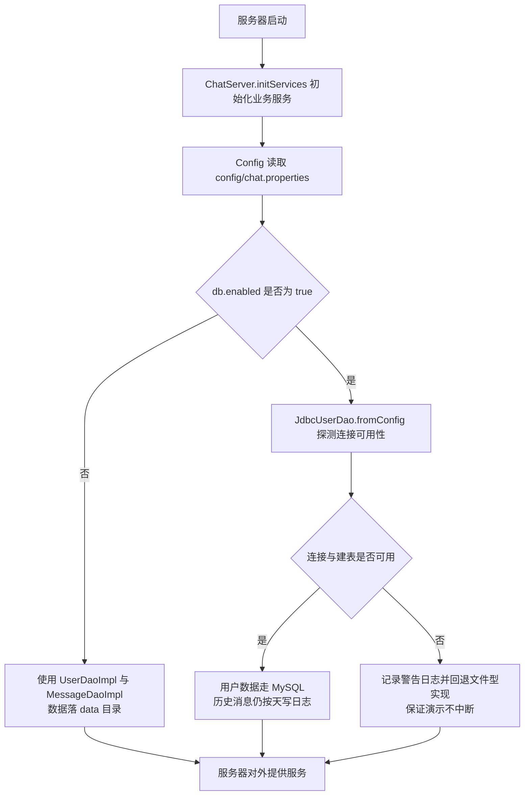
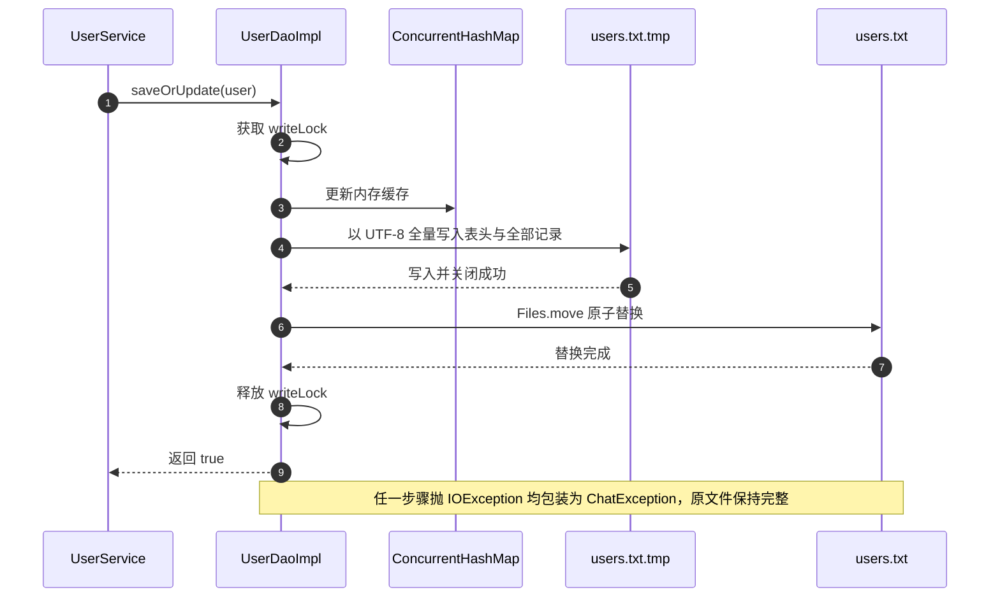
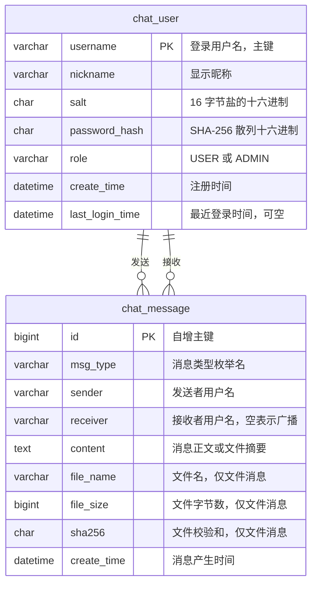
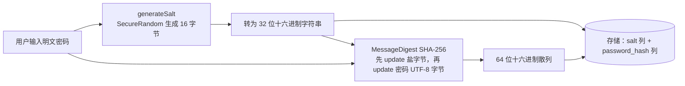

# 局域网聊天程序（题目 13：网络聊天程序）数据库与持久化设计说明书

| 项目名称 | 局域网聊天程序（LanChat） |
| --- | --- |
| 版本号 | v1.0 |
| 文档类型 | 数据库与持久化设计说明书 |
| 默认方案 | 文件型持久化（零依赖，开箱即用） |
| 可选方案 | MySQL + JDBC（配置 `db.enabled=true` 后启用） |
| 依据文档 | `docs/design/01-需求分析.md`、`docs/design/02-系统设计.md` |

---

## 一、持久化方案总览

### 1.1 为什么提供两套方案

本项目的定位是课程设计：既要保证在任何一台只装了 JDK 的机器上「解压即可运行、演示零失败」，又要在评分维度上体现数据库设计能力。因此采用「文件型为默认、数据库型为可选加分项」的双轨设计。两者共享同一套 DAO 接口（`UserDao`、`MessageDao`），业务层（`UserService`、`MessageService`）完全不感知存储介质，切换只改配置不改代码。

### 1.2 方案对比

| 对比维度 | 文件型持久化 | 数据库型持久化（MySQL） |
| --- | --- | --- |
| 优点 | 零第三方依赖，`javac` 编译后即可运行；数据为可读文本，便于教学演示与人工检查；备份即复制目录；单机性能足够；无安装配置成本 | 支持事务与原子提交，断电安全性更高；结构化查询、索引与聚合能力完整；天然支持多进程并发访问；便于统计分析与后续扩展 |
| 缺点 | 无事务，靠「临时文件 + 原子替换」与写锁保证一致性；查询为全文件扫描，数据量增大后性能线性下降；不支持跨进程并发写；无权限与审计能力 | 需要安装 MySQL 与 JDBC 驱动，环境成本高；配置错误会导致演示失败；需要维护建表脚本与连接参数 |
| 适用场景 | 班级演示、单机服务器、几十人规模的小型局域网、需要快速复现的环境 | 多服务器或长期运行环境、需要统计分析、需要与其它系统共享数据 |
| 本项目选择 | 默认启用。理由：局域网聊天会话量小、课程演示环境不可控、评分重点是架构与协议设计而非数据库运维 | 作为可选实现保留。开启后用户数据落库，历史消息可按同一模式扩展落库 |
| 启用开关 | `config/chat.properties` 中 `db.enabled=false`（默认） | `config/chat.properties` 中 `db.enabled=true` 并填写 `db.*` 连接参数 |
| 实现类 | `UserDaoImpl`、`MessageDaoImpl` | `JdbcUserDao`（已实现），`MessageDao` 的 JDBC 版本按同一接口扩展 |
| 数据位置 | 项目根目录 `data/` | 数据库 `lanchat`，表 `chat_user`、`chat_message` |

### 1.3 存储介质选择流程



### 1.4 目录与文件总览

| 路径 | 类型 | 用途 | 是否纳入版本管理 |
| --- | --- | --- | --- |
| `config/chat.properties` | 配置 | 端口、心跳、数据目录、数据库连接与管理员口令 | 是（不含真实口令） |
| `data/users.txt` | 用户表 | 全部账号资料与凭据 | 否，`.gitignore` 已忽略 |
| `data/users.txt.tmp` | 临时文件 | 刷盘中间态，原子替换后立即消失 | 否 |
| `data/history/yyyy-MM-dd.log` | 聊天日志 | 按天切分的消息记录 | 否，`.gitignore` 已忽略 |
| `data/export/` | 导出目录 | `chat-用户名-时间戳.txt` 导出结果 | 否 |
| `data/received/` | 接收目录 | 客户端收到的文件，重名自动追加序号 | 否 |
| `sql/schema.sql` | 建表脚本 | MySQL 建库建表语句 | 是 |

---

## 二、文件型持久化详解

### 2.1 用户表 `data/users.txt`

#### 2.1.1 文件格式

文件为 UTF-8 纯文本，每行一条用户记录，字段之间使用**制表符**（`\t`）分隔。首行为以 `#` 开头的注释与表头说明，读取时被 `parseLine` 跳过。选择制表符而非逗号或空格的理由：昵称与消息正文中可能包含空格甚至逗号，制表符在用户输入中几乎不可能出现，可最大限度避免分隔冲突；写入前还会把字段内的制表符替换为空格作为二次兜底。

字段顺序固定为：`用户名`、`昵称`、`盐`、`散列`、`角色`、`注册时间`、`最近登录`。字段数量允许少于 7（历史兼容），缺失的时间字段按 null 处理；少于 5 个字段的行被视为非法行并跳过，保证单个坏行不会导致整个文件读取失败。

#### 2.1.2 字段定义

| 序号 | 字段名 | 类型 | 长度 | 约束 | 说明 |
| --- | --- | --- | --- | --- | --- |
| 1 | 用户名 | 字符串 | 3 至 16 | 主键，非空，全局唯一，正则 `^[A-Za-z][A-Za-z0-9_]{2,15}$` | 登录标识，创建后不可修改 |
| 2 | 昵称 | 字符串 | 0 至 20 | 可为空，允许重复 | 界面展示名，为空时回退显示用户名 |
| 3 | 盐 | 十六进制字符串 | 32 | 非空（新建账号时生成） | 16 字节随机盐的十六进制表示，与散列分开存储 |
| 4 | 散列 | 十六进制字符串 | 64 | 非空 | SHA-256（盐 + 明文密码）的十六进制小写结果 |
| 5 | 角色 | 字符串 | 4 至 5 | 取值 `USER` 或 `ADMIN` | 权限标识，比较时忽略大小写 |
| 6 | 注册时间 | 日期时间 | 19 | 可为空 | 格式 `yyyy-MM-dd HH:mm:ss` |
| 7 | 最近登录 | 日期时间 | 19 | 可为空 | 每次登录成功后刷新；从未登录为空字符串 |

#### 2.1.3 文件示例

首行固定为注释表头：

```text
# 用户数据文件：用户名<TAB>昵称<TAB>盐<TAB>散列<TAB>角色<TAB>注册时间<TAB>最近登录
```

下面的示例使用可见的制表符表示（真实文件中制表符为单个 `\t` 字符，此处为便于阅读以 `→` 示意分隔位置）：

```text
admin	系统管理员	5f3c9a1d77b24e0f8a6c2d4b1e90357a	3b1f0c9d8e7a6b5c4d3e2f1a0b9c8d7e6f5a4b3c2d1e0f9a8b7c6d5e4f3a2b1c	ADMIN	2025-01-01 09:00:00	2025-01-02 08:30:15
alice	张三	8a7b6c5d4e3f2a1b0c9d8e7f6a5b4c3d	1a2b3c4d5e6f708192a3b4c5d6e7f8091a2b3c4d5e6f708192a3b4c5d6e7f809	USER	2025-01-01 10:12:33	2025-01-02 09:05:41
bob	李四	c1d2e3f4a5b60718293a4b5c6d7e8f90	9f8e7d6c5b4a39281706f5e4d3c2b1a09f8e7d6c5b4a39281706f5e4d3c2b1a0	USER	2025-01-01 10:15:02	
```

说明：

1. 第三条记录「最近登录」为空，表示该账号尚未登录过；
2. 每行写入后追加换行符；`flush` 时按用户名升序排序，保证文件内容稳定、便于 diff 与人工比对；
3. 密码明文在任何时刻都不落入该文件，仅保存盐与散列。

### 2.2 聊天历史日志 `data/history/yyyy-MM-dd.log`

#### 2.2.1 分文件策略

消息按**消息自身的时间戳**决定归属文件，文件名即日期（`DateUtil.dayKey`）。这样即使跨零点的长会话，也能按时间自然分散到两个文件中；查询时先列出目录下全部 `.log` 文件，再按查询区间过滤文件名，避免打开无关日期的文件。

#### 2.2.2 记录格式

每行一条消息，制表符分隔，字段顺序固定为：`消息编号`、`时间`、`类型`、`发送者`、`接收者`、`内容`。写入前会对内容做两项转义：制表符替换为空格（防止破坏列结构），换行符替换为字面量 `\n`（防止一条消息占据多行）；读取时再把 `\n` 还原，保证多行消息可无损往返。

| 序号 | 字段名 | 类型 | 约束 | 说明 |
| --- | --- | --- | --- | --- |
| 1 | 消息编号 | 长整型 | 非空 | 由 `ChatMessageFactory` 的 `AtomicLong` 生成，进程内唯一 |
| 2 | 时间 | 日期时间 | 非空 | 格式 `yyyy-MM-dd HH:mm:ss`，决定归属文件 |
| 3 | 类型 | 枚举名 | 非空 | `MessageType` 的名字，读取时经 `fromName` 安全反查，未知值回退 `SYSTEM` |
| 4 | 发送者 | 字符串 | 非空 | 私聊与群聊为用户名；系统消息固定为 `SYSTEM` |
| 5 | 接收者 | 字符串 | 可为空 | 空字符串表示广播（群聊或系统公告） |
| 6 | 内容 | 字符串 | 可为空 | 文本消息为正文；系统消息为通知正文；文件消息为特殊编码，见下 |

#### 2.2.3 文件消息的特殊编码

文件消息没有正文，其第 6 个字段使用竖线 `|` 编码三个子字段，格式为：

```text
文件名|大小|SHA-256校验和
```

其中「大小」为字节数（长整型），「校验和」为 64 位十六进制小写字符串。之所以不复用制表符，是因为该字段本身位于制表符分隔的列中，需要一层内部的独立分隔符；竖线在文件名中出现概率低，且读取时按 `-1` 限长分割，多余竖线会自然并入最后一段而不会丢失数据。

```text
1001	2025-01-02 09:10:00	FILE_REQUEST	alice	bob	设计文档.pdf|1258291|9f8e7d6c5b4a39281706f5e4d3c2b1a09f8e7d6c5b4a39281706f5e4d3c2b1a0
1002	2025-01-02 09:10:01	TEXT_PRIVATE	bob	alice	收到，我看一下
1003	2025-01-02 09:11:20	TEXT_GROUP	alice		大家下午三点开会
1004	2025-01-02 09:11:21	SYSTEM	bob		欢迎 bob 加入聊天室
```

#### 2.2.4 历史记录的读取与还原

读取流程为：按日期筛选候选文件 -> 逐行跳过空行 -> 按制表符分割并要求至少 6 段 -> 按类型还原为具体子类对象。还原规则如下：

| 类型 | 还原为 | 说明 |
| --- | --- | --- |
| `FILE_REQUEST`、`FILE_RESULT` | `FileMessage` | 解析竖线编码得到文件名、大小与校验和 |
| `SYSTEM`、`ERROR` | `SystemMessage` | 正文作为通知内容，类型保留原值 |
| 其余类型 | `TextMessage` | 正文作为文本内容，类型保留原值（含私聊与群聊） |
| 类型名无法识别 | `SystemMessage` | `fromName` 回退为 `SYSTEM`，保证旧版本文件可读 |

编号与时间在最后通过 setter 恢复到对象上，因此从历史中读出的消息保留原始编号与真实时序，界面按时间升序展示。

### 2.3 写盘策略

#### 2.3.1 用户表：内存缓存 + 临时文件 + 原子替换

用户数据采用「读缓存 + 写穿透」策略：

1. 构造 `UserDaoImpl` 时把整个 `users.txt` 载入 `ConcurrentHashMap<String, User>`，读操作全部走内存，无锁且为 O(1)；
2. 任何写操作先更新缓存，再在写锁内把**整张表**顺序重写到一个临时文件 `users.txt.tmp`；
3. 临时文件写入并关闭成功后，用 `Files.move` 配合 `REPLACE_EXISTING` 与 `ATOMIC_MOVE` 原子替换正式文件。

原子替换是这套策略的核心：文件系统保证 `move` 在同一文件系统内是原子操作，因此任何时刻磁盘上的 `users.txt` 要么是替换前的完整旧版本，要么是替换后的完整新版本，绝不会出现写到一半的半截文件。即便在写临时文件的过程中断电，也只是残留一个可安全删除的 `.tmp` 文件。



#### 2.3.2 历史日志：追加写

历史日志只追加不重写，因此不需要原子替换。写入时在写锁内以 `CREATE + APPEND + WRITE` 打开当天文件，写入一行后立即关闭。追加模式配合单行写入，可把「写到一半」的窗口压缩到最小；即使出现半行，读取侧的字段数校验也会跳过该行，不影响其它记录。

#### 2.3.3 资源管理

所有文件操作均使用 try-with-resources 声明 `BufferedWriter`，保证异常路径下句柄必然释放。目录创建统一走 `FileUtil.ensureDir`，支持多级目录且对已存在目录幂等。导出与接收目录在服务器或客户端启动时按需创建，避免用户看到一堆空目录。

### 2.4 并发控制

| 并发对象 | 保护机制 | 一致性目标 |
| --- | --- | --- |
| 用户缓存读写 | `ConcurrentHashMap`（读无锁） | 任意线程可安全读，不阻塞网络线程 |
| 用户表刷盘 | `synchronized (writeLock)` 串行化 | 「改缓存 + 重写文件」为不可分割的临界区，避免两次并发写相互覆盖 |
| 历史日志追加 | `synchronized (writeLock)` 串行化 | 保证单行完整写入，不出现多线程交错的半行 |
| 多进程访问 | 不支持，约定单服务器进程独占 `data` 目录 | 如需多实例，通过 `lanchat.data.dir` 系统属性或 `data.dir` 配置隔离目录 |
| 文件接收落盘 | 每个传输会话独立的 `RandomAccessFile` 与目标文件 | 不同传输互不干扰，同一会话串行写 |

补充说明：由于 `flush` 在锁内完成，锁的持有时间与用户总数成正比（需重写整表）。在课程设计的规模（百人以内）下，单次刷盘为毫秒级，不构成瓶颈；这也正是文件型方案不适用于超大规模数据的原因，已在方案对比中列明。

### 2.5 文件型方案的局限与已知取舍

| 局限 | 影响 | 当前取舍与缓解 |
| --- | --- | --- |
| 无事务，多文件操作无法回滚 | 极端情况下用户信息与消息日志可能不同步 | 两类数据相互独立，无强一致要求；用户表用原子替换保证自身一致 |
| 查询为全文件扫描 | 历史数据量大时查询变慢 | 按天分文件天然缩小扫描范围；界面默认只查最近 7 天 |
| 不支持跨进程并发写 | 两个服务器实例指向同一目录会互相覆盖 | 文档明确约定单实例；提供数据目录覆盖配置以隔离 |
| 无权限控制 | 任何能读文件系统的人都能看到盐与散列 | 密码本身不可逆；正式部署建议改用数据库并收紧文件权限 |
| 全量重写用户表 | 用户数极大时单次写放大 | 规模可控；数据库方案已提供迁移路径 |

---

## 三、数据库设计（可选方案）

### 3.1 ER 图

数据库名为 `lanchat`，字符集统一 `utf8mb4`，排序规则 `utf8mb4_general_ci`。核心实体为用户与消息，一个用户可以发送多条消息，一条消息可以投递给一个用户（私聊）或广播（接收者为空）。



### 3.2 `chat_user` 表结构

| 字段名 | 类型 | 允许空 | 键与索引 | 默认值 | 说明 |
| --- | --- | --- | --- | --- | --- |
| `username` | `VARCHAR(32)` | 否 | 主键 | 无 | 登录名，业务层另外用正则约束为 3 至 16 位 |
| `nickname` | `VARCHAR(64)` | 是 | 普通索引 `idx_user_nickname` | NULL | 展示昵称，业务层约束不超过 20 字符 |
| `salt` | `CHAR(32)` | 否 | 无 | 无 | 16 字节随机盐的十六进制表示 |
| `password_hash` | `CHAR(64)` | 否 | 无 | 无 | SHA-256 结果的十六进制表示，定长用 `CHAR` 更省空间 |
| `role` | `VARCHAR(16)` | 否 | 无 | `USER` | 角色标识，取值 `USER` 或 `ADMIN` |
| `create_time` | `DATETIME` | 否 | 普通索引 `idx_user_create_time` | `CURRENT_TIMESTAMP` | 注册时间 |
| `last_login_time` | `DATETIME` | 是 | 无 | NULL | 最近一次登录成功时间 |

设计说明：用户名用 `VARCHAR(32)` 而非业务上限 16，是给未来放宽规则留出余量；`salt` 与 `password_hash` 为定长十六进制，使用 `CHAR` 可避免变长类型的额外长度字节；角色字段不使用 `ENUM` 类型，便于后续新增角色而不需要 `ALTER TABLE`。

### 3.3 `chat_message` 表结构

| 字段名 | 类型 | 允许空 | 键与索引 | 默认值 | 说明 |
| --- | --- | --- | --- | --- | --- |
| `id` | `BIGINT` | 否 | 主键，`AUTO_INCREMENT` | 无 | 数据库自增主键，与内存消息编号解耦 |
| `msg_type` | `VARCHAR(32)` | 否 | 索引 `idx_msg_type` | 无 | `MessageType` 枚举名，如 `TEXT_PRIVATE` |
| `sender` | `VARCHAR(32)` | 否 | 联合索引 `idx_msg_sender_time` | 无 | 发送者用户名；系统消息为 `SYSTEM` |
| `receiver` | `VARCHAR(32)` | 是 | 联合索引 `idx_msg_receiver_time` | NULL | 接收者用户名；NULL 或空串表示广播 |
| `content` | `TEXT` | 是 | 全文索引 `ft_msg_content` | NULL | 文本正文或系统通知；文件消息存摘要文本 |
| `file_name` | `VARCHAR(255)` | 是 | 无 | NULL | 文件名，仅文件类消息写入 |
| `file_size` | `BIGINT` | 是 | 无 | NULL | 文件字节数，仅文件类消息写入 |
| `sha256` | `CHAR(64)` | 是 | 无 | NULL | 文件校验和，仅文件类消息写入 |
| `create_time` | `DATETIME` | 否 | 索引 `idx_msg_create_time` | `CURRENT_TIMESTAMP` | 消息产生时间 |

设计说明：把文件元信息从 `content` 中拆成独立列，是为了让「查某个用户收发的文件」「按大小筛选」这类查询可以用索引而不是字符串解析；`content` 用 `TEXT` 支持最长 2000 字符的业务上限并留有余量；`receiver` 允许为 NULL 以表达广播语义，与文件型方案中的空字符串一一对应。

### 3.4 完整建表 SQL

以下脚本可直接保存为 `sql/schema.sql` 并执行，包含注释、索引与字符集设置。

```sql
-- ============================================================
-- 局域网聊天程序（LanChat）数据库初始化脚本
-- 适用数据库：MySQL 8.0 及以上
-- 字符集：utf8mb4，可完整存储中文与表情符号
-- 执行方式：mysql -u root -p < sql/schema.sql
-- ============================================================

-- 创建数据库并指定字符集与排序规则
CREATE DATABASE IF NOT EXISTS lanchat
    DEFAULT CHARACTER SET utf8mb4
    DEFAULT COLLATE utf8mb4_general_ci;

USE lanchat;

-- ------------------------------------------------------------
-- 用户表：保存账号资料与不可逆的口令凭据
-- 说明：口令以「随机盐 + SHA-256」散列存储，不保存明文
-- ------------------------------------------------------------
DROP TABLE IF EXISTS chat_user;
CREATE TABLE chat_user (
    username        VARCHAR(32)  NOT NULL                COMMENT '登录用户名，业务层约束为 3 至 16 位且以字母开头',
    nickname        VARCHAR(64)  DEFAULT NULL            COMMENT '显示昵称，业务层约束不超过 20 字符',
    salt            CHAR(32)     NOT NULL                COMMENT '16 字节随机盐的十六进制表示',
    password_hash   CHAR(64)     NOT NULL                COMMENT 'SHA-256(盐 + 明文密码) 的十六进制小写结果',
    role            VARCHAR(16)  NOT NULL DEFAULT 'USER' COMMENT '角色：USER 普通用户，ADMIN 管理员',
    create_time     DATETIME     NOT NULL DEFAULT CURRENT_TIMESTAMP COMMENT '注册时间',
    last_login_time DATETIME     DEFAULT NULL            COMMENT '最近一次登录成功时间，从未登录为 NULL',
    PRIMARY KEY (username),
    KEY idx_user_nickname (nickname),
    KEY idx_user_create_time (create_time)
) ENGINE = InnoDB
  DEFAULT CHARSET = utf8mb4
  COLLATE = utf8mb4_general_ci
  COMMENT = '用户账号表';

-- ------------------------------------------------------------
-- 消息表：保存文本消息、系统通知与文件消息元信息
-- 说明：内容为纯文本，文件本体不落库，仅保存元信息与校验和
-- ------------------------------------------------------------
DROP TABLE IF EXISTS chat_message;
CREATE TABLE chat_message (
    id          BIGINT       NOT NULL AUTO_INCREMENT    COMMENT '自增主键',
    msg_type    VARCHAR(32)  NOT NULL                   COMMENT '消息类型枚举名，如 TEXT_PRIVATE、FILE_REQUEST',
    sender      VARCHAR(32)  NOT NULL                   COMMENT '发送者用户名，系统消息为 SYSTEM',
    receiver    VARCHAR(32)  DEFAULT NULL               COMMENT '接收者用户名，NULL 或空串表示广播',
    content     TEXT         DEFAULT NULL               COMMENT '文本正文或系统通知内容',
    file_name   VARCHAR(255) DEFAULT NULL               COMMENT '文件名，仅文件类消息填写',
    file_size   BIGINT       DEFAULT NULL               COMMENT '文件字节数，仅文件类消息填写',
    sha256      CHAR(64)     DEFAULT NULL               COMMENT '文件 SHA-256 校验和，仅文件类消息填写',
    create_time DATETIME     NOT NULL DEFAULT CURRENT_TIMESTAMP COMMENT '消息产生时间',
    PRIMARY KEY (id),
    KEY idx_msg_sender_time (sender, create_time),
    KEY idx_msg_receiver_time (receiver, create_time),
    KEY idx_msg_create_time (create_time),
    KEY idx_msg_type (msg_type),
    FULLTEXT KEY ft_msg_content (content) WITH PARSER ngram
) ENGINE = InnoDB
  DEFAULT CHARSET = utf8mb4
  COLLATE = utf8mb4_general_ci
  COMMENT = '聊天消息表';

-- ------------------------------------------------------------
-- 初始化默认管理员账号
-- 注意：password_hash 与 salt 为示例值，正式环境请通过程序注册或在登录后立即修改密码
-- 程序首次启动时若检测到 admin 不存在，仍会按 config/chat.properties 自动创建
-- ------------------------------------------------------------
INSERT INTO chat_user (username, nickname, salt, password_hash, role, create_time)
VALUES ('admin', '系统管理员',
        '5f3c9a1d77b24e0f8a6c2d4b1e90357a',
        '3b1f0c9d8e7a6b5c4d3e2f1a0b9c8d7e6f5a4b3c2d1e0f9a8b7c6d5e4f3a2b1c',
        'ADMIN', NOW());
```

### 3.5 数据库访问实现要点

`JdbcUserDao` 是 `UserDao` 的 JDBC 实现，设计与实现要点如下：

1. **驱动加载与可用性探测**：构造时尝试加载 `db.driver` 指定的驱动类并建立一次连接，失败则 `isAvailable()` 返回 false，业务层据此回退文件实现，避免数据库未就绪时整个系统不可用；
2. **参数化查询**：全部 SQL 使用 `PreparedStatement` 占位符传参，用户名等外部输入绝不拼接进 SQL 文本，从根源上消除 SQL 注入（对应 NFR-17）；
3. **主键语义一致**：`username` 即主键，`findById` 与 `findByUsername` 等价，`save` 在用户名已存在时返回 false，与文件实现保持相同的失败语义，保证上层不因实现不同而产生分歧；
4. **时间字段映射**：`DATETIME` 与 `LocalDateTime` 通过 `setTimestamp` / `getTimestamp` 互转，保持与文件实现相同的精度与格式；
5. **凭据不落地到日志**：SQL 异常只记录消息与错误码，不打印参数列表，避免盐与散列进入日志文件。

### 3.6 文件方案与数据库方案的字段映射

| 业务字段 | `users.txt` 列序 | `chat_user` 列 | 转换规则 |
| --- | --- | --- | --- |
| 用户名 | 1 | `username` | 直接对应 |
| 昵称 | 2 | `nickname` | 空字符串与 NULL 等价处理 |
| 盐 | 3 | `salt` | 十六进制字符串直接存储 |
| 散列 | 4 | `password_hash` | 十六进制字符串直接存储 |
| 角色 | 5 | `role` | 直接对应 |
| 注册时间 | 6 | `create_time` | `yyyy-MM-dd HH:mm:ss` 与 `DATETIME` 互转 |
| 最近登录 | 7 | `last_login_time` | 空值对应 NULL |

| 业务字段 | `yyyy-MM-dd.log` 列序 | `chat_message` 列 | 转换规则 |
| --- | --- | --- | --- |
| 消息编号 | 1 | （使用 `id` 自增，原编号存 `content` 前缀时可选） | 落库时以数据库主键为准 |
| 时间 | 2 | `create_time` | 直接对应，并决定历史分区归属 |
| 类型 | 3 | `msg_type` | 枚举名直接存储 |
| 发送者 | 4 | `sender` | 直接对应 |
| 接收者 | 5 | `receiver` | 空字符串转 NULL 表示广播 |
| 内容 | 6 | `content` 或文件三列 | 文本进 `content`；文件消息的 `文件名\|大小\|校验和` 拆入 `file_name`、`file_size`、`sha256` |

---

## 四、索引设计与查询优化

### 4.1 索引清单

| 索引名 | 表 | 字段 | 类型 | 服务的典型查询 |
| --- | --- | --- | --- | --- |
| `PRIMARY` | `chat_user` | `username` | 主键聚簇索引 | 登录时按用户名取盐与散列；注册时判断重名 |
| `idx_user_nickname` | `chat_user` | `nickname` | 普通二级索引 | 按昵称模糊筛选与后台检索 |
| `idx_user_create_time` | `chat_user` | `create_time` | 普通二级索引 | 统计某时间段注册量 |
| `PRIMARY` | `chat_message` | `id` | 主键聚簇索引 | 按主键定位单条消息 |
| `idx_msg_sender_time` | `chat_message` | `sender`, `create_time` | 联合索引 | 「我发出的消息」按时间倒序分页 |
| `idx_msg_receiver_time` | `chat_message` | `receiver`, `create_time` | 联合索引 | 「我收到的消息」按时间倒序分页，私聊会话查询 |
| `idx_msg_create_time` | `chat_message` | `create_time` | 普通二级索引 | 按时间范围导出、按天统计 |
| `idx_msg_type` | `chat_message` | `msg_type` | 普通二级索引 | 按类型筛选（如只看文件传输记录） |
| `ft_msg_content` | `chat_message` | `content` | 全文索引（`ngram` 解析器） | 中文关键字检索，对应业务的关键字搜索 |

### 4.2 索引设计理由

1. **联合索引的列序遵循最左前缀**：`(sender, create_time)` 先按发送者等值匹配，再按时间范围扫描，正好覆盖「某用户某时间段的消息」这一最高频查询；若把时间放前面，等值条件无法发挥定位作用；
2. **创建时间单独建索引**：导出与统计常按时间范围跨用户筛选，此时联合索引的最左列不参与条件，需要独立的单列索引；
3. **全文索引使用 `ngram` 解析器**：MySQL 默认全文分词按空格切词，对中文无效，必须指定 `WITH PARSER ngram` 才能按字切分实现中文检索；
4. **不对 `content` 建普通索引**：`TEXT` 列建 B+ 树索引体积大且写入代价高，文本检索交给全文索引；
5. **不建冗余索引**：`receiver` 已有联合索引，不再单独建 `receiver` 单列索引，避免写放大；
6. **索引数量克制**：`chat_message` 为写入密集表，索引越多插入越慢，因此只保留查询模式明确支持的五个索引。

### 4.3 关键查询与优化说明

| 查询场景 | SQL 形态 | 命中索引 | 优化说明 |
| --- | --- | --- | --- |
| 用户登录取凭据 | `SELECT salt, password_hash FROM chat_user WHERE username = ?` | `PRIMARY` | 单行点查，返回列尽量少，避免取回整行 |
| 用户列表展示 | `SELECT username, nickname, role FROM chat_user ORDER BY username` | `PRIMARY` | 覆盖索引，无需回表 |
| 私聊会话记录 | `SELECT ... FROM chat_message WHERE (sender = ? AND receiver = ?) OR (sender = ? AND receiver = ?) ORDER BY create_time DESC LIMIT 50` | `idx_msg_sender_time`、`idx_msg_receiver_time` | 双向各取一段后按时间合并，配合 `LIMIT` 分页 |
| 用户时间范围查询 | `SELECT ... FROM chat_message WHERE sender = ? AND create_time BETWEEN ? AND ? ORDER BY create_time` | `idx_msg_sender_time` | 联合索引一次定位到起点后顺序扫描，无排序开销 |
| 按天导出 | `SELECT ... FROM chat_message WHERE create_time >= ? AND create_time < ?` | `idx_msg_create_time` | 用半开区间避免 `DATE()` 函数导致索引失效 |
| 关键字检索 | `SELECT ... FROM chat_message WHERE MATCH(content) AGAINST (? IN NATURAL LANGUAGE MODE)` | `ft_msg_content` | 全文索引替代 `LIKE '%关键字%'`，避免全表扫描 |
| 在线人数统计（可选） | `SELECT COUNT(*) FROM chat_user WHERE last_login_time > ?` | 无（走全表） | 该场景改由内存在线表回答，不查库 |

通用优化约定：

1. 所有时间范围查询使用半开区间 `>= start AND < end`，禁止在索引列上套函数；
2. 分页查询一律带 `ORDER BY` 与 `LIMIT`，不做无界全量查询；
3. 列表类查询只取必要列，尽量形成覆盖索引；
4. 关键字检索前端限制最小长度与最大返回条数，避免一次拉回海量结果；
5. 文件型方案对应地采用「按天分文件 + 文件名预筛 + 单遍扫描」达成同类效果，逻辑与索引思路一致。

---

## 五、数据安全设计

### 5.1 口令存储：随机盐 + SHA-256

存储格式为 `盐:散列`（对外表现为 `SecurityUtil.encode` 的返回值），落盘时盐与散列分列两列，避免格式耦合。



**为什么要加盐**：如果不加盐，相同密码会产生相同散列。攻击者一旦拿到表，就可以用彩虹表（预先算好的「散列 -> 明文」大表）批量反查，也能一眼看出哪些用户使用了相同密码。加入每个账号独立、随机、足够长的盐之后，同一密码在不同账号下得到完全不同的散列，彩虹表失效，攻击者只能对单个账号做暴力破解，成本成倍上升。盐与散列一同存储不构成安全削弱，因为盐的作用是「让预计算失效」而非「保密」。

**为什么选择 SHA-256 而非自行实现**：密码学算法的实现极易因细节错误而失效，项目直接使用 JDK 的 `MessageDigest.getInstance("SHA-256")`，不做自研加密。同时散列计算统一走 `MessageDigest.update` 依次喂入盐与密码，避免字符串拼接产生中间字符串。

**为什么使用常量时间比较**：普通的 `String.equals` 在发现第一个不同字符时立即返回，比较耗时与「相同前缀长度」正相关。攻击者可以通过大量请求测量响应时间，逐字节推断散列前缀。`SecurityUtil.verifyPassword` 先对明文重新计算散列，再用逐字节异或累加的常量时间比较，无论差异出现在哪一位，比较次数都固定，从而消除该侧信道。密码错误与用户不存在返回同一句「用户名或密码错误」，避免账号枚举。

### 5.2 凭据脱敏

`User` 对象同时承担两种角色：持久化实体与网络传输资料。为避免盐与散列随在线用户列表广播出去，服务器在向外发送任何用户对象之前必须调用 `clearCredential()` 把 `salt` 与 `passwordHash` 置空。要点如下：

1. `UserListCodec.encode` 只编码用户名、昵称与角色三列，本身不含凭据，构成第二道防线；
2. `User.toString()` 刻意只输出用户名、昵称、角色与在线状态，不含散列与盐，保证「随手打日志」也不会泄露；
3. 服务器内部持有的是完整的 `User` 对象，脱敏发生在序列化边界之前，业务逻辑仍可正常校验。

### 5.3 日志脱敏

| 敏感信息 | 禁止出现的位置 | 落地做法 |
| --- | --- | --- |
| 明文密码 | 全部日志、异常消息、配置文件示例 | 登录与注册路径只记录用户名与结果，不记录密码；异常信息不拼接密码 |
| 盐与散列 | 全部日志与网络报文 | `User.toString` 与 `UserListCodec` 均不输出凭据字段 |
| 数据库连接口令 | 日志、版本库 | 配置项 `db.password` 默认留空，真实口令不提交仓库；SQL 异常不打印参数 |
| 文件内容 | 服务器磁盘与日志 | 服务器只中继文件分块，不落盘；日志只记录文件名、大小与传输编号 |
| 用户隐私路径 | 界面提示 | 错误提示只给文件名与原因，不在界面暴露服务器绝对路径 |
| 客户端 IP | 对外报文的公告字段 | UDP 公告只含服务器 IP、端口与在线人数，不含其他客户端信息 |

### 5.4 其它安全控制

| 风险 | 控制措施 | 对应需求 |
| --- | --- | --- |
| 身份伪造 | 服务器以连接绑定的登录名强制覆盖消息 `sender` 字段 | NFR-16 |
| SQL 注入 | JDBC 全部使用 `PreparedStatement` 占位符，不拼接 SQL | NFR-17 |
| 目录穿越 | `FileUtil.sanitizeFileName` 去掉路径分隔符与上级目录标记，落盘前再经 `uniqueTarget` 生成安全目标路径 | NFR-17 |
| 覆盖已有文件 | 接收端重名时自动追加序号，绝不覆盖 | FR-7 |
| 超长输入 | 用户名、昵称、密码、消息长度均有上限校验，超限直接拒绝 | FR-16 |
| 未登录操作 | `AbstractMessageHandler` 在父类统一守卫，未登录连接的所有业务请求被拒绝 | FR-15 |
| 连接耗尽 | 连接数上限 200，超出直接关闭套接字，防止资源被占满 | NFR-2、NFR-10 |
| 磁盘占满 | 单文件上限 200MB，导出与接收目录独立，历史按天切分 | NFR-8 |

---

## 六、数据备份与恢复

### 6.1 文件型方案备份

文件型方案的全部业务数据都位于 `data` 目录，备份即复制目录，恢复即还原目录。推荐做法如下：

```bash
# 1. 停止服务器，保证用户表处于稳定状态（历史日志为追加写，可在线备份）
#    若不便停机，至少避免在刷盘瞬间执行复制

# 2. 打包整个数据目录，文件名带日期便于回溯
tar -czvf backup-lanchat-$(date +%Y%m%d).tar.gz data/

# 3. 单独归档某一天的历史日志（日志按天切分，天然支持增量归档）
tar -czvf history-$(date +%Y%m%d).tar.gz data/history/$(date +%Y-%m-%d).log

# 4. 恢复：解压覆盖回项目根目录
tar -xzvf backup-lanchat-20250102.tar.gz -C /path/to/LANChat/
```

注意事项：

1. `data/users.txt` 与 `data/history/` 已在 `.gitignore` 中忽略，不会被误提交到版本库，也不会被版本回滚破坏；
2. 若存在残留的 `users.txt.tmp`，说明上次刷盘未完成，可安全删除，正式文件仍是完整的旧版本；
3. 历史日志为追加写，可在服务器运行期间安全复制（复制到的是某一时刻的完整行前缀）；
4. 恢复前建议先备份当前 `data` 目录，避免误覆盖；
5. 可用 `data.dir` 配置或 `-Dlanchat.data.dir=/path/to/data` 系统属性把数据目录指向独立磁盘或备份盘，便于集中管理。

### 6.2 数据库型方案备份

```bash
# 1. 逻辑备份：导出结构 + 数据 + 存储过程与触发器
mysqldump -u root -p \
  --single-transaction \
  --routines --triggers --events \
  --default-character-set=utf8mb4 \
  lanchat > lanchat-$(date +%Y%m%d).sql

# 2. 仅备份结构（用于快速重建空库）
mysqldump -u root -p --no-data lanchat > lanchat-schema-$(date +%Y%m%d).sql

# 3. 仅备份用户表（含凭据，注意权限与加密存放）
mysqldump -u root -p lanchat chat_user > lanchat-user-$(date +%Y%m%d).sql

# 4. 恢复：先建库再导入
mysql -u root -p -e "CREATE DATABASE IF NOT EXISTS lanchat DEFAULT CHARACTER SET utf8mb4;"
mysql -u root -p lanchat < lanchat-20250102.sql

# 5. 校验恢复结果
mysql -u root -p -e "USE lanchat; SELECT COUNT(*) AS 用户数 FROM chat_user; SELECT COUNT(*) AS 消息数 FROM chat_message;"
```

`--single-transaction` 用于 InnoDB 表的一致性快照备份，可在不锁表的前提下获得一致数据。备份文件包含不可逆的口令散列，虽无法直接还原明文，仍属敏感数据，应限制访问权限并加密存放，禁止提交到公开仓库。

### 6.3 恢复演练与校验清单

| 步骤 | 校验点 | 期望结果 |
| --- | --- | --- |
| 恢复后启动服务器 | 控制台日志 | 无用户数据读取异常，在线表可正常初始化 |
| 用备份前的账号登录 | 登录结果 | 凭据校验通过，说明盐与散列完整恢复 |
| 查询历史记录 | 历史窗口 | 备份前消息可按日期查询到，内容无乱码 |
| 导出聊天记录 | 导出文件 | 文件存在、可打开、条数与提示一致 |
| 校验文件消息编码 | 日志内容 | 文件消息仍可按「文件名\|大小\|校验和」解析 |

### 6.4 数据生命周期建议

| 数据 | 建议保留期 | 处理方式 |
| --- | --- | --- |
| 用户表 | 长期 | 定期备份；离校或项目结束后脱敏归档 |
| 每日聊天日志 | 90 天 | 超期日志压缩归档到备份盘后从 `data/history` 移除 |
| 导出文件 | 30 天 | 由用户自行清理，或由管理员定期清理 `data/export` |
| 接收文件 | 由用户决定 | 保存在客户端 `data/received`，服务器侧不留副本 |
| 数据库消息表 | 180 天 | 按 `create_time` 分批归档到历史表或冷备库 |

---

## 七、数据字典汇总

### 7.1 用户数据字段汇总

| 字段中文名 | 文件列 | 文件列序 | 数据库列 | 数据库类型 | 类型 | 长度 | 必填 | 唯一 | 示例值 |
| --- | --- | --- | --- | --- | --- | --- | --- | --- | --- |
| 用户名 | 用户名 | 1 | `username` | `VARCHAR(32)` | 文本 | 3 至 16 | 是 | 是 | `alice` |
| 昵称 | 昵称 | 2 | `nickname` | `VARCHAR(64)` | 文本 | 0 至 20 | 否 | 否 | `张三` |
| 密码盐 | 盐 | 3 | `salt` | `CHAR(32)` | 十六进制 | 32 | 是 | 否 | `8a7b6c5d4e3f2a1b0c9d8e7f6a5b4c3d` |
| 密码散列 | 散列 | 4 | `password_hash` | `CHAR(64)` | 十六进制 | 64 | 是 | 否 | `1a2b...f809` |
| 角色 | 角色 | 5 | `role` | `VARCHAR(16)` | 枚举文本 | 4 至 5 | 是 | 否 | `ADMIN` |
| 注册时间 | 注册时间 | 6 | `create_time` | `DATETIME` | 日期时间 | 19 | 否 | 否 | `2025-01-01 10:12:33` |
| 最近登录时间 | 最近登录 | 7 | `last_login_time` | `DATETIME` | 日期时间 | 19 | 否 | 否 | `2025-01-02 09:05:41` |
| 在线状态 | 不存储 | 无 | 不存储 | 无 | 布尔 | 1 | 否 | 否 | 运行期状态，仅存于内存在线表 |

### 7.2 消息数据字段汇总

| 字段中文名 | 文件列 | 文件列序 | 数据库列 | 数据库类型 | 类型 | 长度 | 必填 | 索引 | 示例值 |
| --- | --- | --- | --- | --- | --- | --- | --- | --- | --- |
| 消息编号 | 消息编号 | 1 | `id`（落库时另分配） | `BIGINT` | 长整型 | 19 | 是 | 主键 | `1001` |
| 消息时间 | 时间 | 2 | `create_time` | `DATETIME` | 日期时间 | 19 | 是 | 有 | `2025-01-02 09:10:00` |
| 消息类型 | 类型 | 3 | `msg_type` | `VARCHAR(32)` | 枚举名 | 3 至 20 | 是 | 有 | `TEXT_PRIVATE` |
| 发送者 | 发送者 | 4 | `sender` | `VARCHAR(32)` | 文本 | 3 至 16 | 是 | 联合索引首列 | `alice` |
| 接收者 | 接收者 | 5 | `receiver` | `VARCHAR(32)` | 文本 | 0 至 16 | 否 | 联合索引首列 | `bob` 或空表示广播 |
| 消息内容 | 内容 | 6 | `content` | `TEXT` | 文本 | 0 至 2000 | 否 | 全文索引 | `收到，我看一下` |
| 文件名 | 内容第 1 段 | 6 | `file_name` | `VARCHAR(255)` | 文本 | 0 至 255 | 否 | 无 | `设计文档.pdf` |
| 文件大小 | 内容第 2 段 | 6 | `file_size` | `BIGINT` | 长整型 | 20 | 否 | 无 | `1258291` |
| 文件校验和 | 内容第 3 段 | 6 | `sha256` | `CHAR(64)` | 十六进制 | 64 | 否 | 无 | `9f8e...b1a0` |

### 7.3 常量与阈值汇总

| 常量 | 值 | 含义 | 影响的数据行为 |
| --- | --- | --- | --- |
| `DEFAULT_SERVER_PORT` | 9527 | 服务器 TCP 端口 | 连接入口 |
| `DISCOVERY_PORT` | 30000 | UDP 发现端口 | 自动发现 |
| `FIELD_SEPARATOR` | 制表符 | 文件字段分隔符 | `users.txt` 与历史日志的列结构 |
| `DATE_TIME_PATTERN` | `yyyy-MM-dd HH:mm:ss` | 时间格式 | 落盘与解析的时间精度 |
| `DATE_PATTERN` | `yyyy-MM-dd` | 日期格式 | 历史文件按天切分 |
| `FILE_CHUNK_SIZE` | 65536 | 分块大小 | 文件传输内存占用与帧数量 |
| `MAX_FILE_SIZE` | 209715200 | 单文件上限 | 传输准入校验 |
| `MESSAGE_MAX_LENGTH` | 2000 | 单条消息字符上限 | 消息准入校验与 `TEXT` 列容量 |
| `NICKNAME_MAX_LENGTH` | 20 | 昵称字符上限 | 用户表字段业务约束 |
| `PASSWORD_MIN_LENGTH` / `PASSWORD_MAX_LENGTH` | 6 / 32 | 密码长度区间 | 凭据生成 |
| `ADMIN_USERNAME` | `admin` | 默认管理员用户名 | 首次启动初始化 |
| `HEARTBEAT_TIMEOUT_MS` | 60000 | 掉线判定阈值 | 在线表与登录时间统计 |

### 7.4 容量估算

| 数据项 | 单条大小估算 | 规模假设 | 总量估算 | 说明 |
| --- | --- | --- | --- | --- |
| 用户记录 | 约 200 字节 | 100 个账号 | 约 20KB | 全量重写成本极低 |
| 文本消息日志 | 约 150 字节 | 每人每天 200 条，50 人 | 约 1.5MB/天 | 按天文件，便于归档 |
| 文件类消息日志 | 约 300 字节 | 每人每天 10 条 | 约 150KB/天 | 只记元信息，不含文件内容 |
| 数据库消息行 | 约 300 字节（含索引开销约 2 倍） | 3 年累计 | 约 1GB 以内 | 需要定期归档 |
| 接收文件 | 用户自行决定 | 单文件不超过 200MB | 取决于用户 | 服务器不保存副本 |

---

## 八、持久化设计总结

1. 默认采用文件型持久化，以「内存缓存 + 临时文件 + 原子替换」保证用户表在任何时刻都是完整可读的；历史日志以按天追加写保证写入成本恒定且天然可分片归档；
2. 所有持久化实现都藏在 `BaseDao` / `UserDao` / `MessageDao` 接口之后，数据库方案（`JdbcUserDao` 与 `chat_message` 表）作为可选增强，可通过配置一键启用并在不可用时自动回退，保证演示不中断；
3. 安全设计贯穿存储层：口令加盐散列、常量时间比较、凭据脱敏、日志脱敏、路径清洗与参数化查询共同构成数据安全基线；
4. 备份策略与数据形态匹配：文件型以目录复制与按天归档为主，数据库型以 `mysqldump` 一致性快照为主，两者均给出可执行的命令与恢复校验清单；
5. 索引与查询优化遵循最左前缀、半开区间、覆盖索引与限制返回条数四条约定，文件型方案用「按天分文件 + 文件名预筛」实现同等效果。
