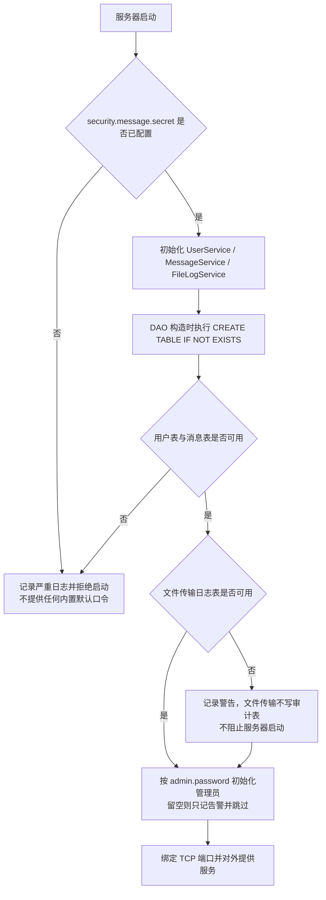
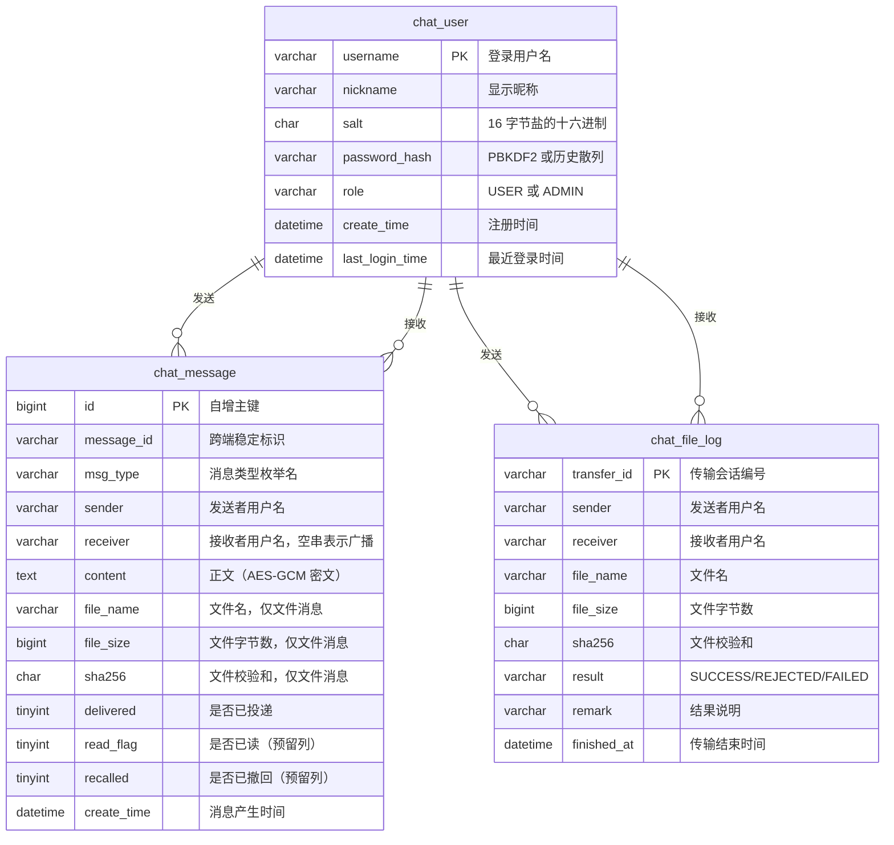
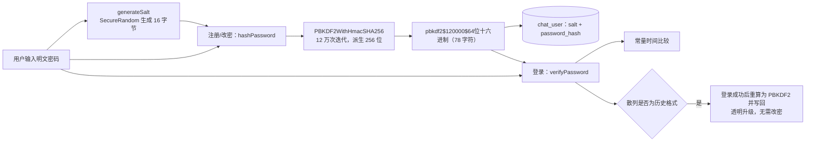

# 局域网聊天程序（题目 13：网络聊天程序）数据库与持久化设计说明书

| 项目名称 | 局域网聊天程序（LanChat） |
| --- | --- |
| 版本号 | v1.1 |
| 文档类型 | 数据库与持久化设计说明书 |
| 存储方案 | MySQL 8 + JDBC（唯一存储方案） |
| 依据文档 | `docs/design/01-需求分析.md`、`docs/design/02-系统设计.md`、`docs/superpowers/specs/2026-09-20-docs-facts.md` |

---

## 一、持久化方案总览

### 1.1 为什么只保留数据库存储

项目早期曾经实现过文件型持久化：用户账号写入项目目录下的文本文件，聊天记录按天写入日志文件，并与 MySQL 方案并存，通过一个配置开关在两者之间切换。该设计带来两个问题：

1. 行为不一致：文本文件与数据库在重复用户名处理、并发写、时间精度、查询能力上的语义无法完全对齐，同一个界面动作在两种存储下表现不同，问题定位成本高；
2. 维护成本翻倍：每新增一个字段或一条校验规则，都要在两条存储路径上各改一遍，测试也必须覆盖两条分支。

按用户要求，本项目只保留数据库存储。文件型实现与切换开关已整体删除：代码中不存在第二条存储路径，也不存在"数据库不可用时回退文件存储"的降级逻辑——数据库不可用时服务器在启动阶段明确拒绝启动并说明原因（见 1.3）。

### 1.2 存储边界与数据形态

| 数据 | 存放位置 | 说明 |
| --- | --- | --- |
| 用户账号与凭据 | 表 `chat_user` | 只保存盐与口令散列，不保存明文口令 |
| 聊天记录 | 表 `chat_message` | 文本与系统通知的正文以 AES-GCM 密文保存（前缀 `enc:v1:`）；文件消息的元信息写入专用列 |
| 文件传输结果 | 表 `chat_file_log` | 审计与统计用途，记录 SUCCESS / REJECTED / FAILED |
| 接收到的文件本体 | 客户端 `data/received/` | 不落库，服务器只做分块中继 |
| 导出的聊天记录 | `data/export/` 或用户指定路径 | 数据库负责"存"，导出是给使用者留存的文本副本 |

也就是说，磁盘上仍然以文件形式存在的只有"接收到的文件"与"导出的聊天记录"两类，其余业务数据一律入库。

导出链路：由服务端查库并渲染文本后回传，客户端只负责落盘，因此任意一台机器上的客户端都能导出，客户端不需要 MySQL 驱动、也不需要数据库配置；导出文本标注"数据来源: 服务器 ip:port"，客户端 10 秒未收到响应会提示超时。

### 1.3 存储初始化与启动校验流程



要点：

1. 加密口令缺失与数据库不可用同级，都在启动阶段直接拒绝，避免"服务起来了却写不进库"的半可用状态；
2. 建表由 DAO 构造函数内的 `CREATE TABLE IF NOT EXISTS` 完成，因此"只跑程序、不手工建表"也能用；
3. `admin.password` 留空时不创建管理员，只记录告警——程序不提供任何内置默认口令；
4. 文件传输日志属于旁路审计，它不可用只告警，不阻止服务器启动。

### 1.4 目录与文件总览

| 路径 | 类型 | 用途 | 是否纳入版本管理 |
| --- | --- | --- | --- |
| `config/chat.properties` | 配置 | 网络、文件、数据库连接与加密口令 | 是（不含真实口令） |
| `config/chat.properties.example` | 配置模板 | 供部署者复制的模板，不含任何真实口令 | 是 |
| `data/received/` | 接收目录 | 客户端收到的文件，重名自动追加序号 | 否 |
| `data/export/` | 导出目录 | `chat-用户名-时间戳.txt` 导出结果 | 否 |
| `sql/schema.sql` | 建表脚本 | 手工初始化或重建三张表，内含升级用的 `ALTER TABLE` 注释 | 是 |
| `lib/mysql-connector-j-8.2.0.jar` | 依赖 | JDBC 驱动，本项目唯一的第三方依赖 | 视提交策略而定 |

数据目录可通过配置项 `data.dir` 或系统属性 `lanchat.data.dir` 覆盖（系统属性优先，自动化测试据此把接收与导出隔离到临时目录）。

---

## 二、数据库存储设计

### 2.1 存储分层与唯一实现

| 层次 | 类型 | 说明 |
| --- | --- | --- |
| 接口层 | `BaseDao`、`UserDao`、`MessageDao` | 定义增删改查契约 |
| 实现层 | `JdbcUserDao`、`JdbcMessageDao`、`JdbcFileLogDao` | 唯一实现；文件型实现已删除，不存在第二个实现类 |
| 业务层 | `UserService`、`MessageService`、`FileLogService` | 承载业务规则；不感知 SQL 细节，也不感知"存储介质" |

连接策略：每次数据库操作独立 `DriverManager.getConnection`，用 try-with-resources 关闭，不引入连接池——在课程设计的并发规模下，连接建立开销远小于一次网络往返，换来的是"零第三方框架"与更小的资源泄漏面。

### 2.2 连接可用性自检

DAO 在构造阶段完成两件事：`Class.forName(driver)` 加载驱动，执行一次建表语句。任一步失败只把状态标记为 `isAvailable()=false` 并记录 `failureReason()`，不在构造阶段抛异常，从而让"数据库不可用"能由服务器启动自检统一汇报，而不是在某个随机调用点突然抛出。驱动类名由配置提供、通过反射加载，因此驱动不在 classpath 上时项目依然可以编译。

### 2.3 字段映射与消息多态还原

`chat_message` 一行保存一条消息，读出时按 `msg_type` 与 `file_name` 还原为对应的消息子类：

| 存储侧条件 | 还原对象 | 说明 |
| --- | --- | --- |
| `msg_type` 为 `FILE_REQUEST`/`FILE_RESULT`，或 `file_name` 非空 | `FileMessage` | 文件名、大小、校验和分别从 `file_name`、`file_size`、`sha256` 列读回 |
| `msg_type` 为 `SYSTEM`/`ERROR` | `SystemMessage` | 正文作为通知内容，类型保留原值 |
| 其余类型 | `TextMessage` | 正文作为文本内容，类型保留原值 |

正文在写入前经 `MessageCipher.encrypt` 加密、读出后立即 `MessageCipher.decrypt`，因此业务层拿到的始终是明文，加密只发生在持久化边界上。`id`（自增主键）在落库后回填到内存消息对象；`message_id` 为跨端稳定标识，允许为 NULL（升级前的历史数据）。

### 2.4 事务、并发与一致性

1. 每条 SQL 独立自动提交，不使用跨语句事务：用户与消息记录都是单行写入，不存在需要回滚的多行原子更新；
2. 重复用户名由 `chat_user` 的主键唯一约束兜底，DAO 把主键冲突包装为受检异常，上层据此提示"用户名已存在"，语义确定且不依赖"先查后写"的竞态窗口；
3. 聊天记录是追加型数据，不提供原地修改，`update` 恒定返回 false；
4. 并发安全交给数据库：每个连接线程各自获取连接，InnoDB 行级锁保证单行更新的原子性，不存在文件存储时代的"整表重写"与写锁串行化。

### 2.5 时间字段与时区

`DATETIME` 与 `LocalDateTime` 通过 `Timestamp.valueOf` / `getTimestamp` 互转，读写两端由同一 JDBC 驱动完成，程序自身的读写始终一致。

时区陷阱（部署必须检查）：连接串 `db.url` 的 `serverTimezone` 必须填写数据库所在机器的真实时区。例如数据库在东八区而连接串填 `UTC`，程序按本地时间写入的 09:21 会以 01:21 存进 `DATETIME` 列——程序自身读写一致（界面显示正常），但用 mysql 命令行或图形工具直接查看会整整差 8 小时，极易被误判为"消息时间错乱"。建议先执行 `SELECT @@global.time_zone, @@session.time_zone, NOW();` 确认数据库时区，再据此填写连接串。

### 2.6 已有数据库升级

程序启动时的建表语句是 `CREATE TABLE IF NOT EXISTS`：表已存在时整条语句直接跳过，因此它既不会补建缺失的列，也不会修改已有列的宽度。升级已有数据库时必须手工执行结构变更，`sql/schema.sql` 内以注释形式提供了对应语句，建议先 `mysqldump` 备份再执行。

两个必须升级的场景：

| 场景 | 症状 | 升级语句 |
| --- | --- | --- |
| `chat_user.password_hash` 仍是历史宽度（64 字符） | 写入 78 字符的 PBKDF2 散列时报 Data too long（MySQL 默认 STRICT_TRANS_TABLES） | `ALTER TABLE chat_user MODIFY COLUMN password_hash VARCHAR(128) NOT NULL;` |
| `chat_message` 缺少可靠性相关新增列 | 落库时提示未知列 | `ALTER TABLE chat_message ADD COLUMN ...` 等语句（见 3.5） |

历史数据兼容：升级前写入的 `chat_message` 行 `message_id` 为 NULL，MySQL 唯一索引允许多行 NULL，因此不需要数据迁移；升级前写入的正文没有 `enc:v1:` 前缀，会被识别为历史明文原样返回；升级前的口令散列为单轮加盐 SHA-256，登录成功后自动重算为 PBKDF2（见 5.1）。

---

## 三、数据库表结构

### 3.1 ER 图

数据库名 `lanchat`，字符集统一 `utf8mb4`。核心实体为用户、消息与文件传输日志；用户与消息之间是"发送/接收"两条一对多关系，用户与文件传输日志同理。



说明：ER 图表达的是业务引用关系，表上不使用外键约束。聊天记录与传输日志是追加型历史数据，删除用户不应连带删除历史记录，因此由应用层控制引用完整性。

### 3.2 `chat_user` 表结构

| 字段名 | 类型 | 允许空 | 键与索引 | 默认值 | 说明 |
| --- | --- | --- | --- | --- | --- |
| `username` | `VARCHAR(32)` | 否 | 主键 | 无 | 登录名，业务层另用正则约束为 3 至 16 位且以字母开头 |
| `nickname` | `VARCHAR(64)` | 否 | 索引 `idx_chat_user_nickname` | 无 | 显示昵称，业务层约束不超过 20 字符 |
| `salt` | `CHAR(32)` | 否 | 无 | 无 | 16 字节随机盐的十六进制表示 |
| `password_hash` | `VARCHAR(128)` | 否 | 无 | 无 | 口令散列：PBKDF2 为 `pbkdf2$迭代数$<64 位十六进制>`（约 78 字符），历史散列为单轮加盐 SHA-256（64 位十六进制） |
| `role` | `VARCHAR(16)` | 否 | 索引 `idx_chat_user_role` | `USER` | 角色标识，取值 `USER` 或 `ADMIN` |
| `create_time` | `DATETIME` | 是 | 无 | NULL | 注册时间 |
| `last_login_time` | `DATETIME` | 是 | 无 | NULL | 最近一次登录成功时间，从未登录为 NULL |

设计说明：

1. `password_hash` 使用 `VARCHAR(128)` 而不是历史上的定长 `CHAR(64)`：PBKDF2 散列形如 `pbkdf2$120000$<64 位十六进制>`，长度 78；`VARCHAR` 还为将来增加迭代数位数留出余量。沿用旧宽度会导致写入被数据库拒绝，这也是升级已有库时必须先执行 `ALTER TABLE` 的直接原因。
2. 盐与散列分列存储、格式解耦：`salt` 固定 32 字符十六进制，用 `CHAR` 定长即可；散列因为要容纳两种格式（PBKDF2 与历史 SHA-256）而使用变长类型。
3. `role` 不使用 `ENUM`，便于后续新增角色而不需要 `ALTER TABLE`。
4. 用户名用 `VARCHAR(32)` 而非业务上限 16，是给放宽规则留出余量，业务约束由 `UserService` 的正则保证。

### 3.3 `chat_message` 表结构

| 字段名 | 类型 | 允许空 | 键与索引 | 默认值 | 说明 |
| --- | --- | --- | --- | --- | --- |
| `id` | `BIGINT` | 否 | 主键，`AUTO_INCREMENT` | 无 | 数据库自增编号，服务端序号 |
| `message_id` | `VARCHAR(36)` | 是 | 唯一索引 `uk_message_id` | NULL | 跨端稳定标识（UUID）；历史数据为 NULL |
| `msg_type` | `VARCHAR(32)` | 否 | 无 | `TEXT_PRIVATE` | `MessageType` 枚举名（当前共 34 项），如 `TEXT_PRIVATE`、`TEXT_GROUP`、`FILE_REQUEST` |
| `sender` | `VARCHAR(32)` | 否 | 联合索引 `idx_chat_message_sender` 首列 | 空串 | 发送者用户名；系统消息为 `SYSTEM` |
| `receiver` | `VARCHAR(32)` | 否 | 联合索引 `idx_chat_message_receiver` 首列 | 空串 | 接收者用户名；空串表示广播（群聊或系统通知） |
| `content` | `TEXT` | 是 | 无 | NULL | 文本正文或系统通知内容，以 AES-GCM 密文保存（前缀 `enc:v1:`）；文件消息存可读描述 |
| `file_name` | `VARCHAR(255)` | 是 | 无 | NULL | 文件名，仅文件类消息写入 |
| `file_size` | `BIGINT` | 是 | 无 | NULL | 文件字节数，仅文件类消息写入 |
| `sha256` | `CHAR(64)` | 是 | 无 | NULL | 文件 SHA-256 校验和，仅文件类消息写入 |
| `delivered` | `TINYINT` | 否 | 联合索引 `idx_receiver_delivered` 次列 | 0 | 是否已投递给接收方：0 未投递、1 已投递 |
| `read_flag` | `TINYINT` | 否 | 无 | 0 | 接收方是否已读：0 未读、1 已读（预留列） |
| `recalled` | `TINYINT` | 否 | 无 | 0 | 是否已撤回：0 否、1 是（预留列） |
| `create_time` | `DATETIME` | 否 | 索引 `idx_chat_message_time` | 无 | 消息产生时间 |

关于可靠性相关列：

1. `message_id` 已被使用：客户端发送时生成 UUID 并随消息上行，服务端在落库前用它做重复判定（网络重发与补投可能把同一条消息再送一次），`uk_message_id` 保证同一标识只落一行；历史数据该列为 NULL，唯一索引允许多行 NULL，因此无需迁移；
2. `delivered` 已被使用：新入库消息一律为 0（未投递），服务端在投递成功后批量置 1，登录时按 `receiver + delivered = 0` 查询未送达消息进行补投；
3. `read_flag` 与 `recalled` 是**预留列**：表结构已建、写入时恒为 0，但已读回执与撤回的端到端业务尚未接线，界面不提供这两项能力。

上述稳定标识、送达标记与离线补投能力已在网络层与服务端落地；界面上的展示部分（如历史分页入口、消息搜索界面）仍随后续界面轮次完善。

设计说明：把文件元信息从正文中拆成独立列，是为了让"查某个用户收发的文件""按大小统计"这类查询走索引而不是解析字符串；`content` 用 `TEXT` 支持最长 2000 字符的业务上限并留有余量；`receiver` 用空串而不是 NULL 表达广播，与业务层"接收者为空即广播"的判断一致。

### 3.4 `chat_file_log` 表结构

| 字段名 | 类型 | 允许空 | 键与索引 | 默认值 | 说明 |
| --- | --- | --- | --- | --- | --- |
| `transfer_id` | `VARCHAR(64)` | 否 | 主键 | 无 | 传输会话编号（UUID） |
| `sender` | `VARCHAR(32)` | 否 | 联合索引 `idx_chat_file_log_sender` 首列 | 无 | 发送者用户名 |
| `receiver` | `VARCHAR(32)` | 否 | 联合索引 `idx_chat_file_log_receiver` 首列 | 无 | 接收者用户名 |
| `file_name` | `VARCHAR(255)` | 否 | 无 | 无 | 文件名 |
| `file_size` | `BIGINT` | 否 | 无 | 无 | 文件字节数 |
| `sha256` | `CHAR(64)` | 是 | 无 | NULL | 文件校验和 |
| `result` | `VARCHAR(16)` | 否 | 无 | 无 | 传输结果：`SUCCESS` / `REJECTED` / `FAILED` |
| `remark` | `VARCHAR(255)` | 是 | 无 | NULL | 结果说明或失败原因 |
| `finished_at` | `DATETIME` | 否 | 联合索引 `idx_chat_file_log_sender` / `idx_chat_file_log_receiver` 次列 | 无 | 传输结束时间 |

用途说明：一次文件传输在 `chat_message` 中只留一条消息，本表则面向"传输审计"，带结果与传输编号，可以按结果统计成功率、按传输编号定位某一次传输。

### 3.5 完整建表 SQL

完整脚本见 `sql/schema.sql`（含建库语句、注释与升级说明），下面给出三张表的结构：列定义、默认值与索引与脚本及程序运行期建表保持一致，这里统一写成 `CREATE TABLE IF NOT EXISTS` 形式（脚本为支持重建，在每条建表语句前另有 `DROP TABLE IF EXISTS`）。脚本刻意不写入任何固定管理员凭据：管理员由程序在首次启动时按 `admin.password` 创建，盐与散列在运行时随机生成——固定散列会把一个公开可知的口令固化进每一份部署。

```sql
CREATE DATABASE IF NOT EXISTS lanchat
    DEFAULT CHARACTER SET utf8mb4
    DEFAULT COLLATE utf8mb4_general_ci;
USE lanchat;

CREATE TABLE IF NOT EXISTS chat_user
(
    username        VARCHAR(32)  NOT NULL COMMENT '登录用户名，全局唯一，作为主键',
    nickname        VARCHAR(64)  NOT NULL COMMENT '显示昵称，可重复',
    salt            CHAR(32)     NOT NULL COMMENT '密码盐（16 字节的十六进制表示，共 32 字符）',
    password_hash   VARCHAR(128) NOT NULL COMMENT '口令散列：PBKDF2 为 pbkdf2$迭代数$hex（约 78 字符），历史散列为单轮加盐 SHA-256（64 字符）',
    role            VARCHAR(16)  NOT NULL DEFAULT 'USER' COMMENT '角色：ADMIN 管理员 / USER 普通用户',
    create_time     DATETIME     NULL COMMENT '注册时间',
    last_login_time DATETIME     NULL COMMENT '最近一次登录时间',
    PRIMARY KEY (username),
    KEY idx_chat_user_nickname (nickname),
    KEY idx_chat_user_role (role)
) ENGINE = InnoDB DEFAULT CHARSET = utf8mb4 COMMENT '用户表';

CREATE TABLE IF NOT EXISTS chat_message
(
    id          BIGINT       NOT NULL AUTO_INCREMENT COMMENT '消息自增编号，服务端序号',
    message_id  VARCHAR(36)  NULL COMMENT '跨端稳定标识（UUID）：ACK 确认、去重、离线补投的依据；历史数据为 NULL',
    msg_type    VARCHAR(32)  NOT NULL DEFAULT 'TEXT_PRIVATE' COMMENT '消息类型，取 MessageType 枚举名',
    sender      VARCHAR(32)  NOT NULL DEFAULT '' COMMENT '发送者用户名，系统消息固定为 SYSTEM',
    receiver    VARCHAR(32)  NOT NULL DEFAULT '' COMMENT '接收者用户名，空字符串表示广播',
    content     TEXT         NULL COMMENT '消息内容（文本消息为 AES-GCM 密文）',
    file_name   VARCHAR(255) NULL COMMENT '文件名（仅文件消息使用）',
    file_size   BIGINT       NULL COMMENT '文件大小（字节，仅文件消息使用）',
    sha256      CHAR(64)     NULL COMMENT '文件 SHA-256 校验和（仅文件消息使用）',
    delivered   TINYINT      NOT NULL DEFAULT 0 COMMENT '是否已投递给接收方：0 未投递 1 已投递',
    read_flag   TINYINT      NOT NULL DEFAULT 0 COMMENT '接收方是否已读（预留列）：0 未读 1 已读',
    recalled    TINYINT      NOT NULL DEFAULT 0 COMMENT '是否已撤回（预留列）：0 否 1 是',
    create_time DATETIME     NOT NULL COMMENT '消息产生时间',
    PRIMARY KEY (id),
    UNIQUE KEY uk_message_id (message_id),
    KEY idx_receiver_delivered (receiver, delivered, id),
    KEY idx_chat_message_time (create_time),
    KEY idx_chat_message_sender (sender, create_time),
    KEY idx_chat_message_receiver (receiver, create_time)
) ENGINE = InnoDB DEFAULT CHARSET = utf8mb4 COMMENT '聊天消息表';

CREATE TABLE IF NOT EXISTS chat_file_log
(
    transfer_id  VARCHAR(64)  NOT NULL COMMENT '传输会话编号（UUID）',
    sender       VARCHAR(32)  NOT NULL COMMENT '发送者用户名',
    receiver     VARCHAR(32)  NOT NULL COMMENT '接收者用户名',
    file_name    VARCHAR(255) NOT NULL COMMENT '文件名',
    file_size    BIGINT       NOT NULL COMMENT '文件大小（字节）',
    sha256       CHAR(64)     NULL COMMENT '文件校验和',
    result       VARCHAR(16)  NOT NULL COMMENT '传输结果：SUCCESS / REJECTED / FAILED',
    remark       VARCHAR(255) NULL COMMENT '结果说明或失败原因',
    finished_at  DATETIME     NOT NULL COMMENT '传输结束时间',
    PRIMARY KEY (transfer_id),
    KEY idx_chat_file_log_sender (sender, finished_at),
    KEY idx_chat_file_log_receiver (receiver, finished_at)
) ENGINE = InnoDB DEFAULT CHARSET = utf8mb4 COMMENT '文件传输日志表';
```

已有数据库的升级语句（`sql/schema.sql` 中以注释形式提供，升级时手工执行）：

```sql
-- 1. 口令散列列宽：老库 password_hash 仍是 CHAR(64)，写 PBKDF2 散列会报 Data too long
ALTER TABLE chat_user
    MODIFY COLUMN password_hash VARCHAR(128) NOT NULL;

-- 2. 补齐消息表的可靠性相关列与索引
ALTER TABLE chat_message
    ADD COLUMN message_id VARCHAR(36)  NULL,
    ADD COLUMN delivered  TINYINT      NOT NULL DEFAULT 0,
    ADD COLUMN read_flag  TINYINT      NOT NULL DEFAULT 0,
    ADD COLUMN recalled   TINYINT      NOT NULL DEFAULT 0,
    MODIFY COLUMN msg_type VARCHAR(32) NOT NULL DEFAULT 'TEXT_PRIVATE',
    ADD UNIQUE KEY uk_message_id (message_id),
    ADD KEY idx_receiver_delivered (receiver, delivered, id);
```

### 3.6 数据库访问实现要点

1. **参数化查询**：全部 SQL 使用 `PreparedStatement` 占位符传参，用户名、关键字等外部输入绝不拼接进 SQL 文本，从根源上消除 SQL 注入；
2. **主键语义一致**：`username` 即用户主键，`findById` 与 `findByUsername` 等价，`save` 在用户名已存在时因主键冲突抛出受检异常，不会产生第二条记录；
3. **自增主键回填**：消息插入时使用 `Statement.RETURN_GENERATED_KEYS`，把数据库分配的 `id` 回填到内存消息对象，供后续按编号删除或定位；
4. **时间字段映射**：`DATETIME` 与 `LocalDateTime` 通过 `Timestamp` 互转，读写精度一致；
5. **凭据不落地到日志**：SQL 异常只记录消息与错误码，不打印参数列表，避免盐与散列进入日志文件。

---

## 四、索引设计与查询优化

### 4.1 索引清单

| 索引名 | 表 | 字段 | 类型 | 服务的典型查询 |
| --- | --- | --- | --- | --- |
| `PRIMARY` | `chat_user` | `username` | 主键聚簇索引 | 登录时取盐与散列；注册与删除时判断存在性 |
| `idx_chat_user_nickname` | `chat_user` | `nickname` | 普通二级索引 | 按昵称检索 |
| `idx_chat_user_role` | `chat_user` | `role` | 普通二级索引 | 按角色筛选（如列出管理员） |
| `PRIMARY` | `chat_message` | `id` | 主键聚簇索引 | 按主键定位单条消息；键集分页的游标列 |
| `uk_message_id` | `chat_message` | `message_id` | 唯一索引 | 落库前去重，保证同一稳定标识只落一行 |
| `idx_receiver_delivered` | `chat_message` | `receiver`, `delivered`, `id` | 联合索引 | 登录后查询某用户"未送达"的消息并按序补投 |
| `idx_chat_message_sender` | `chat_message` | `sender`, `create_time` | 联合索引 | "我发出的消息"按时间检索 |
| `idx_chat_message_receiver` | `chat_message` | `receiver`, `create_time` | 联合索引 | "我收到的消息"按时间检索，私聊会话查询 |
| `idx_chat_message_time` | `chat_message` | `create_time` | 普通二级索引 | 按时间范围导出与统计 |
| `PRIMARY` | `chat_file_log` | `transfer_id` | 主键聚簇索引 | 按传输编号定位一次传输 |
| `idx_chat_file_log_sender` | `chat_file_log` | `sender`, `finished_at` | 联合索引 | 某用户发起过的文件传输记录 |
| `idx_chat_file_log_receiver` | `chat_file_log` | `receiver`, `finished_at` | 联合索引 | 某用户接收过的文件传输记录 |

以上索引以 `sql/schema.sql` 为准。程序的运行期建表只保证"表与列存在"，`CREATE TABLE IF NOT EXISTS` 不会为已存在的表补建索引（原因见 2.6），因此正式部署建议用脚本建库，升级已有库时把脚本中的结构变更一并执行。

### 4.2 索引设计理由

1. **`uk_message_id` 用唯一索引而非普通索引**：它的职责是"同一稳定消息标识只能落一行"，去重必须由数据库保证，而不是应用层"先查后写"；
2. **`idx_receiver_delivered` 把 `id` 作为第三列**：补投查询是"按接收者取未送达、按主键升序"，把 `id` 放进索引后可以直接沿索引顺序取数，无需额外排序；
3. **联合索引列序遵循最左前缀**：`(sender, create_time)` 与 `(receiver, create_time)` 先按用户等值匹配，再按时间范围扫描，正好覆盖"某用户某时间段的消息"这一高频查询；
4. **创建时间单独建索引**：按日期范围跨用户筛选历史时联合索引的最左列不参与条件，需要独立的单列索引；
5. **不建冗余索引**：`receiver` 已有联合索引，不再单独建单列索引，避免写放大；
6. **没有全文索引**：早期文件存储方案曾用全文检索匹配正文，改为数据库后正文以密文入库，`FULLTEXT` 与 `LIKE` 都无法匹配明文，因此关键字检索改在应用层完成（见 4.3），不保留正文全文索引。

### 4.3 关键查询与优化说明

| 查询场景 | SQL 形态 | 命中索引 | 优化说明 |
| --- | --- | --- | --- |
| 用户登录取凭据 | `SELECT * FROM chat_user WHERE username = ?` | `PRIMARY` | 单行点查 |
| 用户列表展示 | `SELECT * FROM chat_user ORDER BY username` | `PRIMARY` | 结果集小，顺序扫描即可 |
| 历史记录按用户查询 | `SELECT ... FROM chat_message WHERE (sender = ? OR receiver = ? OR receiver = '') [AND create_time >= ?] [AND create_time <= ?] ORDER BY create_time ASC, id ASC` | `idx_chat_message_sender`、`idx_chat_message_receiver` | 本人收发的消息或广播消息；时间条件按需拼接 |
| 私聊会话键集分页 | `SELECT ... WHERE ((sender = ? AND receiver = ?) OR (sender = ? AND receiver = ?)) AND id < ? ORDER BY id DESC LIMIT ?` | `PRIMARY`、`idx_chat_message_sender`、`idx_chat_message_receiver` | 用 `id < 游标` 代替 `OFFSET`，翻到第几页代价都一样；取出最近若干条后在内存反转为时间升序；条数默认 50、上限 200。该分页能力已在 DAO 与服务层实现，但尚未接入请求处理与界面入口（见第八节后续方向） |
| 离线消息补投 | `SELECT ... WHERE receiver = ? AND delivered = 0 ORDER BY id ASC LIMIT ?` | `idx_receiver_delivered` | 联合索引直接覆盖过滤与排序 |
| 稳定标识去重 | `SELECT 1 FROM chat_message WHERE message_id = ? LIMIT 1` | `uk_message_id` | 唯一索引点查，命中即返回 |
| 按日期范围查询历史 | 在按用户查询的基础上追加 `AND create_time >= ? AND create_time <= ?` | `idx_chat_message_time`、`idx_chat_message_sender`、`idx_chat_message_receiver` | 起止日期在服务端解析为当天 `00:00:00` 与 `23:59:59` 后直接比较列值，不在索引列上套函数 |
| 导出聊天记录 | 服务端按登录用户调用历史查询（不限定时间），再渲染文本回传，客户端只负责落盘 | 无（结果集顺序扫描） | 导出必须是"服务端查库、客户端落盘"：客户端没有数据库配置，若各自查库则只有与数据库同机的机器能导出；课程设计数据量下全量导出可接受 |
| 关键字检索 | `SELECT ... FROM chat_message ORDER BY create_time ASC, id ASC`，逐行解密后在内存匹配正文、文件名、发送者与接收者 | 无（全表扫描） | 正文为密文，SQL 侧无法过滤；课程设计数据量下可接受，数据量增大后应改为落库时另存可检索摘要 |

通用优化约定：

1. 所有条件一律使用参数占位符，禁止拼接 SQL；
2. 带 `LIMIT` 的查询都做条数归一化（非法值回落默认值、超限截断），不做无界全量查询；
3. 键集分页优先于 `OFFSET` 分页；
4. 时间范围查询把日期解析为明确的起止时刻后直接比较 `create_time` 列，禁止在索引列上使用函数；
5. 关键字检索由界面限制最小长度与返回条数。

---

## 五、数据安全设计

### 5.1 口令存储：PBKDF2 加盐散列

口令永不以明文落库，`chat_user` 只保存 32 字符盐与口令散列。



1. **算法与参数**：`PBKDF2WithHmacSHA256`，迭代 120000 次，派生 256 位，存储格式 `pbkdf2$120000$<64 位十六进制>`，共 78 字符；把迭代次数写进散列，是为了将来提高迭代数时旧散列仍能被正确校验。
2. **为什么不用单轮 SHA-256**：SHA-256 是为"快"设计的通用摘要算法，单张消费级显卡每秒可以尝试上亿次，加盐只能阻止彩虹表、无法阻止逐账号爆破；PBKDF2 把 12 万次迭代作为人为的时间成本写进算法，同一张显卡每秒能试的组合降到几千，爆破成本超出账号价值。
3. **兼容历史散列**：升级前注册的账号存的是单轮加盐 SHA-256（64 位十六进制）。校验时按格式分流：`pbkdf2$` 开头走 PBKDF2，其余走历史算法；登录成功后由业务层重新散列并写回（透明升级，用户无需改密，也不会因升级集体失效）。
4. **常量时间比较**：普通的 `String.equals` 在发现第一个不同字符时立即返回，比较耗时与"相同前缀长度"正相关，攻击者可据响应时间逐字节推断散列前缀；项目使用逐字节异或累加的常量时间比较，无论差异出现在哪一位比较次数都固定，从而消除该侧信道。
5. **不引入第三方加密库**：PBKDF2 与 SHA-256 都使用 JDK 自带实现，符合"不使用现成框架"的题目约束。

### 5.2 聊天正文存储加密：AES-GCM

聊天记录正文在写入数据库前加密，直接查看 `chat_message.content` 列只能看到 Base64 密文。

1. **算法**：`AES/GCM/NoPadding`；GCM 自带完整性校验，密文被篡改会在解密时直接失败；每次加密随机生成 12 字节初始向量，相同明文两次加密结果不同；认证标签 128 位。
2. **密钥派生**：由配置项 `security.message.secret` 经 `PBKDF2WithHmacSHA256` 派生 256 位密钥，固定盐 `LANChat.chat_message.v1`，迭代 65536 次。盐必须固定：密钥要在每次进程启动时重新派生以解开历史记录，随机盐会导致重启后再也解不开此前写入的密文。
3. **密文格式**：`enc:v1:` 前缀 + Base64(IV || 密文)；读取时无前缀的记录按历史明文处理、原样返回，因此加密前写入的旧数据无需迁移。
4. **密钥缺失拒绝启动**：`security.message.secret` 为空时，`MessageCipher` 直接抛出异常，服务器启动自检在绑定端口前记录严重日志并拒绝启动；程序不提供任何内置默认口令，避免"忘记配置"静默退化成使用公开弱密钥。
5. **口令变更的影响**：加密口令一旦变更，此前写入的历史密文无法解密，读取时显示占位文本"该消息无法解密，可能更换了加密口令"并记录警告，而不是抛异常让界面崩溃。部署时应把口令与数据库备份一并妥善保存。
6. **失败时不落明文**：加密失败宁可放弃该条记录的内容，也绝不把明文写入数据库。
7. **边界（必须如实说明）**：上述加密只保护"落盘后的聊天正文"。网络传输仍是 Java 原生对象序列化的明文 TCP 报文，局域网内抓包可见；本项目的协议加固并未改变这一点，文档不得声称传输层已加密。

### 5.3 凭据脱敏

`User` 对象同时承担持久化实体与网络传输资料两种角色。为避免盐与散列随在线用户列表广播出去，服务器在向外发送任何用户对象之前都要清空凭据（`clearCredential()` 或生成脱敏副本）。要点：

1. `UserListCodec.encode` 只编码用户名、昵称与角色三列，本身不含凭据，构成第二道防线；
2. `User.toString()` 只输出用户名、昵称、角色与在线状态，不含散列与盐，保证"随手打日志"也不会泄露；
3. 服务器内部持有完整对象，脱敏发生在序列化边界之前，业务逻辑仍可正常校验。

### 5.4 日志脱敏

| 敏感信息 | 禁止出现的位置 | 落地做法 |
| --- | --- | --- |
| 明文密码 | 全部日志、异常消息、配置文件示例 | 登录与注册路径只记录用户名与结果；异常信息不拼接密码 |
| 盐与散列 | 全部日志与网络报文 | `User.toString` 与 `UserListCodec` 均不输出凭据字段 |
| 数据库连接口令 | 日志、版本库 | 配置模板中 `db.password` 留空，真实口令不提交仓库；SQL 异常不打印参数 |
| 聊天加密口令 | 日志、版本库 | `security.message.secret` 不写入日志；配置模板中留空并标注必填 |
| 聊天正文 | 数据库与导出文件之外的位置 | 数据库中为密文；导出文件是使用者主动生成的明文副本，需自行保管 |
| 用户隐私路径 | 界面提示 | 错误提示只给文件名与原因，不在界面暴露服务器绝对路径 |
| 客户端 IP | 对外报文的公告字段 | UDP 公告只含服务器 IP、端口与在线人数 |

### 5.5 其它安全控制

| 风险 | 控制措施 | 对应需求 |
| --- | --- | --- |
| 身份伪造 | 服务器以连接绑定的登录名强制覆盖消息 `sender` 字段 | NFR-16 |
| SQL 注入 | JDBC 全部使用 `PreparedStatement` 占位符，不拼接 SQL | NFR-17 |
| 目录穿越 | `FileUtil.sanitizeFileName` 去掉路径分隔符与上级目录标记，落盘前再经 `uniqueTarget` 生成安全目标路径 | NFR-17 |
| 覆盖已有文件 | 接收端重名时自动追加序号，绝不覆盖 | FR-7 |
| 超长输入 | 用户名、昵称、密码、消息长度均有上限校验，超限直接拒绝 | FR-16 |
| 未登录操作 | `AbstractMessageHandler` 在父类统一守卫，未登录连接的业务请求被拒绝 | FR-15 |
| 连接耗尽 | 连接数上限由 `server.max.connections` 配置（默认 200），超出直接关闭套接字 | NFR-2、NFR-10 |
| 在线口令爆破 | 同一「用户名（小写）+ 来源地址」连续失败 5 次锁定 5 分钟，到期自动解锁；账号不存在与密码错误返回完全一致的提示 | NFR-14 |
| 恶意反序列化 | 反序列化白名单 `com.chat.common.*;java.lang.*;java.time.*;java.util.*;!*`，并限制 `maxdepth=8`、`maxrefs=1000`、`maxbytes=4MB`、`maxarray=65536`；被拒对象导致该连接断开并记 warning | NFR-17 |
| 控制报文越界 | 控制报文字段数上限 16，超出返回中文错误；拒绝控制字符（放行 `\n` 与 `\t`） | FR-15 |
| 文件元信息伪造 | 文件名非空且不超过 255 字符、剔除路径、拒绝 `..` 与控制字符；文件大小非负；块数必须与文件大小精确自洽；SHA-256 必须为 64 位十六进制 | FR-7、NFR-8 |
| 传输状态机绕过 | 校验参与者（发送者必须是登录者、接收者在线且非本人）、传输编号非空且不超过 64 字符、状态转换合法 | FR-7 |
| UDP 发现滥用 | 报文长度与格式严格校验，单来源限流 5 次/秒（突发 10），畸形包静默丢弃且不影响监听线程 | NFR-10 |

说明：以上加固都不改变"局域网内以明文传输"这一事实。

---

## 六、数据备份与恢复

### 6.1 数据库备份

业务数据的唯一来源是数据库，备份以 `mysqldump` 逻辑备份为主：

```bash
# 1. 逻辑备份：导出结构 + 数据（含三张表）
mysqldump -u root -p \
  --single-transaction \
  --routines --triggers --events \
  --default-character-set=utf8mb4 \
  lanchat > lanchat-$(date +%Y%m%d).sql

# 2. 仅备份结构（用于快速重建空库）
mysqldump -u root -p --no-data lanchat > lanchat-schema-$(date +%Y%m%d).sql

# 3. 仅备份用户表（含不可逆凭据，注意访问权限）
mysqldump -u root -p lanchat chat_user > lanchat-user-$(date +%Y%m%d).sql

# 4. 单独归档仍保存在磁盘上的接收文件与导出记录
tar -czvf lanchat-files-$(date +%Y%m%d).tar.gz data/received data/export
```

`--single-transaction` 用于 InnoDB 表的一致性快照备份，可在不锁表的前提下获得一致数据。备份文件包含不可逆的口令散列与加密后的聊天正文，仍属敏感数据，应限制访问权限并加密存放，禁止提交到公开仓库。

特别注意：聊天正文的密钥来自 `security.message.secret`，它与数据库备份必须配套保存。只恢复数据库而丢失原口令，历史正文将永远无法解密。

### 6.2 恢复演练与校验清单

```bash
# 1. 先建库再导入
mysql -u root -p -e "CREATE DATABASE IF NOT EXISTS lanchat DEFAULT CHARACTER SET utf8mb4;"
mysql -u root -p lanchat < lanchat-20260101.sql

# 2. 校验恢复结果
mysql -u root -p -e "USE lanchat; SELECT COUNT(*) AS 用户数 FROM chat_user; SELECT COUNT(*) AS 消息数 FROM chat_message; SELECT COUNT(*) AS 传输记录数 FROM chat_file_log;"
```

| 步骤 | 校验点 | 期望结果 |
| --- | --- | --- |
| 恢复后启动服务器 | 控制台日志 | 无建表或连接异常，在线表可正常初始化 |
| 用备份前的账号登录 | 登录结果 | 凭据校验通过，说明盐与散列完整恢复 |
| 查询历史记录 | 历史窗口 | 备份前消息可按时间查到，正文正常解密 |
| 变更过加密口令时查询历史 | 历史窗口 | 密文无法解密，显示占位提示（预期行为，不是缺陷） |
| 导出聊天记录 | 导出文件 | 文件存在、可打开、条数与提示一致 |
| 校验文件消息 | 历史内容 | 文件消息仍可按文件名、大小、校验和还原 |

### 6.3 数据生命周期建议

| 数据 | 建议保留期 | 处理方式 |
| --- | --- | --- |
| 用户表 | 长期 | 定期备份；项目结束后脱敏归档 |
| 聊天消息表 | 180 天 | 按 `create_time` 分批归档到历史表或冷备库后删除 |
| 文件传输日志表 | 90 天 | 按 `finished_at` 清理过期审计记录 |
| 导出文件 | 30 天 | 由用户自行清理，或由管理员定期清理 `data/export` |
| 接收文件 | 由用户决定 | 保存在客户端 `data/received`，服务器侧不留副本 |

---

## 七、数据字典汇总

### 7.1 用户数据字段汇总

| 字段中文名 | 数据库列 | 数据库类型 | 类型 | 长度 | 必填 | 唯一 | 示例值 |
| --- | --- | --- | --- | --- | --- | --- | --- |
| 用户名 | `username` | `VARCHAR(32)` | 文本 | 3 至 16 | 是 | 是 | `alice` |
| 昵称 | `nickname` | `VARCHAR(64)` | 文本 | 0 至 20 | 是 | 否 | `张三` |
| 密码盐 | `salt` | `CHAR(32)` | 十六进制 | 32 | 是 | 否 | `8a7b6c5d4e3f2a1b0c9d8e7f6a5b4c3d` |
| 口令散列 | `password_hash` | `VARCHAR(128)` | 十六进制/带前缀 | 64 或 78 | 是 | 否 | `pbkdf2$120000$1a2b...f809` |
| 角色 | `role` | `VARCHAR(16)` | 枚举文本 | 4 至 5 | 是 | 否 | `ADMIN` |
| 注册时间 | `create_time` | `DATETIME` | 日期时间 | 19 | 否 | 否 | `2025-01-01 10:12:33` |
| 最近登录时间 | `last_login_time` | `DATETIME` | 日期时间 | 19 | 否 | 否 | `2025-01-02 09:05:41` |
| 在线状态 | 不存储 | 无 | 布尔 | 1 | 否 | 否 | 运行期状态，仅存于内存在线表 |

### 7.2 消息数据字段汇总

| 字段中文名 | 数据库列 | 数据库类型 | 类型 | 长度 | 必填 | 索引 | 示例值 |
| --- | --- | --- | --- | --- | --- | --- | --- |
| 服务端编号 | `id` | `BIGINT` | 长整型 | 19 | 是 | 主键 | `1001` |
| 稳定消息标识 | `message_id` | `VARCHAR(36)` | UUID | 36 | 否 | 唯一 | `3f2b...9c1d` |
| 消息类型 | `msg_type` | `VARCHAR(32)` | 枚举名 | 3 至 20 | 是 | 无 | `TEXT_PRIVATE` |
| 发送者 | `sender` | `VARCHAR(32)` | 文本 | 3 至 16 | 是 | 联合索引首列 | `alice` |
| 接收者 | `receiver` | `VARCHAR(32)` | 文本 | 0 至 16 | 是 | 联合索引首列 | `bob` 或空表示广播 |
| 消息内容 | `content` | `TEXT` | 密文/文本 | 0 至 2000 | 否 | 无 | `enc:v1:BASE64...` |
| 文件名 | `file_name` | `VARCHAR(255)` | 文本 | 0 至 255 | 否 | 无 | `设计文档.pdf` |
| 文件大小 | `file_size` | `BIGINT` | 长整型 | 20 | 否 | 无 | `1258291` |
| 文件校验和 | `sha256` | `CHAR(64)` | 十六进制 | 64 | 否 | 无 | `9f8e...b1a0` |
| 是否已投递 | `delivered` | `TINYINT` | 布尔 | 1 | 是 | 联合索引次列 | `0` 未投递；`1` 已投递 |
| 是否已读 | `read_flag` | `TINYINT` | 布尔 | 1 | 是 | 无 | 预留列，当前恒为 `0` |
| 是否已撤回 | `recalled` | `TINYINT` | 布尔 | 1 | 是 | 无 | 预留列，当前恒为 `0` |
| 消息时间 | `create_time` | `DATETIME` | 日期时间 | 19 | 是 | 有 | `2025-01-02 09:10:00` |

### 7.3 文件传输日志字段汇总

| 字段中文名 | 数据库列 | 数据库类型 | 类型 | 长度 | 必填 | 索引 | 示例值 |
| --- | --- | --- | --- | --- | --- | --- | --- |
| 传输编号 | `transfer_id` | `VARCHAR(64)` | UUID | 36 | 是 | 主键 | `a1b2...c3d4` |
| 发送者 | `sender` | `VARCHAR(32)` | 文本 | 3 至 16 | 是 | 联合索引首列 | `alice` |
| 接收者 | `receiver` | `VARCHAR(32)` | 文本 | 3 至 16 | 是 | 联合索引首列 | `bob` |
| 文件名 | `file_name` | `VARCHAR(255)` | 文本 | 1 至 255 | 是 | 无 | `设计文档.pdf` |
| 文件大小 | `file_size` | `BIGINT` | 长整型 | 20 | 是 | 无 | `1258291` |
| 文件校验和 | `sha256` | `CHAR(64)` | 十六进制 | 64 | 否 | 无 | `9f8e...b1a0` |
| 传输结果 | `result` | `VARCHAR(16)` | 枚举文本 | 6 至 8 | 是 | 无 | `SUCCESS` |
| 结果说明 | `remark` | `VARCHAR(255)` | 文本 | 0 至 255 | 否 | 无 | `接收方拒绝` |
| 结束时间 | `finished_at` | `DATETIME` | 日期时间 | 19 | 是 | 联合索引次列 | `2025-01-02 09:12:00` |

### 7.4 常量与阈值汇总

| 常量 | 值 | 含义 | 影响的数据行为 |
| --- | --- | --- | --- |
| `DEFAULT_SERVER_PORT` | 9527 | 服务器 TCP 端口 | 连接入口 |
| `DISCOVERY_PORT` | 30000 | UDP 发现端口 | 自动发现 |
| `MAX_CONNECTIONS` | 200 | 最大并发连接数（可配置） | 连接准入 |
| 口令散列迭代次数 | 120000 | PBKDF2 迭代次数 | `chat_user.password_hash` 的长度与登录耗时 |
| 消息加密密钥派生迭代次数 | 65536 | AES-GCM 密钥派生迭代次数 | 密文密钥强度与进程启动耗时 |
| `DATE_TIME_PATTERN` | `yyyy-MM-dd HH:mm:ss` | 时间格式 | 数据库读写的显示精度 |
| `FILE_CHUNK_SIZE` | 65536 | 分块大小 | 文件传输内存占用与帧数量 |
| `MAX_FILE_SIZE` | 209715200 | 单文件上限（可配置） | 传输准入校验 |
| `MESSAGE_MAX_LENGTH` | 2000 | 单条消息字符上限 | 消息准入校验与 `TEXT` 列容量 |
| `NICKNAME_MAX_LENGTH` | 20 | 昵称字符上限 | 用户表字段业务约束 |
| `PASSWORD_MIN_LENGTH` / `PASSWORD_MAX_LENGTH` | 6 / 32 | 密码长度区间 | 凭据生成 |
| `ADMIN_USERNAME` | `admin` | 管理员用户名 | 首次启动初始化（口令来自 `admin.password`，无内置默认值） |
| `HEARTBEAT_TIMEOUT_MS` | 60000 | 掉线判定阈值 | 在线表与登录时间统计 |

### 7.5 容量估算

| 数据项 | 单条大小估算 | 规模假设 | 总量估算 | 说明 |
| --- | --- | --- | --- | --- |
| 用户行 | 约 200 字节 | 100 个账号 | 约 20KB | 含盐与散列 |
| 消息行 | 约 300 字节（含索引开销约 2 倍） | 每人每天 200 条，50 人，3 年 | 约 1GB | 需要定期归档 |
| 文件传输日志行 | 约 350 字节 | 每人每天 10 次传输 | 约 350KB/天 | 只记元信息与结果 |
| 接收文件 | 用户自行决定 | 单文件不超过 200MB | 取决于用户 | 服务器不保存副本 |
| 导出文本 | 约 150 字节/条 | 按需导出 | 取决于导出范围 | 明文副本，需自行保管 |

---

## 八、持久化设计总结

1. 存储只有数据库一种：用户账号、聊天记录与文件传输日志分别落在 `chat_user`、`chat_message`、`chat_file_log` 三张表；文件型实现与切换开关已删除，数据库不可用时服务器明确拒绝启动，不存在降级路径；
2. 表结构在 `sql/schema.sql` 中定义，程序启动时以 `CREATE TABLE IF NOT EXISTS` 幂等建表；升级已有库必须手工执行脚本中给出的 `ALTER TABLE` 语句，因为 `CREATE TABLE IF NOT EXISTS` 不会修改已存在的表；
3. `chat_message` 的 `message_id` 与 `delivered` 已用于消息去重、送达标记与离线补投；`read_flag`、`recalled` 仍是为已读回执与撤回预留的列，端到端业务尚未接线，界面不提供这两项能力；
4. 安全设计贯穿存储层：口令使用 PBKDF2 加盐散列（12 万次迭代、兼容历史散列并透明升级、常量时间比较），聊天正文使用 AES-GCM 加密落库（固定盐派生密钥、密钥缺失拒绝启动、口令变更导致历史密文不可解密），配合凭据脱敏、日志脱敏、参数化查询与路径清洗构成数据安全基线；
5. 必须如实写明边界：上述措施只保护落盘数据，网络传输仍是 Java 原生对象序列化的明文 TCP 报文；
6. 备份以 `mysqldump` 一致性快照为主，并与 `security.message.secret` 配套保存；接收文件与导出文本因仍在磁盘上，需单独归档；
7. 索引与查询优化遵循最左前缀、键集分页、覆盖过滤与限制返回条数四条约定；关键字检索因正文加密改在应用层解密后匹配，数据量增大时应改为落库时另存可检索摘要。

后续可扩展方向（当前未实现，仅作规划，不得描述为现有功能）：历史记录分页的端到端链路与界面入口、消息搜索界面、消息撤回与已读回执的端到端接线（对应 `recalled`、`read_flag` 预留列），以及界面层的其余功能。
