# 04 实现说明

## 1 文档目的与阅读对象

本文档面向需要阅读、维护或扩展本项目源码的读者，包括课程设计评阅教师、答辩提问者、后续接手的学生以及使用本项目作为参考的开发者。文档回答四个问题：项目由哪些文件组成、每个文件负责什么；关键类对外提供哪些方法与语义；核心算法与流程如何运转；如果要新增功能，应该改动哪些位置。

阅读本文档之前，建议先阅读《需求分析》与《系统设计》两份文档，理解题目背景、功能边界与模块划分意图。本文档不重复需求论证，只描述实现事实，所有方法签名、类名与文件行数均与当前仓库代码一致。

---

## 2 项目规模与目录结构

| 项目 | 数值 |
| --- | --- |
| 主源码文件数 | 59 个 Java 文件 |
| 主源码行数 | 18894 行（含规范中文 Javadoc 注释） |
| 主源码包数 | 9 个（common、exception、util、dao、service、server、client、client.ui、client.ui.theme） |
| 测试相关文件数 | 10 个（5 个单元测试类、1 个集成测试类、1 个测试运行器、1 个测试注解、1 个测试数据库工具、1 个打包工具） |
| 测试代码行数 | 2577 行 |
| 单元测试用例数 | 47 个，全部通过 |
| 集成测试用例数 | 7 个，全部通过 |
| Java 版本 | 源码兼容 JDK 17，实际以 JDK 21 编译与验证 |
| 第三方依赖 | 无第三方框架与构建工具；JDBC 访问 MySQL 需要由使用方把驱动 jar 放入 `lib/` 并加入 classpath |

目录结构如下（只列出与实现相关的路径）。

```text
LANChat/
├── config/chat.properties          配置项（端口、心跳、目录、文件上限、数据库连接、加密口令）
├── data/                           运行时数据目录（接收文件与导出记录；账号与聊天记录在数据库）
├── sql/schema.sql                  建库建表脚本（手工初始化或重建，结构等价于程序启动时的自动建表）
├── src/main/java/com/chat/         主源码（9 个包，59 个文件）
├── src/test/java/com/chat/test/    测试代码（10 个文件）
├── out/                            IntelliJ IDEA 编译输出（production/LANChat、test/LANChat）
└── docs/                           需求分析、系统设计、数据库设计、实现说明、测试文档、报告与答辩材料
```

分层与依赖关系如下。图中箭头方向即依赖方向，不存在反向依赖与循环依赖。

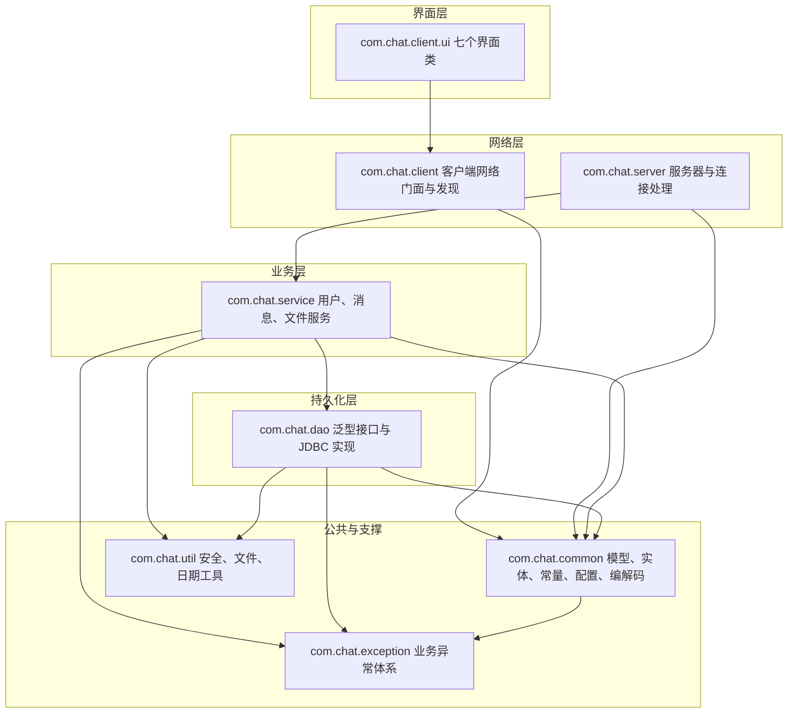

图 4-1 项目分层与依赖关系

---

## 3 项目文件清单

下表列出全部 59 个主源码文件。行数由 `wc -l` 统计，包含注释与空行。

说明：行数与包规模由编写本文档时现场统计得到，用于说明规模量级与文件职责。若源码在文档定稿后继续演进，文件名与行数会有小幅变化，此时请以仓库现状为准；包的划分与各类职责说明不受影响。

### 3.1 公共模块 com.chat.common（12 个文件，2210 行）

| 文件路径 | 行数 | 职责 | 关键方法 |
| --- | --- | --- | --- |
| com/chat/common/Message.java | 232 | 消息抽象基类，序列化字段、稳定消息标识与摘要抽象方法 | getSummary 抽象、isBroadcast、getMessageId、ensureMessageId、toString |
| com/chat/common/TextMessage.java | 64 | 文本消息，承载聊天内容 | getSummary、getContent |
| com/chat/common/SystemMessage.java | 56 | 系统通知与错误消息 | getSummary、getContent |
| com/chat/common/FileMessage.java | 324 | 文件消息，承载传输编号、文件名、大小、块序号、数据、校验和与回执信息 | getTransferId、getChunkIndex、getData、getSha256、isAccepted、failReason、getSummary |
| com/chat/common/MessageType.java | 122 | 34 种消息类型枚举与描述 | getDescription、fromName |
| com/chat/common/ChatMessageFactory.java | 234 | 消息工厂、全局编号分配、协议字段边界校验与反序列化白名单 | text、system、error、file、control、checkTextContent、splitFields、hasIllegalControlChar、serializationFilter |
| com/chat/common/User.java | 279 | 用户实体，凭据脱敏与显示名回退 | clearCredential、getDisplayName、isAdmin、equals、hashCode |
| com/chat/common/Constants.java | 191 | 全部常量集中定义 | 无业务方法，仅静态常量与私有构造 |
| com/chat/common/Config.java | 305 | properties 配置加载与语义化取值 | get、getInt、getLong、getBoolean、dataDir、exportDir、dbDriver、dbUrl、dbUser、dbPassword、messageSecret、receivedDir |
| com/chat/common/Result.java | 116 | 泛型结果封装 | ok、fail、isSuccess、getMessage、getData |
| com/chat/common/UserListCodec.java | 100 | 在线用户列表文本编解码 | encode、decode |
| com/chat/common/FileTransferCodec.java | 187 | 文件请求元信息文本编解码 | encode、decode |

### 3.2 异常体系 com.chat.exception（3 个文件，165 行）

| 文件路径 | 行数 | 职责 | 关键方法 |
| --- | --- | --- | --- |
| com/chat/exception/ChatException.java | 71 | 受检业务异常基类，携带错误码 | 四个构造方法、getErrorCode |
| com/chat/exception/UserNotFoundException.java | 35 | 用户不存在异常 | 两个构造方法 |
| com/chat/exception/FileTransferException.java | 59 | 文件传输异常，携带传输编号 | 三个构造方法、getTransferId |

### 3.3 工具层 com.chat.util（5 个文件，1060 行）

| 文件路径 | 行数 | 职责 | 关键方法 |
| --- | --- | --- | --- |
| com/chat/util/SecurityUtil.java | 315 | 盐生成、PBKDF2 口令散列、历史散列兼容与常量时间比较 | generateSalt、hashPassword、encode、verifyPassword、isLegacyHash、extractSalt、extractHash、sha256Hex |
| com/chat/util/MessageCipher.java | 223 | 聊天正文 AES-GCM 落盘加解密，密钥由配置口令派生并缓存 | encrypt、decrypt、isEncrypted |
| com/chat/util/FileUtil.java | 250 | 目录创建、大小格式化、流式 SHA-256、分块计算、重名规避、文件名清洗、流拷贝 | ensureDir、humanSize、sha256、offsetOf、chunkCount、uniqueTarget、sanitizeFileName、copy、deleteQuietly、extensionOf |
| com/chat/util/MessageExporter.java | 151 | 把消息记录渲染为 UTF-8 文本并写入本地文件 | contentOf、render、write、writeText |
| com/chat/util/DateUtil.java | 121 | 线程安全日期时间格式化与解析 | format、formatTime、now、parse、dayKey、todayKey、formatDuration |

### 3.4 持久化层 com.chat.dao（6 个文件，1717 行）

全部为 JDBC 实现，代码中不存在文件型存储；消息正文的加解密在 `JdbcMessageDao` 内完成，业务层无感知。

| 文件路径 | 行数 | 职责 | 关键方法 |
| --- | --- | --- | --- |
| com/chat/dao/BaseDao.java | 75 | 泛型数据访问接口 | save、update、deleteById、findById、findAll、count |
| com/chat/dao/UserDao.java | 55 | 用户数据访问接口 | findByUsername、deleteByUsername、exists、saveOrUpdate、reload |
| com/chat/dao/JdbcUserDao.java | 433 | MySQL 用户存储实现，PreparedStatement 防注入，启动时自动建表 | isAvailable、failureReason、save、update、deleteByUsername、findByUsername、saveOrUpdate、fromConfig、open |
| com/chat/dao/MessageDao.java | 144 | 消息数据访问接口，含去重、未投递与分页查询 | append、query、queryPage、existsByMessageId、findUndelivered、markDelivered、search、exportTo |
| com/chat/dao/JdbcMessageDao.java | 803 | MySQL 消息存储实现，正文经 MessageCipher 加解密 | isAvailable、failureReason、append、query、queryPage、existsByMessageId、findUndelivered、markDelivered、search、exportTo、map、contentOf、fromConfig |
| com/chat/dao/JdbcFileLogDao.java | 207 | 文件传输结果登记到 chat_file_log | append、isAvailable、failureReason、fromConfig |

### 3.5 业务层 com.chat.service（4 个文件，1606 行）

| 文件路径 | 行数 | 职责 | 关键方法 |
| --- | --- | --- | --- |
| com/chat/service/UserService.java | 519 | 注册、登录（限流与散列透明升级）、改昵称、改密码、删用户、查询 | register、initAdminIfAbsent、login（两参与三参重载）、updateNickname、updatePassword、deleteUser、findByUsername、listAll、validate、copyForTransfer |
| com/chat/service/MessageService.java | 356 | 消息保存与去重、历史查询与检索、未投递补投、导出渲染 | saveMessage、queryHistory、search、exportMessages、existsByMessageId、findUndelivered、markDelivered、queryPage、count |
| com/chat/service/FileService.java | 612 | 文件分块发送与接收、序号校验、完整性校验、传输登记、进度计算 | prepareSend、createEndMessage、closeSend、openReceive、appendChunk、finishReceive、cancelReceive、progressOf、validateRequest |
| com/chat/service/FileLogService.java | 119 | 文件传输日志业务封装 | record、isStorageAvailable、storageFailureReason |

### 3.6 服务器端 com.chat.server（8 个文件，3599 行）

| 文件路径 | 行数 | 职责 | 关键方法 |
| --- | --- | --- | --- |
| com/chat/server/ChatServer.java | 653 | 服务器单例，端口绑定、线程池、心跳扫描、启动自检、会话令牌与观察者通知；入口只启动图形控制台 | getInstance、start、stop、rollback、acceptLoop、scanIdleConnections、issueSessionToken、touchSessionToken、purgeExpiredSessionTokens、notify、initServices、localAddress |
| com/chat/server/ClientHandler.java | 1506 | 连接处理线程，对象流收发、身份校验、业务分派、消息判重与离线补投、文件中继 | run、initStreams、identify、send、handleTextMessage、handleFileMessage、handleSystemMessage、handleDeliveryAck、sendAck、handleExportRequest、pushOfflineMessages、onConnectionClosed、clientAddress、touch、isTimeout |
| com/chat/server/AbstractMessageHandler.java | 171 | 消息分派模板方法基类，显式列举全部类型并拒绝未知类型 | dispatch、handleUserList、handleTextMessage、handleFileMessage、handleSystemMessage、onUserOnline、onUserOffline |
| com/chat/server/MessageHandler.java | 75 | 消息处理接口定义 | 处理钩子方法声明 |
| com/chat/server/UserManager.java | 265 | 在线用户表、单播、广播与观察者管理 | register、unregister、get、isOnline、onlineNames、sendTo、broadcast、broadcastUserList、broadcastText、addObserver、notifyObservers |
| com/chat/server/DiscoveryResponder.java | 596 | UDP 局域网发现应答器，报文格式校验与按来源限流 | start、shutdown、loop、buildAnnouncement、parseAnnouncement、isLoopback |
| com/chat/server/ServerObserver.java | 54 | 服务器观察者接口与事件类型枚举 | onEvent |
| com/chat/server/ServerUI.java | 279 | 服务器 Swing 控制台 | initComponents、startServer、stopServer、refreshUserTable、appendLog、onEvent |

### 3.7 客户端网络层 com.chat.client（4 个文件，2333 行）

| 文件路径 | 行数 | 职责 | 关键方法 |
| --- | --- | --- | --- |
| com/chat/client/ChatClient.java | 1834 | 客户端网络门面，接收线程、发送池、心跳、待确认重发、会话恢复、文件发送线程与回调分发 | connect、login、receiveLoop、handleIncoming、handleDeliveryAck、handleSessionResume、sendFileChunks、send、sendSync、sendPrivateText、sendGroupText、sendFile、respondFileRequest、requestUserList、requestHistory、requestExport、addListener、close |
| com/chat/client/ChatListener.java | 33 | 客户端消息与连接状态回调接口 | onMessage、onConnectionChanged |
| com/chat/client/DiscoveryClient.java | 355 | UDP 发现客户端，枚举全部网卡广播地址 | discover、sendLoopbackProbe、collectResponses、parse、broadcastAddresses、discoverOnce、loopback、probe、ServerInfo |
| com/chat/client/ChatClientApp.java | 111 | 客户端命令行入口与日志配置；只保留图形客户端与 `--local-server`、`--help` 两个参数 | main、configureLogging、printUsage |

### 3.8 客户端界面 com.chat.client.ui（11 个文件，4899 行）

| 文件路径 | 行数 | 职责 | 关键方法 |
| --- | --- | --- | --- |
| com/chat/client/ui/BaseUI.java | 285 | 无边框窗口骨架：自绘标题栏、内容区 body、描边、缩放手柄、提示框与 EDT 调度 | body、card、setTitle、applyFont、centerOnScreen、showInfo、showError、confirm、onEdt、runOnEdtAndWait、safeDispose |
| com/chat/client/ui/BaseChatPanel.java | 942 | 聊天面板基类：富文本显示、消息块布局、滚动与输入发送，以及聊天窗口内的发送文件入口 | appendLine、appendMessage、clearHistory、needsSeparator、sendCurrentInput、chooseAndSendFile、sendFileTo 抽象、askConfirm、doSend 抽象、getChatTarget 抽象、accepts 抽象、onMessage |
| com/chat/client/ui/MessageBubble.java | 644 | 消息块渲染组件（界面轮次进行中，尚未纳入已实现功能范围） | self、other、system、timeSeparator、formatSmartTime、setStatusText、setQuoteText |
| com/chat/client/ui/LoginUI.java | 769 | 登录、注册、发现服务器与修改密码界面 | doLogin、doRegister、doDiscover、applyServer、changePassword、openMainWindow、setBusy、cleanupClient、onMessage |
| com/chat/client/ui/ClientUI.java | 1057 | 主界面：好友树、身份卡、功能菜单与唯一的消息分发者；承载历史查询与导出界面入口 | openPrivateWindow、openGroupWindow、showHistoryDialog、exportHistory、changeNickname、deleteUser、refreshUserList、handlePrivateMessage、routeFileMessage、routeProgress、onMessage |
| com/chat/client/ui/OnlineUserTree.java | 341 | 好友树：按管理员/普通用户/离线分组、关键词过滤、选中查询与在线/离线计数；选中行整行高亮且不依赖外观默认配色 | update、setFilter、selectedUser、selectedIsOnline、onlineUsers、onlineCount、offlineCount |
| com/chat/client/ui/PrivateChatUI.java | 62 | 私聊窗口，仅负责窗口装配与标题 | getPanel、getPeer |
| com/chat/client/ui/PrivateChatPanel.java | 154 | 私聊面板，覆写过滤条件、发送目标与文件接收方（固定为当前对端） | getPeer、doSend、sendFileTo、getChatTarget、accepts、onMessage |
| com/chat/client/ui/GroupChatUI.java | 56 | 群聊窗口，仅负责窗口装配、标题与在线用户提供者的注入 | getPanel |
| com/chat/client/ui/GroupChatPanel.java | 141 | 群聊面板：接收群聊与系统通知，并把文件群发给全部在线用户 | doSend、sendFileTo、getChatTarget、accepts、onMessage |
| com/chat/client/ui/FileTransferUI.java | 448 | 文件传输界面，进度条与传输日志 | windowFor、ownerOf、sendNow、chooseFile、startSend、updateProgress、appendLog、registerTransfer、handleIncomingRequest、handleResult、handleFileMessage |

### 3.9 界面皮肤 com.chat.client.ui.theme（6 个文件，1305 行）

界面皮肤包只回答「控件长什么样」，不引用 `ChatClient`、`Message` 等业务类型，因此可以脱离网络层单独编译与走查。全部图标与头像在运行时用 Java2D 绘制，项目不包含任何图片资源。

| 文件路径 | 行数 | 职责 | 关键方法 |
| --- | --- | --- | --- |
| com/chat/client/ui/theme/Theme.java | 246 | 配色常量（含选中背景 SELECTION_BG 与默认头像配色）、字体探测、全局外观默认值与进度条统一风格 | fontBase、fontBold、fontTitle、fontSmall、font、installDefaults、styleProgressBar |
| com/chat/client/ui/theme/Glyphs.java | 328 | 用函数式接口加 lambda 描述界面图标，运行时绘制 | of、logo、minimize、close、refresh、search、treeArrow、group、file、history、export、user、lock、trash |
| com/chat/client/ui/theme/AvatarFactory.java | 164 | 绘制统一的平面默认头像（圆底人形剪影）并缓存，带在线状态点与管理员描边 | avatar、groupAvatar |
| com/chat/client/ui/theme/SkinButton.java | 199 | 自绘按钮，提供主色、常规、文字、危险四种形态 | primary、normal、menu、menu、withIcon、paintComponent |
| com/chat/client/ui/theme/SkinTitleBar.java | 234 | 自绘标题栏：拖动移动窗口、双击最大化、最小化与关闭 | setTitleText、toggleMaximize、installDrag |
| com/chat/client/ui/theme/WindowResizer.java | 134 | 在分层窗格上叠加三个透明手柄，实现无边框窗口缩放 | install、EDGE、CORNER |

界面侧的窗口与好友树文件（`BaseUI`、`OnlineUserTree` 等）归属 3.8 节；`OnlineUserTree` 是好友树组件，负责按角色与状态分组、关键词过滤与选中查询。
---

## 4 关键类方法签名清单

本节按调用关系列出主要类的公开签名，便于快速定位入口。参数与返回值中的泛型与自定义类型保持源码原样。

### 4.1 公共模型

```java
// com.chat.common.Message（抽象类，实现 Serializable）
public long getId()
public void setId(long id)
public String getMessageId()
public String ensureMessageId()
public MessageType getType()
public void setType(MessageType type)
public String getSender()
public void setSender(String sender)
public String getReceiver()
public void setReceiver(String receiver)
public LocalDateTime getTimestamp()
public void setTimestamp(LocalDateTime timestamp)
public boolean isBroadcast()
public abstract String getSummary()

// com.chat.common.ChatMessageFactory（协议边界校验与工厂方法，均为静态）
public static final int MAX_FIELD_COUNT
public static String checkTextContent(String content)
public static String[] splitFields(String text)
public static boolean hasIllegalControlChar(String value)
public static ObjectInputFilter serializationFilter()
public static TextMessage text(String sender, String receiver, String content, MessageType type)
public static SystemMessage system(String receiver, String content)
public static SystemMessage error(String receiver, String reason)
public static FileMessage file(String sender, String receiver, MessageType type)
public static SystemMessage control(String sender, String receiver, MessageType type)

// com.chat.common.FileMessage
public String getTransferId()
public long getFileSize()
public int getTotalChunks()
public int getChunkIndex()
public byte[] getData()
public String getSha256()
public boolean isAccepted()
public String getMessage()
public String failReason()

// com.chat.common.User
public void clearCredential()
public String getDisplayName()
public boolean isAdmin()

// com.chat.common.Result<T>
public static <T> Result<T> ok(T data)
public static <T> Result<T> ok(String message, T data)
public static <T> Result<T> fail(String message)
public boolean isSuccess()
public T getData()

// com.chat.common.Config（全部为静态方法）
public static String get(String key, String defaultValue)
public static int getInt(String key, int defaultValue)
public static long getLong(String key, long defaultValue)
public static boolean getBoolean(String key, boolean defaultValue)
public static String dataDir()
public static String exportDir()
public static String dbDriver()
public static String dbUrl()
public static String dbUser()
public static String dbPassword()
public static String messageSecret()
public static String receivedDir()
```

### 4.2 工具与编解码

```java
// com.chat.util.SecurityUtil
public static String generateSalt()
public static String hashPassword(String password, String salt)
public static String encode(String password)
public static boolean verifyPassword(String rawPassword, String salt, String hash)
public static boolean isLegacyHash(String hash)
public static String extractSalt(String credential)
public static String extractHash(String credential)
public static String sha256Hex(byte[] data)

// com.chat.util.MessageCipher
public static String encrypt(String plain)
public static String decrypt(String stored)
public static boolean isEncrypted(String stored)
// 私有：密钥派生与缓存
private static SecretKeySpec secretKey()
private static SecretKeySpec deriveKey(String secret)

// com.chat.util.MessageExporter
public static String contentOf(Message message)
public static String render(List<Message> messages)
public static String render(List<Message> messages, String source)
public static int write(List<Message> messages, File target)
public static void writeText(String content, File target)

// com.chat.util.FileUtil
public static File ensureDir(String dir) throws IOException
public static String humanSize(long bytes)
public static String sha256(File file) throws IOException
public static long offsetOf(int chunkIndex, int chunkSize)
public static int chunkCount(long fileSize, int chunkSize)
public static File uniqueTarget(String dir, String fileName)
public static String sanitizeFileName(String fileName)
public static boolean deleteQuietly(File file)

// com.chat.common.UserListCodec / FileTransferCodec
public static String encode(List<User> users)
public static List<User> decode(String text)
public static String encode(FileMessage request)
public static FileMessage decode(String text, String sender, String receiver)
```

### 4.3 业务层

```java
// com.chat.service.UserService
public Result<User> register(String username, String password, String nickname)
public boolean initAdminIfAbsent()
public Result<User> login(String username, String password)
public Result<User> login(String username, String password, String source)
public Result<User> updateNickname(String username, String nickname)
public Result<Boolean> updatePassword(String username, String oldPassword, String newPassword)
public Result<Boolean> deleteUser(String operator, String target)
public Result<User> findByUsername(String username)
public Result<List<User>> listAll()

// com.chat.service.MessageService
public Result<Boolean> saveMessage(Message message)
public Result<List<Message>> queryHistory(String username, LocalDate fromDate, LocalDate toDate)
public Result<List<Message>> queryHistory(String username, LocalDateTime from, LocalDateTime to)
public Result<List<Message>> search(String keyword)
public Result<File> exportMessages(List<Message> messages, File target)
public boolean existsByMessageId(String messageId) throws ChatException
public List<Message> findUndelivered(String receiver, int limit) throws ChatException
public int markDelivered(Collection<String> messageIds) throws ChatException
public List<Message> queryPage(String username, String peer, LocalDateTime from, LocalDateTime to,
                              Long beforeId, int limit) throws ChatException

// com.chat.service.FileService
public FileMessage prepareSend(String sender, String receiver, File file) throws FileTransferException
public FileMessage createEndMessage(String sender, String receiver, FileMessage request)
public void closeSend(String transferId)
public String openReceive(String receiverDir, FileMessage request) throws FileTransferException
public long appendChunk(FileMessage chunk) throws FileTransferException
public File finishReceive(FileMessage end) throws FileTransferException
public void cancelReceive(String transferId)
public double progressOf(String transferId)

// com.chat.service.FileLogService
public boolean record(FileMessage result, String fileSender, String fileReceiver)
public boolean isStorageAvailable()
public String storageFailureReason()
```

### 4.4 服务器端

```java
// com.chat.server.ChatServer
public static ChatServer getInstance()
public synchronized boolean start()
public synchronized void stop()
public UserManager getUserManager()
public UserService getUserService()
public MessageService getMessageService()
public FileLogService getFileLogService()
public String issueSessionToken(String username)
public String touchSessionToken(String token)
public int purgeExpiredSessionTokens()
public void addObserver(ServerObserver observer)
public void notify(ServerObserver.EventType type, String content)
public String localAddress()

// com.chat.server.ClientHandler（继承 AbstractMessageHandler，实现 Runnable）
public ClientHandler(Socket socket, ChatServer server, long maxFileSize, long heartbeatTimeoutMs)
public void run()
public boolean send(Message message)
public void handleTextMessage(Message message, Socket socket)
public void handleFileMessage(Message message, Socket socket)
public void handleSystemMessage(Message message, Socket socket)
public void onConnectionClosed()
public void touch()
public boolean isTimeout(long now)
public static Set<String> activeTransfers()
// 私有：登录来源取址与可靠性处理
private String clientAddress()
private void sendAck(Message target, String state, String detail)
private void handleDeliveryAck(Message message)
private void pushOfflineMessages()

// com.chat.server.AbstractMessageHandler（模板方法）
public final void dispatch(Message message, Socket socket)
public void handleUserList(Message message, Socket socket)
public void handleTextMessage(Message message, Socket socket)
public void handleFileMessage(Message message, Socket socket)
public void handleSystemMessage(Message message, Socket socket)

// com.chat.server.UserManager
public boolean register(User user, ClientHandler handler)
public boolean unregister(String username)
public ClientHandler get(String username)
public boolean sendTo(String username, Message message)
public int broadcast(Message message)
public void broadcastUserList()
public int broadcastText(Message message)
public void notifyObservers(ServerObserver.EventType type, String content)
```

### 4.5 客户端

```java
// com.chat.client.ChatClient
public boolean connect(String host, int port, String name, String password)
public boolean sendPrivateText(String receiver, String content)
public boolean sendGroupText(String content)
public String sendFile(String receiver, File file)
public boolean respondFileRequest(FileMessage request, boolean accepted, String reason)
public static FileMessage decodeRequest(TextMessage message)
public boolean requestUserList()
public boolean requestHistory(String target, String fromDate, String toDate)
public boolean requestExport()
public void addListener(ChatListener listener)
public void close()
public boolean isConnected()
public boolean isReconnecting()
public int getReconnectAttempts()

// com.chat.client.ChatListener
public void onMessage(Message message)
public void onConnectionChanged(boolean connected, String reason)

// com.chat.client.DiscoveryClient
public List<ServerInfo> discover(int timeoutMillis)
public static List<ServerInfo> discoverOnce(int timeoutMillis)
public static ServerInfo loopback(int port)
public static boolean probe(String host, int port)
```

### 4.6 界面层（仅列抽象基类与复用点）

```java
// com.chat.client.ui.BaseUI（抽象 JFrame）
protected void onEdt(Runnable task)
protected void runOnEdtAndWait(Runnable task)
protected void showError(String message)
protected boolean confirm(String message)
public void centerOnScreen()

// com.chat.client.ui.BaseChatPanel（抽象 JPanel）
public void appendMessage(String prefix, String content, Color color)
public void appendLine(String text, Color color)
public void clearHistory()
public void onMessage(Message message)
protected abstract boolean doSend(String content)
protected abstract String getChatTarget()
protected abstract boolean accepts(Message message)
```

---

## 5 关键算法与流程

### 5.1 核心模型总览

所有在网络上传输的数据都是 Message 的子类对象，因此「消息模型」就是本项目的协议定义。理解下图是阅读本项目源码的起点。

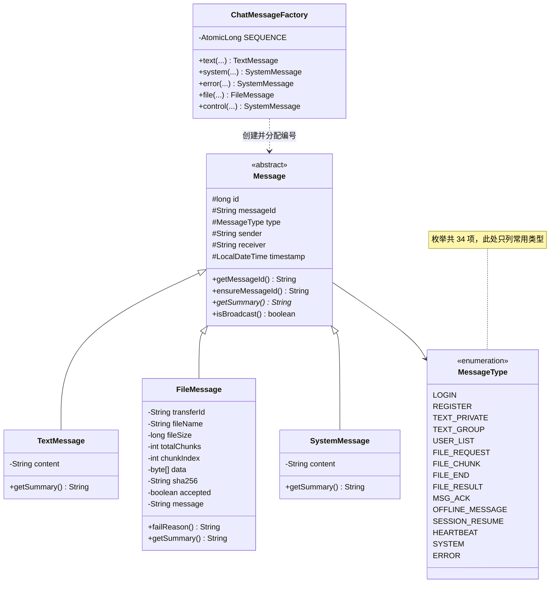

图 4-2 消息模型类图

三条必须记住的约定。第一，类型只能是 MessageType 枚举值（当前 34 项），业务代码中不得出现字符串形式的类型名。第二，`Message.id` 由 ChatMessageFactory 内的 AtomicLong 分配，只在本进程内有意义；跨端去重与送达确认必须使用 `messageId` 这个 UUID 字符串，服务端落库前统一调用 `ensureMessageId()` 补齐，保证旧版客户端不带该字段时库中也不会出现空标识。第三，用户列表与文件请求的元信息以文本形式存放在 TextMessage 的内容字段中，分别由 UserListCodec 与 FileTransferCodec 编解码，服务器必须先解码校验再转发原始消息对象。

### 5.2 消息分派（模板方法）

服务器收到任意消息后，统一经过 AbstractMessageHandler.dispatch，由它完成固定步骤，再把可变步骤交给子类钩子。

```text
算法 dispatch(message, socket)
输入：从对象流读到的消息对象；来源连接
输出：无返回值，必要时向对端写回执

1  若 message 为空或 message.getType() 为空：
2      发送 ERROR 回执「消息格式错误」并返回
3  尝试：
4      按 message.getType() 显式分派（枚举逐个列举，不使用 default 兜底）：
5          TEXT_PRIVATE / TEXT_GROUP                              -> handleTextMessage
6          USER_LIST                                               -> handleUserList
7          FILE_REQUEST / ACCEPT / REJECT / CHUNK / END / RESULT   -> handleFileMessage
8          REGISTER / REGISTER_RESULT / LOGIN / LOGIN_RESULT / LOGOUT
           USER_LIST_REQUEST / USER_ONLINE / USER_OFFLINE / USER_UPDATE
           PASSWORD_CHANGE / HISTORY_REQUEST / HISTORY_RESULT
           EXPORT_REQUEST / EXPORT_RESULT / HEARTBEAT / HEARTBEAT_ACK
           MSG_ACK / OFFLINE_MESSAGE / SESSION_RESUME / SYSTEM / ERROR
                                                                  -> handleSystemMessage
9          未纳入上述分派的类型：记 warning 并拒绝，不再静默按控制消息处理
10 捕获 ChatException：
11     记录日志，发送 ERROR 回执，携带异常的 errorCode 与中文消息
12 捕获其他运行时异常：
13     记录堆栈，发送 ERROR 回执，避免异常逃出读取循环导致连接线程退出
14 最终：
15     touch() 刷新该连接的最近活跃时间（心跳判定依赖此时间）
```

流程中的两个关键点。其一是最后一步：任何一条消息（包括心跳与错误消息）都会刷新活跃时间，因此只有真正「沉默」的连接才会被判定掉线。其二是第 4 步：分派必须逐个列举枚举值，未知类型记 warning 后拒绝；若用 `default` 兜底，任何新协议或畸形类型都会被当作控制消息处理，问题会被静默吞掉。

反序列化白名单不在本流程中判断，而是在连接建立、构造对象输入流时绑定（见 5.10），因此 `dispatch` 收到的对象必然已经通过白名单。

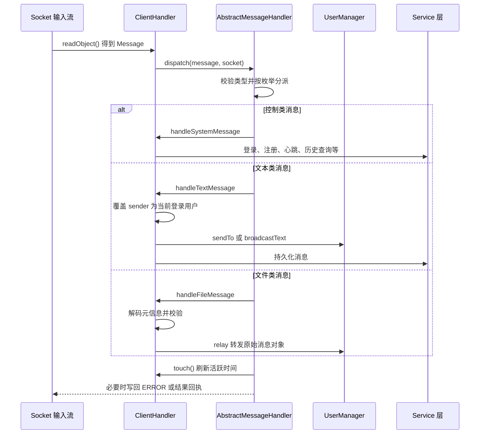

图 4-3 服务器连接处理与消息分派时序图

### 5.3 登录鉴权

登录涉及「凭据校验」与「在线表占位」两个独立步骤，二者都可能失败，且失败原因必须区分。

```text
算法 服务端 handleSystemMessage 的 LOGIN 分支
输入：LOGIN 类型的文本消息，内容格式为「用户名|密码」
输出：LOGIN_RESULT 回执（成功后另有 SESSION_RESUME 令牌与离线补投）

1  若当前连接 username 非空：发送「当前连接已登录」错误，返回
2  parts = ChatMessageFactory.splitFields(内容)；字段数超限或字段含控制字符时回执「登录请求格式错误」
3  result = userService.login(用户名, 密码, clientAddress())
4  若 result 失败：
5      通知观察者 LOGIN_FAILED
6      回执失败（账号不存在与密码错误使用同一条「用户名或密码错误」，限流时回传锁定提示）
7      返回
8  user = result 的用户对象（已脱敏）
9  若 userManager.register(user, this) 失败：
10     回执失败「该账号已在其它位置登录」
11     返回
12 记录当前连接的 username
13 回执成功，携带脱敏用户信息
14 下发 SESSION_RESUME（正文为会话令牌，有效期 30 分钟）
15 pushOfflineMessages()：补投未投递私聊文本，客户端逐条回 MSG_ACK 后标记已送达
16 onUserOnline(用户名, socket)：广播在线用户列表与上线通知

算法 UserService.login(username, password, source)
1  failureKey = 用户名小写 + "@" + (source 为空 ? "unknown" : source)
2  若 failureKey 处于锁定期（连续失败达 5 次，锁定 5 分钟，到期自动解锁）：返回限流提示
3  user = userDao.findByUsername(username)
4  若 user 为空：recordFailure(failureKey)，返回「用户名或密码错误」
5  若 !SecurityUtil.verifyPassword(password, user.getSalt(), user.getPasswordHash())：
6      recordFailure(failureKey)，返回「用户名或密码错误」
7  clearFailures(failureKey)
8  若 SecurityUtil.isLegacyHash(user.getPasswordHash())：
9      重新生成盐并按 PBKDF2（12 万次迭代）重算散列（透明升级，用户无需改密）
10 更新 lastLoginTime（与散列升级合并为同一次 update，不额外增加数据库往返）
11 返回脱敏后的用户对象
```

在线表占位使用 ConcurrentHashMap 的 putIfAbsent 语义实现，这是并发安全的唯一保证点。

```text
算法 UserManager.register(user, handler)
1  existing = onlineUsers.putIfAbsent(user.getUsername(), handler)
2  若 existing 非空：记录日志并返回 false（重复登录被拒绝）
3  标记 user.online = true，写入 userProfiles
4  通知观察者 USER_ONLINE
5  返回 true
```

图 4-4 给出登录鉴权的完整判定路径。

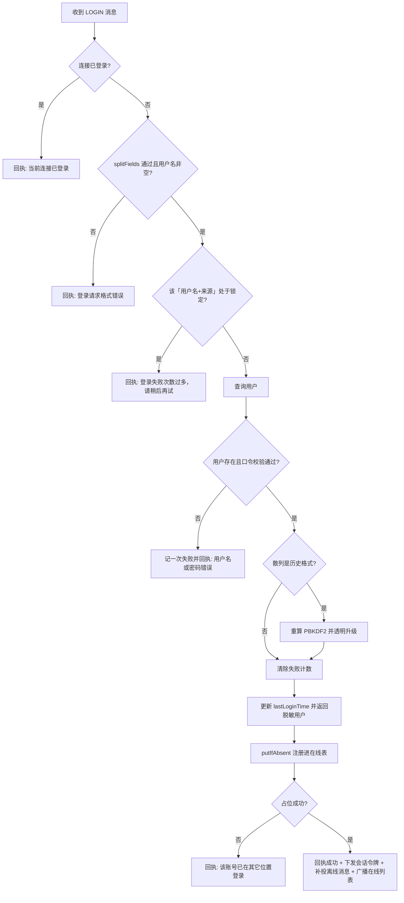

图 4-4 登录鉴权流程图

### 5.4 私聊路由

私聊路径上有三个必须明确的语义：发送者被强制覆盖、离线时明确失败、成功时向发送方回执确认。

```text
算法 handleTextMessage(message, socket) 的私聊分支
1  若连接未登录：忽略并回执「请先登录」
2  若实际对象不是 TextMessage：记 warning 并回执「文本消息格式错误，已拒绝」
3  checkTextContent 校验正文；不通过则回执中文原因
4  message.setSender(当前连接已登录用户名)        // 防伪造
5  若类型为 TEXT_GROUP：转群聊分支（见 5.5）
6  receiver = message.getReceiver()
7  若 receiver 为空：回执「私聊消息缺少接收者」
8  messageId = message.ensureMessageId()
9  若 messageService.existsByMessageId(messageId)：回执 MSG_ACK(DUPLICATE) 并直接返回（幂等）
10 delivered = userManager.sendTo(receiver, message)   // 离线也继续入库
11 messageService.saveMessage(message)                 // 离线记录正是补投的唯一依据
12 若入库失败：回执 MSG_ACK(FAILED) 与中文原因，返回
13 若 delivered 为 false：
14     回执 MSG_ACK(OFFLINE)，并额外发一条可见提示「消息已存入离线队列」
15     （保留可见提示是为了兼容不认识 MSG_ACK 的旧版客户端）
16 messageService.markDelivered(messageId)（失败仅记 warning，不改变已回给发送方的结论）
17 回执 MSG_ACK(DELIVERED) 与一条发送成功回执
18 通知观察者 PRIVATE_MESSAGE
```

对应客户端一侧，接收线程收到 TEXT_PRIVATE 后按「消息发送者或接收者是否等于当前会话对端」的规则分发给私聊窗口；发送方界面在本地直接回显自己发出的内容，并通过服务端的 MSG_ACK 把待确认项更新为「已送达」，超时未收到则复用同一 `messageId` 重发。

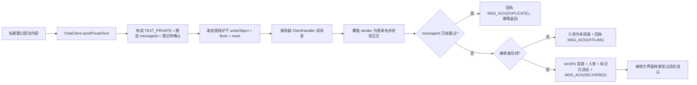

图 4-5 私聊路由流程图

### 5.5 群聊广播

群聊的语义是「广播给当前在线表的全部连接」，服务器同样先覆盖发送者，再广播，最后持久化。

```text
算法 群聊分支
1  message.setSender(当前登录用户名)
2  message.setReceiver("")                    // 群聊不指定接收者
3  userManager.broadcastText(message)          // 遍历在线表逐个 send
4  messageService.saveMessage(message)
5  通知观察者 GROUP_MESSAGE

算法 UserManager.broadcast(message)
1  count = 0
2  对 handlers() 快照中的每个连接 handler：
3      若 handler.send(message) 成功：count 自增
4  返回 count
```

广播的健壮性来自两点：遍历的是连接集合的快照，避免遍历期间连接增减造成并发修改异常；单个连接的写入失败只影响该连接，其返回值不计入成功数，上层据此判定该连接异常并交由心跳扫描回收。

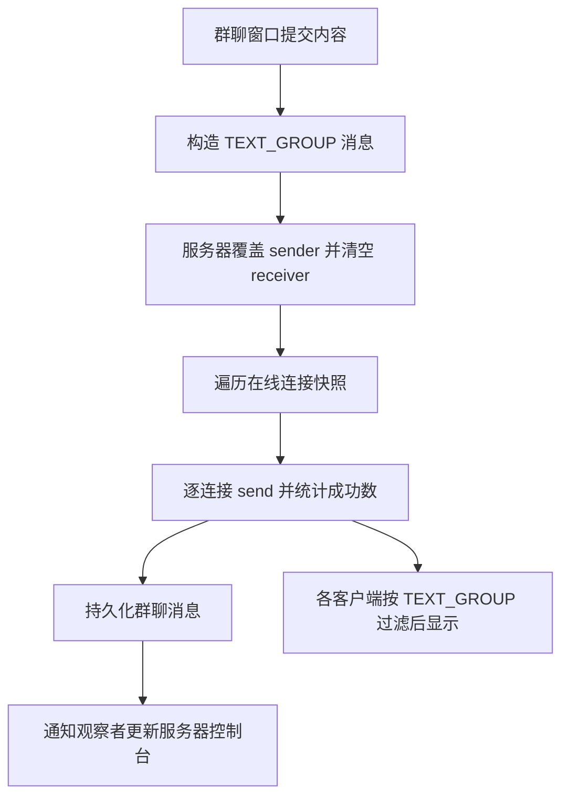

图 4-6 群聊广播流程图

### 5.6 文件分块传输与完整性校验

文件传输是本项目最复杂的流程，包含发送侧分块读取、接收侧序号校验、结束校验与失败清理四个环节。完整的交互时序如下。

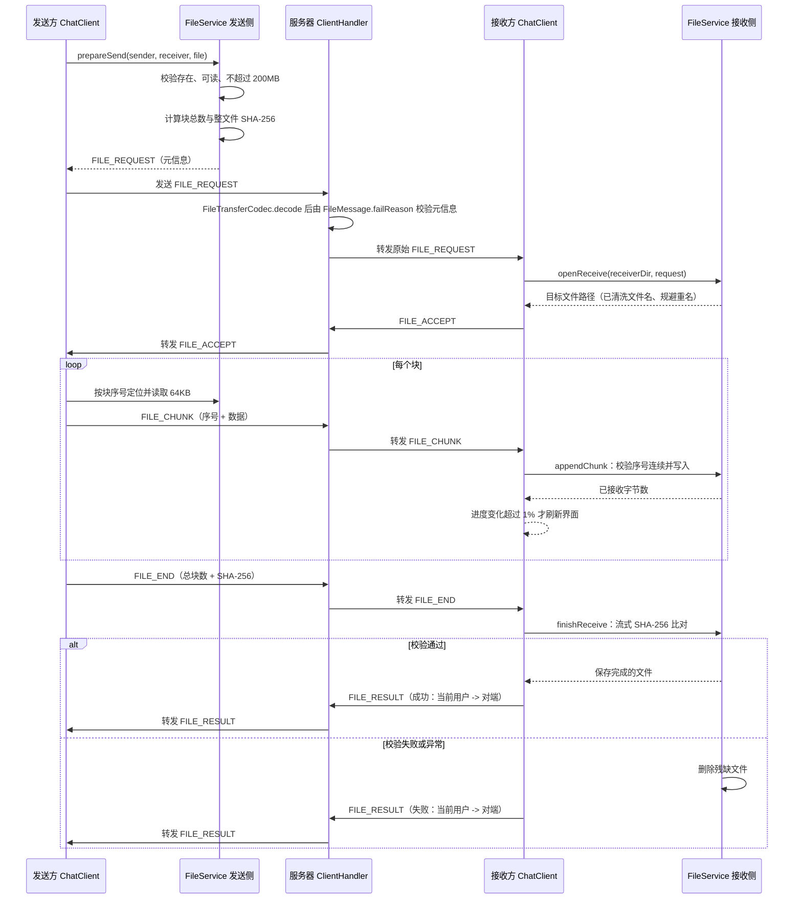

图 4-7 文件分块发送与校验时序图

接收侧的状态与清理规则如下。任何未走到「已完成」的路径都必须删除残缺文件。

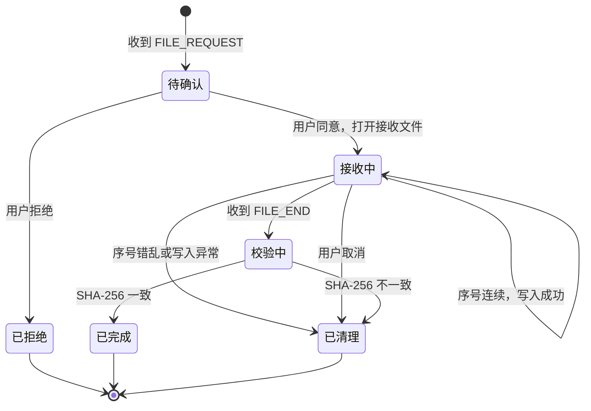

图 4-8 文件接收状态流转图

核心算法伪代码如下。

```text
算法 FileService.prepareSend(sender, receiver, file)
1  若文件为空、不存在、不可读：抛 FileTransferException
2  若文件长度大于 200MB：抛 FileTransferException（本地即拒绝）
3  totalChunks = FileUtil.chunkCount(length, 64KB)
4  sha256 = FileUtil.sha256(file)                // 流式计算，不整块读入内存
5  打开 RandomAccessFile 并登记到发送会话表
6  构造 FILE_REQUEST，填充 transferId、文件名、大小、块总数、校验和
7  返回该消息

算法 FileService.appendChunk(chunk)
1  按 transferId 取出接收会话；不存在则抛异常
2  若 chunk.getChunkIndex() != 已接收块数：抛异常「数据块序号错乱」
3  在锁保护下从 RandomAccessFile 的对应偏移量写入数据
4  累加已接收字节数并返回

算法 FileService.finishReceive(end)
1  按 transferId 取出接收会话；不存在则抛异常
2  尝试：
3      关闭输出流，flush 到磁盘
4      计算本地文件的实际 SHA-256
5      若与 end.getSha256() 不一致：抛 FileTransferException
6      从会话表移除并返回文件
7  捕获 IOException 与 FileTransferException：
8      删除残缺文件，从会话表移除
9      继续向上抛出，交由上层回执失败
```

值得注意的是第 7 至 9 行：必须同时捕获 IO 异常与业务异常。早期版本只捕获 IOException，导致 SHA-256 校验失败抛出的业务异常绕过了删除逻辑，磁盘上会残留一个内容损坏但扩展名正常的文件。

### 5.7 心跳扫描与掉线清理

```text
算法 ChatServer.scanIdleConnections（由定时任务每 20 秒触发一次）
1  now = 当前毫秒时间
2  在 handlers 锁内复制一份连接快照
3  对快照中的每个 handler：
4      若 handler.isTimeout(now) 成立（now - lastActiveTime > 60 秒）：
5          记录警告日志
6          handler.close()：关闭套接字、注销在线表、清理文件传输会话

算法 ClientHandler.run 的读取循环
1  初始化对象流：先构造 ObjectOutputStream 并 flush，再构造 ObjectInputStream
2  循环：
3      message = in.readObject()             // 阻塞；对端关闭时抛 EOFException
4      touch()                               // 刷新最近活跃时间
5      dispatch(message, socket)
6  捕获 EOFException 与 IOException：
7      记录日志，结束循环
8  最终：
9      onConnectionClosed()：注销在线表、关闭流与套接字、通知服务器移除本处理器
```

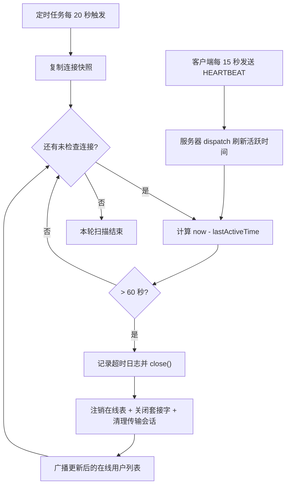

图 4-9 心跳扫描与掉线清理流程图

### 5.8 UDP 自动发现

```text
算法 DiscoveryResponder.loop（服务器侧，独立线程）
1  创建 DatagramSocket 并绑定发现端口
2  循环直到 running 为 false：
3      packet = 接收数据报（阻塞）
4      校验报文长度（不超过 64 字节）与格式（严格匹配探测前缀，来源须为点分十进制地址）
5      按来源 IP 做令牌桶限流（5 次/秒、突发 10，限流表上限 256 条并按空闲回收）
6      校验与限流均通过后：
7          announcement = "LANCHAT_ANNOUNCE|<本机IP>|<TCP端口>|<在线人数>"
8          把 announcement 回送给请求来源地址与端口
9      畸形包、限流丢弃与回复失败都只记录日志，绝不终止监听循环

算法 DiscoveryClient.discover(timeoutMillis)（客户端侧）
1  addresses = broadcastAddresses()      // 枚举全部网卡的广播地址
2  socket = 新建 DatagramSocket，开启广播，设置接收超时
3  对每个广播地址发送探测报文
4  在总超时窗口内循环接收应答：
5      text = 收到的文本
6      解析为 ServerInfo（IP、端口、在线人数）
7      按「IP + 端口」放入集合去重（同一服务器可能多网卡应答多次）
8  返回去重后的 ServerInfo 列表

算法 DiscoveryClient.broadcastAddresses()
1  结果集合置空
2  枚举 NetworkInterface.getNetworkInterfaces() 中所有处于启用状态的接口
3  对每个接口的每个 InterfaceAddress：
4      计算广播地址（接口地址按子网掩码或前缀长度推导）
5      非空且不重复时加入结果集合
6  返回结果集合
```

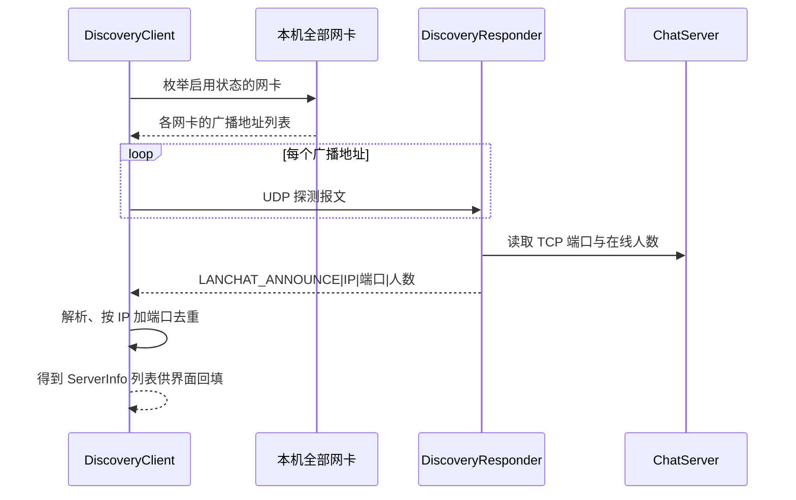

图 4-10 UDP 自动发现时序图

发现失败时的降级路径必须保留：客户端允许手工输入服务器 IP 与端口，且提供 loopback 与 probe 两个静态方法，分别用于生成本机服务器信息与探测指定地址是否可连接。

### 5.9 文件名清洗与重名规避

```text
算法 FileUtil.sanitizeFileName(fileName)
1  若为空或仅空白：返回 "unnamed"
2  把反斜杠统一替换为正斜杠
3  截取最后一个斜杠之后的部分（丢弃任何目录部分）
4  把 [\\/:*?"<>|] 等非法字符替换为下划线
5  若结果为空、为 "." 或为 ".."：返回 "unnamed"
6  返回结果

算法 FileUtil.uniqueTarget(dir, fileName)
1  name = sanitizeFileName(fileName)
2  target = new File(dir, name)
3  若 target 不存在：直接返回
4  拆分主名与扩展名
5  index 从 1 递增：尝试「主名(index)扩展名」
6  返回第一个不存在的候选文件
```

第 3 步是防目录穿越的关键：即使对端构造 `../../etc/passwd` 这样的文件名，也会被截断为 `passwd`，再叠加接收目录的路径，写入位置无法越出接收目录。

### 5.10 反序列化白名单

协议使用 Java 原生对象序列化，因此对象输入流是唯一能从字节流触发类加载的入口，必须设过滤器。`ChatMessageFactory.serializationFilter()` 返回的过滤器被绑定到两端的对象输入流：服务端在 `ClientHandler.initStreams` 中调用，客户端在 `ChatClient` 重建对象输入流时调用。

```text
算法 反序列化过滤（由 ObjectInputFilter 在读取每个对象前回调）
1  放行 com.chat.common.*、java.lang.*、java.time.*、java.util.*
2  其余类名一律拒绝（过滤器串末尾的 !*）
3  同时限制资源用量：
4      maxdepth = 8         递归深度，抵御深层嵌套
5      maxrefs  = 1000      引用总数，抵御引用膨胀
6      maxbytes = 4194304   单次反序列化字节数上限（4MB）
7      maxarray = 65536     数组长度上限
8  被拒绝时该连接断开并记 warning
```

三点需要留意。其一，`java.util.*` 只匹配该包下的直接成员，`java.util.concurrent.atomic` 这类子包不在放行范围。其二，`byte[]` 等基本类型数组不受类名白名单约束，其长度由 `maxarray` 单独限制，因此文件数据块仍能正常传输；而 `java.io.File`、`java.util.concurrent.*` 等非协议类型会被拒绝。其三，白名单串是集中定义的常量，新增消息类只要放在 `com.chat.common` 下就无需改动过滤器。

### 5.11 文件元信息校验

文件传输不信任对端声明的任何元信息。`FileMessage.failReason()` 提供统一的校验入口，网络层与业务层都调用它，返回第一处非法的中文原因（全部合法时返回 `null`，调用方据 `!= null` 判断即可，无需另设只返回布尔值的重载）。

```text
算法 FileMessage.failReason()
1  传输编号为空 -> 「文件传输编号为空」
2  文件名为空 -> 「文件名为空」
3  文件名长度 > 255 -> 「文件名过长」
4  文件名含 '/' 或 '\' -> 「文件名不得包含路径分隔符」
5  文件名含 ".." -> 「文件名不得包含 ..」
6  文件名含 ISO 控制字符 -> 「文件名含非法控制字符」
7  文件大小 < 0 -> 「文件大小不能为负数」（0 字节空文件合法，按 1 个空块传输）
8  分块总数 <= 0 或 > 1000000 -> 拒绝
9  分块总数与文件大小不自洽 -> 「分块总数与文件大小不匹配」
   （expectedChunks = ceil(fileSize / 64KB)，与 FileUtil.chunkCount 口径一致）
10 SHA-256 为空、长度不等于 64 或含非十六进制字符 -> 拒绝
11 全部合法 -> 返回 null
```

其中第 9 步是防资源耗尽的关键：块数少于实际会让文件残缺，块数多于实际会让接收方按声明块数空等永远不来的数据块。`FileService.validateRequest` 与 `ClientHandler.handleFileMessage` 都在进行实际 IO 之前调用本方法，不合格的请求不会产生任何网络流量或磁盘写入。

---

## 6 编码规范说明

本项目在编码规范上遵循以下约定，全部源码均已按此执行。

| 规范项 | 约定 | 说明 |
| --- | --- | --- |
| 包名 | 全小写，按职责分层 | com.chat.common、com.chat.dao、com.chat.client.ui 等 |
| 类名 | 大驼峰 | ChatClient、AbstractMessageHandler、JdbcMessageDao |
| 方法名 | 小驼峰，动词开头 | sendPrivateText、prepareSend、broadcastUserList |
| 常量 | 全大写加下划线 | DEFAULT_SERVER_PORT、MAX_FILE_SIZE、FILE_CHUNK_SIZE |
| 字段 | 私有字段，通过 getter/setter 访问 | 实体与消息类统一遵守封装原则 |
| 类注释 | 每个类都有中文 Javadoc，说明职责与设计意图 | 见任一源文件头部 |
| 方法注释 | 每个方法都有 Javadoc，说明参数、返回值与异常 | 使用 @param、@return、@throws 标签 |
| 行内注释 | 用于「为什么」而非「做什么」 | 例如说明常量时间比较、历史散列透明升级、反序列化白名单、`reset` 调用的原因 |
| 魔法值 | 禁止 | 全部收敛到 Constants 或 MessageType 枚举 |
| 异常 | 业务可预期失败用 Result 表达，需中断资源操作的失败用受检异常 | 见 ChatException 体系 |
| 命名即文档 | 方法名直接表达语义与方向 | 例如 handleIncomingEnd、finishFailedTransfer |
| 线程安全 | 界面更新只能经 onEdt；共享流写入必须持锁 | 基类提供统一入口，避免逐处判断 |

每个源文件头部统一包含类注释、职责说明、设计说明（或使用说明）、作者与版本信息；每个公开方法前有 Javadoc 中文说明。这也是主源码 18894 行中注释占比较高的原因，属于刻意的可读性投入。

---

## 7 推荐阅读顺序

建议按下图顺序阅读源码，每一步都能独立编译运行、独立验证，不需要一次理解全部代码。

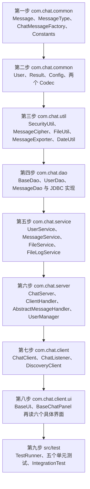

图 4-11 推荐阅读顺序图

每一步的阅读目标与验证方式如下。

| 步骤 | 阅读目标 | 建议验证方式 |
| --- | --- | --- |
| 第一步 | 搞清楚「协议就是这几个类」 | 阅读 MessageType 的 34 个枚举说明，对照协议表 |
| 第二步 | 搞清实体、结果封装与配置优先级 | 修改 config/chat.properties 中的端口，观察 Config 的取值变化 |
| 第三步 | 搞清口令散列格式、正文加密与文件工具 | 阅读 SecurityUtilTest 与 MessageCipher，理解盐、PBKDF2 与 `enc:v1:` 前缀 |
| 第四步 | 搞清数据如何落库与去重 | 运行 UserDaoTest，观察 lanchat_test 库中的 chat_user 表与 message_id 唯一索引 |
| 第五步 | 搞清业务规则与返回值约定 | 运行 UserServiceTest 与 FileServiceTest |
| 第六步 | 搞清连接生命周期与消息分派 | 阅读 ClientHandler.run 与 dispatch，对照图 4-3 |
| 第七步 | 搞清客户端线程结构与回调机制 | 阅读 receiveLoop、writeObject、startHeartbeat 三处 |
| 第八步 | 搞清界面复用与 EDT 调度 | 对比 PrivateChatUI 与 GroupChatUI 的差异仅在三个方法 |
| 第九步 | 搞清测试如何驱动真实协议 | 运行 IntegrationTest 并观察控制台输出 |

---

## 8 如何扩展

### 8.1 新增一种消息类型

以「新增一个查询服务器运行状态的消息」为例，需要改动的位置如下。

1. 在 com.chat.common.MessageType 中新增枚举项，例如 SERVER_STATUS 与 SERVER_STATUS_RESULT，并补充中文描述。
2. 判断是否需要新字段。若只需携带文本，直接复用 TextMessage，用 ChatMessageFactory.text 或 control 创建；若需要结构化字段，则在 com.chat.common 下新增 Message 的子类并实现 getSummary。
3. 服务器侧：在 ClientHandler 覆写的对应钩子中增加分支。控制类消息落在 handleSystemMessage，文本类落在 handleTextMessage，文件类落在 handleFileMessage。若新增的消息不属于这三类，可考虑扩展 AbstractMessageHandler 的分派条件。新增的消息类只要放在 `com.chat.common` 下，就不会被反序列化白名单拦截；若放在其他包，必须同步扩展 `ChatMessageFactory` 的白名单串，否则对端会在反序列化阶段直接断开。
4. 客户端侧：在 ChatClient.handleIncoming 的分派逻辑中增加处理分支，并通过 notifyMessage 回调给界面。
5. 界面侧：在需要展示该消息的界面实现中处理回调；若是新窗口，可继承 BaseUI 并实现 ChatListener。
6. 补充测试用例：在对应的单元测试类中增加断言，必要时在 IntegrationTest 中增加端到端场景。

不需要改动的位置：消息编号分配、对象流收发、连接管理、持久化层。这三点正是「类型集中定义、创建走工厂、分派走统一入口」带来的收益。

### 8.2 新增一种存储实现

数据访问层以接口为契约，新增存储介质只需实现接口，不需要修改业务层。

1. 选择接口：用户数据实现 com.chat.dao.UserDao，消息数据实现 com.chat.dao.MessageDao，二者都继承 com.chat.dao.BaseDao<T, ID>。
2. 新建实现类，例如 RedisUserDao，放在 com.chat.dao 包下，实现全部接口方法。方法内部把 IO 异常与驱动异常统一转换为 ChatException 及其子类。
3. 在构造或初始化方法中完成连接准备，并提供一个静态工厂（参考 JdbcUserDao.fromConfig 与 open）用于按配置构造实例。
4. 若需要按配置切换，在服务层构造处增加选择逻辑，并同步更新服务器启动自检的可用性判断。当前设计以「只使用 MySQL」为前提，引入新介质时必须明确它与 MySQL 是替换还是并存；不要采用「连不上就静默换一种」的写法，那会把配置错误掩盖成看似正常的运行。
5. 补充测试：参考 UserDaoTest 的写法，用独立测试库构造隔离环境，重点断言持久化与重新加载的一致性。

### 8.3 把文件传输改为支持断点续传

当前传输一旦中断必须整文件重传。改造思路如下，改动集中在 FileService 与协议层面，不需要触碰界面框架。

1. 元信息扩展：在 FileMessage 中增加「已完成块位图」字段（可用 byte 数组或 Base64 字符串表示），随 FILE_ACCEPT 与 FILE_END 一起传输。
2. 发送侧改造：prepareSend 时若发现同一文件与同一对端存在历史会话，先向接收方询问已完成块；发送循环跳过位图中已完成的块，进度按「已确认字节数」而不是「已发送块数」计算。
3. 接收侧改造：openReceive 探测目标目录是否已存在同名的部分文件与本地位图记录，若存在则不再清空，而是从缺失块继续；appendChunk 允许非连续块，但必须校验块序号范围并把数据写入正确偏移量（RandomAccessFile 已具备按偏移写入的能力）。
4. 校验时机：SHA-256 校验从 FILE_END 时的整文件校验改为「全部块齐备后」触发，因此需要先判断位图是否完整。
5. 会话超时：为未完成的接收会话增加超时与清理策略，避免部分文件长期驻留磁盘；同时要明确告知用户「该文件尚未传输完成」，不能留下无标记的残缺文件。
6. 测试补充：在 FileServiceTest 中增加「传输一半后重新发起，最终内容与源文件一致」的用例；在 IntegrationTest 中增加中断重连场景。

### 8.4 其他常见扩展的落点

| 想做的事 | 主要改动位置 | 关键注意点 |
| --- | --- | --- |
| 历史记录分页与消息搜索界面 | MessageService.queryPage 与 search 已具备，界面侧新增入口与结果视图 | 分页游标使用 beforeId，注意与时间范围条件的组合 |
| 消息撤回与已读回执 | chat_message 已预留 recalled 与 read_flag 列，需补协议类型与服务端状态流转 | 撤回需限定时间窗与权限（仅发送者本人），并考虑对端已读后的语义 |
| 协议版本协商 | 客户端连接后与服务器握手交换版本号，Constants 增加版本常量 | 版本不一致应给出明确中文提示，而不是等待反序列化异常 |
| 传输层加密 | 在 ChatClient 与 ClientHandler 的对象流外再包一层加密通道（如 SSLSocket） | 落盘加密已实现，但网络传输仍是明文；密钥分发是难点，教学项目中可先用预共享密钥演示 |
| 自建群与成员管理 | 新增 Group 实体与 GroupDao，UserManager 广播范围改为群成员集合，界面新增群管理窗口 | 群成员与在线表的交集计算；群消息持久化需携带群标识 |
| 服务器压力测试 | 新增可控的模拟客户端程序 | 需要可控的发送速率与统计输出，避免压测本身成为瓶颈 |

---

## 9 常见陷阱备忘

以下五条是本项目在开发中真实踩过或刻意规避的陷阱，修改代码时请务必注意。

1. 对象流构造顺序：必须先构造 ObjectOutputStream 并 flush，再构造 ObjectInputStream。两端都先构造输入流会互相阻塞形成死锁。
2. 对象流内存增长：每次 writeObject 之后必须 flush 并调用 reset()，否则流会持续缓存已发送对象引用。
3. 发送必须持锁：心跳线程、聊天发送、文件分块来自不同线程，任何一处绕过发送锁都会造成对象流字节交错，表现为对端反序列化失败。
4. 服务器必须覆盖 sender：不要相信消息体中的发送者字段，身份只能来自连接已登录状态。
5. 失败路径必须清理：文件接收的任意失败分支都要删除残缺文件；数据库写入失败必须返回失败结果而不是静默成功；消息解密失败返回占位文本而不是抛异常。

界面相关的两条附加约定：任何组件更新只能通过 BaseUI 的 onEdt 或 runOnEdtAndWait；耗时操作（连接、发现、注册、文件选择）必须放在后台线程或 SwingWorker 中执行。

---

## 10 界面层实现说明

本节补充界面层最近完成的一轮实现：无边框皮肤、Java2D 自绘资源、在线用户树，以及网络回调到事件分发线程的收口。涉及的类集中在 `com.chat.client.ui`（窗口与面板）与 `com.chat.client.ui.theme`（皮肤与自绘资源，6 个类文件），均已计入第 2、3 节的规模统计。本节只描述表现层实现；消息协议、服务层与 DAO 的说明见前述章节。

### 10.1 分包：窗口面板与皮肤资源分离

| 包 | 主要类 | 职责 |
| --- | --- | --- |
| com.chat.client.ui | BaseUI、BaseChatPanel、LoginUI、ClientUI、OnlineUserTree、PrivateChatUI/PrivateChatPanel、GroupChatUI/GroupChatPanel、FileTransferUI | 布局、交互、消息路由与业务调用 |
| com.chat.client.ui.theme | Theme、Glyphs、AvatarFactory、SkinButton、SkinTitleBar、WindowResizer | 只回答“控件长什么样”，不含业务与网络逻辑 |

这样分有三点理由。第一，`theme` 包只依赖 `javax.swing` 与 `java.awt`，不引用 `ChatClient`、`Message` 等业务类型，可以脱离网络层单独编译与走查。第二，皮肤类被多个窗口复用：`ClientUI`、`LoginUI`、私聊与群聊窗口都用 `SkinButton`，`com.chat.server.ServerUI` 也继承 `BaseUI` 并使用 `theme` 包；若把绘制代码留在某个窗口的内部类里，复用方就得反向依赖那个窗口。第三，`ui` 包内的类只做“把控件摆到 `body()` 上、把事件接到 `ChatClient`”，逻辑与外观边界清晰，改配色不必改窗口。

`BaseChatPanel` 仍声明实现 `ChatListener`，但面板自身不再调用 `client.addListener`，其 `onMessage`、`onConnectionChanged` 由 `ClientUI` 直接调用；保留接口是为了让主窗口能以统一方式投递消息。

### 10.2 零资源文件：全部用 Java2D 绘制

项目不包含任何图片文件，图标、头像、标题栏渐变与按钮底纹都在运行时绘制。好处是运行时不依赖资源目录与工作目录，打包成单个 jar 后不会因为找不到图片而出现空白控件；同时避免直接复用第三方聊天软件素材带来的版权与原创性问题。默认头像也遵守这条约束：即使"上网找一张默认头像图片"能立刻改善观感，也仍然选择用 Java2D 自绘标准人形剪影，因为引入位图就意味着引入资源目录、资源加载失败分支与素材来源问题，而剪影本身的几何形状只有十几个绘制调用。

`Glyphs` 用函数式接口把“几何形状”与“图标配置”分开：

```java
public interface Painter {
    void paint(Graphics2D g, int size);   // 只关心形状
}

public static Icon of(int size, Color color, Painter painter) { ... }
```

`of` 返回匿名 `Icon`，在 `paintIcon` 中统一开启抗锯齿、按 `size` 设置 `BasicStroke` 的粗细与圆角端点、平移到图标左上角，再回调 `Painter`。因此每个图标的绘制体都只是几行几何调用，最小化图标甚至只有一条 `drawLine`。现有图标方法为 `logo`、`minimize`、`close`、`refresh`、`search`、`treeArrow`、`group`、`file`、`history`、`export`、`user`、`lock`、`trash`，全部在 `[0, size)` 的正方形坐标系内绘制，与调用处给定的尺寸无关。

`AvatarFactory.avatar(online, admin, size)` 绘制统一的平面默认头像：先画外圆（在线取 `Theme.AVATAR_BG`、离线取 `Theme.AVATAR_BG_OFFLINE`），把画布裁剪成该圆后再画头部圆与肩部椭圆（在线 `AVATAR_FG`、离线 `AVATAR_FG_OFFLINE`），最后叠加状态圆点与管理员描边；裁剪让肩部超出外圆的部分被自动裁掉，不必手工计算交点。群聊头像由 `groupAvatar(size)` 绘制，主色实心底加三个白色人形剪影。

关键取舍是缓存：绘制结果以“在线|管理员|尺寸”为键存入 `ConcurrentHashMap`，用 `computeIfAbsent` 取值。在线列表每次刷新都会重建整棵树，若不缓存则每次都要重画几十个图标；键中带上在线与管理员标记，保证状态变化时能取到新图标而不是旧图。

### 10.3 无边框窗口骨架 BaseUI

`BaseUI` 的构造方法固定了所有窗口的骨架，顺序是：调用 `Theme.installDefaults()` 初始化外观，`setUndecorated(true)` 去掉系统装饰，然后组装根面板——`BorderLayout.NORTH` 放 `SkinTitleBar`，`CENTER` 放内容面板 `body`，并给根面板加一圈 `Theme.BORDER` 描边；随后设置最小尺寸 480×360、递归 `applyFont` 统一字体、调用 `WindowResizer.install(this)`。

这是模板方法式的复用：子类只写 `body().setLayout(...)` 与 `body().add(...)`，窗口是否有标题栏、边距多少、字体从哪里来、能否缩放全部由父类决定。新增一个窗口因此不必复制这段初始化代码，也不会出现某个窗口忘记设置字体或边框的情况。

`setTitle` 被覆写，除调用 `super.setTitle` 外还要调用 `titleBar.setTitleText`。原因很直接：窗口去掉系统装饰后系统标题栏不复存在，用户看到的标题由 `SkinTitleBar` 内的 `JLabel` 显示，不作同步则代码里设置的标题不会更新。构造时另把标题写入根窗格的 `window.title` 客户端属性，供任务栏与辅助功能读取。

### 10.4 自绘控件：按钮、标题栏与缩放

`SkinButton` 用 `Kind` 枚举区分四种变体：`PRIMARY`（主色实心，主操作）、`NORMAL`（白底描边，常规操作）、`GHOST`（无边框，次要操作）、`DANGER`（危险色，删除等不可恢复操作）。构造时关闭 `contentAreaFilled`、`borderPainted`、`focusPainted` 三项默认绘制，`paintComponent` 中先按 `fillFor()` 的返回值画圆角底与描边，再调用 `super.paintComponent` 绘制文本与图标。`fillFor()` 依据 `getModel().isPressed()` 与 `isRollover()` 选色，因此悬停与按下反馈不需要额外的鼠标监听器；禁用态统一用浅灰底配 `Theme.TEXT_WEAK` 文字。静态工厂 `primary`、`normal`、`menu` 覆盖了常用构造方式。

`SkinTitleBar` 高度固定 38 像素，背景用 `GradientPaint` 从 `Theme.PRIMARY` 渐变到 `Theme.PRIMARY_DARK`，底部画一条半透明分隔线。拖动由 `installDrag` 安装到左侧区域与标题标签上：`mousePressed` 记录鼠标屏幕坐标与窗口位置，`mouseDragged` 用两者差值调用 `frame.setLocation`，不依赖窗口管理器。双击切换最大化，用 `getMaximumWindowBounds()` 取可用屏幕区域，切换前把原位置保存到 `restoreBounds`，还原时直接 `setBounds`。最小化调用 `setExtendedState(Frame.ICONIFIED)`，关闭则分发标准 `WINDOW_CLOSING` 事件。

`WindowResizer` 解决无边框窗口无法拖拽边框缩放的问题：在根窗格的分层窗格上叠加三条透明拖拽带，`EDGE` 为 5 像素（右边、底边），`CORNER` 为 16 像素（右下角），统一加到 `JLayeredPane.PALETTE_LAYER`。放在分层窗格而不是内容面板上，是因为内容面板会被业务组件完全覆盖，拖拽带收不到鼠标事件。拖动时按方向把屏幕位移换算成宽高，并用 `Math.max(min.width, ...)` 夹住 `frame.getMinimumSize()`；分层窗格尺寸变化时由 `componentResized` 重新摆放三条拖拽带。

### 10.5 线程模型：窗口创建与文档写入必须整体切到 EDT

硬规则只有一条：客户端网络回调发生在 `ChatClient` 的接收线程（线程名 `chat-receiver`），而 Swing 组件只能在事件分发线程（EDT）上操作，因此所有窗口的创建、显示与文档写入都必须切到 EDT。

这条规则的由来是一次真实的死锁。早期实现既在网络线程里创建窗口，又在 EDT 上向 `JTextPane` 追加文本，结果是：EDT 正在排版时持有文档写锁并等待 AWT 树锁，网络线程在创建窗口时持有 AWT 树锁并等待文档读锁，双方互相等待，界面彻底卡死且无法恢复。结论是“窗口创建”与“文本追加”不能被拆到两个线程各做一半，必须作为一个整体投递到 EDT，让锁的获取顺序始终在同一个线程内完成。

现在的做法是三层收口。第一层是 `BaseUI.onEdt`（已在 EDT 则直接执行，否则 `invokeLater`）与 `runOnEdtAndWait`（跨线程时 `invokeAndWait`），所有界面更新只走这两个入口。第二层是 `ClientUI.onMessage` 统一分发：`USER_LIST` 走 `refreshUserList`，`TEXT_PRIVATE` 走 `handlePrivateMessage`，`TEXT_GROUP` 与 `SYSTEM`/`ERROR` 投递群聊面板，文件类消息按类型走 `routeFileMessage` 或 `routeProgress`，`HISTORY_RESULT` 弹历史记录对话框。第三层是具体方法：`handlePrivateMessage` 先在网络线程完成纯计算（由发送者与接收者推断出对端用户名），再用 `onEdt(() -> openPrivateWindow(peer).getPanel().onMessage(message))` 把“建窗口加写文本”整体投递；`routeFileMessage`、`routeProgress` 同样把窗口查找、创建、显示与日志追加一起放进 EDT。

消息只渲染一次也是这一轮明确的约定。聊天面板不再单独注册为客户端监听器，同一条消息因此只经过 `ClientUI` 一次；`GroupChatPanel.onMessage` 另外忽略发送者等于当前用户名的 `TEXT_GROUP` 消息——发送时 `doSend` 已本地回显，而服务器会把群聊广播回发送者，不过滤就会显示两遍。私聊与群聊的发送同样都在 `doSend` 中本地回显，接收侧统一由 `ClientUI` 按对端分发。

连接状态不再由各面板自行监听：`ClientUI.onConnectionChanged` 在 EDT 内更新状态栏，再把状态转发给所有已打开的 `PrivateChatPanel` 与 `GroupChatPanel`，保证子窗口提示与主窗口一致。断开是终态，因此先 `removeListener(this)` 再 `close()`，否则 `close()` 触发的第二次回调会用“已断开与服务器的连接”覆盖真实原因并弹出第二个对话框。登录阶段由 `LoginUI` 注册监听，登录成功后它移除自身监听并把连接移交给 `ClientUI`。

### 10.6 在线用户树 OnlineUserTree

`OnlineUserTree` 直接继承 `JTree`，内部结构分三层：根节点文本为“在线用户 N 人”，其下固定三个分组节点，组名为 `管理员`、`普通用户`、`离线`，每个分组标题在重建时追加“（组内人数）”，分组之下是用户叶子节点。

叶子节点的载荷不是 `User`，而是内部类 `Entry(User user, boolean online)`。原因是同一棵树里同时存在在线与离线用户，渲染与选中查询都需要知道该节点属于哪一组；`selectedUser()` 从选中路径取出 `Entry` 后返回其中的 `user`，选中的是分组或根节点时返回 `null`，`selectedIsOnline()` 则返回 `Entry.online`。把“用户”与“是否在线”放在一起，避免了渲染时反查两个 Map。

数据用两个有序 `LinkedHashMap` 维护：`online`（用户名到用户）与 `offline`（本次会话出现过、当前不在线的用户）。`update(List<User>)` 先把新列表转成 Map，再把原先在线但不在新列表中的用户移入 `offline`，然后清空并用新列表覆盖 `online`，最后把重新上线的用户名从 `offline` 移除。因此离线用户会保留在树中并置灰，用来表达“谁刚刚还在”，也说明服务器推送的是实时在线列表而不是好友关系。

搜索框通过文档监听器调用 `setFilter`，关键字会去掉首尾空白并转小写；`matches(user)` 对 `username` 与 `nickname` 做不区分大小写的包含匹配，`rebuild` 时对三个分组同时生效，因此离线组也会一起被过滤。`rebuild` 末尾逐行调用 `expandRow` 展开全部节点，配合构造时的 `setRootVisible(true)` 与行高 46，保证刷新后不需要手工展开。渲染器 `UserNodeRenderer` 用 HTML 两行文本显示昵称与“用户名 · 角色 · 状态”，用户头像取 `AvatarFactory.avatar(entry.online, user.isAdmin(), 34)`，分组头像取 `AvatarFactory.groupAvatar(26)`；选中行的整行背景由渲染器自己在 `paint` 中填成 `Theme.SELECTION_BG`，详见 10.9。对外只读接口是 `onlineUsers()`（不可修改视图）、`onlineCount()` 与 `offlineCount()`，`ClientUI` 的头部统计与状态栏都取自它们。

### 10.7 主题与外观：Theme 的集中约定

`Theme` 把调色板、字体探测与全局外观默认值收敛到一处。主色是 `PRIMARY`（0x12B7F5），另有 `PRIMARY_DARK`、`PRIMARY_LIGHT`、`BG`、`CARD`、`BORDER`、`TEXT`、`TEXT_WEAK`、`ONLINE`、`OFFLINE`、`ADMIN`、`DANGER`；字体由 `fontBase`（13 常规）、`fontBold`（13 粗体）、`fontTitle`（14 粗体）、`fontSmall`（12 常规）提供。

字体族不写死，而是按候选列表探测：`Microsoft YaHei`、`微软雅黑`、`PingFang SC`、`Noto Sans CJK SC`、`Source Han Sans SC`、`WenQuanYi Micro Hei`、`SansSerif`，取第一个在 `GraphicsEnvironment` 中确实存在的族，全部不存在时回退逻辑字体 `Font.SANS_SERIF`。原因是 Linux 上通常没有微软雅黑，直接 `new Font("Microsoft YaHei", ...)` 会被系统静默替换成别的字体，字号与行高随之变化，布局不可控；探测过程中若抛异常也只是打印并回退，不阻断启动。

`installDefaults` 只做两件事，并用静态标志 `ready` 保证只执行一次：调用 `UIManager.setLookAndFeel` 采用系统外观（设置失败仅打印，不中断启动），以及覆盖少量 `UIManager` 键。覆盖的键集中在字体（`Label`、`Button`、`TextField`、`PasswordField`、`TextArea`、`TextPane`、`ComboBox`、`CheckBox`、`Table`、`TableHeader`、`Tree`、`OptionPane`、`TitledBorder`）与少数结构性取值（`Tree.rowHeight` 为 46、`Tree.background` 为 `CARD`、`Panel.background` 为 `BG`、`Tree.paintLines` 为 `FALSE`）。之所以不逐控件设置字体，是因为在 `UIManager` 上覆盖一次后，后续新建的控件都自动继承，避免遗漏。此外还覆盖了三组与选中态有关的键：`Tree`/`Table`/`List`/`TextField`/`PasswordField`/`TextArea`/`TextPane` 的 `selectionBackground` 与 `selectionForeground`、把 `TreeUI` 与 `TableUI` 指定为基础外观实现、以及用 `Glyphs.treeArrow` 注册 `Tree.collapsedIcon` 与 `Tree.expandedIcon`，详见 10.9。

进度条单独处理。基础外观（Metal/Ocean）用橙红渐变填充进度条，系统外观为 GTK 时又取自桌面主题的强调色，两者都与整体蓝色主题明显冲突；因此 `styleProgressBar` 把 UI 换成 `BasicProgressBarUI`，再设置 `PRIMARY` 前景与 `BORDER` 背景。与之配套的两个文字颜色键也必须换：进度条文字颜色取自外观默认值，Ocean 主题下是暗红与白色；实测基础外观下填充区文字用 `ProgressBar.selectionForeground`、空槽文字用 `ProgressBar.selectionBackground`，所以 `installDefaults` 把前者设为白色、后者设为 `TEXT`，形成“蓝底白字、灰底深字”。

### 10.8 关键取舍

- 无边框窗口不做圆角。圆角依赖窗口形状（`setShape`）或逐像素透明，需要合成窗口管理器；在 Xvfb、部分远程桌面等没有窗口管理器的环境下会留下未绘制的像素块。因此统一采用直角加 1 像素描边，跨平台表现一致。
- 关闭按钮派发 `WINDOW_CLOSING` 而不是直接 `dispose`。各窗口的关闭路径已有自己的语义：`ServerUI` 关闭即停服需要用户确认，`ClientUI.dispose` 要注销监听、关闭子窗口并断开连接，登录窗口还要区分会话是否已交接。自定义按钮只替换外观、把语义交还给既有逻辑，才不会绕过这些分支。
- 不引入图片、不实现换肤开关、不加动画与阴影。项目只有一套皮肤，多加一层主题抽象或多份资源只会扩大维护面；需要新增图标时，在 `Glyphs` 中增加一个方法即可。

### 10.9 默认头像与好友树选中态修复

头像改为统一的平面默认头像：`AvatarFactory.avatar(online, admin, size)` 先在 `[0, size)` 内画外圆，在线用 `Theme.AVATAR_BG`、离线用 `Theme.AVATAR_BG_OFFLINE`；随后把画布裁剪成这个圆，在圆内画头部圆与肩部椭圆（在线 `AVATAR_FG`、离线 `AVATAR_FG_OFFLINE`），最后叠加右下角状态圆点与管理员的 `Theme.ADMIN` 描边。裁剪是关键：肩部椭圆一定超出外圆，裁剪后超出部分被自动裁掉，不需要手工求交点，也不需要预先设计一张带透明通道的位图。

之所以不再按用户名生成渐变色首字头像：首字头像要为每个名字稳定分配一个底色，颜色一多就与蓝色主题互相干扰，列表看起来也更花；默认头像只表达“这里是一个人”，在线状态交给状态圆点，信息分工更清楚，代码也更少——`Theme.avatarColor` 与那套八色调色板已随之删除。群聊头像同样去掉了渐变，改为主色实心底。

好友树选中态是这一轮修掉的真实缺陷（D-18）。现象是选中行除“头像 + 文字”以外的区域出现一块 Ubuntu 橙色（`#E95420`），看起来像高亮错位。根因有两条：其一，`Theme.installDefaults()` 采用系统外观，而本机系统外观是 GTK，GTK 会用自己的主题强调色填充整行选中背景，自定义单元格渲染器只覆盖“图标 + 文字”那一块，于是左右两侧露出系统色；其二，`DefaultTreeCellRenderer` 默认只在树获得焦点时使用选中色，并且只从图标之后开始填充，本身就会造成“图标区没高亮、文字区高亮”的割裂观感。

修复分四步。第一，把 `TreeUI` 与 `TableUI` 指定为基础外观实现，让行背景完全交给渲染器，不再由系统外观着色。第二，渲染器的 `paint` 先把整行填成 `Theme.SELECTION_BG`（`#CFE9FA`，本轮新增的常量）再交给父类绘制图标与文字。第三，显式覆盖 `Tree`、`Table`、`List`、`TextField`、`PasswordField`、`TextArea`、`TextPane` 的 `selectionBackground` 与 `selectionForeground`，避免同类问题在其它控件上重现。第四，基础外观不提供系统三角图标，因此新增 `Glyphs.treeArrow(expanded, size, color)` 自绘展开与收起三角，并注册到 `Tree.collapsedIcon` 与 `Tree.expandedIcon`。选中行的文字配色刻意不随选中变化：头像与分组图标本身是浅色或主色图形，换成深色实心底会把它们淹没。

证据保存在 `docs/test/evidence/`：`D-18-根因复现-GTK主题橙色渗出.png` 是保留自绘渲染器、仅去掉基础外观覆盖时的复现图，`D-18-修复后-整行浅蓝选中.png` 是修复后的效果。组件级离屏渲染校验对该界面做了像素断言：选中行不含 `#E95420`，且含 `#CFE9FA` 超过 2000 像素。

### 10.10 聊天窗口内的文件发送入口

发送文件的入口从主窗口搬进了聊天窗口。`BaseChatPanel` 在输入区增加“发送文件”按钮，点击后弹出 `JFileChooser`，把选中的文件交给抽象方法 `sendFileTo(File)`；实现只有私聊与群聊两种，因此用模板方法而不是策略模式。面板另外提供 `askConfirm(String)` 供子类弹确认框，按钮回调本身就运行在事件分发线程上，不需要再做线程切换。

私聊窗口的实现是“发给当前对端”：`PrivateChatPanel.sendFileTo` 直接调用 `FileTransferUI.windowFor(client, peer).sendNow(file)`，接收方由“我正在跟谁聊”确定，使用者不必再选一次人。群聊窗口的实现是“群发给全部在线用户”：`GroupChatPanel.sendFileTo` 先取出“当前在线且不是自己”的用户名单，用 `askConfirm` 说明将发送给几人、分别是哪些人，确认后对每个接收方各调用一次 `sendNow`。本项目没有“群”实体，群聊本身就是全员广播，所以群文件的语义就是逐个发给每个在线用户：每人各自确认、各自显示进度，一个人拒收不影响其他人。在线名单由构造时注入的 `Supplier<List<String>>` 提供（`GroupChatUI` 的构造方法新增该参数，`ClientUI.openGroupWindow` 传入好友树在线用户名的快照），面板因此不必反向依赖主窗口或 `JTree`，也能脱离主窗口单独实例化。

`FileTransferUI.sendNow(File)` 等于“设置待发文件 + 立即开始传输”，替代了原先“先 `presetFile` 再由使用者点一次发送”的两步操作；只被旧入口使用的 `presetFile`、`getPeer`、`activeWindowCount` 已一并删除。主窗口相应移除了用户列表下方的“发送文件”按钮、功能区的“发送文件…”菜单项，以及 `openFileTransferWithSelected`、`chooseAndSendFile` 两个方法：入口只保留一处，“发给谁”由窗口自身决定，避免同一功能存在两条语义不同的路径。
