# 04 实现说明

## 1 文档目的与阅读对象

本文档面向需要阅读、维护或扩展本项目源码的读者，包括课程设计评阅教师、答辩提问者、后续接手的学生以及使用本项目作为参考的开发者。文档回答四个问题：项目由哪些文件组成、每个文件负责什么；关键类对外提供哪些方法与语义；核心算法与流程如何运转；如果要新增功能，应该改动哪些位置。

阅读本文档之前，建议先阅读《需求分析》与《系统设计》两份文档，理解题目背景、功能边界与模块划分意图。本文档不重复需求论证，只描述实现事实，所有方法签名、类名与文件行数均与当前仓库代码一致。

---

## 2 项目规模与目录结构

| 项目 | 数值 |
| --- | --- |
| 主源码文件数 | 46 个 Java 文件 |
| 主源码行数 | 11142 行（含规范中文 Javadoc 注释） |
| 主源码包数 | 8 个（common、exception、util、dao、service、server、client、client.ui） |
| 测试相关文件数 | 8 个（5 个单元测试类、1 个集成测试类、1 个测试运行器、1 个测试注解） |
| 测试代码行数 | 2130 行 |
| 单元测试用例数 | 47 个，全部通过 |
| 集成测试用例数 | 7 个，全部通过 |
| Java 版本 | 源码兼容 JDK 17，实际以 JDK 21 编译与验证 |
| 第三方依赖 | 无（数据库实现所需的 MySQL 驱动仅在显式启用时按需加入 classpath） |

目录结构如下（只列出与实现相关的路径）。

```text
LANChat/
├── config/chat.properties          配置项（端口、心跳、目录、文件上限、数据库开关）
├── data/                           运行时数据目录（用户数据、聊天记录、导出、接收文件）
├── scripts/                        编译与启动脚本
├── sql/schema.sql                  启用 MySQL 存储时的建表脚本
├── src/main/java/com/chat/         主源码（8 个包，46 个文件）
├── src/test/java/com/chat/test/    测试代码（8 个文件）
├── build/                          编译输出（classes、test-classes、sources 清单）
└── docs/                           需求分析、系统设计、数据库设计、实现说明、测试文档、报告与答辩材料
```

分层与依赖关系如下。图中箭头方向即依赖方向，不存在反向依赖与循环依赖。

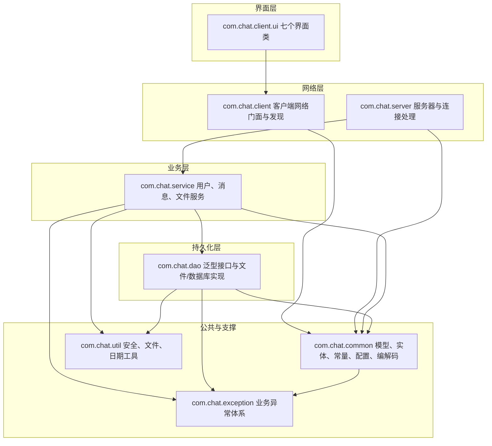

图 4-1 项目分层与依赖关系

---

## 3 项目文件清单

下表列出全部 46 个主源码文件。行数由 `wc -l` 统计，包含注释与空行。

说明：行数为编写本文档时的统计快照，用于说明规模量级与文件职责。若源码在文档定稿后发生重构（例如把界面内部类提取为独立的 Panel 类文件），文件名与行数会小幅变化，此时请以仓库现状为准；包的划分与各类职责说明不受影响。

### 3.1 公共模块 com.chat.common（12 个文件，1710 行）

| 文件路径 | 行数 | 职责 | 关键方法 |
| --- | --- | --- | --- |
| com/chat/common/Message.java | 182 | 消息抽象基类，序列化字段与摘要抽象方法 | getSummary 抽象、isBroadcast、toString |
| com/chat/common/TextMessage.java | 64 | 文本消息，承载聊天内容 | getSummary、getContent |
| com/chat/common/SystemMessage.java | 56 | 系统通知与错误消息 | getSummary、getContent |
| com/chat/common/FileMessage.java | 241 | 文件消息，承载传输编号、文件名、大小、块序号、数据、校验和与回执信息 | getTransferId、getChunkIndex、getData、getSha256、isAccepted、getSummary |
| com/chat/common/MessageType.java | 104 | 24 种消息类型枚举与描述 | getDescription、fromName |
| com/chat/common/ChatMessageFactory.java | 113 | 消息工厂与全局编号分配 | text、system、error、file、control |
| com/chat/common/User.java | 279 | 用户实体，凭据脱敏与显示名回退 | clearCredential、getDisplayName、isAdmin、equals、hashCode |
| com/chat/common/Constants.java | 162 | 全部常量集中定义 | 无业务方法，仅静态常量与私有构造 |
| com/chat/common/Config.java | 211 | properties 配置加载与语义化路径 | get、getInt、getLong、getBoolean、dataDir、userFile、historyDir、receivedDir |
| com/chat/common/Result.java | 116 | 泛型结果封装 | ok、fail、isSuccess、getMessage、getData |
| com/chat/common/UserListCodec.java | 100 | 在线用户列表文本编解码 | encode、decode |
| com/chat/common/FileTransferCodec.java | 82 | 文件请求元信息文本编解码 | encode、decode |

### 3.2 异常体系 com.chat.exception（3 个文件，165 行）

| 文件路径 | 行数 | 职责 | 关键方法 |
| --- | --- | --- | --- |
| com/chat/exception/ChatException.java | 71 | 受检业务异常基类，携带错误码 | 四个构造方法、getErrorCode |
| com/chat/exception/UserNotFoundException.java | 35 | 用户不存在异常 | 两个构造方法 |
| com/chat/exception/FileTransferException.java | 59 | 文件传输异常，携带传输编号 | 三个构造方法、getTransferId |

### 3.3 工具层 com.chat.util（3 个文件，556 行）

| 文件路径 | 行数 | 职责 | 关键方法 |
| --- | --- | --- | --- |
| com/chat/util/SecurityUtil.java | 185 | 盐生成、SHA-256 加盐散列、常量时间比较、凭据解析 | generateSalt、hashPassword、encode、verifyPassword、extractSalt、extractHash、sha256Hex |
| com/chat/util/FileUtil.java | 250 | 目录创建、大小格式化、流式 SHA-256、分块计算、重名规避、文件名清洗、流拷贝 | ensureDir、humanSize、sha256、offsetOf、chunkCount、uniqueTarget、sanitizeFileName、copy、deleteQuietly、extensionOf |
| com/chat/util/DateUtil.java | 121 | 线程安全日期时间格式化与解析 | format、formatTime、now、parse、dayKey、todayKey、formatDuration |

### 3.4 持久化层 com.chat.dao（6 个文件，1516 行）

| 文件路径 | 行数 | 职责 | 关键方法 |
| --- | --- | --- | --- |
| com/chat/dao/BaseDao.java | 75 | 泛型数据访问接口 | save、update、deleteById、findById、findAll、count |
| com/chat/dao/UserDao.java | 55 | 用户数据访问接口 | findByUsername、deleteByUsername、exists、saveOrUpdate、reload |
| com/chat/dao/UserDaoImpl.java | 377 | 用户文件存储实现，内存缓存加原子替换落盘 | reload、save、update、deleteByUsername、findByUsername、flush |
| com/chat/dao/MessageDao.java | 65 | 消息数据访问接口 | append、query、search、exportTo、findById |
| com/chat/dao/MessageDaoImpl.java | 522 | 消息文件存储实现，按天分文件 | append、query、search、exportTo、fileOf、parseLine、toLine |
| com/chat/dao/JdbcUserDao.java | 422 | 可选 MySQL 用户存储实现，PreparedStatement 防注入 | isAvailable、save、update、findByUsername、saveOrUpdate、fromConfig、open |

### 3.5 业务层 com.chat.service（3 个文件，1114 行）

| 文件路径 | 行数 | 职责 | 关键方法 |
| --- | --- | --- | --- |
| com/chat/service/UserService.java | 377 | 注册、登录、改昵称、改密码、删用户、查询 | register、initAdminIfAbsent、login、updateNickname、updatePassword、deleteUser、listAll、validate、copyForTransfer |
| com/chat/service/MessageService.java | 201 | 消息持久化、历史查询与导出 | saveMessage、queryHistory、search、exportHistory、exportMessages、count |
| com/chat/service/FileService.java | 536 | 文件分块发送与接收、序号校验、完整性校验、进度计算 | prepareSend、createEndMessage、closeSend、openReceive、appendChunk、finishReceive、cancelReceive、progressOf、validateRequest |

### 3.6 服务器端 com.chat.server（8 个文件，2230 行）

| 文件路径 | 行数 | 职责 | 关键方法 |
| --- | --- | --- | --- |
| com/chat/server/ChatServer.java | 472 | 服务器单例，端口绑定、线程池、心跳扫描、启动回滚与观察者通知 | getInstance、start、stop、rollback、acceptLoop、scanIdleConnections、notify、initServices、localAddress |
| com/chat/server/ClientHandler.java | 744 | 连接处理线程，对象流收发、身份校验、业务分派与文件中继 | run、initStreams、identify、send、handleTextMessage、handleFileMessage、handleLogin、handleRegister、handleHistoryRequest、onConnectionClosed、touch、isTimeout |
| com/chat/server/AbstractMessageHandler.java | 137 | 消息分派模板方法基类 | dispatch、handleUserList、handleTextMessage、handleFileMessage、handleSystemMessage、onUserOnline、onUserOffline |
| com/chat/server/MessageHandler.java | 75 | 消息处理接口定义 | 处理钩子方法声明 |
| com/chat/server/UserManager.java | 265 | 在线用户表、单播、广播与观察者管理 | register、unregister、get、isOnline、onlineNames、sendTo、broadcast、broadcastUserList、broadcastText、addObserver、notifyObservers |
| com/chat/server/DiscoveryResponder.java | 209 | UDP 局域网发现应答器 | start、shutdown、loop、buildAnnouncement、parseAnnouncement、isLoopback |
| com/chat/server/ServerObserver.java | 54 | 服务器观察者接口与事件类型枚举 | onEvent |
| com/chat/server/ServerUI.java | 274 | 服务器 Swing 控制台 | initComponents、startServer、stopServer、refreshUserTable、appendLog、onEvent |

### 3.7 客户端网络层 com.chat.client（4 个文件，1406 行）

| 文件路径 | 行数 | 职责 | 关键方法 |
| --- | --- | --- | --- |
| com/chat/client/ChatClient.java | 964 | 客户端网络门面，接收线程、发送池、心跳、文件发送线程与回调分发 | connect、receiveLoop、handleIncoming、handleIncomingChunk、handleIncomingEnd、sendFileChunks、send、sendSync、sendPrivateText、sendGroupText、sendFile、respondFileRequest、decodeRequest、requestUserList、requestHistory、addListener、close |
| com/chat/client/ChatListener.java | 33 | 客户端消息与连接状态回调接口 | onMessage、onConnectionChanged |
| com/chat/client/DiscoveryClient.java | 297 | UDP 发现客户端，枚举全部网卡广播地址 | discover、collectResponses、parse、broadcastAddresses、discoverOnce、loopback、probe、ServerInfo |
| com/chat/client/ChatClientApp.java | 112 | 客户端命令行入口与日志配置 | main、configureLogging、printUsage |

### 3.8 客户端界面 com.chat.client.ui（7 个文件，2445 行）

| 文件路径 | 行数 | 职责 | 关键方法 |
| --- | --- | --- | --- |
| com/chat/client/ui/BaseUI.java | 253 | 界面基类，外观、字体、居中、提示框与 EDT 调度 | initLookAndFeel、applyFont、titledPanel、statusLabel、centerOnScreen、showInfo、showError、confirm、onEdt、runOnEdtAndWait、safeDispose |
| com/chat/client/ui/BaseChatPanel.java | 258 | 聊天面板基类，富文本显示与输入发送 | appendLine、appendMessage、clearHistory、sendCurrentInput、doSend 抽象、getChatTarget 抽象、accepts 抽象、onMessage |
| com/chat/client/ui/LoginUI.java | 597 | 登录、注册、发现服务器与修改密码界面 | doLogin、doRegister、doDiscover、applyServer、changePassword、openMainWindow、setBusy、cleanupClient、onMessage |
| com/chat/client/ui/ClientUI.java | 641 | 主界面，在线列表、功能按钮与消息分派 | openPrivateWindow、openGroupWindow、chooseAndSendFile、showHistoryDialog、exportHistory、changeNickname、deleteUser、refreshUserTable、onMessage、routeFileMessage |
| com/chat/client/ui/PrivateChatUI.java | 161 | 私聊窗口，复用聊天面板基类 | getPanel、getPeer、doSend、getChatTarget、accepts、onMessage |
| com/chat/client/ui/GroupChatUI.java | 143 | 群聊窗口，复用聊天面板基类 | getPanel、doSend、getChatTarget、accepts、onMessage |
| com/chat/client/ui/FileTransferUI.java | 392 | 文件传输界面，进度条与传输日志 | windowFor、ownerOf、forget、chooseFile、startSend、updateProgress、appendLog、registerTransfer、handleIncomingRequest、handleResult、handleFileMessage、presetFile、activeWindowCount |

---

## 4 关键类方法签名清单

本节按调用关系列出主要类的公开签名，便于快速定位入口。参数与返回值中的泛型与自定义类型保持源码原样。

### 4.1 公共模型

```java
// com.chat.common.Message（抽象类，实现 Serializable）
public long getId()
public void setId(long id)
public MessageType getType()
public void setType(MessageType type)
public String getSender()
public void setSender(String sender)
public String getReceiver()
public void setReceiver(String receiver)
public LocalDateTime getTimestamp()
public void setTimestamp(LocalDateTime timestamp)
public boolean isBroadcast()
public abstract String getSummary()

// com.chat.common.ChatMessageFactory（全部为静态工厂方法）
public static TextMessage text(String sender, String receiver, String content, MessageType type)
public static SystemMessage system(String receiver, String content)
public static SystemMessage error(String receiver, String reason)
public static FileMessage file(String sender, String receiver, MessageType type)
public static SystemMessage control(String sender, String receiver, MessageType type)

// com.chat.common.User
public void clearCredential()
public String getDisplayName()
public boolean isAdmin()

// com.chat.common.Result<T>
public static <T> Result<T> ok(T data)
public static <T> Result<T> ok(String message, T data)
public static <T> Result<T> fail(String message)
public boolean isSuccess()
public T getData()

// com.chat.common.Config（全部为静态方法）
public static String get(String key, String defaultValue)
public static int getInt(String key, int defaultValue)
public static long getLong(String key, long defaultValue)
public static boolean getBoolean(String key, boolean defaultValue)
public static String dataDir()
public static String userFile()
public static String historyDir()
public static String receivedDir()
```

### 4.2 工具与编解码

```java
// com.chat.util.SecurityUtil
public static String generateSalt()
public static String hashPassword(String password, String salt)
public static String encode(String password)
public static boolean verifyPassword(String rawPassword, String salt, String hash)
public static String sha256Hex(byte[] data)

// com.chat.util.FileUtil
public static File ensureDir(String dir) throws IOException
public static String humanSize(long bytes)
public static String sha256(File file) throws IOException
public static long offsetOf(int chunkIndex, int chunkSize)
public static int chunkCount(long fileSize, int chunkSize)
public static File uniqueTarget(String dir, String fileName)
public static String sanitizeFileName(String fileName)
public static boolean deleteQuietly(File file)

// com.chat.common.UserListCodec / FileTransferCodec
public static String encode(List<User> users)
public static List<User> decode(String text)
public static String encode(FileMessage request)
public static FileMessage decode(String text, String sender, String receiver)
```

### 4.3 业务层

```java
// com.chat.service.UserService
public Result<User> register(String username, String password, String nickname)
public boolean initAdminIfAbsent()
public Result<User> login(String username, String password)
public Result<User> updateNickname(String username, String nickname)
public Result<Boolean> updatePassword(String username, String oldPassword, String newPassword)
public Result<Boolean> deleteUser(String operator, String target)
public Result<List<User>> listAll()

// com.chat.service.MessageService
public Result<Boolean> saveMessage(Message message)
public Result<List<Message>> queryHistory(String username, LocalDate fromDate, LocalDate toDate)
public Result<List<Message>> queryHistory(String username, LocalDateTime from, LocalDateTime to)
public Result<List<Message>> search(String keyword)
public Result<File> exportHistory(String username)

// com.chat.service.FileService
public FileMessage prepareSend(String sender, String receiver, File file) throws FileTransferException
public FileMessage createEndMessage(String sender, String receiver, FileMessage request)
public void closeSend(String transferId)
public String openReceive(String receiverDir, FileMessage request) throws FileTransferException
public long appendChunk(FileMessage chunk) throws FileTransferException
public File finishReceive(FileMessage end) throws FileTransferException
public void cancelReceive(String transferId)
public double progressOf(String transferId)
```

### 4.4 服务器端

```java
// com.chat.server.ChatServer
public static ChatServer getInstance()
public synchronized boolean start()
public synchronized void stop()
public void addObserver(ServerObserver observer)
public void notify(ServerObserver.EventType type, String content)
public String localAddress()

// com.chat.server.ClientHandler（继承 AbstractMessageHandler，实现 Runnable）
public ClientHandler(Socket socket, ChatServer server)
public void run()
public boolean send(Message message)
public void handleTextMessage(Message message, Socket socket)
public void handleFileMessage(Message message, Socket socket)
public void onConnectionClosed()
public void touch()
public boolean isTimeout(long now)
public static Set<String> activeTransfers()

// com.chat.server.AbstractMessageHandler（模板方法）
public final void dispatch(Message message, Socket socket)
public void handleUserList(Message message, Socket socket)
public void handleTextMessage(Message message, Socket socket)
public void handleFileMessage(Message message, Socket socket)
public void handleSystemMessage(Message message, Socket socket)

// com.chat.server.UserManager
public boolean register(User user, ClientHandler handler)
public boolean unregister(String username)
public ClientHandler get(String username)
public boolean sendTo(String username, Message message)
public int broadcast(Message message)
public void broadcastUserList()
public int broadcastText(Message message)
public void notifyObservers(ServerObserver.EventType type, String content)
```

### 4.5 客户端

```java
// com.chat.client.ChatClient
public boolean connect(String host, int port, String name, String password)
public boolean sendPrivateText(String receiver, String content)
public boolean sendGroupText(String content)
public String sendFile(String receiver, File file)
public boolean respondFileRequest(FileMessage request, boolean accepted, String reason)
public static FileMessage decodeRequest(TextMessage message)
public boolean requestUserList()
public boolean requestHistory(String target, String fromDate, String toDate)
public void addListener(ChatListener listener)
public void close()
public boolean isConnected()

// com.chat.client.ChatListener
public void onMessage(Message message)
public void onConnectionChanged(boolean connected, String reason)

// com.chat.client.DiscoveryClient
public List<ServerInfo> discover(int timeoutMillis)
public static List<ServerInfo> discoverOnce(int timeoutMillis)
public static ServerInfo loopback(int port)
public static boolean probe(String host, int port)
```

### 4.6 界面层（仅列抽象基类与复用点）

```java
// com.chat.client.ui.BaseUI（抽象 JFrame）
protected void onEdt(Runnable task)
protected void runOnEdtAndWait(Runnable task)
protected void showError(String message)
protected boolean confirm(String message)
public void centerOnScreen()

// com.chat.client.ui.BaseChatPanel（抽象 JPanel）
public void appendMessage(String prefix, String content, Color color)
public void appendLine(String text, Color color)
public void clearHistory()
public void onMessage(Message message)
protected abstract boolean doSend(String content)
protected abstract String getChatTarget()
protected abstract boolean accepts(Message message)
```

---

## 5 关键算法与流程

### 5.1 核心模型总览

所有在网络上传输的数据都是 Message 的子类对象，因此「消息模型」就是本项目的协议定义。理解下图是阅读本项目源码的起点。

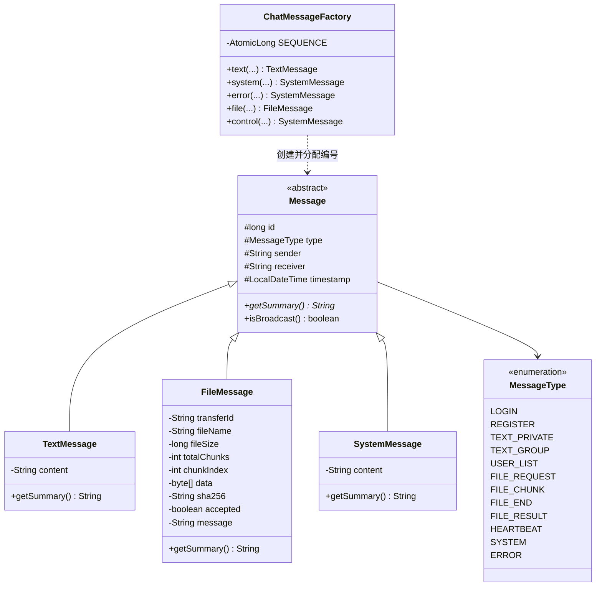

图 4-2 消息模型类图

三条必须记住的约定。第一，类型只能是 MessageType 枚举值，业务代码中不得出现字符串形式的类型名。第二，消息编号由 ChatMessageFactory 内的 AtomicLong 分配，全局递增且不重复，可作为去重键使用。第三，用户列表与文件请求的元信息以文本形式存放在 TextMessage 的内容字段中，分别由 UserListCodec 与 FileTransferCodec 编解码，服务器必须先解码校验再转发原始消息对象。

### 5.2 消息分派（模板方法）

服务器收到任意消息后，统一经过 AbstractMessageHandler.dispatch，由它完成固定步骤，再把可变步骤交给子类钩子。

```text
算法 dispatch(message, socket)
输入：从对象流读到的消息对象；来源连接
输出：无返回值，必要时向对端写回执

1  若 message 为空或 message.getType() 为空：
2      发送 ERROR 回执「消息格式错误」并返回
3  尝试：
4      按 message.getType() 分派：
5          USER_LIST 或 USER_LIST_REQUEST        -> handleUserList
6          TEXT_PRIVATE 或 TEXT_GROUP 或 HISTORY_* -> handleTextMessage
7          FILE_REQUEST / ACCEPT / REJECT / CHUNK / END / RESULT -> handleFileMessage
8          其余（LOGIN / REGISTER / LOGOUT / HEARTBEAT / USER_UPDATE / PASSWORD_CHANGE）-> handleSystemMessage
9  捕获 ChatException：
10     记录日志，发送 ERROR 回执，携带异常的 errorCode 与中文消息
11 捕获其他运行时异常：
12     记录堆栈，发送 ERROR 回执，避免异常逃出读取循环导致连接线程退出
13 最终：
14     touch() 刷新该连接的最近活跃时间（心跳判定依赖此时间）
```

流程中的关键点在最后一步：任何一条消息（包括心跳与错误消息）都会刷新活跃时间，因此只有真正「沉默」的连接才会被判定掉线。

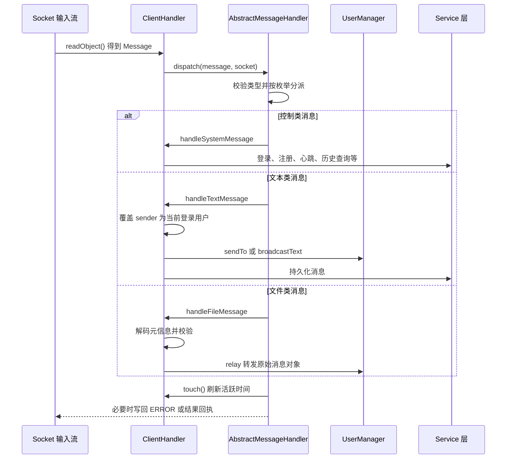

图 4-3 服务器连接处理与消息分派时序图

### 5.3 登录鉴权

登录涉及「凭据校验」与「在线表占位」两个独立步骤，二者都可能失败，且失败原因必须区分。

```text
算法 服务端 handleLogin(message)
输入：LOGIN 类型的文本消息，内容格式为「用户名|密码」
输出：LOGIN_RESULT 回执

1  若当前连接 username 非空：发送「当前连接已登录」错误，返回
2  按分隔符 '|' 切分内容；格式非法时回执失败
3  result = userService.login(用户名, 密码)
4  若 result 失败：
5      通知观察者 LOGIN_FAILED
6      回执失败（原因可能是「用户不存在」「密码错误」「格式非法」）
7      返回
8  user = result 的用户对象（已脱敏）
9  若 userManager.register(user, this) 失败：
10     回执失败「该账号已在其它位置登录」
11     返回
12 记录当前连接的 username
13 回执成功，携带脱敏用户信息
14 onUserOnline(用户名, socket)：广播在线用户列表与上线通知
```

在线表占位使用 ConcurrentHashMap 的 putIfAbsent 语义实现，这是并发安全的唯一保证点。

```text
算法 UserManager.register(user, handler)
1  existing = onlineUsers.putIfAbsent(user.getUsername(), handler)
2  若 existing 非空：记录日志并返回 false（重复登录被拒绝）
3  标记 user.online = true，写入 userProfiles
4  通知观察者 USER_ONLINE
5  返回 true
```

图 4-4 给出登录鉴权的完整判定路径。

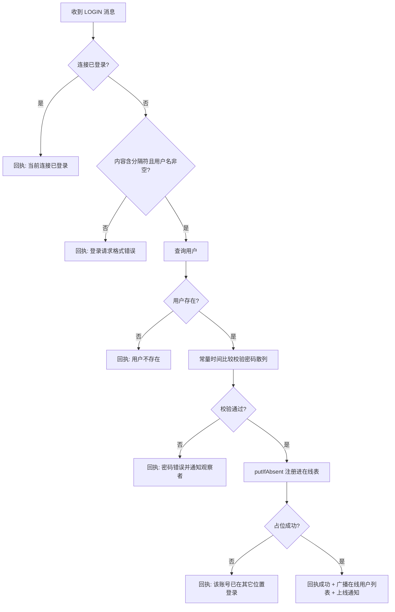

图 4-4 登录鉴权流程图

### 5.4 私聊路由

私聊路径上有三个必须明确的语义：发送者被强制覆盖、离线时明确失败、成功时向发送方回执确认。

```text
算法 handleTextMessage(message, socket) 的私聊分支
1  若连接未登录：忽略并回执「请先登录」
2  message.setSender(当前连接已登录用户名)        // 防伪造
3  若类型为 TEXT_GROUP：转群聊分支（见 5.5）
4  receiver = message.getReceiver()
5  若 receiver 为空：回执「私聊消息缺少接收者」
6  delivered = userManager.sendTo(receiver, message)
7  若 delivered 为 false：
8      回执「用户 X 不在线，消息未送达」，不静默丢弃
9      返回
10 messageService.saveMessage(message)            // 只持久化成功投递的消息
11 构造回执：ChatMessageFactory.text(发送者, 发送者, message.getSummary(), TEXT_PRIVATE)
12 回执给发送方，使其界面确认已发出
13 通知观察者 PRIVATE_MESSAGE
```

对应客户端一侧，接收线程收到 TEXT_PRIVATE 后按「消息发送者或接收者是否等于当前会话对端」的规则分发给私聊窗口；发送方界面在本地直接回显自己发出的内容，并通过服务器回执确认投递成功，从而避免重复显示。

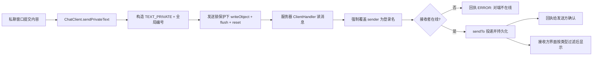

图 4-5 私聊路由流程图

### 5.5 群聊广播

群聊的语义是「广播给当前在线表的全部连接」，服务器同样先覆盖发送者，再广播，最后持久化。

```text
算法 群聊分支
1  message.setSender(当前登录用户名)
2  message.setReceiver("")                    // 群聊不指定接收者
3  userManager.broadcastText(message)          // 遍历在线表逐个 send
4  messageService.saveMessage(message)
5  通知观察者 GROUP_MESSAGE

算法 UserManager.broadcast(message)
1  count = 0
2  对 handlers() 快照中的每个连接 handler：
3      若 handler.send(message) 成功：count 自增
4  返回 count
```

广播的健壮性来自两点：遍历的是连接集合的快照，避免遍历期间连接增减造成并发修改异常；单个连接的写入失败只影响该连接，其返回值不计入成功数，上层据此判定该连接异常并交由心跳扫描回收。

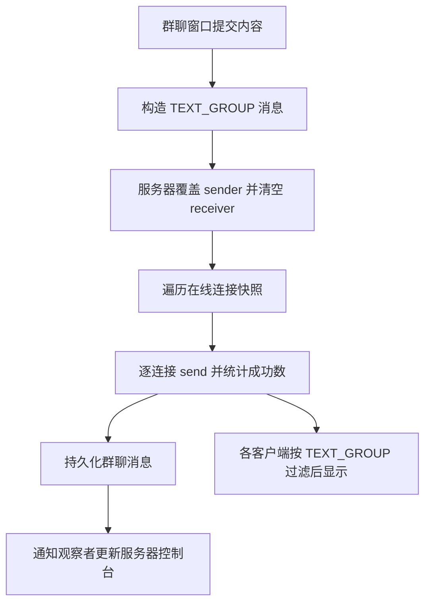

图 4-6 群聊广播流程图

### 5.6 文件分块传输与完整性校验

文件传输是本项目最复杂的流程，包含发送侧分块读取、接收侧序号校验、结束校验与失败清理四个环节。完整的交互时序如下。

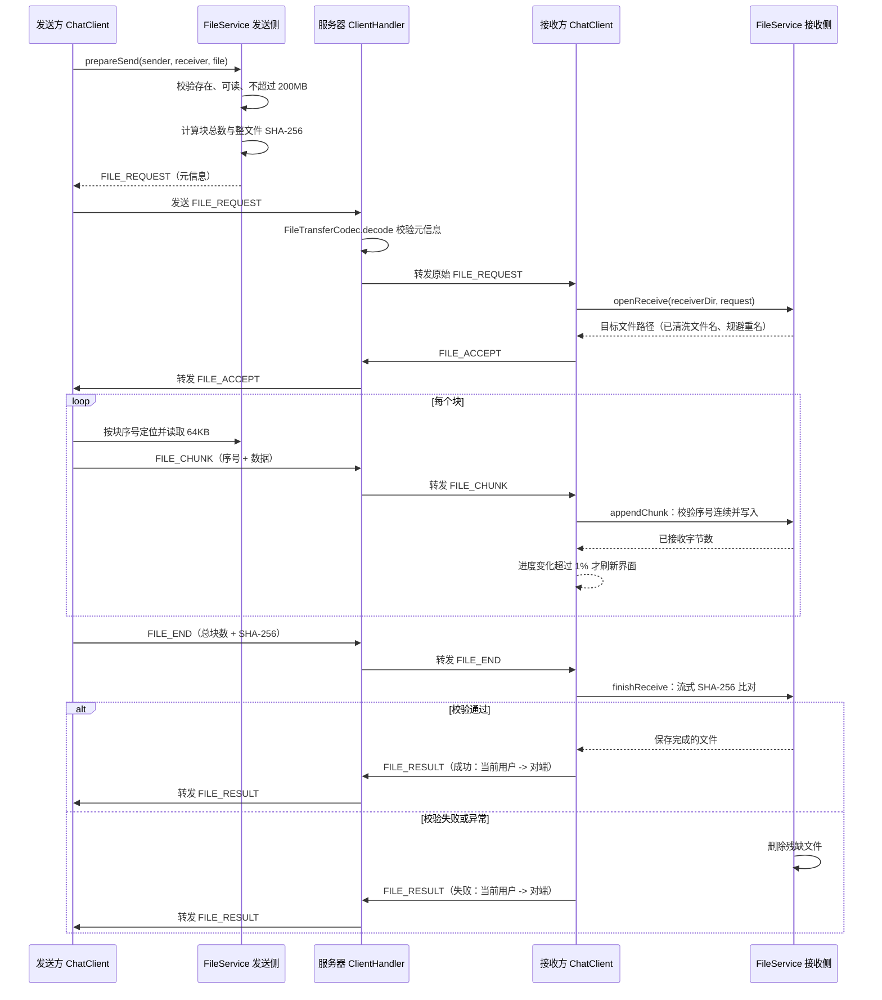

图 4-7 文件分块发送与校验时序图

接收侧的状态与清理规则如下。任何未走到「已完成」的路径都必须删除残缺文件。

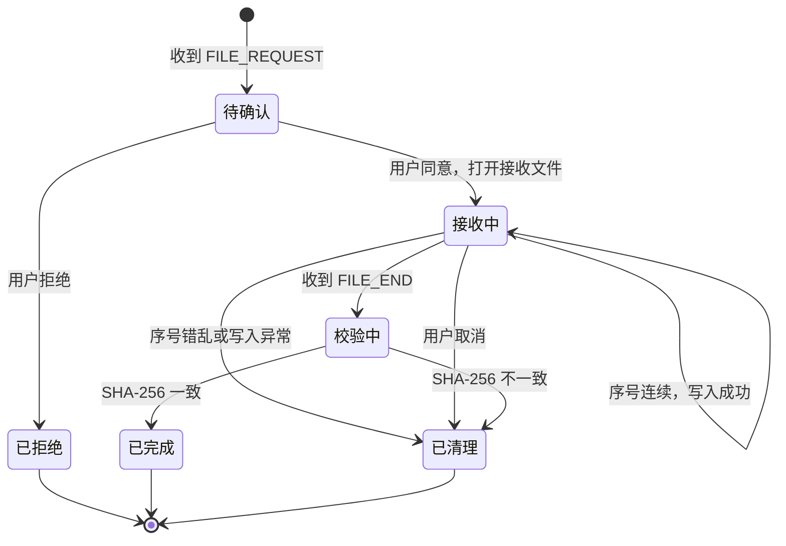

图 4-8 文件接收状态流转图

核心算法伪代码如下。

```text
算法 FileService.prepareSend(sender, receiver, file)
1  若文件为空、不存在、不可读：抛 FileTransferException
2  若文件长度大于 200MB：抛 FileTransferException（本地即拒绝）
3  totalChunks = FileUtil.chunkCount(length, 64KB)
4  sha256 = FileUtil.sha256(file)                // 流式计算，不整块读入内存
5  打开 RandomAccessFile 并登记到发送会话表
6  构造 FILE_REQUEST，填充 transferId、文件名、大小、块总数、校验和
7  返回该消息

算法 FileService.appendChunk(chunk)
1  按 transferId 取出接收会话；不存在则抛异常
2  若 chunk.getChunkIndex() != 已接收块数：抛异常「数据块序号错乱」
3  在锁保护下从 RandomAccessFile 的对应偏移量写入数据
4  累加已接收字节数并返回

算法 FileService.finishReceive(end)
1  按 transferId 取出接收会话；不存在则抛异常
2  尝试：
3      关闭输出流，flush 到磁盘
4      计算本地文件的实际 SHA-256
5      若与 end.getSha256() 不一致：抛 FileTransferException
6      从会话表移除并返回文件
7  捕获 IOException 与 FileTransferException：
8      删除残缺文件，从会话表移除
9      继续向上抛出，交由上层回执失败
```

值得注意的是第 7 至 9 行：必须同时捕获 IO 异常与业务异常。早期版本只捕获 IOException，导致 SHA-256 校验失败抛出的业务异常绕过了删除逻辑，磁盘上会残留一个内容损坏但扩展名正常的文件。

### 5.7 心跳扫描与掉线清理

```text
算法 ChatServer.scanIdleConnections（由定时任务每 20 秒触发一次）
1  now = 当前毫秒时间
2  在 handlers 锁内复制一份连接快照
3  对快照中的每个 handler：
4      若 handler.isTimeout(now) 成立（now - lastActiveTime > 60 秒）：
5          记录警告日志
6          handler.close()：关闭套接字、注销在线表、清理文件传输会话

算法 ClientHandler.run 的读取循环
1  初始化对象流：先构造 ObjectOutputStream 并 flush，再构造 ObjectInputStream
2  循环：
3      message = in.readObject()             // 阻塞；对端关闭时抛 EOFException
4      touch()                               // 刷新最近活跃时间
5      dispatch(message, socket)
6  捕获 EOFException 与 IOException：
7      记录日志，结束循环
8  最终：
9      onConnectionClosed()：注销在线表、关闭流与套接字、通知服务器移除本处理器
```

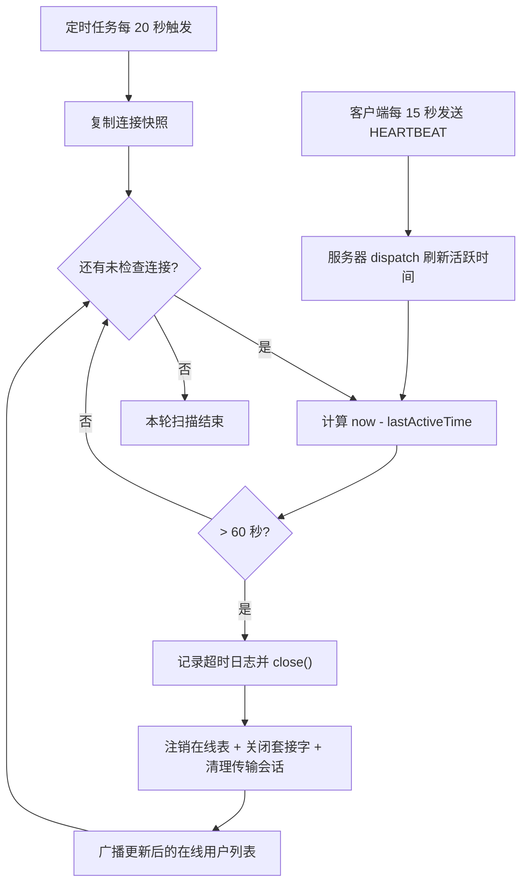

图 4-9 心跳扫描与掉线清理流程图

### 5.8 UDP 自动发现

```text
算法 DiscoveryResponder.loop（服务器侧，独立线程）
1  创建 DatagramSocket 并绑定发现端口
2  循环直到 running 为 false：
3      packet = 接收数据报（阻塞）
4      若负载为约定探测报文：
5          announcement = "LANCHAT_ANNOUNCE|<本机IP>|<TCP端口>|<在线人数>"
6          把 announcement 回送给请求来源地址与端口

算法 DiscoveryClient.discover(timeoutMillis)（客户端侧）
1  addresses = broadcastAddresses()      // 枚举全部网卡的广播地址
2  socket = 新建 DatagramSocket，开启广播，设置接收超时
3  对每个广播地址发送探测报文
4  在总超时窗口内循环接收应答：
5      text = 收到的文本
6      解析为 ServerInfo（IP、端口、在线人数）
7      按「IP + 端口」放入集合去重（同一服务器可能多网卡应答多次）
8  返回去重后的 ServerInfo 列表

算法 DiscoveryClient.broadcastAddresses()
1  结果集合置空
2  枚举 NetworkInterface.getNetworkInterfaces() 中所有处于启用状态的接口
3  对每个接口的每个 InterfaceAddress：
4      计算广播地址（接口地址按子网掩码或前缀长度推导）
5      非空且不重复时加入结果集合
6  返回结果集合
```

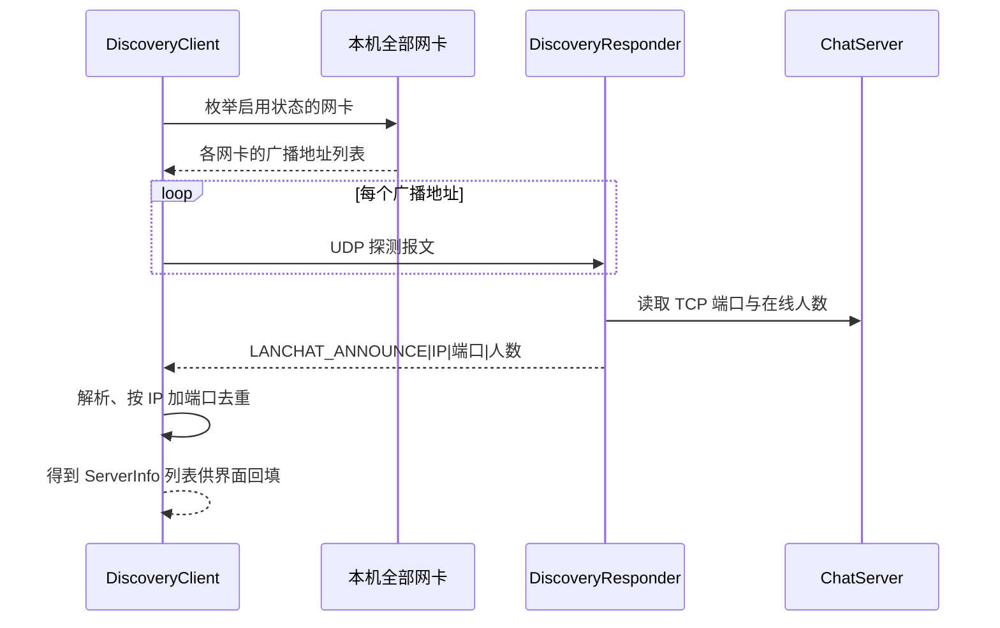

图 4-10 UDP 自动发现时序图

发现失败时的降级路径必须保留：客户端允许手工输入服务器 IP 与端口，且提供 loopback 与 probe 两个静态方法，分别用于生成本机服务器信息与探测指定地址是否可连接。

### 5.9 文件名清洗与重名规避

```text
算法 FileUtil.sanitizeFileName(fileName)
1  若为空或仅空白：返回 "unnamed"
2  把反斜杠统一替换为正斜杠
3  截取最后一个斜杠之后的部分（丢弃任何目录部分）
4  把 [\\/:*?"<>|] 等非法字符替换为下划线
5  若结果为空、为 "." 或为 ".."：返回 "unnamed"
6  返回结果

算法 FileUtil.uniqueTarget(dir, fileName)
1  name = sanitizeFileName(fileName)
2  target = new File(dir, name)
3  若 target 不存在：直接返回
4  拆分主名与扩展名
5  index 从 1 递增：尝试「主名(index)扩展名」
6  返回第一个不存在的候选文件
```

第 3 步是防目录穿越的关键：即使对端构造 `../../etc/passwd` 这样的文件名，也会被截断为 `passwd`，再叠加接收目录的路径，写入位置无法越出接收目录。

---

## 6 编码规范说明

本项目在编码规范上遵循以下约定，全部源码均已按此执行。

| 规范项 | 约定 | 说明 |
| --- | --- | --- |
| 包名 | 全小写，按职责分层 | com.chat.common、com.chat.dao、com.chat.client.ui 等 |
| 类名 | 大驼峰 | ChatClient、AbstractMessageHandler、UserDaoImpl |
| 方法名 | 小驼峰，动词开头 | sendPrivateText、prepareSend、broadcastUserList |
| 常量 | 全大写加下划线 | DEFAULT_SERVER_PORT、MAX_FILE_SIZE、FILE_CHUNK_SIZE |
| 字段 | 私有字段，通过 getter/setter 访问 | 实体与消息类统一遵守封装原则 |
| 类注释 | 每个类都有中文 Javadoc，说明职责与设计意图 | 见任一源文件头部 |
| 方法注释 | 每个方法都有 Javadoc，说明参数、返回值与异常 | 使用 @param、@return、@throws 标签 |
| 行内注释 | 用于「为什么」而非「做什么」 | 例如说明原子替换、reset 调用、常量时间比较的原因 |
| 魔法值 | 禁止 | 全部收敛到 Constants 或 MessageType 枚举 |
| 异常 | 业务可预期失败用 Result 表达，需中断资源操作的失败用受检异常 | 见 ChatException 体系 |
| 命名即文档 | 方法名直接表达语义与方向 | 例如 handleIncomingEnd、finishFailedTransfer |
| 线程安全 | 界面更新只能经 onEdt；共享流写入必须持锁 | 基类提供统一入口，避免逐处判断 |

每个源文件头部统一包含类注释、职责说明、设计说明（或使用说明）、作者与版本信息；每个公开方法前有 Javadoc 中文说明。这也是主源码 11142 行中注释占比较高的原因，属于刻意的可读性投入。

---

## 7 推荐阅读顺序

建议按下图顺序阅读源码，每一步都能独立编译运行、独立验证，不需要一次理解全部代码。

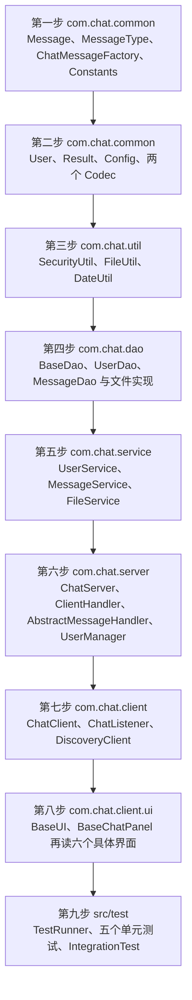

图 4-11 推荐阅读顺序图

每一步的阅读目标与验证方式如下。

| 步骤 | 阅读目标 | 建议验证方式 |
| --- | --- | --- |
| 第一步 | 搞清楚「协议就是这几个类」 | 阅读 MessageType 的 24 个枚举说明，对照协议表 |
| 第二步 | 搞清实体、结果封装与配置优先级 | 修改 config/chat.properties 中的端口，观察 Config 的取值变化 |
| 第三步 | 搞清密码存储格式与文件工具 | 阅读 SecurityUtilTest，理解盐与散列的关系 |
| 第四步 | 搞清数据如何落盘与原子替换 | 运行 UserDaoTest，观察临时目录中的 users.txt |
| 第五步 | 搞清业务规则与返回值约定 | 运行 UserServiceTest 与 FileServiceTest |
| 第六步 | 搞清连接生命周期与消息分派 | 阅读 ClientHandler.run 与 dispatch，对照图 4-3 |
| 第七步 | 搞清客户端线程结构与回调机制 | 阅读 receiveLoop、writeObject、startHeartbeat 三处 |
| 第八步 | 搞清界面复用与 EDT 调度 | 对比 PrivateChatUI 与 GroupChatUI 的差异仅在三个方法 |
| 第九步 | 搞清测试如何驱动真实协议 | 运行 IntegrationTest 并观察控制台输出 |

---

## 8 如何扩展

### 8.1 新增一种消息类型

以「新增一个查询服务器运行状态的消息」为例，需要改动的位置如下。

1. 在 com.chat.common.MessageType 中新增枚举项，例如 SERVER_STATUS 与 SERVER_STATUS_RESULT，并补充中文描述。
2. 判断是否需要新字段。若只需携带文本，直接复用 TextMessage，用 ChatMessageFactory.text 或 control 创建；若需要结构化字段，则在 com.chat.common 下新增 Message 的子类并实现 getSummary。
3. 服务器侧：在 ClientHandler 覆写的对应钩子中增加分支。控制类消息落在 handleSystemMessage，文本类落在 handleTextMessage，文件类落在 handleFileMessage。若新增的消息不属于这三类，可考虑扩展 AbstractMessageHandler 的分派条件。
4. 客户端侧：在 ChatClient.handleIncoming 的分派逻辑中增加处理分支，并通过 notifyMessage 回调给界面。
5. 界面侧：在需要展示该消息的界面实现中处理回调；若是新窗口，可继承 BaseUI 并实现 ChatListener。
6. 补充测试用例：在对应的单元测试类中增加断言，必要时在 IntegrationTest 中增加端到端场景。

不需要改动的位置：消息编号分配、对象流收发、连接管理、持久化层。这三点正是「类型集中定义、创建走工厂、分派走统一入口」带来的收益。

### 8.2 新增一种存储实现

数据访问层以接口为契约，新增存储介质只需实现接口，不需要修改业务层。

1. 选择接口：用户数据实现 com.chat.dao.UserDao，消息数据实现 com.chat.dao.MessageDao，二者都继承 com.chat.dao.BaseDao<T, ID>。
2. 新建实现类，例如 RedisUserDao，放在 com.chat.dao 包下，实现全部接口方法。方法内部把 IO 异常与驱动异常统一转换为 ChatException 及其子类。
3. 在构造或初始化方法中完成连接准备，并提供一个静态工厂（参考 JdbcUserDao.fromConfig 与 open）用于按配置构造实例。
4. 若需要按配置切换，在服务层构造处增加选择逻辑，遵循「默认文件存储、显式配置才切换」的原则，避免重演「由环境隐式决定存储介质」的缺陷。
5. 补充测试：参考 UserDaoTest 的写法，用临时资源构造隔离环境，重点断言持久化与重新加载的一致性。

### 8.3 把文件传输改为支持断点续传

当前传输一旦中断必须整文件重传。改造思路如下，改动集中在 FileService 与协议层面，不需要触碰界面框架。

1. 元信息扩展：在 FileMessage 中增加「已完成块位图」字段（可用 byte 数组或 Base64 字符串表示），随 FILE_ACCEPT 与 FILE_END 一起传输。
2. 发送侧改造：prepareSend 时若发现同一文件与同一对端存在历史会话，先向接收方询问已完成块；发送循环跳过位图中已完成的块，进度按「已确认字节数」而不是「已发送块数」计算。
3. 接收侧改造：openReceive 探测目标目录是否已存在同名的部分文件与本地位图记录，若存在则不再清空，而是从缺失块继续；appendChunk 允许非连续块，但必须校验块序号范围并把数据写入正确偏移量（RandomAccessFile 已具备按偏移写入的能力）。
4. 校验时机：SHA-256 校验从 FILE_END 时的整文件校验改为「全部块齐备后」触发，因此需要先判断位图是否完整。
5. 会话超时：为未完成的接收会话增加超时与清理策略，避免部分文件长期驻留磁盘；同时要明确告知用户「该文件尚未传输完成」，不能留下无标记的残缺文件。
6. 测试补充：在 FileServiceTest 中增加「传输一半后重新发起，最终内容与源文件一致」的用例；在 IntegrationTest 中增加中断重连场景。

### 8.4 其他常见扩展的落点

| 想做的事 | 主要改动位置 | 关键注意点 |
| --- | --- | --- |
| 支持离线消息 | MessageService 与 MessageDao 增加未读表，ClientHandler.handleTextMessage 的离线分支，登录成功后补发 | 需要去重键（可用消息编号）与保留期限；不能把补发设计成无限增长 |
| 协议版本协商 | 客户端连接后与服务器握手交换版本号，Constants 增加版本常量 | 版本不一致应给出明确中文提示，而不是等待反序列化异常 |
| 传输加密 | SecurityUtil 增加对称加密与消息认证码，或改用 SSLSocket 封装 | 密钥分发是难点；教学项目中可先用预共享密钥演示 |
| 自建群与成员管理 | 新增 Group 实体与 GroupDao，UserManager 广播范围改为群成员集合，界面新增群管理窗口 | 群成员与在线表的交集计算；群消息持久化需携带群标识 |
| 服务器压力测试 | 新增可控的模拟客户端程序 | 需要可控的发送速率与统计输出，避免压测本身成为瓶颈 |

---

## 9 常见陷阱备忘

以下五条是本项目在开发中真实踩过或刻意规避的陷阱，修改代码时请务必注意。

1. 对象流构造顺序：必须先构造 ObjectOutputStream 并 flush，再构造 ObjectInputStream。两端都先构造输入流会互相阻塞形成死锁。
2. 对象流内存增长：每次 writeObject 之后必须 flush 并调用 reset()，否则流会持续缓存已发送对象引用。
3. 发送必须持锁：心跳线程、聊天发送、文件分块来自不同线程，任何一处绕过发送锁都会造成对象流字节交错，表现为对端反序列化失败。
4. 服务器必须覆盖 sender：不要相信消息体中的发送者字段，身份只能来自连接已登录状态。
5. 失败路径必须清理：文件接收的任意失败分支都要删除残缺文件；用户数据落盘必须走临时文件加原子替换。

界面相关的两条附加约定：任何组件更新只能通过 BaseUI 的 onEdt 或 runOnEdtAndWait；耗时操作（连接、发现、注册、文件选择）必须放在后台线程或 SwingWorker 中执行。

