# 局域网聊天程序

## Java 课程设计报告

| 项目 | 内容 |
| --- | --- |
| 课程名称 | Java 程序设计（Java SE 课程设计） |
| 设计题目 | 题目 13：网络聊天程序 |
| 题目名称 | 局域网聊天程序（类 QQ 的局域网即时通信工具） |
| 学生姓名 | （留空，请填写） |
| 学号 | （留空，请填写） |
| 专业班级 | （留空，请填写） |
| 指导教师 | （留空，请填写） |
| 完成日期 | 2026 年 9 月 |

---

## 摘要

本课程设计完成了一个基于 Java SE 的局域网聊天程序，对应课程设计题目 13「网络聊天程序」。程序采用客户端/服务器（C/S）架构，以 TCP Socket 长连接承载通信，以 Java 原生对象序列化承载消息，以 Swing 构建图形界面，实现类 QQ 的局域网即时通信体验。系统提供四项核心能力：局域网内自动侦测启动了本软件的在线用户、两人私聊、多人群聊以及点对点文件传输。全部代码基于 JDK 17 及以上版本的纯 Java SE 标准库编写，不依赖 Netty、Spring、JavaFX 等任何第三方框架，使用 javac 直接编译并由脚本完成构建与启动。

系统按职责划分为八个包：common 定义消息模型、消息类型、用户实体与配置常量；exception 定义受检业务异常体系；util 提供密码散列、文件处理与日期格式化工具；dao 以泛型接口抽象数据访问层，提供文件存储实现与可选的 MySQL 实现；service 封装用户、消息与文件三类业务逻辑；server 实现服务器端的多线程连接处理、消息分派与观察者通知；client 实现客户端网络层与 UDP 局域网发现；client.ui 基于 Swing 完成登录、主窗口、私聊、群聊与文件传输五类界面。主源码共 46 个 Java 文件、11142 行（含规范中文注释），测试代码共 8 个文件、2130 行，规模远超题目要求的 500 行有效代码。

设计过程中重点解决了若干工程问题：Java 对象流的构造死锁与内存泄漏、多线程并发写入同一输出流的字节交错、服务器端强制覆盖发送者字段以抵御身份伪造、文件分块传输的序号校验与 SHA-256 完整性校验、残缺文件清理、密码加盐散列与常量时间比较、Swing 事件分发线程安全、以及单例与配置加载的时序问题。测试采用自研的轻量测试框架（不引入第三方测试库），47 个单元测试用例与 7 个集成测试用例全部通过，集成测试真实启动服务器与多个客户端，覆盖登录、在线列表刷新、私聊、群聊、文件传输、下线刷新与异常场景。

**关键词**：Java SE；Socket 网络编程；多线程；Swing；C/S 架构；对象序列化；局域网广播发现；文件传输

---

## 目录

- [摘要](#摘要)
- [第一章 绪论](#第一章-绪论)
  - [1.1 课题背景与意义](#11-课题背景与意义)
  - [1.2 国内外现状](#12-国内外现状)
  - [1.3 设计目标与主要内容](#13-设计目标与主要内容)
  - [1.4 开发环境与技术选型](#14-开发环境与技术选型)
- [第二章 需求分析](#第二章-需求分析)
  - [2.1 功能需求](#21-功能需求)
  - [2.2 非功能需求](#22-非功能需求)
  - [2.3 系统用例图](#23-系统用例图)
  - [2.4 用例描述](#24-用例描述)
  - [2.5 需求边界与不做范围](#25-需求边界与不做范围)
- [第三章 总体设计](#第三章-总体设计)
  - [3.1 C/S 分层架构](#31-cs-分层架构)
  - [3.2 模块划分](#32-模块划分)
  - [3.3 类图设计](#33-类图设计)
  - [3.4 设计模式应用](#34-设计模式应用)
  - [3.5 通信协议设计](#35-通信协议设计)
  - [3.6 线程模型](#36-线程模型)
- [第四章 详细设计与实现](#第四章-详细设计与实现)
- [第五章 测试与结果分析](#第五章-测试与结果分析)
- [第六章 总结与展望](#第六章-总结与展望)
- [参考文献](#参考文献)
- [附录 A 源文件清单](#附录-a-源文件清单)
- [附录 B 运行截图说明清单](#附录-b-运行截图说明清单)

---

# 第一章 绪论

## 1.1 课题背景与意义

即时通信软件是网络编程技术最典型的应用形态之一。从早期的 ICQ、OICQ 到如今的 QQ、微信、钉钉，其底层始终依赖同一套基本机制：进程之间建立可靠的字节流通道、按约定的协议格式交换消息、在多个并发连接之间正确调度数据、并在用户界面上实时呈现对端状态。对 Java 学习者而言，若只停留在语法与集合框架层面，很难理解「一个按钮点击之后数据究竟经过了哪些环节」。局域网聊天程序恰好提供了这样一个端到端可观测的载体：客户端与服务器都在本机或同一网段内运行，任何一次消息投递都可以被完整追踪、调试和验证。

选择本课题的意义体现在四个方面。第一，它把 Java SE 的多个知识板块串联为一个整体，包括面向对象（继承、多态、接口、封装）、集合与并发容器、异常处理、输入输出流、网络编程、反射与序列化、Swing 图形界面与事件模型、以及 java.util.logging 日志体系，形成一次综合性的工程训练。第二，它要求设计者自行定义通信协议，理解「应用层协议就是双方约定的消息格式与交互时序」这一本质，而不是把网络通信当成一个黑盒 API 调用。第三，它天然包含并发问题：一个服务器要同时服务多个客户端，一个客户端要在接收消息的同时响应用户输入，任何一处共享状态处理不当都会造成数据错乱或界面卡死，这为理解线程安全提供了真实场景。第四，它包含明确的安全议题，例如密码不能明文存储、发送者身份不能被客户端伪造、文件内容不能被中间环节篡改而不被发现。

## 1.2 国内外现状

在工业界，主流即时通信系统普遍采用「私有二进制协议 + 长连接网关 + 分布式消息队列」的架构。协议层面，国际上有 XMPP（基于 XML 的可扩展消息与在线协议）、MQTT（轻量级发布订阅协议，广泛用于物联网与移动推送）、Matrix 等开放标准；实现框架层面，Java 生态中有 Netty、MINA 等高性能网络框架，它们通过 Reactor 模型与零拷贝技术支撑百万级并发连接。这些方案在可靠性、可扩展性与跨平台能力上远超教学项目的需求，但其抽象层次过高，学习者难以观察到底层字节流如何被切分与组装。

在局域网场景中，还存在一批轻量级工具，例如基于 UDP 广播的局域网聊天小工具、基于 IP Messenger 协议的内网文件与消息互传工具、以及各类「局域网文件快传」应用。它们的共同特点是：不需要中心服务器或仅需要极轻量的中心节点、依赖广播或多播完成节点自动发现、通信范围限定在同一个广播域内。这类工具的技术路线与本课程设计高度吻合。

在教学与课程设计层面，网络聊天程序是使用频率极高的题目，但常见的实现存在若干典型缺陷：消息类型用裸字符串表示导致拼写错误只能在运行时暴露；服务器不做身份校验，任何客户端都可以把 sender 字段改成别人的名字；文件传输整块读入内存导致大文件直接内存溢出；文件接收失败时残留一个「看起来正常但内容损坏」的文件；密码以明文或简单散列存储。本设计在完成基本功能之外，把上述缺陷逐条作为设计约束加以处理，力求交付一个在工程细节上经得起追问的实现。

## 1.3 设计目标与主要内容

本设计的目标是实现一个类 QQ 的局域网聊天程序，具体目标如下。

1. 功能目标：支持局域网自动发现服务器、用户注册与登录、在线用户列表实时刷新、两人私聊、多人群聊、点对点文件传输、历史消息查询与导出、昵称与密码修改、管理员删除用户。
2. 架构目标：采用清晰的 C/S 分层架构，客户端与服务器共用公共模块，界面层与网络层解耦，数据访问层以接口抽象并支持文件存储与可选的数据库存储两种实现。
3. 质量目标：协议以枚举集中定义、常量零硬编码、配置外部化、密码加盐散列、消息发送者不可伪造、文件传输可校验完整性、异常统一为受检业务异常并给出可读提示。
4. 工程目标：纯 Java SE 标准库实现，不引入第三方框架，提供构建脚本、配置文件、数据库脚本、设计文档、测试报告与用户手册，具备可复现的构建与运行路径。
5. 测试目标：以自研轻量测试框架完成单元测试与集成测试，覆盖正常路径与异常路径，且集成测试必须真实启动服务器与多个客户端。

主要内容包括：需求分析与用例建模；总体架构与模块划分；通信协议与消息模型设计；服务器端多线程连接处理与消息分派；客户端网络层与 Swing 界面；局域网 UDP 广播发现；文件分块传输与完整性校验；数据持久化设计；测试设计与执行；以及对开发过程中真实缺陷的定位与修复记录。

## 1.4 开发环境与技术选型

| 类别 | 选型 | 说明 |
| --- | --- | --- |
| 开发语言 | Java SE（JDK 17 及以上，实际使用 JDK 21 编译与验证） | 全部使用标准库，无第三方框架 |
| 图形界面 | Swing（javax.swing） | 使用 JFrame、JPanel、JTable、JTextPane、JProgressBar 等组件 |
| 网络通信 | java.net（Socket、ServerSocket、DatagramSocket、MulticastSocket 之外的单播广播实现） | TCP 长连接承载消息与文件；UDP 广播承载自动发现 |
| 消息编码 | Java 原生对象序列化（ObjectOutputStream / ObjectInputStream） | 消息对象实现 Serializable，流上直接传输对象 |
| 并发工具 | java.util.concurrent（线程池、ConcurrentHashMap、CopyOnWriteArrayList、原子类） | 固定线程池处理连接，原子类生成消息编号 |
| 数据存储 | 文本文件（制表符分隔、按天分文件）+ 可选 MySQL | 默认文件存储零依赖即可运行，数据库需显式开启 |
| 日志 | java.util.logging | 统一日志名为 com.chat，启动时配置格式与级别 |
| 配置 | java.util.Properties（config/chat.properties） | 支持系统属性覆盖，缺省回落到 Constants |
| 构建方式 | javac 直接编译 + 脚本 | 不依赖 Maven / Gradle，编译产物位于 build/classes |
| 测试 | 自研轻量测试框架（自定义 @Test 注解 + TestRunner） | 不引入 JUnit 等第三方库 |

技术选型理由简述如下。选择 Swing 而非 JavaFX，是因为 Swing 属于 Java SE 标准库，无需额外模块依赖，且课程教学以 Swing 为准；选择 Java 原生对象序列化而非 JSON/自定义二进制协议，是为了在「消息模型即协议」的前提下减少手工编解码代码，同时对象流本身也构成了一个值得讨论的技术难点；选择自研测试运行器而非 JUnit，是为了满足「不引入任何第三方依赖」的整体约束，同时通过反射调用测试方法这一实现本身也加深了对注解与反射的理解；选择文本文件作为默认存储而非数据库，是为了保证在教师机上解压即运行、零环境配置，而把数据库实现作为可选加分项保留。

---

# 第二章 需求分析

## 2.1 功能需求

系统功能划分为「发现与连接」「账号与身份」「消息通信」「文件传输」「数据查询与导出」「服务器运维」六组，编号 F1 至 F17。

| 编号 | 功能名称 | 需求描述 | 优先级 |
| --- | --- | --- | --- |
| F1 | 服务器启动与停止 | 服务器可启动监听指定 TCP 端口，可优雅停止并释放端口与线程 | 高 |
| F2 | 局域网自动发现 | 客户端无需手工输入 IP 即可发现同一广播域内已启动的服务器，显示服务器 IP、TCP 端口与当前在线人数 | 高 |
| F3 | 手工连接降级 | 自动发现失败时，用户可手工输入服务器 IP 与端口完成连接 | 高 |
| F4 | 用户注册 | 用户名符合命名规则、密码长度合规、用户名未被占用时注册成功 | 高 |
| F5 | 用户登录 | 用户名与密码校验通过后登录；重复登录同一账号被拒绝 | 高 |
| F6 | 在线用户列表 | 登录成功后自动推送在线用户列表；有用户上线或下线时列表实时刷新 | 高 |
| F7 | 两人私聊 | 用户可从在线列表选择对端打开私聊窗口，消息仅投递给指定用户 | 高 |
| F8 | 多人群聊 | 群聊窗口中的消息广播给所有在线用户（含发送者自身的回显约定） | 高 |
| F9 | 消息发送防护 | 服务器强制以连接已登录的用户名覆盖消息发送者字段，客户端无法冒充他人 | 高 |
| F10 | 文件传输 | 发送方选择文件后向指定接收方发起请求，接收方同意后在进度条中展示进度，传输完成后校验完整性 | 高 |
| F11 | 文件拒绝与取消 | 接收方可拒绝传输请求；任一方可取消进行中的传输 | 中 |
| F12 | 历史消息查询 | 用户可按对端与日期范围查询历史聊天记录 | 中 |
| F13 | 历史记录导出 | 可将查询到的聊天记录导出为文本文件 | 中 |
| F14 | 昵称修改 | 用户可修改昵称，修改后其他在线用户可看到资料变更 | 中 |
| F15 | 密码修改 | 用户需提供原密码方可设置新密码 | 中 |
| F16 | 管理员删除用户 | 角色为 ADMIN 的用户可删除其他用户，普通用户无权删除 | 中 |
| F17 | 服务器控制台 | 服务器界面展示运行状态、在线用户表与实时事件日志，支持启动与停止 | 低 |

## 2.2 非功能需求

| 编号 | 类别 | 需求描述 |
| --- | --- | --- |
| N1 | 性能 | 单服务器支持至少 200 个连接（常量上限 MAX_CONNECTIONS=200），连接处理线程池核心数 8、任务队列容量 1000；文件分块大小 64KB，单文件上限 200MB |
| N2 | 可靠性 | 用户数据写入采用「临时文件 + 原子替换」，避免写入中途崩溃造成数据文件损坏；文件接收失败或取消时必须删除残缺文件，不留损坏文件 |
| N3 | 安全性 | 密码以「随机盐 + SHA-256」存储，禁止明文；密码校验使用常量时间比较；凭据字段不随用户对象经网络传输；SQL 使用 PreparedStatement 防注入 |
| N4 | 实时性 | 客户端每 15 秒发送心跳，服务器 60 秒无活跃判定为掉线，每 20 秒扫描一次空闲连接并释放资源 |
| N5 | 可用性 | 界面更新统一调度到 Swing 事件分发线程；网络异常必须以可读中文提示呈现，不允许界面卡死或抛出未捕获异常 |
| N6 | 可配置性 | 端口、心跳间隔、数据目录、文件上限、管理员初始密码、数据库开关等均可通过 config/chat.properties 配置，并支持系统属性覆盖 |
| N7 | 可维护性 | 常量集中于 Constants，消息类型集中于 MessageType 枚举，包按职责分层，每个类与每个方法均有中文 Javadoc |
| N8 | 可移植性 | 纯 Java SE，无第三方依赖，JDK 17 及以上均可编译运行；默认文件存储，无需数据库即可启动 |

## 2.3 系统用例图

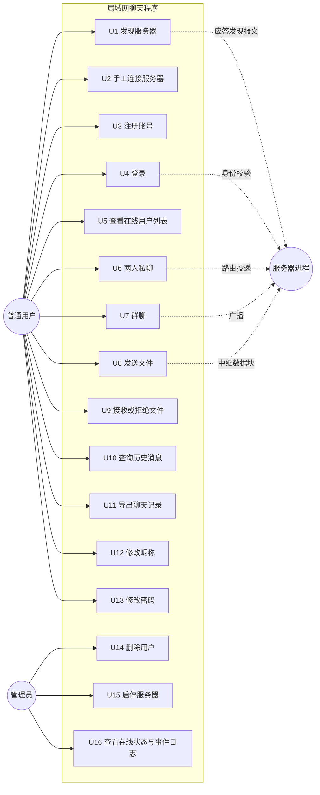

图 2-1 系统用例图

## 2.4 用例描述

以下给出四个最能体现系统核心机制的用例的详细描述，其余用例在测试用例表与用户手册中给出。

### 2.4.1 用例 U4：用户登录

| 项目 | 内容 |
| --- | --- |
| 用例编号 | U4 |
| 参与者 | 普通用户、服务器 |
| 前置条件 | 服务器已启动并监听 TCP 端口；客户端与服务器网络可达；账号已注册 |
| 后置条件 | 服务器在线表中新增该用户；客户端进入主界面；所有在线客户端收到更新后的在线用户列表 |
| 基本流程 | 1. 用户在登录界面输入服务器地址、端口、用户名与密码；2. 客户端建立 Socket 连接并完成连接超时控制；3. 客户端先构造对象输出流并 flush，再构造对象输入流；4. 客户端发送 LOGIN 类型的文本消息；5. 服务器解析消息，调用用户服务校验密码；6. 校验通过后以 putIfAbsent 语义将用户注册进在线表；7. 服务器返回 LOGIN_RESULT，内容为用户信息；8. 服务器向所有在线客户端广播新的在线用户列表；9. 客户端接收线程收到登录结果后，界面切换到主窗口 |
| 异常流程 | A1 密码错误：服务器返回失败结果与原因，客户端停留在登录界面并提示；A2 账号不存在：同 A1；A3 账号已在别处登录：服务器以先到先得原则拒绝新连接；A4 连接超时或服务器未启动：客户端在连接超时（默认 3000 毫秒）后提示失败，并允许切换为发现或手工输入 |
| 业务规则 | 用户名规则为「字母开头、由字母数字下划线组成、长度 3 至 16」；密码长度 6 至 32 位 |

### 2.4.2 用例 U6：两人私聊

| 项目 | 内容 |
| --- | --- |
| 用例编号 | U6 |
| 参与者 | 发送方、接收方、服务器 |
| 前置条件 | 双方均已登录；发送方已从在线列表选中对端 |
| 后置条件 | 接收方界面出现该消息；消息被写入服务器聊天记录 |
| 基本流程 | 1. 发送方在主窗口选中用户并打开私聊窗口；2. 输入内容并提交；3. 客户端构造 TEXT_PRIVATE 消息，receiver 为对端用户名；4. 服务器从当前连接取出已登录用户名，强制覆盖消息的 sender 字段；5. 服务器按 receiver 在在线表中查找连接并投递；6. 服务器将消息持久化到当天记录文件；7. 接收方推送消息给界面回调，界面按消息类型着色显示 |
| 异常流程 | A1 接收方不在线：服务器返回 ERROR 类型的系统消息，内容说明对端不在线；A2 消息长度超过 2000 字符：客户端输入层拦截或服务器拒绝；A3 未登录即发送：服务器返回「请先登录」并忽略该消息 |
| 业务规则 | 服务器只信任连接自身的登录身份，不信任消息体中的 sender 字段；同一消息在服务器侧只对接收方投递一次，发送方界面回显由本地直接追加 |

### 2.4.3 用例 U8：发送文件

| 项目 | 内容 |
| --- | --- |
| 用例编号 | U8 |
| 参与者 | 发送方、接收方、服务器 |
| 前置条件 | 双方均已登录且在线；文件存在、可读、大小不超过 200MB |
| 后置条件 | 接收方本地保存了内容与源文件逐字节一致的文件；双方界面均显示传输结果 |
| 基本流程 | 1. 发送方选择文件并提交；2. 客户端计算文件大小、分块总数与 SHA-256，构造 FILE_REQUEST 并附带元信息；3. 服务器解码请求元信息并转发给接收方，不落盘、不缓存文件内容；4. 接收方弹出确认，选择保存位置或使用默认接收目录；5. 接收方打开接收文件并按块写入，返回 FILE_ACCEPT；6. 发送方按 64KB 分块读取并逐块发送 FILE_CHUNK，附带块序号；7. 接收方逐块校验序号连续性并写入；8. 发送方发送 FILE_END，携带总块数与 SHA-256；9. 接收方完成写入后校验 SHA-256；10. 接收方以「当前用户指向对端」的方向构造 FILE_RESULT 回执；11. 双方界面显示成功与文件保存路径 |
| 异常流程 | A1 接收方拒绝：回执为拒绝，发送方终止发送；A2 块序号错乱：接收方抛出文件传输异常并删除残缺文件；A3 校验和不匹配：接收方抛出异常、删除残缺文件并回执失败；A4 传输中任一方取消：接收方中止写入并删除残缺文件，进度归零；A5 文件超过上限：发送方在本地即拒绝，不产生网络流量 |
| 业务规则 | 服务器只做消息中继，不缓存文件内容，避免成为磁盘与带宽瓶颈；接收端文件名必须经过清洗以防止目录穿越；同名文件自动生成「(1)」「(2)」形式的副本名，不覆盖已有文件 |

### 2.4.4 用例 U7：群聊

| 项目 | 内容 |
| --- | --- |
| 用例编号 | U7 |
| 参与者 | 发送方、全体在线用户、服务器 |
| 前置条件 | 发送方已登录 |
| 后置条件 | 所有在线用户收到群聊消息 |
| 基本流程 | 1. 用户打开群聊窗口并输入内容；2. 客户端构造 TEXT_GROUP 消息；3. 服务器覆盖 sender 字段并遍历在线表广播；4. 服务器持久化该消息；5. 各客户端按群聊规则过滤并显示 |
| 异常流程 | A1 在线用户数较多时广播失败：服务器对单个连接的写入异常做隔离处理，不影响其他连接，并将该连接判定为掉线 |
| 业务规则 | 广播范围是「服务器当前在线表」的快照；发送方自身是否收到服务器回传副本由客户端的显示策略去重 |

## 2.5 需求边界与不做范围

为避免范围蔓延，本设计明确以下内容不在实现范围内：不支持跨网段或跨公网通信（依赖局域网广播域）；不支持离线消息（离线用户的消息不会被暂存与补发，服务器对离线私聊直接返回错误提示）；不支持消息撤回、表情、图片与语音；不支持端到端加密（密码存储安全与传输身份可信是两条独立议题，本设计只处理前者）；不支持多服务器集群与用户漫游；不提供移动端界面。上述边界在第五章的测试与第六章的展望中再次对应说明。

---

# 第三章 总体设计

## 3.1 C/S 分层架构

系统采用客户端/服务器两层部署、三层代码分层的结构。部署上，一个服务器进程与多个客户端进程通过 TCP 与 UDP 通信；代码上，无论是服务器还是客户端，都遵循「界面层 / 业务与服务层 / 数据与工具层」的划分，并共享同一套公共模块。

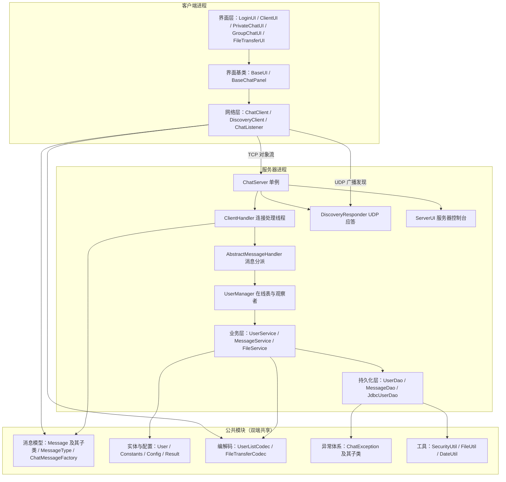

图 3-1 C/S 分层架构图

架构要点说明。第一，客户端界面层只依赖 ChatClient 这一个网络门面，界面代码中不出现任何 Socket 或流对象，界面与网络层之间通过 ChatListener 回调单向通信，因此群聊窗口与私聊窗口可以复用同一套界面基类。第二，服务器端的连接处理类只负责「读消息、校验身份、分派」，真正的业务处理放在模板方法基类的各钩子方法中，业务逻辑再委托给 service 层，service 层再依赖 dao 接口，形成单向依赖链，便于替换存储实现。第三，公共模块被双端共享，消息类型与实体定义只有一份，从根本上避免了「客户端与服务器对协议理解不一致」这一类问题。

## 3.2 模块划分

| 包 | 文件数 | 行数 | 职责 |
| --- | --- | --- | --- |
| com.chat.common | 12 | 1710 | 消息模型、消息类型枚举、消息工厂、用户实体、常量、配置、结果封装、协议文本编解码 |
| com.chat.exception | 3 | 165 | 受检业务异常基类与用户、文件两类具体异常 |
| com.chat.util | 3 | 556 | 密码散列、文件处理（大小格式化、流式 SHA-256、分块计算、重名规避、文件名清洗）、日期格式化 |
| com.chat.dao | 6 | 1516 | 泛型数据访问接口、用户与消息的文件存储实现、可选的 MySQL 用户存储实现 |
| com.chat.service | 3 | 1114 | 用户业务、消息业务、文件传输业务 |
| com.chat.server | 8 | 2230 | 服务器单例、连接处理线程、消息分派模板、在线用户管理、UDP 发现应答、服务器观察者与界面 |
| com.chat.client | 4 | 1406 | 客户端网络门面、回调接口、UDP 发现客户端、命令行入口 |
| com.chat.client.ui | 7 | 2445 | 界面基类、聊天面板基类、登录界面、主界面、私聊界面、群聊界面、文件传输界面 |
| 合计 | 46 | 11142 | 主源码（含规范中文注释） |

表 3-1 主源码模块划分与规模

模块依赖关系遵循「上层依赖下层、实现依赖接口、公共模块被所有模块依赖」的原则，不存在反向依赖与时序耦合。

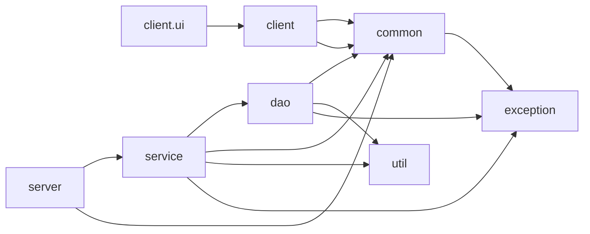

图 3-2 模块依赖关系图

## 3.3 类图设计

### 3.3.1 消息模型类图

消息采用「抽象基类 + 具体子类」的多态结构，共同继承自可序列化的 Message 基类。

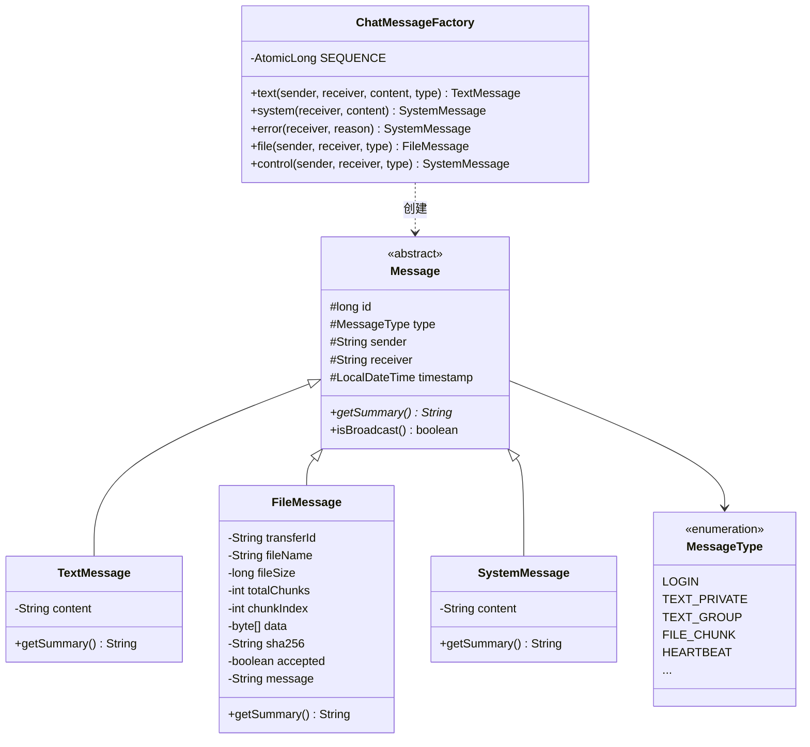

图 3-3 消息模型类图

### 3.3.2 服务器核心类图

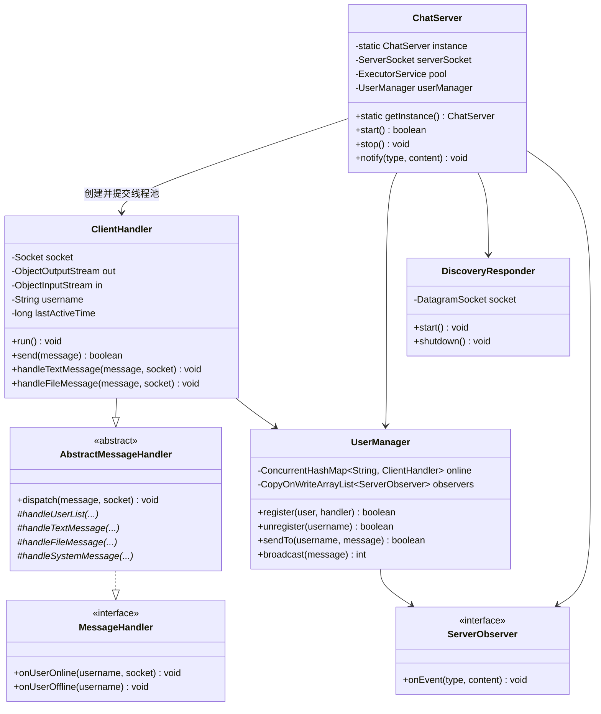

图 3-4 服务器核心类图

### 3.3.3 数据访问与业务层类图

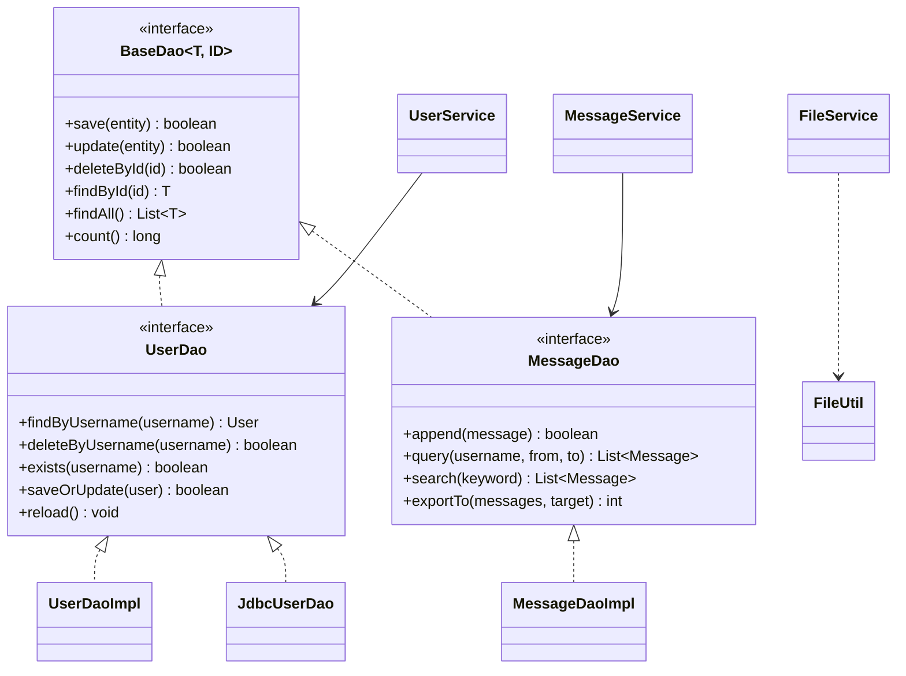

图 3-5 数据访问与业务层类图

### 3.3.4 客户端类图

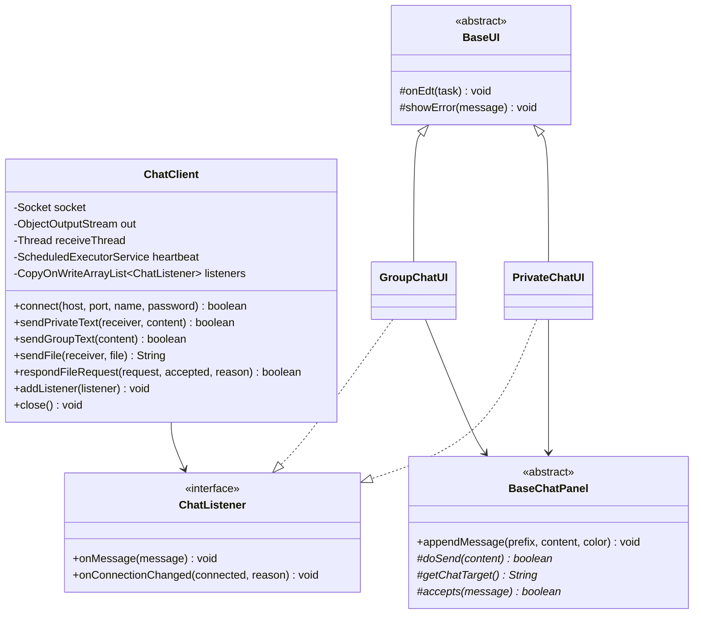

图 3-6 客户端类图

## 3.4 设计模式应用

| 设计模式 | 应用位置 | 解决的问题 |
| --- | --- | --- |
| 单例模式 | ChatServer 通过静态方法获取唯一实例 | 保证端口、线程池、在线表全局唯一，避免多实例争抢端口 |
| 工厂模式 | ChatMessageFactory 统一创建各类消息并分配全局递增编号 | 收敛对象构造细节，保证编号唯一与字段一致性 |
| 模板方法模式 | AbstractMessageHandler.dispatch 定义处理骨架，子类实现各类型钩子 | 把「身份校验、异常兜底、活跃时间刷新」等固定步骤与「按类型处理」的可变步骤分离 |
| 观察者模式 | ServerObserver 观察服务器事件；ChatListener 观察客户端消息与连接状态 | 解耦网络层与界面层，使同一网络层可同时驱动 GUI 与测试代码 |
| 多态 | Message 子类各自实现 getSummary | 日志与界面按统一方式获取摘要，无需 instanceof 分支 |
| 数据访问对象（DAO） | BaseDao / UserDao / MessageDao 接口与文件、数据库两种实现 | 业务层不感知存储介质，满足「默认文件存储、可选数据库」需求 |
| 门面模式 | ChatClient 封装连接、收发、心跳、文件传输细节 | 界面层只需调用少量语义化方法 |
| 策略与延迟初始化 | Config 的配置读取策略（系统属性优先）、ChatServer 在 start 时才创建业务服务 | 支持运行时覆盖配置，避免单例提前固化配置 |

表 3-2 设计模式应用一览

## 3.5 通信协议设计

协议基于「TCP 长连接 + Java 对象序列化」，通信双方共享同一套 Message 类，因此协议定义等价于类定义。消息类型共 24 种，覆盖注册、登录、上下线通知、私聊、群聊、用户列表、资料变更、密码修改、文件请求、同意、拒绝、数据块、结束、结果回执、历史查询与结果、心跳与应答、系统通知、错误通知。

| 交互方向 | 消息类型 | 载荷说明 |
| --- | --- | --- |
| 客户端到服务器 | LOGIN / REGISTER | 文本载荷为约定格式的用户名与密码 |
| 客户端到服务器 | TEXT_PRIVATE / TEXT_GROUP | 文本载荷为聊天内容，receiver 为对端或广播标记 |
| 客户端到服务器 | FILE_REQUEST / FILE_ACCEPT / FILE_REJECT / FILE_CHUNK / FILE_END / FILE_RESULT | FileMessage 载荷，含传输编号、文件名、大小、块序号、数据与校验和 |
| 客户端到服务器 | USER_LIST_REQUEST / HISTORY_REQUEST / PASSWORD_CHANGE / USER_UPDATE / LOGOUT / HEARTBEAT | 控制类消息 |
| 服务器到客户端 | LOGIN_RESULT / REGISTER_RESULT / USER_LIST / USER_ONLINE / USER_OFFLINE / USER_UPDATE | 结果与通知类消息 |
| 服务器到客户端 | TEXT_PRIVATE / TEXT_GROUP / FILE_* 转发 | 原样转发（sender 已被服务器覆盖） |
| 服务器到客户端 | HISTORY_RESULT / HEARTBEAT_ACK / SYSTEM / ERROR | 查询结果、心跳应答与提示 |

表 3-3 协议消息类型与方向

协议约定三条规则。第一，类型一律使用 MessageType 枚举，序列化后天然保持一致性，禁止在业务代码中出现字符串形式的类型名。第二，用户列表与文件请求元信息在两处以文本形式承载（USER_LIST 与 FILE_REQUEST），分别由 UserListCodec 与 FileTransferCodec 做编解码，采用制表符分隔并对内容做换行与分隔符转义，保证单行可解析。第三，文件数据块的传输消息形态在两端保持一致——服务器转发的是原始消息对象而非重新构造的对象，避免因类型不一致导致转换异常。

## 3.6 线程模型

服务器端与客户端各自的线程构成如下。

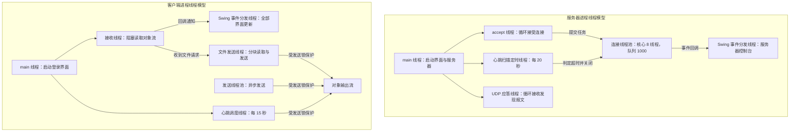

图 3-7 线程模型图

线程安全设计要点。第一，所有对同一对象输出流的写入都必须持有发送锁，因为心跳、聊天消息与文件数据块可能来自不同线程，交错写入会破坏对象流的帧结构。第二，在线用户表使用 ConcurrentHashMap，并以 putIfAbsent 语义注册，保证并发登录时同一用户名只能成功一次。第三，观察者列表使用 CopyOnWriteArrayList，使事件回调期间的遍历不会因注册或注销而抛并发修改异常。第四，所有 Swing 组件更新统一通过 EDT 调度方法投递，网络线程绝不直接操作组件。

---

# 第四章 详细设计与实现

本章按模块说明实现方式。为保持报告篇幅可控，关键代码以「真实方法签名 + 流程描述」的形式给出，完整实现请对照源码阅读（推荐阅读顺序见《04-实现说明》）。

## 4.1 公共模块（com.chat.common）

### 4.1.1 消息抽象基类与多态

Message 是全部消息的抽象基类，实现 Serializable 接口，持有 5 个公共字段：全局唯一编号 id、类型 type、发送者 sender、接收者 receiver、时间戳 timestamp（类型为 LocalDateTime）。基类声明抽象方法 getSummary()，由三个子类分别实现：TextMessage 返回内容摘要，FileMessage 返回文件名、大小与块进度摘要，SystemMessage 返回通知文本摘要。这样日志与界面在展示消息时只需调用 getSummary()，不必关心具体类型，也不需要 instanceof 分支。

基类同时提供 isBroadcast() 判断，用于识别 receiver 是否为广播标记（常量 ALL），群聊广播与服务器侧路由都依赖该判断。时间戳使用 java.time.LocalDateTime 而非 java.util.Date，避免可变对象在序列化与日志输出中的线程安全与格式化问题。

### 4.1.2 消息类型枚举

MessageType 集中定义了 24 种消息类型，每种类型绑定一段中文描述，用于日志与界面提示。枚举还提供 fromName(String) 静态方法，用于从历史记录文本或配置中反查类型；该方法对未知名称不抛异常，而是统一回退为 SYSTEM，保证读取旧版本记录时不会中断。这是「读档兼容性优先于严格校验」的一次取舍。

### 4.1.3 消息工厂与全局编号

ChatMessageFactory 提供四个静态工厂方法，关键签名如下：

```java
public static TextMessage text(String sender, String receiver, String content, MessageType type)
public static SystemMessage system(String receiver, String content)
public static SystemMessage error(String receiver, String reason)
public static FileMessage file(String sender, String receiver, MessageType type)
public static SystemMessage control(String sender, String receiver, MessageType type)
```

编号由类内 AtomicLong 静态计数器生成，保证跨线程递增且不重复。工厂内部先创建对象、再统一应用类型与编号，因此调用方即使传入非文本类型也不会因参数校验而失败——这一设计直接来自一次真实缺陷（见第五章缺陷 D2）。

### 4.1.4 用户实体与凭据脱敏

User 实体采用私有字段加 getter/setter 的封装形式，字段包括用户名、昵称、密码散列、盐、角色、创建时间、最近登录时间与在线标志。两个方法与安全直接相关：clearCredential() 清空密码散列与盐，用于向客户端投递用户对象之前脱敏；getDisplayName() 在昵称为空时回退为用户名，避免界面出现空白项。equals 与 hashCode 以用户名为基准，保证集合去重语义正确。

### 4.1.5 常量与配置

Constants 集中定义了全部常量，包括网络参数（默认端口 9527、发现端口 30000、连接超时 3000 毫秒、读超时 60000 毫秒）、心跳参数（15 秒间隔、60 秒超时、20 秒扫描）、并发参数（连接上限 200、池核心 8、队列 1000）、文件参数（64KB 分块、200MB 上限）、路径参数、账号规则（用户名正则、密码长度 6 至 32、昵称上限 20、单条消息上限 2000 字符）与格式参数。业务代码中不出现魔法值。

Config 负责加载 config/chat.properties，遵循「系统属性覆盖配置文件、配置文件覆盖内置默认值」的优先级。类提供类型化读取方法 get/getInt/getLong/getBoolean，以及 dataDir/userFile/historyDir/exportDir/receivedDir/serverPort/discoveryPort 等语义化路径方法。该类的加载时机经过修正：早期版本在静态字段初始化阶段读取路径，导致其他组件在配置生效前就固化了目录，现改为显式触发加载与幂等的 isLoaded() 判断。

### 4.1.6 协议文本编解码

UserListCodec 负责在线用户列表的编码与解码：把用户集合编码为一行文本，字段之间用制表符分隔，用户之间用换行外的分隔标记连接，并对可能出现的分隔符做转义；解码时逐条还原并忽略非法行。FileTransferCodec 负责文件请求元信息的编解码，关键签名为：

```java
public static String encode(FileMessage request)
public static FileMessage decode(String text, String sender, String receiver)
```

引入这两个编解码器的直接原因是：文件请求需要以文本消息承载元信息（因为服务器必须先校验再转发），而服务器不能对文本消息直接做类型强转。

## 4.2 持久化层（com.chat.dao）

### 4.2.1 泛型接口抽象

BaseDao<T, ID> 定义 save、update、deleteById、findById、findAll、count 等通用方法；UserDao 与 MessageDao 在其基础上扩展领域方法，例如 UserDao 增加 findByUsername、deleteByUsername、exists、saveOrUpdate、reload，MessageDao 增加 append、query、search、exportTo。业务层只依赖接口，因此把存储从文件切换为数据库不需要修改任何业务代码。

### 4.2.2 用户文件存储实现

UserDaoImpl 以文本文件存储用户，采用「内存缓存 + 写时全量落盘」的方式：启动或显式 reload 时把文件内容解析进以用户名为键的映射，查询全部走内存；写操作在写锁保护下先修改内存，再调用 flush 把全量数据写入。关键实现点是 flush 使用临时文件加原子替换：

```java
private void flush() throws ChatException
```

该方法先在目标文件同目录创建临时文件并写入全部记录，随后通过 Files.move 配合 ATOMIC_MOVE 选项原子替换目标文件。原子替换保证了「写到一半进程崩溃」时磁盘上要么是旧版本完整数据、要么是新版本完整数据，不会出现半截文件。记录格式为制表符分隔的单行文本，密码散列与盐以「盐 + 分隔符 + 散列」的凭据串整体存储，读取时由 SecurityUtil 拆分。

### 4.2.3 消息文件存储实现

MessageDaoImpl 采用「按天分文件」策略：每条消息写入以日期命名的记录文件（如 2026-09-19.log），文件内部每行一条记录，字段包括编号、类型、发送者、接收者、时间与内容。该策略带来两个收益：时间范围查询只需枚举命中日期对应的文件，无需扫描全部历史；单文件体积受单日消息量约束，便于用文本工具直接查看与人工排查。append 方法以写锁串行化；query 先按日期筛选文件再逐行匹配用户与时间区间；search 做关键字检索；exportTo 把结果集写成可读的导出文本。

### 4.2.4 可选的数据库实现

JdbcUserDao 实现了同一套 UserDao 接口，使用 JDBC 与 PreparedStatement 完成增删改查，所有 SQL 参数均通过占位符绑定，杜绝字符串拼接注入；表结构不存在时自动建表，并在初始化失败时把自身标记为不可用。该实现默认关闭，必须在配置文件中显式设置 db.enabled=true 才允许启用——这是对一次严重缺陷的修正（见第五章缺陷 D1）。静态工厂方法 fromConfig() 与 open(...) 负责构造与探测可用性。

## 4.3 业务层（com.chat.service）

### 4.3.1 用户服务

UserService 提供注册、登录、改昵称、改密码、删除用户与查询能力，所有返回值统一为泛型 Result<T>，把「成功与否、提示文本、数据」三者封装在一起，避免用异常表达业务上的正常失败。关键实现点如下。注册流程先做用户名与密码的格式校验，再检查用户名是否已存在，随后调用 SecurityUtil.encode 生成凭据并保存。登录流程先按用户名取出用户，再用 SecurityUtil.verifyPassword 做常量时间比较；成功后更新最近登录时间。删除用户引入操作者与目标两个参数，只有 ADMIN 角色可以执行，普通用户请求被拒绝。所有对外返回的用户对象都经过脱敏副本处理（copyForTransfer），保证密码散列与盐不离开服务器。

### 4.3.2 消息服务

MessageService 封装消息持久化、历史查询与导出。保存方法对空对象与空内容做防御性判断，返回失败结果而不是抛异常；查询方法支持「按日期」与「按时间戳区间」两种入口，并在起止时间倒置时返回失败提示；导出方法在结果集为空时明确返回失败，避免生成无意义的空文件。

### 4.3.3 文件服务

FileService 是文件传输的核心，负责发送侧分块读取与接收侧分块写入，关键签名如下：

```java
public FileMessage prepareSend(String sender, String receiver, File file) throws FileTransferException
public FileMessage createEndMessage(String sender, String receiver, FileMessage request)
public void closeSend(String transferId)
public String openReceive(String receiverDir, FileMessage request) throws FileTransferException
public long appendChunk(FileMessage chunk) throws FileTransferException
public File finishReceive(FileMessage end) throws FileTransferException
public void cancelReceive(String transferId)
public double progressOf(String transferId)
```

发送侧为每个进行中的传输维护一个 SendingFile 内部对象，内部持有 RandomAccessFile，按块序号定位偏移量后读取定长字节，因此不需要把整个文件载入内存；接收侧维护 ReceivingFile 内部对象，按块序号严格校验连续性——若收到乱序或重复的块，立即抛出业务异常。finishReceive 在写入完成后流式计算接收文件的 SHA-256，与发送方在 FILE_END 中携带的校验和比对；无论校验失败还是 IOException，都会统一清理残缺文件。cancelReceive 关闭输出流、删除残缺文件并把进度归零。单文件上限 200MB 在 prepareSend 中校验，超限时在本地即拒绝，不产生网络流量。

## 4.4 服务器端（com.chat.server）

### 4.4.1 服务器单例与启动流程

ChatServer 是单例，start() 方法按顺序完成：读取端口配置、创建 ServerSocket 绑定端口、创建固定线程池与命名线程工厂、启动 UDP 发现应答器、启动心跳扫描任务。若启动过程中任一步失败，rollback() 会关闭已创建的资源并停止线程，避免留下半启动状态。方法级同步（synchronized start/stop）保证重复点击启动或并发调用的幂等性。业务服务（用户服务、消息服务）的创建被延迟到 start() 阶段，以修复「单例提前初始化固化数据目录配置」的缺陷（见第五章缺陷 D6）。

### 4.4.2 连接处理线程

ClientHandler 继承 AbstractMessageHandler，实现 Runnable，每个连接对应一个线程。run 方法流程为：初始化对象流、进入读取循环、逐条分派消息、异常时退出循环并回收资源。关键实现细节有三点。

第一，对象流的构造顺序。ObjectInputStream 在构造时会阻塞读取对端写入的流头部，如果两端都先构造输入流就会互相等待形成死锁。因此 initStreams 严格遵循「先构造 ObjectOutputStream 并立即 flush，再构造 ObjectInputStream」的顺序，并显式禁用输出流的缓冲区复用对端引用问题（reset 见下）。

第二，对象流的重置。ObjectOutputStream 会缓存已发送对象以复用引用，长时间运行会导致服务器内存持续增长。因此每次 writeObject 之后立即 flush 并调用 reset()，牺牲少量带宽换取内存稳定。所有写入都在 sendLock 同步块中完成。

第三，身份可信。handleTextMessage 在处理任何业务之前，先从连接自身取出已登录用户名并强制覆盖消息的 sender 字段，然后才进入分派逻辑；同时刷新连接的最近活跃时间。未登录连接除注册与登录外的消息一律被拒绝并收到提示。

### 4.4.3 消息分派模板

AbstractMessageHandler 实现模板方法模式，dispatch 方法负责固定步骤：参数校验、调用子类按类型分派的钩子、捕获业务异常并转换为错误消息回执、刷新活跃时间。子类需要实现的钩子包括 handleUserList、handleTextMessage、handleFileMessage、handleSystemMessage，以及 onUserOnline、onUserOffline。ClientHandler 只覆写与服务器语义相关的处理，使「连接管理」与「业务处理」职责分离。

### 4.4.4 在线用户管理与观察者

UserManager 使用 ConcurrentHashMap 维护用户名到连接处理器的映射，使用 CopyOnWriteArrayList 维护观察者列表。register 方法以「先检查、再以 putIfAbsent 语义写入」的方式保证同一用户名并发登录时只有一个成功，其余被拒绝；unregister 移除映射并通知观察者；sendTo 在目标不在线时返回 false，由上层转换为错误提示；broadcast 遍历在线表逐个发送，对单个连接的写入异常做隔离，不影响其他连接；broadcastUserList 生成在线用户列表快照并广播。notifyObservers 用于把服务器事件推送给界面（服务器控制台）与其他观察者。

### 4.4.5 心跳扫描与掉线判定

服务器每 20 秒执行一次扫描（由 ScheduledExecutorService 驱动），遍历连接表并把「当前时间与最近活跃时间之差超过 60 秒」的连接判定为超时，主动关闭并从在线表移除。由于心跳包与任何业务消息都会刷新活跃时间，因此正常用户不受影响。定时任务通过命名线程工厂创建，便于在日志与线程转储中识别。

### 4.4.6 UDP 发现应答

DiscoveryResponder 在指定端口（默认 30000）上创建 DatagramSocket 并循环接收广播报文。收到约定格式的探测报文后，构造包含本机 IP、TCP 端口与当前在线人数的应答报文回送给请求方。应答内容由 buildAnnouncement 生成，解析逻辑由静态方法 parseAnnouncement 提供，双方共用同一格式。服务器停止时 shutdown 关闭套接字并使循环退出。

### 4.4.7 服务器控制台

ServerUI 是基于 Swing 的服务器控制台，实现 ServerObserver 接口，展示服务器地址与端口、启动与停止按钮、在线用户表格与实时事件日志。事件通过观察者回调进入界面，界面刷新通过定时器周期性拉取在线用户表。该界面把「事件驱动」与「周期快照」两种更新方式结合，避免在高频事件下频繁重建表格。

## 4.5 客户端网络层（com.chat.client）

### 4.5.1 客户端门面

ChatClient 是客户端网络层的门面，对界面层暴露语义化方法，关键签名包括 connect、sendPrivateText、sendGroupText、sendFile、respondFileRequest、requestUserList、requestHistory、addListener、close。内部结构为：一个 Socket 与其对象流、一个接收线程、一个发送线程池、一个心跳调度器，以及一个观察者列表（ChatListener）。

### 4.5.2 接收循环与回调

接收线程在 receiveLoop 中阻塞读取对象流，每读到一条消息就交给 handleIncoming 处理。处理策略分三类：连接状态与登录结果类消息触发连接回调；用户列表与历史结果类消息分发给对应界面逻辑；文件传输类消息路由到文件传输界面与文件服务。所有回调都通过 notifyMessage 遍历监听器触发，监听器实现类负责把更新调度到 Swing 事件分发线程。连接断开时 receiveLoop 退出并触发「已断开」回调，界面据此提示用户并恢复到可重连状态。

### 4.5.3 心跳与发送安全

心跳调度器每 15 秒发送一次 HEARTBEAT；发送线程池负责异步发送，避免界面在等待网络写入时卡顿。所有写入共享同一把发送锁（在 writeObject 中同步），保证心跳、聊天消息与文件块不会交错写入同一对象流。sendSync 用于需要同步确认的少量场景（如登录），内部同样走加锁写入。

### 4.5.4 文件发送线程

发送文件时，客户端在独立线程中按块读取并发送：先发送 FILE_REQUEST 并等待接收方回应，收到 FILE_ACCEPT 后进入分块循环，每块构造 FILE_CHUNK 并顺带更新一次进度回调，全部发送完成后发送 FILE_END。若中途收到拒绝、取消或失败回执，终止循环并关闭发送侧资源。接收方向收到 FILE_REQUEST 后交给界面确认，收到 FILE_CHUNK 后调用文件服务写盘并回报进度，收到 FILE_END 后触发校验与回执。

### 4.5.5 命令行入口

ChatClientApp 提供三种启动方式：默认启动图形客户端；携带 --local-server 参数时先启动本机服务器再打开客户端，便于单人演示；携带 --help 参数输出用法说明。入口同时配置 java.util.logging 的格式与级别。

## 4.6 客户端图形界面（com.chat.client.ui）

### 4.6.1 界面基类

BaseUI 是所有 JFrame 的抽象基类，统一完成外观（LookAndFeel）与字体初始化、窗口居中、状态标签构造、提示框封装（showInfo/showError/confirm）、以及两个关键的线程调度方法 onEdt(Runnable) 与 runOnEdtAndWait(Runnable)。所有子类界面在更新组件时只能使用这两个方法，从机制上保证「网络线程不直接触碰组件」。

### 4.6.2 聊天面板基类与界面复用

BaseChatPanel 是私聊与群聊共用的聊天面板抽象基类，内部使用 JTextPane 实现富文本着色（不同消息类型使用不同颜色），包含历史显示区与输入发送区，提供 appendLine、appendMessage、clearHistory 等方法。子类只需实现三个方法：doSend(String content) 决定如何发送、getChatTarget() 返回会话对端、accepts(Message message) 决定该消息是否属于本窗口。PrivateChatUI 由此把过滤条件设为「消息类型为私聊且对端匹配」，GroupChatUI 则设为「消息类型为群聊」。这一设计把两个窗口的重复代码压缩到约 150 行级别。

### 4.6.3 登录界面

LoginUI 提供服务器地址、端口、用户名、密码输入与登录、注册、发现服务器、修改密码四类操作。耗时操作（连接、发现、注册）通过 SwingWorker 放到后台线程执行，完成后在 done 回调中更新界面，避免登录过程阻塞 EDT 造成界面假死。发现按钮触发 DiscoveryClient 的一次性发现并把结果填充到服务器地址输入框。

### 4.6.4 主界面

ClientUI 是登录后的主窗口，左侧为在线用户表格（用户名、昵称、状态），右侧为功能按钮区（与选中用户私聊、发送文件、查询历史、导出记录、修改昵称、修改密码、删除用户），底部为状态栏。表格模型限制单元格不可编辑。双击用户行可直接打开私聊窗口。主界面同时实现 ChatListener，负责把用户列表刷新、私聊消息、文件相关消息分派给对应子窗口；子窗口采用「按用户名索引复用」的策略，重复打开同一会话不会产生多个窗口。

### 4.6.5 文件传输界面

FileTransferUI 展示发送与接收两侧的进度：文件选择按钮、进度条、传输日志与取消操作。界面提供按对端获取窗口的静态工厂方法，并维护传输编号到窗口的映射，使服务器回执能够定位到正确的窗口；同时提供活动窗口计数等静态查询方法，便于测试断言与资源清理。接收请求到达时界面弹出确认对话框，用户可选择接收位置或拒绝。

## 4.7 局域网自动发现

发现机制由客户端 DiscoveryClient 与服务器 DiscoveryResponder 配对实现。

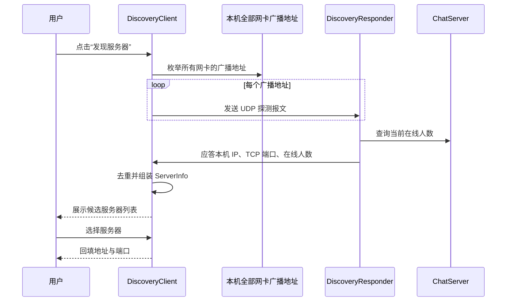

图 4-1 局域网自动发现时序图

实现要点有三。第一，广播地址不是简单地使用 255.255.255.255，而是通过 NetworkInterface 枚举本机全部网卡（含回环与虚拟网卡）的接口地址，按子网掩码计算出各自的广播地址后逐个发送，从而兼容多网卡与虚拟网卡环境。第二，发现流程设置了总体超时（默认由调用方传入），在超时窗口内持续收集应答并按「IP + 端口」去重，避免同一服务器因多网卡应答多次而被重复列出。第三，发现失败时提供降级路径：用户可手工输入 IP 与端口，且回环地址（127.0.0.1 等）被显式识别，便于单机自测。

## 4.8 文件传输设计要点

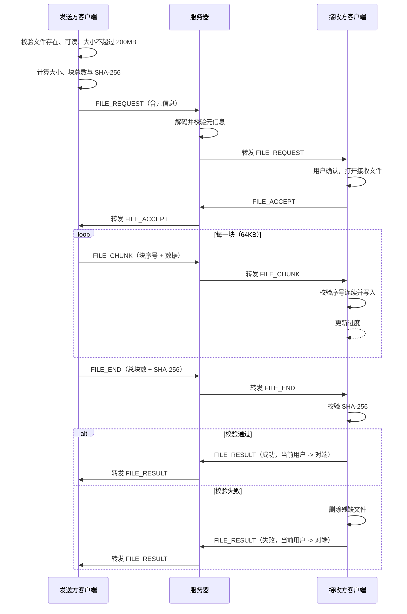

图 4-2 文件传输时序图

文件中继策略是本节的设计核心：服务器只转发消息对象，不缓存文件内容、不落盘，因此服务器的内存占用与磁盘占用与文件大小无关，瓶颈被限制在网络带宽上。这一取舍的代价是传输过程依赖发送方持续在线，无法实现断点续传（列为本设计的不足与改进方向）。

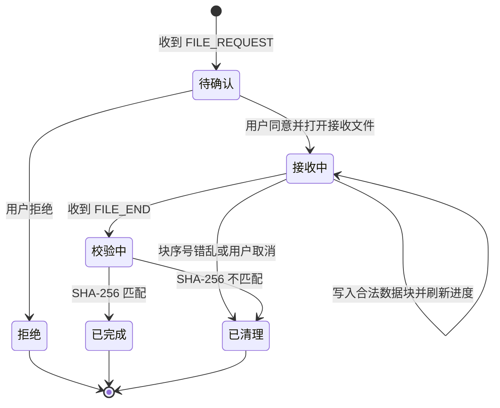

图 4-3 文件接收状态流转图

## 4.9 异常体系

异常体系自顶向下为：ChatException 作为受检业务异常基类，携带 errorCode 字段便于区分错误类别；UserNotFoundException 表示用户不存在；FileTransferException 附带 transferId，便于把异常定位到具体传输任务。设计原则是「业务可预期的失败用 Result 表达，需要中断当前操作并向上传播的失败用受检异常表达」。例如注册时用户名重复属于正常业务分支，返回失败 Result；而文件校验和不匹配属于必须中断并清理资源的异常，抛出 FileTransferException。服务器端在分派模板中统一捕获业务异常并转换为 ERROR 消息回执，网络与 IO 异常则记录日志并触发连接回收。

## 4.10 日志体系

日志使用 java.util.logging，统一日志名为 com.chat，在程序入口处通过系统属性配置输出格式为「日期 时间 [级别] 类名 - 消息」。日志输出遵循三条约定：只记录关键事件（服务器启动与停止、客户端连接与断开、登录成功与失败、文件传输开始与结束、异常堆栈）；不记录密码、密码散列、盐等敏感内容；异常日志保留堆栈以便定位，业务日志使用中文描述便于直接阅读。服务器控制台的事件日志与文件日志来源一致，都通过观察者与 Logger 两个通道输出。

---

# 第五章 测试与结果分析

## 5.1 测试环境

| 项目 | 内容 |
| --- | --- |
| 操作系统 | Linux 桌面环境（开发机），程序本身与操作系统无关 |
| JDK | JDK 21（编译与运行），源码兼容级别为 JDK 17 |
| 构建方式 | javac 直接编译，主源码输出到 build/classes，测试代码输出到 build/test-classes |
| 依赖 | 无第三方依赖；数据库实现所需的 MySQL 驱动仅在显式启用数据库时按需加入 classpath |
| 网络环境 | 本机回环地址与局域网网卡，集成测试使用操作系统动态分配的空闲端口（ServerSocket(0)） |
| 测试数据 | 临时目录，测试结束后清理；不触碰 data/ 下的正式数据 |

## 5.2 测试策略与框架

测试遵循「不引入第三方库」的项目约束，自研了一个极简测试框架：Test 是自定义注解（值为用例说明），TestRunner 通过反射扫描测试类的公共无参实例方法、按注解说明输出结果，并统计通过与失败数量，失败时以非零退出码结束，便于脚本判定。框架还提供断言方法（assertEquals、assertNotEquals、assertArrayEquals、assertNotNull 等）与临时目录辅助方法。

测试分为两层。单元测试针对单个类或单个服务，使用临时目录构造隔离的数据环境，不依赖网络；集成测试真实启动 ChatServer 与多个 ChatClient，使用真实 TCP 与 UDP 通信，不使用任何 mock。分层的好处是：单元测试定位精确、执行快；集成测试验证真实协议与并发时序，能够发现只在真实交互下才暴露的缺陷。

## 5.3 单元测试

单元测试共 47 个用例，分布于 5 个测试类。

| 测试类 | 行数 | 用例数 | 覆盖内容 |
| --- | --- | --- | --- |
| SecurityUtilTest | 104 | 7 | 盐值生成长度与随机性、相同密码不同盐散列不同、相同密码相同盐散列一致、密码校验正确与错误分支、空密码与空凭据边界、凭据编码与盐散列解析、字节数组 SHA-256 可复现与长度正确 |
| UserDaoTest | 198 | 7 | 新增后可查询且字段完整、重复用户名新增失败、更新昵称生效、删除生效且删除不存在用户抛 UserNotFoundException、落盘后可被新实例重新加载、saveOrUpdate 兼具新增与更新、保存空对象抛 ChatException |
| UserServiceTest | 247 | 9 | 注册成功且返回对象不含密码散列、用户名与密码格式非法被拒、重复用户名注册失败、登录成功并刷新最近登录时间、存储中的密码为加盐散列而非明文、修改昵称生效、修改密码需校验原密码且新密码可登录、普通用户无权删除而管理员可删除、列表查询返回脱敏对象 |
| MessageServiceTest | 311 | 12 | 工厂创建各类型消息与摘要多态、编号全局递增不重复、保存后可按用户查询、日期范围过滤与起止时间倒置报错、关键字检索与空关键字校验、导出生成可读文本、无记录时导出返回失败、用户列表编解码往返一致、文件消息记录回读保留元信息、按编号删除后不可查询、历史记录按天生成独立文件、保存空消息返回失败且不抛异常 |
| FileServiceTest | 389 | 12 | 文件不存在时抛 FileTransferException、分块数量计算覆盖空文件与整块边界、小文件分块传输后内容与校验和一致、1MB 随机文件多块传输逐字节一致、空文件可完成传输、块序号错乱时抛异常并清理残缺文件、SHA-256 不匹配时抛异常并删除文件、重名文件自动生成副本、文件名清洗阻止目录穿越、大小格式化单位正确、文件 SHA-256 与字节数组结果一致、取消接收后进度归零且文件被清理 |
| 合计 | 1249 | 47 | 覆盖密码安全、用户持久化、用户业务、消息持久化与查询、文件传输与工具方法五类 |

表 5-1 单元测试用例分布

单元测试中有三类断言值得特别说明。第一类是「负向断言」，例如注册成功后检查返回对象中密码散列与盐必须为空，验证脱敏逻辑确实生效。第二类是「持久化断言」，例如用户写入后重新构造 DAO 实例再读取，验证数据确实落盘而不是仅存在于内存缓存。第三类是「清理断言」，例如校验和不匹配后检查目标文件不存在，验证残缺文件确实被删除。

## 5.4 集成测试

集成测试共 7 个用例，真实启动服务器与多个客户端，使用动态端口避免与本机已运行的服务冲突。测试过程中通过 ChatListener 收集消息，并以「条件等待」的方式断言（避免固定 sleep 造成不稳定）。

| 编号 | 用例名称 | 验证内容 |
| --- | --- | --- |
| 1 | 服务器启动与客户端登录 | 服务器绑定端口并接受连接；客户端登录成功并返回用户信息；错误密码登录失败 |
| 2 | 在线用户列表实时刷新 | 第二个客户端登录后，第一个客户端收到包含两名用户的列表快照 |
| 3 | 私聊消息端到端可达 | 发送方发送私聊文本，接收方在超时窗口内收到且内容一致 |
| 4 | 群聊消息广播到全部客户端 | 一个客户端发送群聊消息，其余在线客户端均收到 |
| 5 | 文件端到端传输并校验 | 发送方经服务器中继把文件传给接收方，接收方文件与源文件逐字节一致且 SHA-256 匹配 |
| 6 | 用户下线后列表刷新 | 客户端断开后，其余客户端收到更新后的列表 |
| 7 | 异常场景 | 服务器未启动时连接失败而不抛异常；密码错误登录失败；向不在线用户发私聊收到错误提示；超过 200MB 的文件在本地被拒绝 |
| 合计 | 7 个用例 | 覆盖登录、列表刷新、私聊、群聊、文件传输、下线刷新与异常路径 |

表 5-2 集成测试用例表

执行结果为：47 个单元测试用例全部通过，7 个集成测试用例全部通过。

## 5.5 需求覆盖矩阵

| 需求编号 | 需求名称 | 主要实现类 | 验证方式 |
| --- | --- | --- | --- |
| F1 | 服务器启动与停止 | ChatServer.start / stop / rollback | 集成测试 1、7；服务器控制台手工验证 |
| F2 | 局域网自动发现 | DiscoveryClient、DiscoveryResponder | 手工双机验证；发现报文格式由静态解析方法自检 |
| F3 | 手工连接降级 | LoginUI 服务器地址输入 | 集成测试 7 场景 A；手工验证 |
| F4 | 用户注册 | UserService.register | UserServiceTest 注册相关 3 个用例；集成测试可用注册流程 |
| F5 | 用户登录 | UserService.login、ClientHandler.handleLogin | UserServiceTest 登录用例；集成测试 1、7 场景 B |
| F6 | 在线用户列表 | UserManager.broadcastUserList、ClientUI | 集成测试 2、6 |
| F7 | 两人私聊 | ClientHandler.handleTextMessage、PrivateChatUI | 集成测试 3 |
| F8 | 多人群聊 | UserManager.broadcast、GroupChatUI | 集成测试 4 |
| F9 | 发送者不可伪造 | ClientHandler 覆盖 sender 字段 | 代码审查与集成测试 3（接收方看到的发送者为真实登录名） |
| F10 | 文件传输 | FileService、FileTransferUI、ClientHandler 中继 | FileServiceTest 12 个用例；集成测试 5 |
| F11 | 拒绝与取消 | respondFileRequest、cancelReceive | FileServiceTest 取消用例；手工界面验证 |
| F12 | 历史消息查询 | MessageService.queryHistory、MessageDaoImpl.query | MessageServiceTest 查询用例 |
| F13 | 历史记录导出 | MessageService.exportHistory、MessageDaoImpl.exportTo | MessageServiceTest 导出用例 |
| F14 | 昵称修改 | UserService.updateNickname、ClientHandler.handleUserUpdate | UserServiceTest 昵称用例 |
| F15 | 密码修改 | UserService.updatePassword | UserServiceTest 密码用例 |
| F16 | 管理员删除用户 | UserService.deleteUser | UserServiceTest 权限用例 |
| F17 | 服务器控制台 | ServerUI、ServerObserver | 手工验证 |
| N2 | 原子写入与残缺文件清理 | UserDaoImpl.flush、FileService.finishReceive | UserDaoTest 持久化用例；FileServiceTest 校验失败与取消用例 |
| N3 | 密码安全与防注入 | SecurityUtil、JdbcUserDao | SecurityUtilTest 全部用例；UserServiceTest 明文检测用例 |

表 5-3 需求覆盖矩阵

## 5.6 缺陷记录与修复

开发过程中真实发现并修复了 7 个缺陷，其中 4 个属于「静默错误」（不抛异常但行为错误），这类缺陷最能说明测试与日志的价值。

| 编号 | 现象 | 根因分析 | 修复方式 | 回归验证 |
| --- | --- | --- | --- | --- |
| D1 | 用户数据被静默写入 MySQL，而预期写入 data 目录，教师机与开发机行为不一致 | 初期实现只要 classpath 上存在 MySQL 驱动就自动切换到数据库存储，而开发机恰好运行着 MySQL，导致存储介质被环境隐式决定 | 改为必须显式配置 db.enabled=true 才允许启用数据库实现，默认强制文件存储 | 移除驱动或保持默认配置时，UserDaoTest 持久化用例验证数据落在文件；配置说明中明确开启步骤 |
| D2 | 客户端登录后服务器连接线程异常退出，用户列表无法推送 | 构造用户列表消息时，用 USER_LIST 类型调用了只接受文本类型的工厂方法，工厂内部类型校验抛出 IllegalArgumentException，异常逃出读取循环导致线程终止 | 修改工厂的创建路径，先创建消息对象再覆写类型，使控制类消息也能复用统一编号与字段初始化 | 集成测试 2 验证列表刷新；新增 USER_LIST 相关断言 |
| D3 | 文件传输请求在服务器侧抛出 ClassCastException，传输无法发起 | 客户端用文本消息承载文件请求元信息（因为需要先被服务器校验），服务器却直接把该消息强转为 FileMessage | 服务器先通过 FileTransferCodec 解码并校验元信息，再转发原始消息对象，保证两端消息形态一致 | 集成测试 5 验证完整传输；FileTransferCodec 往返用例 |
| D4 | 发送方永远收不到文件传输完成通知 | 接收方构造 FILE_RESULT 时直接借用源消息的 sender 与 receiver，而源消息在两端语义方向相反，导致回执被投递回接收方自己 | 显式以「当前用户到对端」的方向构造回执，不再复用源消息方向字段 | 集成测试 5 断言发送方收到成功回执 |
| D5 | 校验失败后本地残留一个内容损坏但扩展名正常的文件 | finishReceive 只捕获 IOException，SHA-256 校验失败抛出的是业务异常，绕过了删除逻辑 | 在 finishReceive 中统一捕获 IO 异常与业务异常并执行清理，再向上抛出 | FileServiceTest 校验和不匹配用例断言文件已被删除 |
| D6 | 数据目录配置不生效，程序始终使用默认目录 | ChatServer 在字段初始化阶段就创建了业务服务，此时配置尚未被读取，数据目录被提前固化 | 把业务服务的创建延迟到 start() 阶段，并保证配置在使用前完成加载 | 修改配置文件后重启验证目录生效；UserDaoTest 使用显式路径构造 |
| D7 | 集成测试偶发失败，报「未收到上线通知」 | 服务器推送的上线通知可能早于测试注册监听器，属于典型竞态 | 连接建立时即注册缓冲监听器，先缓存全部到达的消息，断言时再从缓冲区中按条件查找 | 集成测试连续多次执行结果稳定 |

表 5-4 缺陷记录与修复表

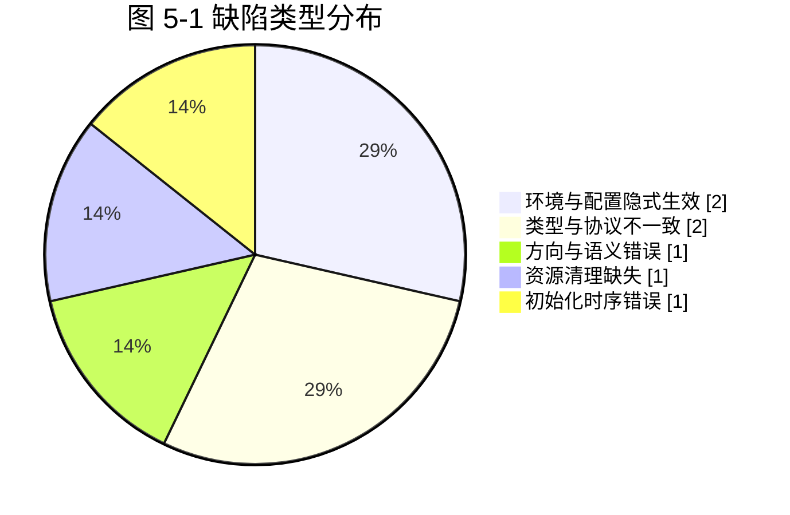

图 5-1 缺陷类型分布图

从缺陷分布可以得到两条工程结论。第一，凡是「由环境隐式决定行为」的设计（D1）都应当改造为显式配置，因为隐式行为在开发机上可能恰好正确，却在他人机器上错误。第二，「静默错误」占比高达一半以上（D1、D4、D5、D6），它们不抛异常、不崩溃，只表现为业务结果不符合预期，因此必须依靠针对业务语义的断言（回执方向、文件是否存在、目录是否正确）而不能只依靠「程序是否报错」来判断测试是否有效。

## 5.7 性能分析

本设计未进行专门的压测，因此本节给出结构性的复杂度与资源边界分析，并说明可复现的测量方法，避免给出无依据的实测数字。

| 维度 | 设计取值或复杂度 | 分析 |
| --- | --- | --- |
| 连接承载 | 单机上限 200 连接，连接池核心 8 线程 | 连接处理为 IO 密集型，线程大部分时间阻塞在读取上，8 个核心线程配合容量 1000 的任务队列足以支撑教学规模的并发 |
| 登录与鉴权 | 用户查询 O(1)（内存映射），密码校验一次 SHA-256 散列 | 抹盐散列的计算成本是刻意的安全权衡；单次登录耗时可忽略 |
| 私聊投递 | 在线表查找 O(1)，单次写操作 | 端到端延迟主要由网络往返与界面刷新决定 |
| 群聊广播 | O(n)，n 为在线人数 | 广播逐个发送并对单连接异常做隔离，n 为教学规模时无压力 |
| 消息持久化 | 追加写 O(1)；按用户查询 O(m)，m 为该用户相关的记录数；按日期范围查询只读取命中日期的文件 | 按天分文件把「时间范围查询」从全量扫描降为按文件筛选 |
| 文件传输 | 发送侧按块随机读取 O(块数)；接收侧顺序写 O(块数)；校验一次流式 SHA-256 O(文件大小) | 内存占用与文件大小无关（单块 64KB）；服务器零存储开销；时间开销的主要构成是一次完整的 SHA-256 计算与网络传输 |
| 内存稳定性 | 每次写对象后调用 reset 释放对象流缓存 | 长时间运行不会因对象流引用缓存而持续增长 |
| 空闲资源回收 | 60 秒超时判定，20 秒扫描周期 | 最坏情况下掉线连接的资源会在 60 至 80 秒内被回收 |

表 5-5 结构性性能分析

可复现的验证方法：单机启动服务器与两个客户端传输一个 100MB 文件，观察服务器进程的内存占用是否保持平稳（验证不缓存文件内容）与传输用时，并结合日志中的块进度计算有效吞吐；同时使用 jcmd 或 jconsole 观察线程数与堆内存曲线，确认对象流未持续增长。上述方法已写入测试报告的执行建议中，但未作为本设计的必测项。

---

# 第六章 总结与展望

## 6.1 完成的工作

本课程设计完成了一个功能完整、可运行的局域网聊天程序，具体成果包括：

1. 需求与设计文档：完成需求分析、系统设计、数据库设计与实现说明四份设计文档，含用例图、架构图、类图、时序图与状态图等 Mermaid 图形。
2. 主源码：46 个 Java 文件、11142 行（含规范中文注释），按八个包分层组织，覆盖公共模型、持久化、业务、服务器、客户端网络与 Swing 界面。
3. 核心功能：局域网自动发现、注册与登录、在线列表实时刷新、私聊、群聊、文件分块传输与完整性校验、历史查询与导出、昵称与密码修改、管理员删除用户、服务器控制台，共 17 项功能需求全部落地。
4. 测试代码：8 个文件、2130 行，其中 47 个单元测试用例与 7 个集成测试用例全部通过，集成测试真实启动服务器与多个客户端。
5. 交付配套：配置文件 config/chat.properties、数据库脚本 sql/schema.sql、构建与启动脚本 scripts/、README、测试报告与测试用例表、用户手册、课程设计报告与答辩 PPT 大纲。
6. 工程细节：常量化、配置外部化、密码加盐散列、身份防伪造、文件完整性校验与残缺文件清理、原子写入、EDT 线程安全、异常与日志体系，以及 7 个真实缺陷的定位与修复记录。

## 6.2 技术收获

第一，理解了「协议即约定」的本质。使用对象序列化时，协议的权威定义就是共享的类与枚举，这让我第一次直观看到「双端共用同一份模型代码」如何消除一整类不一致问题，也理解了为什么工业界协议通常需要独立的版本协商与向后兼容设计。

第二，理解了并发不是「加个 synchronized 就完了」。真实项目中需要区分三种不同的共享资源：需要串行化的输出流、需要并发安全但可并行的在线表、需要遍历稳定的观察者列表，它们各自适合不同的并发工具与同步粒度。

第三，理解了「静默错误」比「异常崩溃」更难处理。本设计中被修复的缺陷有一半以上不会报错，只是结果不对。这直接改变了我的测试思路：断言必须针对业务语义（回执方向、文件是否存在、目录是否正确），而不是只判断「有没有抛异常」。

第四，理解了资源清理与失败路径的重要性。文件传输在失败时如果不删除残缺文件，用户会得到一个「看起来正常但打不开」的文件，这种问题的危害远大于直接报错。同样，用户数据文件的原子替换是为了让崩溃时刻的数据保持自洽。

第五，理解了界面框架的事件模型。Swing 是单线程模型，任何网络回调都必须调度回 EDT；把这条规则固化为基类中的两个方法后，界面代码就不再需要逐个考虑线程问题，这是「用结构约束代替纪律」的一次实践。

## 6.3 不足与改进方向

1. 不支持离线消息。当前服务器对离线用户的私聊直接返回错误提示，消息不会暂存。改进方向是增加离线消息表，在用户登录时补发未读消息，并配合已读回执。
2. 不支持断点续传。文件传输一旦中断必须重传全部内容。改进方向是在 FILE_REQUEST 中携带已完成块位图，接收方在 FILE_ACCEPT 中回传已接收的块序号，发送方据此跳过已完成块。
3. 协议无版本协商。双端共用同一份类定义，若一端升级而另一端未升级，序列化可能失败。改进方向是在握手阶段交换协议版本号，不一致时给出明确提示而不是抛出序列化异常。
4. 缺少端到端加密与传输完整性保护。当前只保证密码存储安全与文件传输后的内容校验，不防止传输过程中的窃听。改进方向是引入 javax.crypto 的对称加密与消息认证码，或使用 TLS 封装 Socket。
5. 广播发现受限于广播域，且部分企业网络会屏蔽 UDP 广播。改进方向是增加静态服务器列表配置与基于组播或服务注册中心的发现方式。
6. 群聊为单一群，不支持自建群与成员管理。改进方向是把群定义为实体（群标识、成员列表、群主），并把广播范围改为群成员集合。
7. 缺乏性能压测与系统化的并发压力测试。改进方向是引入可控的客户端模拟器，测试 200 连接规模下的消息延迟分布与内存曲线。
8. 文件存储的可扩展性有限。全量内存缓存的用户表与全量读写的落盘方式在用户量增大时效率下降，改进方向是切换为 JdbcUserDao 或引入分片与增量写。

上述不足构成了本设计继续演进的自然路径，也说明一个「能运行」的教学项目与一个「能上线」的工程系统之间仍有明确差距。

---

# 参考文献

[1] Oracle. Java Platform, Standard Edition 17 API Specification [EB/OL]. https://docs.oracle.com/en/java/javase/17/docs/api/.

[2] Oracle. The Java Tutorials: Custom Networking [EB/OL]. https://docs.oracle.com/javase/tutorial/networking/.

[3] Oracle. The Java Tutorials: Concurrency [EB/OL]. https://docs.oracle.com/javase/tutorial/essential/concurrency/.

[4] Oracle. The Java Tutorials: Creating a GUI With Swing [EB/OL]. https://docs.oracle.com/javase/tutorial/uiswing/.

[5] Oracle. Java Object Serialization Specification [EB/OL]. https://docs.oracle.com/en/java/javase/17/docs/specs/serialization/.

[6] W. Richard Stevens. TCP/IP Illustrated, Volume 1: The Protocols（TCP/IP 详解 卷 1：协议）[M]. 北京：机械工业出版社.

[7] Elliotte Rusty Harold. Java Network Programming（Java 网络编程）[M]. 4th ed. O'Reilly Media.

[8] Cay S. Horstmann. Core Java, Volume I—Fundamentals 与 Volume II—Advanced Features（Java 核心技术 卷 I 基础知识、卷 II 高级特性）[M]. 北京：机械工业出版社.

[9] Joshua Bloch. Effective Java（Effective Java 中文版）[M]. 3rd ed. 北京：机械工业出版社.

[10] Erich Gamma, Richard Helm, Ralph Johnson, John Vlissides. Design Patterns: Elements of Reusable Object-Oriented Software（设计模式：可复用面向对象软件的基础）[M]. 北京：机械工业出版社.

[11] NIST. FIPS PUB 180-4: Secure Hash Standard (SHS) [S]. 2015. https://csrc.nist.gov/publications/detail/fips/180/4/final.

[12] OWASP Foundation. Password Storage Cheat Sheet [EB/OL]. https://cheatsheetseries.owasp.org/cheatsheets/Password_Storage_Cheat_Sheet.html.

[13] J. Postel. RFC 793: Transmission Control Protocol [S]. IETF, 1981. https://www.rfc-editor.org/rfc/rfc793.

[14] J. Postel. RFC 768: User Datagram Protocol [S]. IETF, 1980. https://www.rfc-editor.org/rfc/rfc768.

[15] 张海藩. 软件工程导论[M]. 6 版. 北京：清华大学出版社.

---

# 附录 A 源文件清单

## A.1 主源码（46 个文件，11142 行）

| 序号 | 文件路径（相对 src/main/java） | 行数 | 职责 |
| --- | --- | --- | --- |
| 1 | com/chat/common/Message.java | 182 | 消息抽象基类，序列化字段、getSummary 抽象方法与广播判定 |
| 2 | com/chat/common/TextMessage.java | 64 | 文本消息子类，承载聊天内容 |
| 3 | com/chat/common/SystemMessage.java | 56 | 系统通知与错误消息子类 |
| 4 | com/chat/common/FileMessage.java | 241 | 文件消息子类，承载传输编号、文件名、大小、块序号、数据与校验和 |
| 5 | com/chat/common/MessageType.java | 104 | 24 种消息类型枚举与安全反查方法 |
| 6 | com/chat/common/ChatMessageFactory.java | 113 | 消息工厂，统一创建消息并分配全局递增编号 |
| 7 | com/chat/common/User.java | 279 | 用户实体，私有字段封装、凭据脱敏与显示名回退 |
| 8 | com/chat/common/Constants.java | 162 | 全部常量集中定义，消除魔法值 |
| 9 | com/chat/common/Config.java | 211 | properties 配置加载、系统属性覆盖与语义化路径方法 |
| 10 | com/chat/common/Result.java | 116 | 泛型结果封装，统一表达成功、提示与数据 |
| 11 | com/chat/common/UserListCodec.java | 100 | 在线用户列表的文本编解码 |
| 12 | com/chat/common/FileTransferCodec.java | 82 | 文件请求元信息的文本编解码 |
| 13 | com/chat/exception/ChatException.java | 71 | 受检业务异常基类，携带错误码 |
| 14 | com/chat/exception/UserNotFoundException.java | 35 | 用户不存在异常 |
| 15 | com/chat/exception/FileTransferException.java | 59 | 文件传输异常，携带传输编号 |
| 16 | com/chat/util/SecurityUtil.java | 185 | 盐生成、SHA-256 加盐散列、常量时间比较与凭据解析 |
| 17 | com/chat/util/FileUtil.java | 250 | 目录创建、大小格式化、流式 SHA-256、分块计算、重名规避、文件名清洗 |
| 18 | com/chat/util/DateUtil.java | 121 | 线程安全的日期时间格式化与解析 |
| 19 | com/chat/dao/BaseDao.java | 75 | 泛型数据访问接口 |
| 20 | com/chat/dao/UserDao.java | 55 | 用户数据访问接口 |
| 21 | com/chat/dao/UserDaoImpl.java | 377 | 用户文件存储实现，内存缓存加原子替换落盘 |
| 22 | com/chat/dao/MessageDao.java | 65 | 消息数据访问接口 |
| 23 | com/chat/dao/MessageDaoImpl.java | 522 | 消息文件存储实现，按天分文件与查询、检索、导出 |
| 24 | com/chat/dao/JdbcUserDao.java | 422 | 可选的 MySQL 用户存储实现，PreparedStatement 防注入 |
| 25 | com/chat/service/UserService.java | 377 | 注册、登录、改昵称、改密码、删除与查询业务 |
| 26 | com/chat/service/MessageService.java | 201 | 消息持久化、历史查询与导出业务 |
| 27 | com/chat/service/FileService.java | 536 | 文件分块发送与接收、序号校验、完整性校验与进度计算 |
| 28 | com/chat/server/ChatServer.java | 472 | 服务器单例，端口绑定、线程池、心跳扫描与启动回滚 |
| 29 | com/chat/server/ClientHandler.java | 744 | 连接处理线程，对象流收发、身份校验与业务分派 |
| 30 | com/chat/server/AbstractMessageHandler.java | 137 | 消息分派模板方法基类 |
| 31 | com/chat/server/MessageHandler.java | 75 | 消息处理接口定义 |
| 32 | com/chat/server/UserManager.java | 265 | 在线用户表、广播与观察者列表 |
| 33 | com/chat/server/DiscoveryResponder.java | 209 | UDP 局域网发现应答器 |
| 34 | com/chat/server/ServerObserver.java | 54 | 服务器观察者接口 |
| 35 | com/chat/server/ServerUI.java | 274 | 服务器 Swing 控制台 |
| 36 | com/chat/client/ChatClient.java | 964 | 客户端网络门面，接收线程、发送池、心跳与文件发送线程 |
| 37 | com/chat/client/ChatListener.java | 33 | 客户端消息与连接状态回调接口 |
| 38 | com/chat/client/DiscoveryClient.java | 297 | UDP 发现客户端，枚举全部网卡广播地址 |
| 39 | com/chat/client/ChatClientApp.java | 112 | 客户端命令行入口与日志配置 |
| 40 | com/chat/client/ui/BaseUI.java | 253 | 界面基类，外观、字体、居中、提示框与 EDT 调度 |
| 41 | com/chat/client/ui/BaseChatPanel.java | 258 | 聊天面板基类，富文本显示与输入发送 |
| 42 | com/chat/client/ui/LoginUI.java | 597 | 登录、注册、发现服务器与修改密码界面 |
| 43 | com/chat/client/ui/ClientUI.java | 641 | 主界面，在线列表、功能按钮与消息分派 |
| 44 | com/chat/client/ui/PrivateChatUI.java | 161 | 私聊窗口，复用聊天面板基类 |
| 45 | com/chat/client/ui/GroupChatUI.java | 143 | 群聊窗口，复用聊天面板基类 |
| 46 | com/chat/client/ui/FileTransferUI.java | 392 | 文件传输界面，进度条与传输日志 |
| — | 合计 | 11142 | 46 个主源码文件 |

## A.2 测试代码（8 个文件，2130 行；其中自定义注解定义 Test.java 为 30 行）

| 序号 | 文件路径（相对 src/test/java） | 行数 | 职责 |
| --- | --- | --- | --- |
| 1 | com/chat/test/Test.java | 30 | 自定义测试注解，值为用例说明 |
| 2 | com/chat/test/TestRunner.java | 269 | 反射执行测试、断言方法、临时目录辅助与结果汇总 |
| 3 | com/chat/test/SecurityUtilTest.java | 104 | 密码安全 7 个用例 |
| 4 | com/chat/test/UserDaoTest.java | 198 | 用户持久化 7 个用例 |
| 5 | com/chat/test/UserServiceTest.java | 247 | 用户业务 9 个用例 |
| 6 | com/chat/test/MessageServiceTest.java | 311 | 消息模型与持久化 12 个用例 |
| 7 | com/chat/test/FileServiceTest.java | 389 | 文件传输与工具 12 个用例 |
| 8 | com/chat/test/IntegrationTest.java | 582 | 端到端集成测试 7 个用例 |
| — | 合计 | 2130 | 8 个测试相关文件 |

## A.3 其他交付物

| 类别 | 路径 | 说明 |
| --- | --- | --- |
| 配置文件 | config/chat.properties | 端口、心跳、目录、文件上限、管理员密码与数据库开关 |
| 数据库脚本 | sql/schema.sql | 启用 MySQL 存储时的建表脚本 |
| 构建与启动脚本 | scripts/ | 编译、运行服务器与客户端的脚本 |
| 数据目录 | data/ | users.txt 用户数据、history 聊天记录、received 接收文件、export 导出文件 |
| 设计文档 | docs/design/ | 需求分析、系统设计、数据库设计、实现说明 |
| 测试文档 | docs/test/ | 测试报告与测试用例表 |
| 报告与答辩 | docs/report/、docs/ppt/ | 课程设计报告与答辩 PPT 大纲 |

# 附录 B 运行截图说明清单

答辩与报告提交时需要附上真实运行截图，建议按下列清单逐张截取，每张注明图号与说明文字。

| 图号 | 截图内容 | 获取步骤 |
| --- | --- | --- |
| 图 B-1 | 服务器控制台启动成功 | 运行服务器（java com.chat.server.ChatServer），截取显示监听地址、端口与「服务已启动」事件日志的窗口 |
| 图 B-2 | 登录界面与自动发现结果 | 打开客户端，点击「发现服务器」，截取服务器地址被自动回填、状态提示为发现成功的界面 |
| 图 B-3 | 主界面在线用户列表 | 使用两个不同账号登录，截取主界面左侧在线用户表格中出现两个用户、底部状态栏显示已连接 |
| 图 B-4 | 两人私聊 | 从用户列表选中对端打开私聊窗口，互发若干条消息，截取带有不同颜色区分的对话记录 |
| 图 B-5 | 群聊广播 | 打开群聊窗口发送一条消息，截取两个客户端窗口同时显示该消息的画面（可并排截图） |
| 图 B-6 | 文件传输进度 | 发送一个较大文件，在传输过程中截取进度条与传输日志；传输完成后截取成功提示与保存路径 |
| 图 B-7 | 文件完整性验证 | 在接收目录查看文件，与源文件对比大小，并截取校验通过的传输日志 |
| 图 B-8 | 历史记录查询与导出 | 打开历史查询对话框，按日期范围查询，截取结果列表；导出后截取 data/export 下的文本文件内容 |
| 图 B-9 | 密码安全验证 | 打开 data/users.txt，截取某用户记录中的盐与散列字段（确认无明文密码），注意遮挡无关内容 |
| 图 B-10 | 单元测试全部通过 | 运行单元测试，截取控制台末尾的「通过: 47 失败: 0 结论: 全部通过」 |
| 图 B-11 | 集成测试全部通过 | 运行集成测试，截取 7 个用例逐条通过的控制台输出 |
| 图 B-12 | 异常场景提示 | 分别制造密码错误、对端离线、超过 200MB 文件三种情况，截取界面上可读的中文错误提示 |

截图命名建议为「图B-编号-内容.png」，统一放入 docs/report/images/ 目录后再插入本报告相应位置。

