# 局域网聊天程序

## Java 课程设计报告

| 项目 | 内容 |
| --- | --- |
| 课程名称 | Java 程序设计（Java SE 课程设计） |
| 设计题目 | 题目 13：网络聊天程序 |
| 题目名称 | 局域网聊天程序（类 QQ 的局域网即时通信工具） |
| 学生姓名 | （留空，请填写） |
| 学号 | （留空，请填写） |
| 专业班级 | （留空，请填写） |
| 指导教师 | （留空，请填写） |
| 完成日期 | 2026 年 9 月 |

---

## 摘要

本课程设计完成了一个基于 Java SE 的局域网聊天程序，对应课程设计题目 13「网络聊天程序」。程序采用客户端/服务器（C/S）架构，以 TCP Socket 长连接承载通信，以 Java 原生对象序列化承载消息，以 Swing 构建图形界面，实现类 QQ 的局域网即时通信体验。系统提供四项核心能力：局域网内自动侦测启动了本软件的在线用户、两人私聊、多人群聊以及点对点文件传输。全部代码基于 JDK 17 及以上版本的纯 Java SE 标准库编写，除 MySQL JDBC 驱动外不依赖 Netty、Spring、JavaFX 等任何第三方框架，使用 javac 直接编译，并在 IntelliJ IDEA 中以运行配置完成构建与启动。

数据持久化只使用 MySQL 一种存储：用户账号存入 chat_user，聊天记录存入 chat_message，文件传输结果另存 chat_file_log 日志表；程序启动时自动建表，磁盘上只保留接收到的文件（data/received）与导出的聊天记录（data/export）。聊天正文以 AES-GCM 密文落库，口令以 PBKDF2WithHmacSHA256 散列存储，二者都只依赖 JDK 标准库。

系统按职责划分为九个包：common 定义消息模型、消息类型、用户实体与配置常量；exception 定义受检业务异常体系；util 提供口令散列、聊天正文加解密、导出文本渲染、文件处理与日期格式化工具；dao 以泛型接口抽象数据访问层，并由 JDBC 实现访问 MySQL；service 封装用户、消息、文件与文件传输日志四类业务逻辑；server 实现服务器端的多线程连接处理、消息分派与观察者通知；client 实现客户端网络层与 UDP 局域网发现；client.ui 基于 Swing 完成登录、主窗口、私聊、群聊与文件传输五类界面；client.ui.theme 提供界面皮肤，配色与字体、图标与头像、自绘按钮与窗口构件集中在此。界面层不使用系统边框，标题栏与按钮全部自绘，头像与图标全部由 Java2D 在运行时绘制——默认头像是平面的人形剪影，不按用户名取色、不使用渐变，项目零图片资源。主源码约 60 个 Java 文件、约 1.9 万行（含规范中文注释），测试相关代码 10 个文件（含自定义注解、反射执行器、测试库辅助与打包辅助），规模远超题目要求的 500 行有效代码。

设计过程中重点解决了若干工程问题：Java 对象流的构造死锁与内存泄漏、多线程并发写入同一输出流的字节交错、服务器端强制覆盖发送者字段以抵御身份伪造、文件分块传输的序号校验与 SHA-256 完整性校验、残缺文件清理、口令的 PBKDF2 散列与常量时间比较、聊天正文的 AES-GCM 落盘加密、反序列化白名单与协议字段边界校验、登录失败限流与账号枚举防护、Swing 事件分发线程安全、以及单例与配置加载的时序问题。测试采用自研的轻量测试框架（不引入第三方测试库），47 个单元测试用例与 7 个集成测试用例全部通过，集成测试真实启动服务器与多个客户端，覆盖登录、在线列表刷新、私聊、群聊、文件传输、下线刷新与异常场景；安全加固另以攻击者视角的探针逐条复现攻击路径，17 项断言全部通过。

**关键词**：Java SE；Socket 网络编程；多线程；Swing；C/S 架构；对象序列化；局域网广播发现；文件传输

---

## 目录

- [摘要](#摘要)
- [第一章 绪论](#第一章-绪论)
  - [1.1 课题背景与意义](#11-课题背景与意义)
  - [1.2 国内外现状](#12-国内外现状)
  - [1.3 设计目标与主要内容](#13-设计目标与主要内容)
  - [1.4 开发环境与技术选型](#14-开发环境与技术选型)
- [第二章 需求分析](#第二章-需求分析)
  - [2.1 功能需求](#21-功能需求)
  - [2.2 非功能需求](#22-非功能需求)
  - [2.3 系统用例图](#23-系统用例图)
  - [2.4 用例描述](#24-用例描述)
  - [2.5 需求边界与不做范围](#25-需求边界与不做范围)
- [第三章 总体设计](#第三章-总体设计)
  - [3.1 C/S 分层架构](#31-cs-分层架构)
  - [3.2 模块划分](#32-模块划分)
  - [3.3 类图设计](#33-类图设计)
  - [3.4 设计模式应用](#34-设计模式应用)
  - [3.5 通信协议设计](#35-通信协议设计)
  - [3.6 线程模型](#36-线程模型)
- [第四章 详细设计与实现](#第四章-详细设计与实现)
- [第五章 测试与结果分析](#第五章-测试与结果分析)
- [第六章 总结与展望](#第六章-总结与展望)
- [参考文献](#参考文献)
- [附录 A 源文件清单](#附录-a-源文件清单)
- [附录 B 运行截图说明清单](#附录-b-运行截图说明清单)

---

# 第一章 绪论

## 1.1 课题背景与意义

即时通信软件是网络编程技术最典型的应用形态之一。从早期的 ICQ、OICQ 到如今的 QQ、微信、钉钉，其底层始终依赖同一套基本机制：进程之间建立可靠的字节流通道、按约定的协议格式交换消息、在多个并发连接之间正确调度数据、并在用户界面上实时呈现对端状态。对 Java 学习者而言，若只停留在语法与集合框架层面，很难理解「一个按钮点击之后数据究竟经过了哪些环节」。局域网聊天程序恰好提供了这样一个端到端可观测的载体：客户端与服务器都在本机或同一网段内运行，任何一次消息投递都可以被完整追踪、调试和验证。

选择本课题的意义体现在四个方面。第一，它把 Java SE 的多个知识板块串联为一个整体，包括面向对象（继承、多态、接口、封装）、集合与并发容器、异常处理、输入输出流、网络编程、反射与序列化、Swing 图形界面与事件模型、以及 java.util.logging 日志体系，形成一次综合性的工程训练。第二，它要求设计者自行定义通信协议，理解「应用层协议就是双方约定的消息格式与交互时序」这一本质，而不是把网络通信当成一个黑盒 API 调用。第三，它天然包含并发问题：一个服务器要同时服务多个客户端，一个客户端要在接收消息的同时响应用户输入，任何一处共享状态处理不当都会造成数据错乱或界面卡死，这为理解线程安全提供了真实场景。第四，它包含明确的安全议题，例如密码不能明文存储、发送者身份不能被客户端伪造、文件内容不能被中间环节篡改而不被发现。

## 1.2 国内外现状

在工业界，主流即时通信系统普遍采用「私有二进制协议 + 长连接网关 + 分布式消息队列」的架构。协议层面，国际上有 XMPP（基于 XML 的可扩展消息与在线协议）、MQTT（轻量级发布订阅协议，广泛用于物联网与移动推送）、Matrix 等开放标准；实现框架层面，Java 生态中有 Netty、MINA 等高性能网络框架，它们通过 Reactor 模型与零拷贝技术支撑百万级并发连接。这些方案在可靠性、可扩展性与跨平台能力上远超教学项目的需求，但其抽象层次过高，学习者难以观察到底层字节流如何被切分与组装。

在局域网场景中，还存在一批轻量级工具，例如基于 UDP 广播的局域网聊天小工具、基于 IP Messenger 协议的内网文件与消息互传工具、以及各类「局域网文件快传」应用。它们的共同特点是：不需要中心服务器或仅需要极轻量的中心节点、依赖广播或多播完成节点自动发现、通信范围限定在同一个广播域内。这类工具的技术路线与本课程设计高度吻合。

在教学与课程设计层面，网络聊天程序是使用频率极高的题目，但常见的实现存在若干典型缺陷：消息类型用裸字符串表示导致拼写错误只能在运行时暴露；服务器不做身份校验，任何客户端都可以把 sender 字段改成别人的名字；文件传输整块读入内存导致大文件直接内存溢出；文件接收失败时残留一个「看起来正常但内容损坏」的文件；密码以明文或简单散列存储。本设计在完成基本功能之外，把上述缺陷逐条作为设计约束加以处理，力求交付一个在工程细节上经得起追问的实现。

## 1.3 设计目标与主要内容

本设计的目标是实现一个类 QQ 的局域网聊天程序，具体目标如下。

1. 功能目标：支持局域网自动发现服务器、用户注册与登录、在线用户列表实时刷新、两人私聊、多人群聊、点对点文件传输、历史消息查询与导出、昵称与密码修改、管理员删除用户。
2. 架构目标：采用清晰的 C/S 分层架构，客户端与服务器共用公共模块，界面层与网络层解耦，数据访问层以接口抽象，由 JDBC 实现访问 MySQL 数据库。
3. 质量目标：协议以枚举集中定义、常量零硬编码、配置外部化、口令以 PBKDF2 加盐散列存储、聊天正文加密落盘、消息发送者不可伪造、文件传输可校验完整性、异常统一为受检业务异常并给出可读提示。
4. 工程目标：纯 Java SE 标准库实现，不引入第三方框架，提供 IDEA 运行配置、配置文件、数据库脚本、设计文档、测试报告与用户手册，具备可复现的构建与运行路径。
5. 测试目标：以自研轻量测试框架完成单元测试与集成测试，覆盖正常路径与异常路径，且集成测试必须真实启动服务器与多个客户端。

主要内容包括：需求分析与用例建模；总体架构与模块划分；通信协议与消息模型设计；服务器端多线程连接处理与消息分派；客户端网络层与 Swing 界面；局域网 UDP 广播发现；文件分块传输与完整性校验；数据持久化设计；测试设计与执行；以及对开发过程中真实缺陷的定位与修复记录。

## 1.4 开发环境与技术选型

| 类别 | 选型 | 说明 |
| --- | --- | --- |
| 开发语言 | Java SE（JDK 17 及以上，实际使用 JDK 21 编译与验证） | 全部使用标准库，无第三方框架 |
| 图形界面 | Swing（javax.swing） | 无边框 JFrame 加自绘标题栏、JPanel、JTree 好友树、JTextPane、JProgressBar、JPasswordField、JSplitPane、JTabbedPane、CardLayout 等组件，图标与头像由 Java2D 绘制，默认头像为平面人形剪影，不使用任何图片资源 |
| 网络通信 | java.net（Socket、ServerSocket、DatagramSocket、MulticastSocket 之外的单播广播实现） | TCP 长连接承载消息与文件；UDP 广播承载自动发现 |
| 消息编码 | Java 原生对象序列化（ObjectOutputStream / ObjectInputStream） | 消息对象实现 Serializable，流上直接传输对象 |
| 并发工具 | java.util.concurrent（线程池、ConcurrentHashMap、CopyOnWriteArrayList、原子类） | 固定线程池处理连接，原子类生成消息编号 |
| 数据存储 | MySQL（JDBC，唯一存储方式） | 用户、聊天记录与文件传输日志三张表；启动时自动建表，聊天正文加密落库 |
| 日志 | java.util.logging | 统一日志名为 com.chat，启动时配置格式与级别 |
| 配置 | java.util.Properties（config/chat.properties） | 支持系统属性覆盖，缺省回落到 Constants |
| 构建方式 | javac 直接编译（IntelliJ IDEA 内 Build → Rebuild Project） | 不依赖 Maven / Gradle，主源码输出到 out/production/LANChat，测试代码输出到 out/test/LANChat |
| 运行方式 | IntelliJ IDEA 运行配置（.idea/runConfigurations/） | 分别提供客户端（可多开）、客户端（含内置服务器）、服务器（图形控制台）、单元测试与集成测试五个配置，工作目录为项目根目录 |
| 测试 | 自研轻量测试框架（自定义 @Test 注解 + TestRunner） | 不引入 JUnit 等第三方库 |

技术选型理由简述如下。选择 Swing 而非 JavaFX，是因为 Swing 属于 Java SE 标准库，无需额外模块依赖，且课程教学以 Swing 为准；选择 Java 原生对象序列化而非 JSON/自定义二进制协议，是为了在「消息模型即协议」的前提下减少手工编解码代码，同时对象流本身也构成了一个值得讨论的技术难点；选择自研测试运行器而非 JUnit，是为了满足「不引入任何第三方依赖」的整体约束，同时通过反射调用测试方法这一实现本身也加深了对注解与反射的理解；选择 MySQL 作为唯一存储而非早期的文本文件，是因为关系表天然支持按用户与时间范围的条件查询、稳定消息标识的唯一约束与传输结果统计，这些都是文本文件需要手工解析才能做到的事，代价是部署时必须准备一个可用的数据库；加密与限流所需的算法全部取自 JDK 自带的 JCE，仍然满足「不引入第三方依赖」的约束。

---

# 第二章 需求分析

## 2.1 功能需求

系统功能划分为「发现与连接」「账号与身份」「消息通信」「文件传输」「数据查询与导出」「服务器运维」六组，编号 F1 至 F17。

| 编号 | 功能名称 | 需求描述 | 优先级 |
| --- | --- | --- | --- |
| F1 | 服务器启动与停止 | 服务器可启动监听指定 TCP 端口，可优雅停止并释放端口与线程 | 高 |
| F2 | 局域网自动发现 | 客户端无需手工输入 IP 即可发现同一广播域内已启动的服务器，显示服务器 IP、TCP 端口与当前在线人数 | 高 |
| F3 | 手工连接降级 | 自动发现失败时，用户可手工输入服务器 IP 与端口完成连接 | 高 |
| F4 | 用户注册 | 用户名符合命名规则、密码长度合规、用户名未被占用时注册成功 | 高 |
| F5 | 用户登录 | 用户名与密码校验通过后登录；重复登录同一账号被拒绝 | 高 |
| F6 | 在线用户列表 | 登录成功后自动推送在线用户列表；有用户上线或下线时列表实时刷新 | 高 |
| F7 | 两人私聊 | 用户可从在线列表选择对端打开私聊窗口，消息仅投递给指定用户 | 高 |
| F8 | 多人群聊 | 群聊窗口中的消息广播给所有在线用户（含发送者自身的回显约定） | 高 |
| F9 | 消息发送防护 | 服务器强制以连接已登录的用户名覆盖消息发送者字段，客户端无法冒充他人 | 高 |
| F10 | 文件传输 | 发送方在私聊或群聊窗口内选择文件后发起请求（私聊发给对端、群聊群发给全部在线用户），接收方同意后在进度条中展示进度，传输完成后校验完整性 | 高 |
| F11 | 文件拒绝与取消 | 接收方可拒绝传输请求；任一方可取消进行中的传输 | 中 |
| F12 | 历史消息查询 | 用户可按对端与日期范围查询历史聊天记录 | 中 |
| F13 | 历史记录导出 | 可将查询到的聊天记录导出为文本文件 | 中 |
| F14 | 昵称修改 | 用户可修改昵称，修改后其他在线用户可看到资料变更 | 中 |
| F15 | 密码修改 | 用户需提供原密码方可设置新密码 | 中 |
| F16 | 管理员删除用户 | 角色为 ADMIN 的用户可删除其他用户，普通用户无权删除 | 中 |
| F17 | 服务器控制台 | 服务器界面展示运行状态、在线用户表与实时事件日志，支持启动与停止 | 低 |

## 2.2 非功能需求

| 编号 | 类别 | 需求描述 |
| --- | --- | --- |
| N1 | 性能 | 单服务器支持至少 200 个连接（常量上限 MAX_CONNECTIONS=200），连接处理线程按需创建、上限 200、空闲 60 秒回收，等待队列为 SynchronousQueue；文件分块大小 64KB，单文件上限 200MB |
| N2 | 可靠性 | 私聊消息带稳定消息标识，服务端据此幂等去重；接收方离线时消息先落库、待其上线后补投，发送方 5 秒未收到服务端确认则复用同一标识重发；文件接收失败或取消时必须删除残缺文件，不留损坏文件 |
| N3 | 安全性 | 口令以 PBKDF2WithHmacSHA256（12 万次迭代）加盐散列存储，禁止明文，校验使用常量时间比较；聊天正文以 AES-GCM 加密落库，加密口令缺失时服务器拒绝启动；凭据字段不随用户对象经网络传输；SQL 使用 PreparedStatement 防注入；反序列化白名单与协议字段边界校验抵御恶意报文 |
| N4 | 实时性 | 客户端每 15 秒发送心跳，服务器 60 秒无活跃判定为掉线，每 20 秒扫描一次空闲连接并释放资源 |
| N5 | 可用性 | 界面更新统一调度到 Swing 事件分发线程；网络异常必须以可读中文提示呈现，不允许界面卡死或抛出未捕获异常 |
| N6 | 可配置性 | 服务器端口、发现端口、最大连接数、心跳间隔与超时、接收目录、文件上限、管理员初始口令、数据库连接与聊天记录加密口令等均可通过 config/chat.properties 配置，并支持系统属性覆盖 |
| N7 | 可维护性 | 常量集中于 Constants，消息类型集中于 MessageType 枚举，包按职责分层，每个类与每个方法均有中文 Javadoc |
| N8 | 可移植性 | 纯 Java SE，无第三方依赖（数据库驱动除外），JDK 17 及以上均可编译运行；数据库连接与加密口令通过配置文件注入，代码中不内置任何口令 |

## 2.3 系统用例图

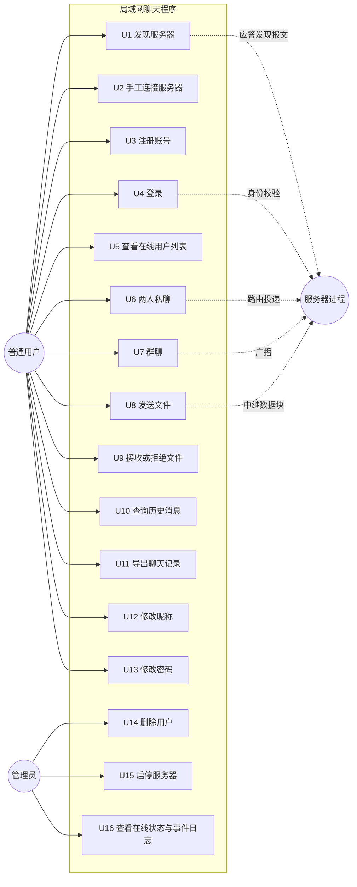

图 2-1 系统用例图

## 2.4 用例描述

以下给出四个最能体现系统核心机制的用例的详细描述，其余用例在测试用例表与用户手册中给出。

### 2.4.1 用例 U4：用户登录

| 项目 | 内容 |
| --- | --- |
| 用例编号 | U4 |
| 参与者 | 普通用户、服务器 |
| 前置条件 | 服务器已启动并监听 TCP 端口；客户端与服务器网络可达；账号已注册 |
| 后置条件 | 服务器在线表中新增该用户；客户端进入主界面；所有在线客户端收到更新后的在线用户列表 |
| 基本流程 | 1. 用户在登录界面输入服务器地址、端口、用户名与密码；2. 客户端建立 Socket 连接并完成连接超时控制；3. 客户端先构造对象输出流并 flush，再构造对象输入流；4. 客户端发送 LOGIN 类型的文本消息；5. 服务器解析消息，调用用户服务校验密码；6. 校验通过后以 putIfAbsent 语义将用户注册进在线表；7. 服务器返回 LOGIN_RESULT，内容为用户信息；8. 服务器向所有在线客户端广播新的在线用户列表；9. 客户端接收线程收到登录结果后，界面切换到主窗口 |
| 异常流程 | A1 密码错误：服务器返回失败结果与原因，客户端停留在登录界面并提示；A2 账号不存在：同 A1；A3 账号已在别处登录：服务器以先到先得原则拒绝新连接；A4 连接超时或服务器未启动：客户端在连接超时（默认 3000 毫秒）后提示失败，并允许切换为发现或手工输入 |
| 业务规则 | 用户名规则为「字母开头、由字母数字下划线组成、长度 3 至 16」；密码长度 6 至 32 位 |

### 2.4.2 用例 U6：两人私聊

| 项目 | 内容 |
| --- | --- |
| 用例编号 | U6 |
| 参与者 | 发送方、接收方、服务器 |
| 前置条件 | 双方均已登录；发送方已从在线列表选中对端 |
| 后置条件 | 接收方界面出现该消息；消息被写入服务器聊天记录 |
| 基本流程 | 1. 发送方在主窗口选中用户并打开私聊窗口；2. 输入内容并提交；3. 客户端构造 TEXT_PRIVATE 消息，receiver 为对端用户名；4. 服务器从当前连接取出已登录用户名，强制覆盖消息的 sender 字段；5. 服务器先按稳定消息标识判重，再按 receiver 在在线表中查找连接并投递；6. 服务器把消息持久化到 chat_message 表（正文加密）并回送达确认；7. 接收方推送消息给界面回调，界面按消息类型着色显示 |
| 异常流程 | A1 接收方不在线：服务器把消息保留为未投递并回 OFFLINE 确认，同时提示「已存入离线队列，将在其上线后送达」，接收方下次登录时补投；A2 消息长度超过 2000 字符：客户端输入层拦截或服务器拒绝；A3 未登录即发送：服务器返回「请先登录」并忽略该消息 |
| 业务规则 | 服务器只信任连接自身的登录身份，不信任消息体中的 sender 字段；同一消息在服务器侧只对接收方投递一次，发送方界面回显由本地直接追加 |

### 2.4.3 用例 U8：发送文件

| 项目 | 内容 |
| --- | --- |
| 用例编号 | U8 |
| 参与者 | 发送方、接收方、服务器 |
| 前置条件 | 双方均已登录且在线；文件存在、可读、大小不超过 200MB |
| 后置条件 | 接收方本地保存了内容与源文件逐字节一致的文件；双方界面均显示传输结果 |
| 基本流程 | 1. 发送方在私聊窗口内点击「发送文件」并选择文件，接收方即该窗口的对端，无需再选人；群聊窗口的同一按钮则先确认接收人数与名单，再向全部在线用户群发；2. 客户端计算文件大小、分块总数与 SHA-256，构造 FILE_REQUEST 并附带元信息；3. 服务器解码请求元信息并转发给接收方，不落盘、不缓存文件内容；4. 接收方弹出确认，选择保存位置或使用默认接收目录；5. 接收方打开接收文件并按块写入，返回 FILE_ACCEPT；6. 发送方按 64KB 分块读取并逐块发送 FILE_CHUNK，附带块序号；7. 接收方逐块校验序号连续性并写入；8. 发送方发送 FILE_END，携带总块数与 SHA-256；9. 接收方完成写入后校验 SHA-256；10. 接收方以「当前用户指向对端」的方向构造 FILE_RESULT 回执；11. 双方界面显示成功与文件保存路径 |
| 异常流程 | A1 接收方拒绝：回执为拒绝，发送方终止发送；A2 块序号错乱：接收方抛出文件传输异常并删除残缺文件；A3 校验和不匹配：接收方抛出异常、删除残缺文件并回执失败；A4 传输中任一方取消：接收方中止写入并删除残缺文件，进度归零；A5 文件超过上限：发送方在本地即拒绝，不产生网络流量；A6 群聊群发时没有其他在线用户：界面直接提示「当前没有其他在线用户，无法发送文件」，不产生任何传输 |
| 业务规则 | 发送入口放在聊天窗口内：面板自身知道「正在跟谁聊」，因此接收方由窗口类型决定，不再需要用户在主窗口里先选人；服务器只做消息中继，不缓存文件内容，避免成为磁盘与带宽瓶颈；接收端文件名必须经过清洗以防止目录穿越；同名文件自动生成「(1)」「(2)」形式的副本名，不覆盖已有文件；群聊群发是「对每个在线用户各发起一次独立传输」，每个接收方各自确认，一人拒收不影响其他人 |

### 2.4.4 用例 U7：群聊

| 项目 | 内容 |
| --- | --- |
| 用例编号 | U7 |
| 参与者 | 发送方、全体在线用户、服务器 |
| 前置条件 | 发送方已登录 |
| 后置条件 | 所有在线用户收到群聊消息 |
| 基本流程 | 1. 用户打开群聊窗口并输入内容；2. 客户端构造 TEXT_GROUP 消息；3. 服务器覆盖 sender 字段并遍历在线表广播；4. 服务器持久化该消息；5. 各客户端按群聊规则过滤并显示 |
| 异常流程 | A1 在线用户数较多时广播失败：服务器对单个连接的写入异常做隔离处理，不影响其他连接，并将该连接判定为掉线 |
| 业务规则 | 广播范围是「服务器当前在线表」的快照；发送方自身是否收到服务器回传副本由客户端的显示策略去重 |

## 2.5 需求边界与不做范围

为避免范围蔓延，本设计明确以下内容不在实现范围内：不支持跨网段或跨公网通信（依赖局域网广播域，跨网段需手工输入服务器地址）；不支持消息撤回与已读回执；不支持历史记录分页与消息搜索界面；不支持表情、图片与语音；传输层不加密——本设计已对落盘正文做 AES-GCM 加密，但网络传输仍是 Java 原生序列化的明文 TCP 报文，局域网内抓包可见，二者是相互独立的两件事；不支持多服务器集群与用户漫游；不提供移动端界面。离线消息已在网络层与服务端实现（接收方离线时先落库、待其上线后补投），其界面展示随后续界面完善继续打磨；上述边界在第五章的测试与第六章的展望中再次对应说明。

---

# 第三章 总体设计

## 3.1 C/S 分层架构

系统采用客户端/服务器两层部署、三层代码分层的结构。部署上，一个服务器进程与多个客户端进程通过 TCP 与 UDP 通信；代码上，无论是服务器还是客户端，都遵循「界面层 / 业务与服务层 / 数据与工具层」的划分，并共享同一套公共模块。

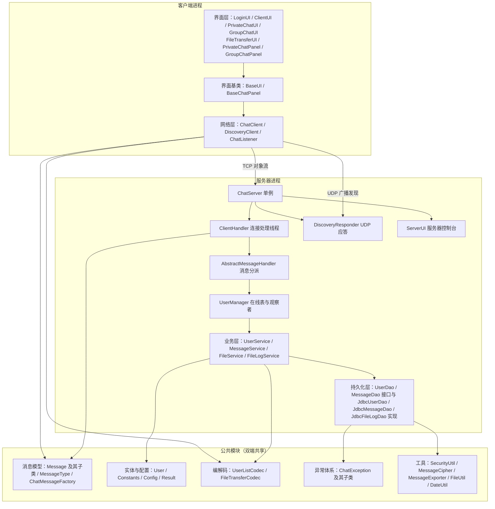

图 3-1 C/S 分层架构图

架构要点说明。第一，客户端界面层只依赖 ChatClient 这一个网络门面，界面代码中不出现任何 Socket 或流对象，界面与网络层之间通过 ChatListener 回调单向通信，因此群聊窗口与私聊窗口可以复用同一套界面基类。第二，服务器端的连接处理类只负责「读消息、校验身份、分派」，真正的业务处理放在模板方法基类的各钩子方法中，业务逻辑再委托给 service 层，service 层再依赖 dao 接口，形成单向依赖链，使业务层不感知具体存储细节、也便于在测试中替换数据源。第三，公共模块被双端共享，消息类型与实体定义只有一份，从根本上避免了「客户端与服务器对协议理解不一致」这一类问题。第四，聊天正文加解密与导出文本渲染都放在公共模块：加解密由数据访问层调用，导出渲染由服务端查库后调用，客户端只负责把回传文本落盘。

## 3.2 模块划分

| 包 | 文件数 | 约行数 | 职责 |
| --- | --- | --- | --- |
| com.chat.common | 12 | 2200 | 消息模型、消息类型枚举、消息工厂、用户实体、常量、配置、结果封装、协议文本编解码 |
| com.chat.exception | 3 | 165 | 受检业务异常基类与用户、文件两类具体异常 |
| com.chat.util | 5 | 1060 | 口令散列与校验（SecurityUtil）、聊天正文加解密（MessageCipher）、导出文本渲染（MessageExporter）、文件处理（大小格式化、流式 SHA-256、分块计算、重名规避、文件名清洗）、日期格式化 |
| com.chat.dao | 6 | 1700 | 泛型数据访问接口，以及用户、消息、文件传输日志三张表的 JDBC 实现 |
| com.chat.service | 4 | 1600 | 用户业务、消息业务、文件传输业务、文件传输日志业务 |
| com.chat.server | 8 | 3600 | 服务器单例、连接处理线程、消息分派模板、在线用户管理、UDP 发现应答、服务器观察者与界面 |
| com.chat.client | 4 | 2330 | 客户端网络门面、回调接口、UDP 发现客户端、命令行入口 |
| com.chat.client.ui | 11 | 4880 | 界面基类、聊天面板基类、登录界面、主界面、好友树（OnlineUserTree）、私聊界面、群聊界面、文件传输界面 |
| com.chat.client.ui.theme | 6 | 1300 | 界面皮肤：配色与字体、Java2D 图标与头像（含树形三角）、自绘按钮与标题栏、窗口缩放手柄 |
| 合计 | 59 | 约 18900 | 主源码（含规范中文注释） |

表 3-1 主源码模块划分与规模

说明：表中为编写本报告时的现场统计快照（`find` 与 `wc -l`），源码仍在持续重构与扩展，文件数与行数会有浮动，请以仓库现状为准；此处给出的是数量级参考，不追求与某一时刻逐行一致。模块依赖关系遵循「上层依赖下层、实现依赖接口、公共模块被所有模块依赖」的原则，不存在反向依赖与时序耦合。

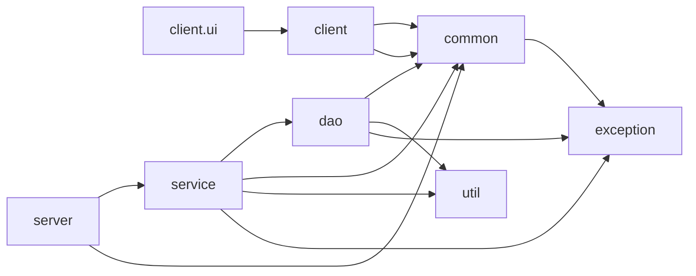

图 3-2 模块依赖关系图

## 3.3 类图设计

### 3.3.1 消息模型类图

消息采用「抽象基类 + 具体子类」的多态结构，共同继承自可序列化的 Message 基类。

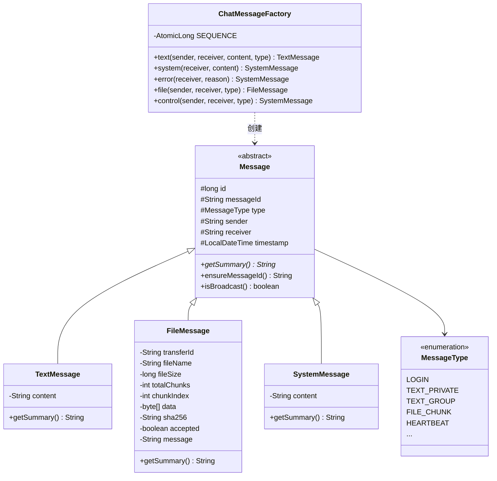

图 3-3 消息模型类图

### 3.3.2 服务器核心类图

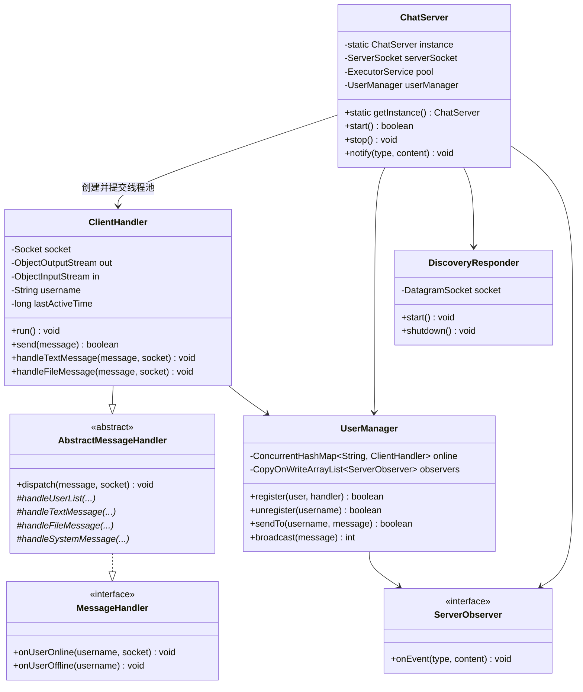

图 3-4 服务器核心类图

### 3.3.3 数据访问与业务层类图

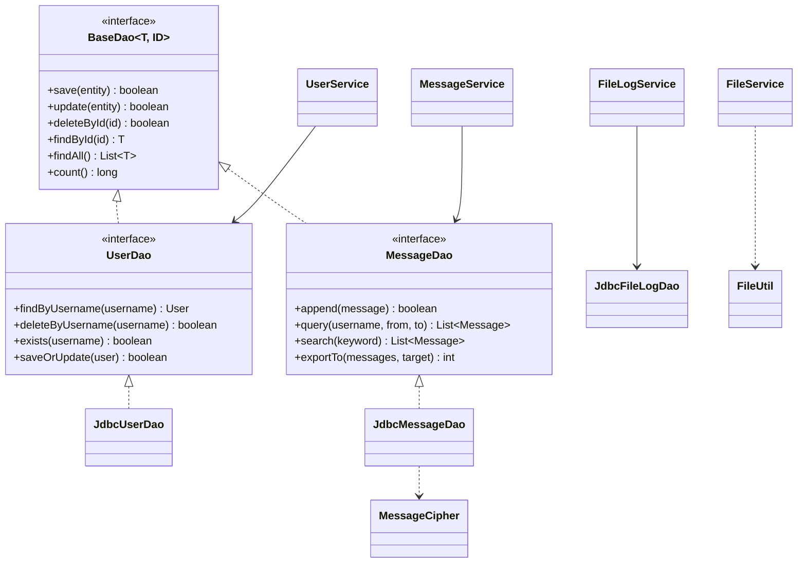

图 3-5 数据访问与业务层类图

### 3.3.4 客户端类图

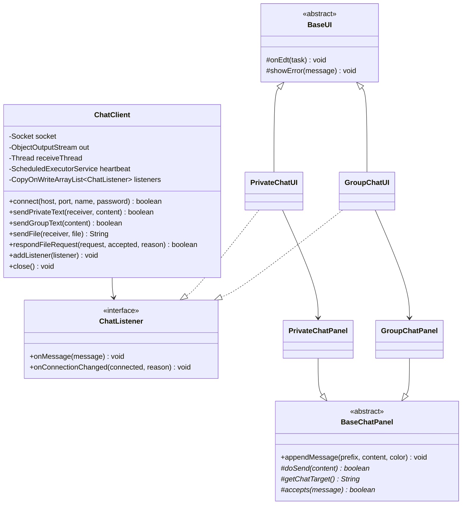

图 3-6 客户端类图

## 3.4 设计模式应用

| 设计模式 | 应用位置 | 解决的问题 |
| --- | --- | --- |
| 单例模式 | ChatServer 通过静态方法获取唯一实例 | 保证端口、线程池、在线表全局唯一，避免多实例争抢端口 |
| 工厂模式 | ChatMessageFactory 统一创建各类消息并分配全局递增编号 | 收敛对象构造细节，保证编号唯一与字段一致性 |
| 模板方法模式 | AbstractMessageHandler.dispatch 定义处理骨架，子类实现各类型钩子 | 把「身份校验、异常兜底、活跃时间刷新」等固定步骤与「按类型处理」的可变步骤分离 |
| 观察者模式 | ServerObserver 观察服务器事件；ChatListener 观察客户端消息与连接状态 | 解耦网络层与界面层，使同一网络层可同时驱动 GUI 与测试代码 |
| 多态 | Message 子类各自实现 getSummary | 日志与界面按统一方式获取摘要，无需 instanceof 分支 |
| 数据访问对象（DAO） | BaseDao / UserDao / MessageDao 接口与 JdbcUserDao / JdbcMessageDao 实现 | 业务层不感知 SQL 细节，测试可注入不同数据源 |
| 门面模式 | ChatClient 封装连接、收发、心跳、文件传输细节 | 界面层只需调用少量语义化方法 |
| 策略与延迟初始化 | Config 的配置读取策略（系统属性优先）、ChatServer 在 start 时才创建业务服务 | 支持运行时覆盖配置，避免单例提前固化配置 |

表 3-2 设计模式应用一览

## 3.5 通信协议设计

协议基于「TCP 长连接 + Java 对象序列化」，通信双方共享同一套 Message 类，因此协议定义等价于类定义。MessageType 枚举当前定义 34 种消息类型，覆盖注册、登录、上下线通知、私聊、群聊、用户列表、资料变更、密码修改、文件请求、同意、拒绝、数据块、结束、结果回执、历史查询与结果、心跳与应答、系统通知、错误通知，以及用于可靠投递的消息确认、离线补投与会话恢复；另有消息撤回、聊天记录搜索、已读回执三类枚举项已预留，端到端流程与界面尚未接入，本报告不对其作已实现声明。

| 交互方向 | 消息类型 | 载荷说明 |
| --- | --- | --- |
| 客户端到服务器 | LOGIN / REGISTER | 文本载荷为约定格式的用户名与密码 |
| 客户端到服务器 | TEXT_PRIVATE / TEXT_GROUP | 文本载荷为聊天内容，receiver 为对端或广播标记 |
| 客户端到服务器 | FILE_REQUEST / FILE_ACCEPT / FILE_REJECT / FILE_CHUNK / FILE_END / FILE_RESULT | FileMessage 载荷，含传输编号、文件名、大小、块序号、数据与校验和 |
| 客户端到服务器 | USER_LIST_REQUEST / HISTORY_REQUEST / EXPORT_REQUEST / PASSWORD_CHANGE / USER_UPDATE / LOGOUT / HEARTBEAT / MSG_ACK / SESSION_RESUME | 控制类消息 |
| 服务器到客户端 | LOGIN_RESULT / REGISTER_RESULT / USER_LIST / USER_ONLINE / USER_OFFLINE / USER_UPDATE | 结果与通知类消息 |
| 服务器到客户端 | TEXT_PRIVATE / TEXT_GROUP / FILE_* 转发 | 原样转发（sender 已被服务器覆盖） |
| 服务器到客户端 | HISTORY_RESULT / EXPORT_RESULT / HEARTBEAT_ACK / SYSTEM / ERROR | 查询结果、导出结果、心跳应答与提示 |
| 服务器到客户端 | MSG_ACK / OFFLINE_MESSAGE / SESSION_RESUME | 送达确认、离线消息补投与会话恢复 |

表 3-3 协议消息类型与方向

协议约定三条规则。第一，类型一律使用 MessageType 枚举，序列化后天然保持一致性，禁止在业务代码中出现字符串形式的类型名。第二，用户列表与文件请求元信息在两处以文本形式承载（USER_LIST 与 FILE_REQUEST），分别由 UserListCodec 与 FileTransferCodec 做编解码，采用制表符分隔并对内容做换行与分隔符转义，保证单行可解析。第三，文件数据块的传输消息形态在两端保持一致——服务器转发的是原始消息对象而非重新构造的对象，避免因类型不一致导致转换异常。此外，控制报文正文按竖线分隔，服务端统一限制字段数不超过 16、拒绝换行与制表符之外的控制字符，超限时回中文错误而不是解析或截断。

## 3.6 线程模型

服务器端与客户端各自的线程构成如下。

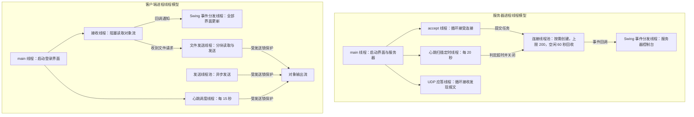

图 3-7 线程模型图

线程安全设计要点。第一，所有对同一对象输出流的写入都必须持有发送锁，因为心跳、聊天消息与文件数据块可能来自不同线程，交错写入会破坏对象流的帧结构。第二，在线用户表使用 ConcurrentHashMap，并以 putIfAbsent 语义注册，保证并发登录时同一用户名只能成功一次。第三，观察者列表使用 CopyOnWriteArrayList，使事件回调期间的遍历不会因注册或注销而抛并发修改异常。第四，所有 Swing 组件更新统一通过 EDT 调度方法投递，网络线程绝不直接操作组件。

---

# 第四章 详细设计与实现

本章按模块说明实现方式。为保持报告篇幅可控，关键代码以「真实方法签名 + 流程描述」的形式给出，完整实现请对照源码阅读（推荐阅读顺序见《04-实现说明》）。

## 4.1 公共模块（com.chat.common）

### 4.1.1 消息抽象基类与多态

Message 是全部消息的抽象基类，实现 Serializable 接口，持有 6 个公共字段：全局唯一编号 id、跨端稳定标识 messageId、类型 type、发送者 sender、接收者 receiver、时间戳 timestamp（类型为 LocalDateTime）。messageId 由 ensureMessageId() 惰性生成 UUID，供服务端幂等去重与客户端重发复用。基类声明抽象方法 getSummary()，由三个子类分别实现：TextMessage 返回内容摘要，FileMessage 返回文件名、大小与块进度摘要，SystemMessage 返回通知文本摘要。这样日志与界面在展示消息时只需调用 getSummary()，不必关心具体类型，也不需要 instanceof 分支。

基类同时提供 isBroadcast() 判断，用于识别 receiver 是否为广播标记（常量 ALL），群聊广播与服务器侧路由都依赖该判断。时间戳使用 java.time.LocalDateTime 而非 java.util.Date，避免可变对象在序列化与日志输出中的线程安全与格式化问题。

### 4.1.2 消息类型枚举

MessageType 集中定义了 34 种消息类型，每种类型绑定一段中文描述，用于日志与界面提示。枚举还提供 fromName(String) 静态方法，用于从历史记录文本或配置中反查类型；该方法对未知名称不抛异常，而是统一回退为 SYSTEM，保证读取旧版本记录时不会中断。这是「读档兼容性优先于严格校验」的一次取舍。其中 MSG_ACK、OFFLINE_MESSAGE、SESSION_RESUME 已接入可靠投递流程，MSG_RECALL、SEARCH_REQUEST、SEARCH_RESULT、READ_RECEIPT 为后续扩展预留。

### 4.1.3 消息工厂与全局编号

ChatMessageFactory 提供五个静态工厂方法，关键签名如下：

```java
public static TextMessage text(String sender, String receiver, String content, MessageType type)
public static SystemMessage system(String receiver, String content)
public static SystemMessage error(String receiver, String reason)
public static FileMessage file(String sender, String receiver, MessageType type)
public static SystemMessage control(String sender, String receiver, MessageType type)
```

编号由类内 AtomicLong 静态计数器生成，保证跨线程递增且不重复。工厂内部先创建对象、再统一应用类型与编号，因此调用方即使传入非文本类型也不会因参数校验而失败——这一设计直接来自一次真实缺陷（见第五章缺陷 D2）。

### 4.1.4 用户实体与凭据脱敏

User 实体采用私有字段加 getter/setter 的封装形式，字段包括用户名、昵称、密码散列、盐、角色、创建时间、最近登录时间与在线标志。两个方法与安全直接相关：clearCredential() 清空密码散列与盐，用于向客户端投递用户对象之前脱敏；getDisplayName() 在昵称为空时回退为用户名，避免界面出现空白项。equals 与 hashCode 以用户名为基准，保证集合去重语义正确。

### 4.1.5 常量与配置

Constants 集中定义了全部常量，包括网络参数（默认端口 9527、发现端口 30000、连接超时 3000 毫秒、读超时 60000 毫秒）、心跳参数（15 秒间隔、60 秒超时、20 秒扫描）、并发参数（连接上限 200、工作线程空闲保活 60 秒）、文件参数（64KB 分块、200MB 上限）、路径参数（数据目录下只保留 received 与 export）、账号规则（用户名正则、密码长度 6 至 32、昵称上限 20、单条消息上限 2000 字符）与格式参数。业务代码中不出现魔法值，也不内置任何口令。

Config 负责加载 config/chat.properties，遵循「系统属性覆盖配置文件、配置文件覆盖内置默认值」的优先级，普通配置缺失时回退默认值以保证程序能启动，而安全关键项刻意不设默认值。类提供类型化读取方法 get/getInt/getLong/getBoolean，以及 dataDir/exportDir/receivedDir/serverPort/discoveryPort/dbUrl/dbUser/messageSecret/maxFileSize/maxConnections/heartbeatIntervalMs/heartbeatTimeoutMs 等语义化方法。其中 messageSecret() 在未配置时返回空串，由 MessageCipher 与服务器启动自检明确拒绝，避免「忘记配置」悄悄退化成使用公开弱密钥；数据库连接参数同样支持系统属性覆盖，便于测试使用独立的测试库。该类在静态初始化时显式触发加载，并提供 isLoaded() 供调用方判断配置文件是否读取成功。

### 4.1.6 协议文本编解码

UserListCodec 负责在线用户列表的编码与解码：把用户集合编码为一行文本，字段之间用制表符分隔，用户之间用换行外的分隔标记连接，并对可能出现的分隔符做转义；解码时逐条还原并忽略非法行。FileTransferCodec 负责文件请求元信息的编解码，关键签名为：

```java
public static String encode(FileMessage request)
public static FileMessage decode(String text, String sender, String receiver)
```

引入这两个编解码器的直接原因是：文件请求需要以文本消息承载元信息（因为服务器必须先校验再转发），而服务器不能对文本消息直接做类型强转。

## 4.2 持久化层（com.chat.dao）

本设计的持久化只有 MySQL 一种方式，历史上出现过的基于文本文件的用户与聊天记录落盘方式及其配置开关已经删除，磁盘上只保留接收到的文件与导出的聊天记录两类产物。

### 4.2.1 泛型接口抽象

BaseDao<T, ID> 定义 save、update、deleteById、findById、findAll、count 等通用方法；UserDao 与 MessageDao 在其基础上扩展领域方法：UserDao 增加 findByUsername、deleteByUsername、exists、saveOrUpdate，MessageDao 增加 append、query、search、exportTo。业务层只依赖接口，实现类负责把领域操作翻译为 SQL，因此测试可以注入指向独立测试库的数据源，业务代码不需要感知数据库地址。

### 4.2.2 三张表的结构

数据库共三张表，字段与索引如下（与 sql/schema.sql 及程序启动时执行的 CREATE TABLE IF NOT EXISTS 保持一致）。

| 表 | 字段 | 说明 |
| --- | --- | --- |
| chat_user | username（主键）、nickname、salt、password_hash（VARCHAR(128)）、role、create_time、last_login_time | 账号、昵称、口令盐与散列、角色与登录时间 |
| chat_message | id（主键，自增）、message_id（VARCHAR(36)，唯一）、msg_type、sender、receiver、content、file_name、file_size、sha256、delivered、read_flag、recalled、create_time | 聊天记录；文本消息的 content 为 AES-GCM 密文，文件消息记录文件名、大小与校验和 |
| chat_file_log | transfer_id（主键）、sender、receiver、file_name、file_size、sha256、result、remark、finished_at | 文件传输审计日志，result 取 SUCCESS / REJECTED / FAILED |

表 4-1 数据库表结构

chat_message 的 message_id 与 delivered 已接入可靠投递：message_id 是跨端一致的稳定标识（发送方生成 UUID），服务端据此做幂等去重，delivered 标记消息是否已投递给接收方，为 0 的记录在接收方下次登录时补投。read_flag 与 recalled 是为「已读回执」与「消息撤回」预留的列，对应业务功能尚未接线；撤回与已读回执在本设计中不作为已实现能力声明。message_id 上的唯一索引允许存在多行 NULL，因此升级前写入的历史记录不会互相冲突，无需数据迁移。

### 4.2.3 用户数据访问实现

JdbcUserDao 使用 JDBC 与 PreparedStatement 完成增删改查，所有 SQL 参数均通过占位符绑定，杜绝字符串拼接注入；表结构不存在时自动建表（CREATE TABLE IF NOT EXISTS），初始化失败时把自身标记为不可用并给出中文原因。口令的盐与散列以「盐 : 散列」的凭据串统一存储，读取时由 SecurityUtil 拆分。程序不内置任何默认口令：只有当 chat.properties 中配置了 admin.password 且 admin 账号尚不存在时才会创建管理员，未配置口令时只记录告警并跳过创建。

### 4.2.4 聊天记录访问与正文加密

JdbcMessageDao 负责消息的写入、按用户与时间范围的查询、关键字检索与导出取数。写入前对正文调用 MessageCipher.encrypt，读出后调用 MessageCipher.decrypt，因此直接用 mysql 命令行查看 chat_message.content 只能看到 Base64 密文。加密算法为 AES/GCM/NoPadding，每次加密随机生成 12 字节初始向量，密文带固定前缀 enc:v1:；密钥由配置项 security.message.secret 经 PBKDF2WithHmacSHA256（固定盐 LANChat.chat_message.v1，65536 次迭代）派生并缓存。没有 enc:v1: 前缀的值按历史明文处理，仍可读；解密失败时显示占位文本并记录警告，而不是让界面崩溃。加密口令一旦变更，此前写入的密文将无法解密，这是该方案的固有代价，配置文件中已明确提示。

### 4.2.5 文件传输日志

JdbcFileLogDao 与 FileLogService 负责把每次文件传输的终态写入 chat_file_log：传输编号、双方用户名、文件名、大小、校验和、结果与结束时间。聊天历史里也会保留一行文件传输记录（供历史查询与导出展示），审计表则用于按结果统计成功率与追溯异常传输，两者职责不同、互不替代。

### 4.2.6 建表、升级与时区

sql/schema.sql 供手工初始化或重建数据库使用，服务器启动时的自动建表与它结构一致，两者已逐列、逐索引核验。脚本中以注释形式给出「已有数据库升级说明」的 ALTER TABLE 语句：CREATE TABLE IF NOT EXISTS 不会修改已存在的表，因此升级已有库时需要手工执行这些语句（例如把 password_hash 从 CHAR(64) 扩到 VARCHAR(128)，或补齐可靠投递新增的列）。

需要特别保留的一条部署说明是时区陷阱：db.url 的 serverTimezone 必须填写数据库所在机器的真实时区。驱动会把 JDBC 时间在「连接时区」与 JVM 时区之间换算，若数据库在东八区而连接串填 UTC，程序里写入的 09:21 会以 01:21 存入 DATETIME 列——程序自身读写一致（界面显示正常），但用 mysql 命令行或图形工具直接查看会整整差 8 小时，极易被误判为程序写错了时间。

## 4.3 业务层（com.chat.service）

### 4.3.1 用户服务

UserService 提供注册、登录、改昵称、改密码、删除用户与查询能力，所有返回值统一为泛型 Result<T>，把「成功与否、提示文本、数据」三者封装在一起，避免用异常表达业务上的正常失败。关键实现点如下。注册流程先做用户名与密码的格式校验，再检查用户名是否已存在，随后调用 SecurityUtil.encode 生成凭据并保存，新口令一律使用 PBKDF2WithHmacSHA256（12 万次迭代），存储格式为 pbkdf2$120000$十六进制。登录流程先按用户名取出用户，再用 SecurityUtil.verifyPassword 做常量时间比较；该校验对升级前的单轮加盐 SHA-256 散列保持兼容，历史账号登录成功后会在同一次写库中透明重算为 PBKDF2 格式并回写，用户无需改密。删除用户引入操作者与目标两个参数，只有 ADMIN 角色可以执行，普通用户请求被拒绝。所有对外返回的用户对象都经过脱敏副本处理（copyForTransfer），保证密码散列与盐不离开服务器。

登录还叠加了两层防护：同一「用户名（小写）+ 来源地址」连续失败 5 次后锁定 5 分钟、到期自动解锁；账号不存在与密码错误对外返回完全一致的提示「用户名或密码错误」，避免攻击者据此枚举已注册账号（日志中仍分别记录，便于排障）。

### 4.3.2 消息服务

MessageService 封装消息持久化、历史查询、导出取数与可靠投递的支撑能力。保存方法对空对象与空内容做防御性判断，返回失败结果而不是抛异常；查询方法支持「按日期」与「按时间戳区间」两种入口，并在起止时间倒置时返回失败提示；导出方法在结果集为空时明确返回失败，避免生成无意义的空文件。存储不可用时，类提供 isStorageAvailable 与 storageFailureReason，让调用方拿到明确原因而不是静默的空结果。

可靠投递方面，服务层对外提供按稳定标识判重、查询未投递消息与批量标记已送达三项能力，供服务端在私聊转发、幂等去重与登录后补投时使用；导出链路由服务端查库取数，交给 MessageExporter 渲染为文本后回传客户端落盘。

### 4.3.3 文件服务

FileService 是文件传输的核心，负责发送侧分块读取与接收侧分块写入，关键签名如下：

```java
public FileMessage prepareSend(String sender, String receiver, File file) throws FileTransferException
public FileMessage createEndMessage(String sender, String receiver, FileMessage request)
public void closeSend(String transferId)
public String openReceive(String receiverDir, FileMessage request) throws FileTransferException
public long appendChunk(FileMessage chunk) throws FileTransferException
public File finishReceive(FileMessage end) throws FileTransferException
public void cancelReceive(String transferId)
public double progressOf(String transferId)
```

发送侧为每个进行中的传输维护一个 SendingFile 内部对象，内部持有 RandomAccessFile，按块序号定位偏移量后读取定长字节，因此不需要把整个文件载入内存；接收侧维护 ReceivingFile 内部对象，按块序号严格校验连续性——若收到乱序或重复的块，立即抛出业务异常。finishReceive 在写入完成后流式计算接收文件的 SHA-256，与发送方在 FILE_END 中携带的校验和比对；无论校验失败还是 IOException，都会统一清理残缺文件。cancelReceive 关闭输出流、删除残缺文件并把进度归零。单文件上限 200MB 在 prepareSend 中校验，超限时在本地即拒绝，不产生网络流量。

### 4.3.4 文件传输日志服务

FileLogService 负责把每次传输的终态写入 chat_file_log：由结果消息解析 SUCCESS / REJECTED / FAILED，记录传输编号、双方、文件名、大小、校验和、结果说明与结束时间。它把「聊天历史」与「传输审计」分开：前者面向用户查看与导出，后者面向统计与追溯，两者都从同一份终态消息派生，不会出现口径不一致。

## 4.4 服务器端（com.chat.server）

### 4.4.1 服务器单例与启动流程

ChatServer 是单例，start() 方法按顺序完成：读取端口配置、执行启动自检、创建 ServerSocket 绑定端口、创建连接线程池与命名线程工厂、启动 UDP 发现应答器、启动心跳扫描任务。启动自检有两条硬性前置条件：security.message.secret 未配置时直接拒绝启动（避免聊天记录在用户不知情的情况下以弱密钥落库），数据库不可用时也拒绝启动（否则服务器起来了却无法注册、登录或查询历史，故障会被推迟到使用阶段才暴露）。若启动过程中任一步失败，rollback() 会关闭已创建的资源并停止线程，避免留下半启动状态。方法级同步（synchronized start/stop）保证重复点击启动或并发调用的幂等性。

连接线程池采用 ThreadPoolExecutor(0, maxConnections, 60 秒, SynchronousQueue) 按需创建、空闲回收，而不是固定大小线程池：每个连接处理线程的整个生命周期都阻塞在对象流读取上，固定线程池会让超出线程数的连接永久排队，表现为「服务器已接受连接却毫无响应」。业务服务（用户服务、消息服务、文件服务、文件日志服务）的创建被延迟到 start() 阶段，以修复「单例提前初始化固化配置」的缺陷（见第五章缺陷 D6）。管理员账号也只在启动时按 admin.password 尝试创建，口令留空则只记录告警，程序不提供任何内置默认口令。

### 4.4.2 连接处理线程

ClientHandler 继承 AbstractMessageHandler，实现 Runnable，每个连接对应一个线程。run 方法流程为：初始化对象流、进入读取循环、逐条分派消息、异常时退出循环并回收资源。关键实现细节有三点。

第一，对象流的构造顺序。ObjectInputStream 在构造时会阻塞读取对端写入的流头部，如果两端都先构造输入流就会互相等待形成死锁。因此 initStreams 严格遵循「先构造 ObjectOutputStream 并立即 flush，再构造 ObjectInputStream」的顺序，并显式禁用输出流的缓冲区复用对端引用问题（reset 见下）。

第二，对象流的重置。ObjectOutputStream 会缓存已发送对象以复用引用，长时间运行会导致服务器内存持续增长。因此每次 writeObject 之后立即 flush 并调用 reset()，牺牲少量带宽换取内存稳定。所有写入都在 sendLock 同步块中完成。

第三，身份可信。handleTextMessage 在处理任何业务之前，先从连接自身取出已登录用户名并强制覆盖消息的 sender 字段，然后才进入分派逻辑；同时刷新连接的最近活跃时间。未登录连接除注册与登录外的消息一律被拒绝并收到提示。

第四，反序列化白名单。对象输入流创建后立即绑定 ObjectInputFilter，只放行 com.chat.common、java.lang、java.time、java.util 四个包，并限制递归深度 8、引用数 1000、总字节数 4MB、数组长度 65536。白名单之外的类型（例如 java.io.File）在类加载前就被拒绝，连接随即断开并记录 warning，因此依赖链 gadget 类无法被加载，反序列化炸弹也无法耗尽内存。

第五，协议边界与可靠投递。控制报文正文统一经字段切分校验：字段数上限 16、拒绝换行与制表符之外的控制字符，超限时回中文错误而不是解析或截断。私聊消息带稳定消息标识，服务端先按标识判重（命中即回 MSG_ACK 的 DUPLICATE 状态，不再转发、不再入库），再转发并落库，然后回 DELIVERED；接收方离线时消息保留为未投递状态，回 OFFLINE，并在接收方下次登录后补投。文件消息则通过传输登记表做状态机校验（见 4.4 节末与 4.8 节）。

### 4.4.3 消息分派模板

AbstractMessageHandler 实现模板方法模式，dispatch 方法负责固定步骤：参数校验、调用子类按类型分派的钩子、捕获业务异常并转换为错误消息回执、刷新活跃时间。子类需要实现的钩子包括 handleUserList、handleTextMessage、handleFileMessage、handleSystemMessage，以及 onUserOnline、onUserOffline。ClientHandler 只覆写与服务器语义相关的处理，使「连接管理」与「业务处理」职责分离。分派采用显式列举而不是 default 兜底：任何服务器本不该接收的类型都会留下 warning 并被拒绝，新增枚举值若忘记同步分派规则同样会被拒绝，而不是静默落进控制消息处理流程。

### 4.4.4 在线用户管理与观察者

UserManager 使用 ConcurrentHashMap 维护用户名到连接处理器的映射，使用 CopyOnWriteArrayList 维护观察者列表。register 方法以「先检查、再以 putIfAbsent 语义写入」的方式保证同一用户名并发登录时只有一个成功，其余被拒绝；unregister 移除映射并通知观察者；sendTo 在目标不在线时返回 false，由上层转换为错误提示；broadcast 遍历在线表逐个发送，对单个连接的写入异常做隔离，不影响其他连接；broadcastUserList 生成在线用户列表快照并广播。notifyObservers 用于把服务器事件推送给界面（服务器控制台）与其他观察者。

### 4.4.5 心跳扫描与掉线判定

服务器每 20 秒执行一次扫描（由 ScheduledExecutorService 驱动），遍历连接表并把「当前时间与最近活跃时间之差超过 60 秒」的连接判定为超时，主动关闭并从在线表移除。由于心跳包与任何业务消息都会刷新活跃时间，因此正常用户不受影响。定时任务通过命名线程工厂创建，便于在日志与线程转储中识别。

### 4.4.6 UDP 发现应答

DiscoveryResponder 在指定端口（默认 30000）上创建 DatagramSocket 并循环接收广播报文。收到约定格式的探测报文后，先校验固定前缀、字段数量与各字段取值范围（地址必须是可解析的 IP 或主机名），再按来源做令牌桶限流（单来源 5 次/秒、突发 10），通过后才构造包含本机 IP、TCP 端口与当前在线人数的应答报文回送给请求方。应答内容由 buildAnnouncement 生成，解析逻辑由静态方法 parseAnnouncement 提供，双方共用同一格式。限流表设有条目上限，触顶时先回收空闲条目、必要时淘汰最久未使用的来源，避免伪造来源把内存撑满。畸形包与限流丢弃只记低频 warning、不抛出异常，因此单个坏包不会终止监听循环。服务器停止时 shutdown 关闭套接字并使循环退出。

### 4.4.7 服务器控制台

ServerUI 是基于 Swing 的服务器控制台，实现 ServerObserver 接口，展示服务器地址与端口、启动与停止按钮、在线用户表格与实时事件日志。事件通过观察者回调进入界面，界面刷新通过定时器周期性拉取在线用户表。该界面把「事件驱动」与「周期快照」两种更新方式结合，避免在高频事件下频繁重建表格。

## 4.5 客户端网络层（com.chat.client）

### 4.5.1 客户端门面

ChatClient 是客户端网络层的门面，对界面层暴露语义化方法，关键签名包括 connect、sendPrivateText、sendGroupText、sendFile、respondFileRequest、requestUserList、requestHistory、requestExport、addListener、close。内部结构为：一个 Socket 与其对象流、一个接收线程、一个发送线程池、一个心跳调度器、一个待确认消息扫描器，以及一个观察者列表（ChatListener）。为保证可靠投递，类内维护 messageId 到待确认项的映射：私聊发出后登记，收到服务端 MSG_ACK 才移除，超时未确认则复用同一标识重发（上限 3 次），从而把「网络重发」与「服务端幂等」配成一对。类内另有已渲染消息标识的有界集合用于去重，避免离线补投与重发造成界面重复。

### 4.5.2 接收循环与回调

接收线程在 receiveLoop 中阻塞读取对象流，每读到一条消息就交给 handleIncoming 处理。处理策略分四类：连接状态与登录结果类消息触发连接回调；用户列表、历史结果与导出结果类消息分发给对应界面逻辑；文件传输类消息路由到文件传输界面与文件服务；MSG_ACK、OFFLINE_MESSAGE 与 SESSION_RESUME 属于可靠投递控制消息，分别用于确认发送状态、渲染离线补投消息与恢复会话。所有回调都通过 notifyMessage 遍历监听器触发，监听器实现类负责把更新调度到 Swing 事件分发线程。连接断开时 receiveLoop 退出并触发「已断开」回调，界面据此提示用户。

### 4.5.3 心跳、重连与发送安全

心跳调度器每 15 秒发送一次 HEARTBEAT，并记录最近一次收到 HEARTBEAT_ACK 的时刻；连续若干个周期未收到应答即判定连接失效，按 1、2、4、8、16、30 秒的退避序列尝试重连，重连时携带会话令牌（SESSION_RESUME）恢复登录态，令牌过期则提示重新登录。发送线程池负责异步发送，避免界面在等待网络写入时卡顿。所有写入共享同一把发送锁（在 writeObject 中同步），保证心跳、聊天消息与文件块不会交错写入同一对象流。sendSync 用于需要同步确认的少量场景（如登录），内部同样走加锁写入。导出聊天记录时，客户端只发送 EXPORT_REQUEST 并在 10 秒内等待服务端回传渲染好的文本，收到后落盘；客户端本地不连接数据库，也不包含任何 SQL。

### 4.5.4 文件发送线程

发送文件时，客户端在独立线程中按块读取并发送：先发送 FILE_REQUEST 并等待接收方回应，收到 FILE_ACCEPT 后进入分块循环，每块构造 FILE_CHUNK 并顺带更新一次进度回调，全部发送完成后发送 FILE_END。若中途收到拒绝、取消或失败回执，终止循环并关闭发送侧资源。接收方向收到 FILE_REQUEST 后交给界面确认，收到 FILE_CHUNK 后调用文件服务写盘并回报进度，收到 FILE_END 后触发校验与回执。

### 4.5.5 命令行入口

ChatClientApp 提供三种启动方式：默认启动图形客户端；携带 --local-server 参数时先启动本机服务器再打开客户端，便于单人演示；携带 --help 参数输出用法说明。入口同时配置 java.util.logging 的格式与级别。

## 4.6 客户端图形界面（com.chat.client.ui）

### 4.6.1 界面基类 BaseUI

BaseUI 是所有 JFrame 的抽象基类，统一完成外观（LookAndFeel）与字体初始化、窗口居中、状态标签构造、提示框封装（showInfo/showError/confirm）、以及两个关键的线程调度方法 onEdt(Runnable) 与 runOnEdtAndWait(Runnable)。所有子类界面在更新组件时只能使用这两个方法，从机制上保证「网络线程不直接触碰组件」。

本轮改造把「无边框窗口骨架」也固定到了基类的构造方法中，顺序为：调用 Theme.installDefaults() 初始化外观，执行 setUndecorated(true) 去掉系统装饰，然后组装根面板——BorderLayout.NORTH 放自绘标题栏 SkinTitleBar，CENTER 放子类提供的 body() 内容区，并给根面板加一圈 1 像素描边；随后设置最小尺寸 480x360、递归 applyFont 统一字体、调用 WindowResizer.install(this) 安装窗口缩放手柄。这是模板方法式的复用：子类只写 body().setLayout(...) 与 body().add(...)，窗口是否有标题栏、边距多少、字体从哪里来、能否缩放全部由父类决定，新增窗口不必复制这段初始化代码，也不会漏设字体或边框。

由于窗口去掉系统装饰后系统标题栏不复存在，用户看到的标题由 SkinTitleBar 内的标签显示，因此 setTitle 被覆写：除调用 super.setTitle 外还要同步调用 titleBar.setTitleText，否则代码中设置的标题不会更新。构造时另把标题写入根窗格的 window.title 客户端属性，供任务栏与辅助功能读取。

### 4.6.2 聊天面板基类与界面复用

BaseChatPanel 是私聊与群聊共用的聊天面板抽象基类，内部使用 JTextPane 实现富文本着色（不同消息类型使用不同颜色），包含历史显示区与输入发送区，提供 appendLine、appendMessage、clearHistory 等方法。子类只需实现四个方法：doSend(String content) 决定如何发送、getChatTarget() 返回会话对端、accepts(Message message) 决定该消息是否属于本窗口、sendFileTo(File file) 决定文件发给谁。私聊与群聊各自的面板子类由此把过滤条件分别设为「消息类型为私聊且对端匹配」与「消息类型为群聊」，并把文件接收方分别设为「当前对端」与「全部在线用户」。发送文件按钮与文件选择框都由基类提供（chooseAndSendFile），基类另提供 askConfirm 供子类在发起群发前做一次确认，因此新增一种聊天场景仍然只是几十行子类代码。

本轮改造进一步明确了面板与监听器的关系：BaseChatPanel 仍声明实现 ChatListener，但面板自身不再调用 client.addListener 注册，其 onMessage 与 onConnectionChanged 由 ClientUI 直接调用，保留接口只是为了让主窗口能以统一方式投递消息。消息因此只渲染一次：面板不再单独接收网络回调，同一条消息只经过 ClientUI 一次。群聊面板另外忽略发送者等于当前用户名的 TEXT_GROUP 消息——发送时 doSend 已本地回显，而服务器会把群聊广播回发送者，不过滤就会显示两遍；私聊与群聊的发送都在 doSend 中本地回显，接收侧统一由 ClientUI 按对端分发。

### 4.6.3 登录界面

LoginUI 提供服务器地址、端口、用户名、密码输入与登录、注册、发现服务器、修改密码四类操作。耗时操作（连接、发现、注册）通过 SwingWorker 放到后台线程执行，完成后在 done 回调中更新界面，避免登录过程阻塞 EDT 造成界面假死。发现按钮触发 DiscoveryClient 的一次性发现并把结果填充到服务器地址输入框。

本轮改造补充了三点。第一，界面顶部为蓝色品牌横幅，徽标、程序名与副标题均由 Java2D 绘制。第二，输入框未填写时在提交前给出校验提示（如「服务器地址与用户名不能为空」「密码不能为空」），不再把空值直接送进网络层。第三，登录成功后需要把 ChatClient 会话交接给主窗口：openMainWindow 先构造并显示 ClientUI，再置位 sessionHandedOver 标志后才 dispose 登录窗口；dispose 仍注销监听，但仅在未交接时才关闭连接。该标志直接来自一次真实缺陷——登录成功后连接被登录窗口一并关闭（见第五章 D-12）。

### 4.6.4 主界面（ClientUI）

ClientUI 是登录后的主窗口，顶部为身份卡，左侧为好友树，右侧为功能菜单按钮，底部为状态栏。好友树即 OnlineUserTree（直接继承 JTree）：根节点显示「在线用户 N 人」，其下固定「管理员」「普通用户」「离线」三个分组，每个分组标题在重建时追加组内人数，离线分组的用户置灰，选中行以主题浅蓝整行高亮。树上方是搜索框，按用户名或昵称做不区分大小写的包含匹配，过滤对三个分组同时生效；双击用户节点直接打开私聊窗口，选中分组或根节点时不会误开窗口。顶部身份卡展示当前用户头像、昵称、身份与在线人数；右侧功能菜单依次为私聊、查询历史、导出记录、修改昵称、修改密码、删除用户。发送文件的入口不在这里，而是放在私聊与群聊窗口内部——聊天窗口本来就知道「正在跟谁聊」，接收方不需要使用者再选一次，因此主窗口中既没有用户列表下方的「发送文件」按钮，也没有功能区的「发送文件…」菜单项。子窗口采用「按用户名索引复用」的策略，重复打开同一会话不会产生多个窗口。

ClientUI 是本设计的唯一消息分发者。它实现 ChatListener，在 onMessage 中统一分发：USER_LIST 刷新好友树，TEXT_PRIVATE 走 handlePrivateMessage，OFFLINE_MESSAGE 作为离线补投的私聊投递到对应窗口并标注来源，TEXT_GROUP 与 SYSTEM/ERROR 投递群聊面板，文件类消息按类型路由到传输窗口或进度更新，HISTORY_RESULT 弹出历史记录对话框，EXPORT_RESULT 由客户端把服务端回传的文本写入导出目录。网络回调线程只做协议解码，窗口创建、显示与文本渲染统一用 onEdt(...) 投递到事件分发线程。

这里有一处容易忽略的边界：服务器在私聊投递成功后会给发送方回一条送达回执，其发送者与接收者都是发送者本人；handlePrivateMessage 在开头识别这一形态并直接返回，因此不再弹出「与自己私聊」的窗口（回执在协议层仍然有效，集成测试 IT-03 依赖它）。连接状态同样由主窗口统一广播：onConnectionChanged 在 EDT 内更新状态栏，再把状态转发给所有已打开的 PrivateChatPanel 与 GroupChatPanel，保证子窗口提示与主窗口一致。

### 4.6.5 文件传输界面

FileTransferUI 展示发送与接收两侧的进度：文件选择按钮、进度条、传输日志与取消操作。界面提供按对端获取窗口的静态工厂方法，并维护传输编号到窗口的映射，使服务器回执能够定位到正确的窗口。接收请求到达时界面弹出确认对话框，用户可选择接收位置或拒绝。本轮把「发起传输」这一步也收进窗口内部：新增 sendNow(File) 方法，一次完成「设置待发文件 + 立即发起请求」，供聊天窗口的「发送文件」按钮调用，使用者选完文件即完成发起，不必再回到传输窗口手工点一次「发送」。

本轮改造有两点补充。其一，进度条改用基础外观（BasicProgressBarUI）加主题配色：系统外观在没有 GTK 主题库的 Linux 上是 Metal/Ocean，会用橙红渐变填充进度条，与整体蓝色主题明显冲突；配套把填充区文字颜色设为白色、空槽文字设为深色，形成「蓝底白字、灰底深字」。其二，窗口以对端用户名为键复用（静态工厂内部用 computeIfAbsent），同一对端的多条进度消息与结果回执都落到同一个窗口，不会重复开窗。

### 4.6.6 界面皮肤包 com.chat.client.ui.theme

界面皮肤集中在新拆分的 com.chat.client.ui.theme 包。该包只依赖 javax.swing 与 java.awt，不引用 ChatClient、Message 等业务类型，因此可以脱离网络层单独编译与走查；ClientUI、LoginUI、私聊与群聊窗口都复用其中的控件，服务器端 com.chat.server.ServerUI 也继承 BaseUI 并使用该包。组成如下。

| 类 | 行数 | 职责 |
| --- | --- | --- |
| Theme | 246 | 配色与字体探测、installDefaults 统一外观默认值与选中色、styleProgressBar 进度条配色 |
| Glyphs | 308 | Java2D 绘制的界面图标与好友树展开/收起三角，Painter 函数式接口加 lambda 表达形状 |
| AvatarFactory | 164 | 平面默认头像（圆底人形剪影）与群聊头像，带在线状态点与管理员描边并做缓存 |
| SkinButton | 199 | PRIMARY / NORMAL / GHOST / DANGER 四种形态的自绘按钮 |
| SkinTitleBar | 234 | 高 38 像素的自绘标题栏，拖动、双击最大化、最小化与关闭 |
| WindowResizer | 134 | 右、下、右下三个透明手柄，实现无边框窗口缩放 |

表 4-2 界面皮肤包的组成

Theme 把调色板、字体探测与全局外观默认值收敛到一处。主色 PRIMARY 为 0x12B7F5，另有 PRIMARY_DARK、PRIMARY_LIGHT、SELECTION_BG、BG、CARD、BORDER、TEXT、TEXT_WEAK、ONLINE、OFFLINE、ADMIN、AVATAR_BG、AVATAR_FG、DANGER；字体由 fontBase（13 常规）、fontBold（13 粗体）、fontTitle（14 粗体）、fontSmall（12 常规）提供。字体族不写死，而是按 Microsoft YaHei、微软雅黑、PingFang SC、Noto Sans CJK SC、Source Han Sans SC、WenQuanYi Micro Hei、SansSerif 的顺序探测，取第一个在 GraphicsEnvironment 中确实存在的族，全部不存在时回退逻辑字体；这样做是因为 Linux 上通常没有微软雅黑，直接构造该字体会被系统静默替换，字号与行高随之变化，布局不可控。installDefaults 只做两件事，并用静态标志保证只执行一次：采用系统外观（失败仅打印，不中断启动），以及覆盖三组 UIManager 键——第一组是字体与结构性取值，字体集中在 Label、Button、TextField、PasswordField、TextArea、TextPane、ComboBox、CheckBox、Table、TableHeader、Tree、OptionPane、TitledBorder，结构性取值包括 Tree.rowHeight 为 46、Tree.background 为 CARD、Panel.background 为 BG，另含进度条文字配色；第二组是选中色（见本节末尾的缺陷 D-18），把 Tree、Table、List 与 TextField、PasswordField、TextArea、TextPane 的选中背景统一为 SELECTION_BG、选中前景统一为 TEXT；第三组是树与表格的外观实现，改为基础外观并把展开/收起图标换成本包自绘的三角。在 UIManager 上覆盖一次后，后续新建的控件都自动继承，避免逐个控件设置造成遗漏。

Glyphs 用函数式接口把「几何形状」与「图标配置」分开：

```java
public interface Painter {
    void paint(Graphics2D g, int size);   // 只关心形状
}

public static Icon of(int size, Color color, Painter painter) { ... }
```

of 返回匿名 Icon，在 paintIcon 中统一开启抗锯齿、按 size 设置描边粗细与圆角端点、平移到图标左上角，再回调 Painter，因此每个图标的绘制体都只是几行几何调用，最小化图标甚至只有一条 drawLine。现有图标方法为 logo、minimize、close、refresh、search、group、file、treeArrow、history、export、user、lock、trash，全部在 [0, size) 的正方形坐标系内绘制，与调用处给定的尺寸无关。其中 treeArrow(expanded, size, color) 是为好友树新增的展开/收起三角：树的实现改为基础外观后系统自带图标不再可用，自绘三角同时保证了跨平台一致（见本节末尾的缺陷 D-18）。

AvatarFactory.avatar(online, admin, size) 绘制统一的平面默认头像：外圆填主题灰蓝（AVATAR_BG，离线时换更浅的 AVATAR_BG_OFFLINE），人形由「头部圆 + 肩部椭圆」两部分组成，绘制前先把画布裁剪成外圆，肩部超出圆的部分自动裁掉，不必手工计算交点；右下角叠加状态圆点，先画卡片色底再画在线或离线色；管理员在外缘描一圈 Theme.ADMIN。群聊头像 groupAvatar(size) 同样去掉渐变，改为主色圆角底加三个白色人形剪影。绘制结果以「在线、管理员、尺寸」（群聊为「群聊、尺寸」）为键缓存于 ConcurrentHashMap，用 computeIfAbsent 取值——好友树每次刷新都会重建整棵树，不缓存则每次都要重画几十个图标；键中带上在线与管理员标记，保证状态变化时能取到新图标而不是旧图标。

SkinButton 用 Kind 枚举区分四种形态：PRIMARY（主色实心，主操作）、NORMAL（白底描边，常规操作）、GHOST（无边框，次要操作）、DANGER（危险色，删除等不可恢复操作）。构造时关闭 contentAreaFilled、borderPainted、focusPainted 三项默认绘制，paintComponent 中先画圆角底与描边，再调用 super.paintComponent 绘制文本与图标；悬停与按下反馈由 getModel().isPressed() 与 isRollover() 决定，不需要额外的鼠标监听器，禁用态统一用浅灰底配 TEXT_WEAK 文字。

SkinTitleBar 高度固定 38 像素，背景用 GradientPaint 从 PRIMARY 渐变到 PRIMARY_DARK，底部画一条半透明分隔线。拖动由 installDrag 安装到左侧区域与标题标签上：mousePressed 记录鼠标屏幕坐标与窗口位置，mouseDragged 用两者差值调用 setLocation，不依赖窗口管理器；双击切换最大化，切换前把原位置保存下来以便还原；最小化调用 setExtendedState(Frame.ICONIFIED)，关闭则分发标准 WINDOW_CLOSING 事件，把语义交还给各窗口既有的关闭逻辑。WindowResizer 在根窗格的分层窗格上叠加三条透明拖拽带：边宽 5 像素（右边、底边）、角区 16 像素（右下角），统一加到 JLayeredPane.PALETTE_LAYER；放在分层窗格而不是内容面板上，是因为内容面板会被业务组件完全覆盖，拖拽带收不到鼠标事件。拖动时按方向把屏幕位移换算成宽高，并用 Math.max 夹住 frame.getMinimumSize()；分层窗格尺寸变化时重新摆放三条拖拽带。

「零图片资源」是本轮改造的一条硬约束：项目不包含任何图片文件，图标、头像、标题栏渐变与按钮底纹都在运行时用 Java2D 绘制。理由有三点。第一，运行时不依赖资源目录与工作目录，从任意目录启动或打包成单个 jar 后都不会因为找不到图片而出现空白控件。第二，避免直接复用第三方聊天软件素材带来的版权与原创性问题，界面素材全部为自制绘制。第三，同一套图标可以按调用处给定的尺寸与颜色重新绘制，不必为不同尺寸准备多份位图。这条约束也决定了默认头像的做法：一度考虑过「上网找一张默认头像图片」，但引入外部图片会同时破坏「零资源文件」与「素材可自证原创」两条性质，最终改为用 Java2D 绘制业界最常见的标准默认头像（圆底人形剪影），既符合使用者的直觉，也仍然不需要任何图片文件；头像本身也从「按用户名取色的渐变首字」收敛为「所有人一致的平面剪影」，在线状态改由状态点与底色深浅表达，浅色列表因此更干净。

另有一个与外观实现相关的缺陷值得记录（D-18）。现象是好友树的选中行除了「头像 + 文字」以外，两侧露出一块橙色，看起来像高亮画错了位置。根因有两层：其一是系统外观。开发机的系统外观是 GTK，GTK 会用自己的主题强调色（Ubuntu 下为 #E95420 橙色）填充整行选中背景与行内空隙，而这个颜色与主题蓝毫无关系；其二是渲染器。默认树单元格渲染器只在树获得焦点时才使用选中色，并且只从图标之后开始填充，自绘渲染器覆盖不到图标之前与文字之后的区域。修复分四步：把 Tree 与 Table 的外观实现改为基础实现，让行背景完全交给渲染器决定；渲染器在 paint 中把整行填成主题浅蓝 SELECTION_BG（#CFE9FA），不再依赖外观默认行为；显式覆盖 Tree、Table、List 与各文本组件的选中底色与选中前景；基础外观没有系统自带的树形图标，因此新增 Glyphs.treeArrow 自绘展开/收起三角并注册到 Tree.collapsedIcon 与 Tree.expandedIcon。这里有一个值得记住的细节：只在 UIManager 里覆盖 Tree.selectionBackground 是无效的，因为 GTK 直接读取自己的主题样式，必须同时换掉外观实现才能让配色由主题说了算。修复后选中行不再出现任何系统主题色，浅色头像与主色分组图标在浅蓝底上依然清晰。

### 4.6.7 界面层的线程规则与一次真实死锁

界面层的硬规则只有一条：客户端网络回调发生在 ChatClient 的接收线程（线程名 chat-receiver），而 Swing 组件只能在事件分发线程（EDT）上操作，因此所有窗口的创建、显示与文档写入都必须切到 EDT。

这条规则的由来是一次真实的死锁。早期实现既在网络线程里创建窗口，又在 EDT 上向 JTextPane 追加文本，结果是：EDT 正在排版时持有文档写锁并等待 AWT 树锁，网络线程在创建窗口时持有 AWT 树锁并等待文档读锁，双方互相等待，界面彻底无响应且无法恢复。线程转储中两个线程的持锁方向正好相反：

```text
chat-receiver   ：ClientUI.routeFileMessage → new FileTransferUI → Window.show → validateTree
                  持有 AWT 树锁，等待 JTextArea 文档的读锁（WAITING）
AWT-EventQueue-0：FileTransferUI.appendLog → JTextArea.append → AbstractDocument 写锁
                  持有文档写锁，等待 AWT 树锁（BLOCKED）
```

结论是「窗口创建」与「文本追加」不能被拆到两个线程各做一半，必须作为一个整体投递到 EDT，让锁的获取顺序始终在同一个线程内完成。收口之后的调用关系是：网络线程只读对象流并解码协议、推断对端用户名（纯计算），随后用 onEdt(...) 把「创建或复用窗口、显示并触发布局、向 JTextPane 追加文本」三步作为一个整体投递；只要其中任何一步留在网络线程，就可能重现上述交叉持锁。

修复方式是把窗口创建、显示、文本追加整体投递到 EDT，并让 ClientUI 成为唯一分发者：面板不再各自注册为监听器，连接状态也由主窗口转发。这样一来，同类问题在结构上被消除，而不是靠逐处补 onEdt 的纪律来避免；后续走查中发现的重复渲染与自聊窗口两个缺陷，也都落在「唯一分发者」这一条约定上（见第五章 5.6 与《测试报告》第十二节）。

## 4.7 局域网自动发现

发现机制由客户端 DiscoveryClient 与服务器 DiscoveryResponder 配对实现。

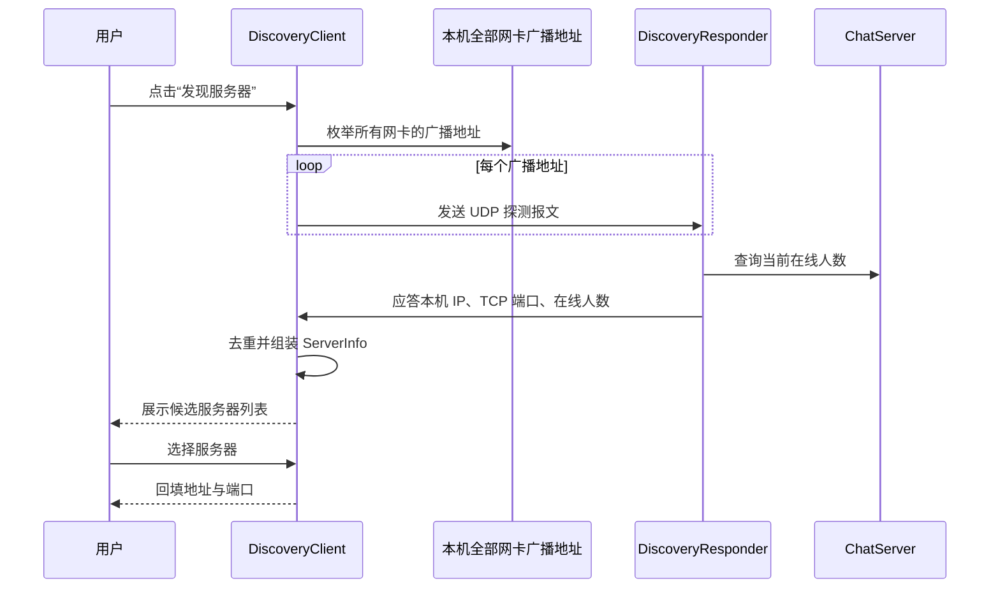

图 4-1 局域网自动发现时序图

实现要点有三。第一，广播地址不是简单地使用 255.255.255.255，而是通过 NetworkInterface 枚举本机全部网卡（含回环与虚拟网卡）的接口地址，按子网掩码计算出各自的广播地址后逐个发送，从而兼容多网卡与虚拟网卡环境。第二，发现流程设置了总体超时（默认由调用方传入），在超时窗口内持续收集应答并按「IP + 端口」去重，避免同一服务器因多网卡应答多次而被重复列出。第三，发现失败时提供降级路径：用户可手工输入 IP 与端口，且回环地址（127.0.0.1 等）被显式识别，便于单机自测。

## 4.8 文件传输设计要点

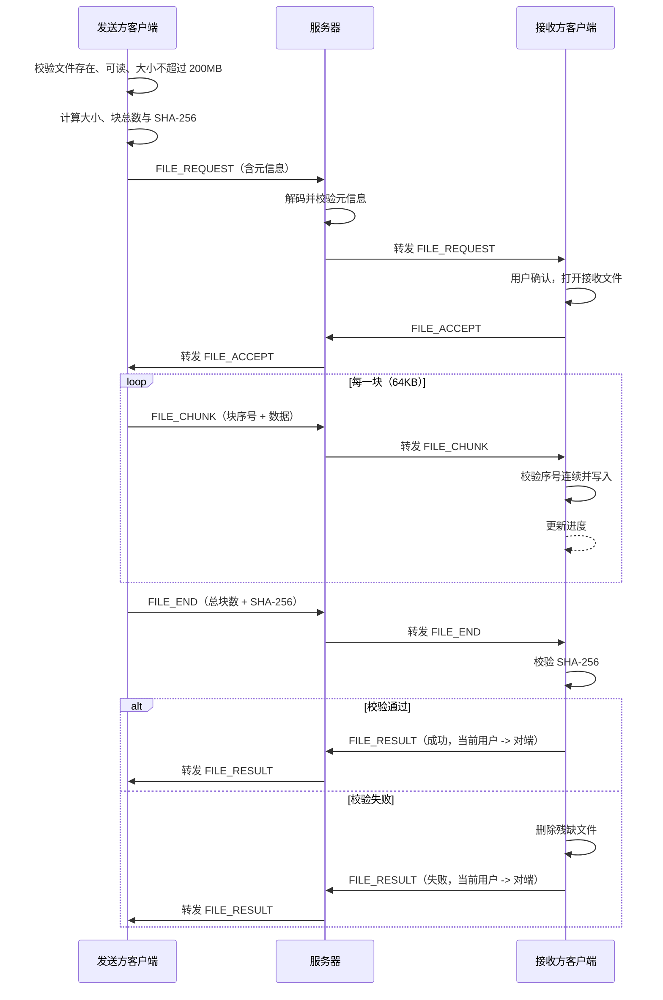

图 4-2 文件传输时序图

文件中继策略是本节的设计核心：服务器只转发消息对象，不缓存文件内容、不落盘，因此服务器的内存占用与磁盘占用与文件大小无关，瓶颈被限制在网络带宽上。这一取舍的代价是传输过程依赖发送方持续在线，无法实现断点续传（列为本设计的不足与改进方向）。

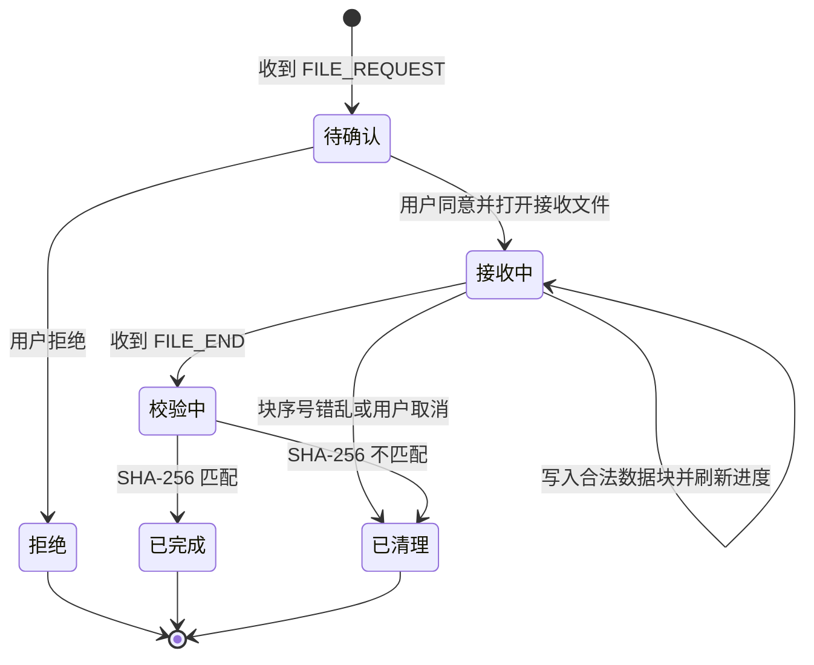

图 4-3 文件接收状态流转图

## 4.9 异常体系

异常体系自顶向下为：ChatException 作为受检业务异常基类，携带 errorCode 字段便于区分错误类别；UserNotFoundException 表示用户不存在；FileTransferException 附带 transferId，便于把异常定位到具体传输任务。设计原则是「业务可预期的失败用 Result 表达，需要中断当前操作并向上传播的失败用受检异常表达」。例如注册时用户名重复属于正常业务分支，返回失败 Result；而文件校验和不匹配属于必须中断并清理资源的异常，抛出 FileTransferException。服务器端在分派模板中统一捕获业务异常并转换为 ERROR 消息回执，网络与 IO 异常则记录日志并触发连接回收。

## 4.10 日志体系

日志使用 java.util.logging，统一日志名为 com.chat，在程序入口处通过系统属性配置输出格式为「日期 时间 [级别] 类名 - 消息」。日志输出遵循三条约定：只记录关键事件（服务器启动与停止、客户端连接与断开、登录成功与失败、文件传输开始与结束、异常堆栈）；不记录密码、密码散列、盐等敏感内容；异常日志保留堆栈以便定位，业务日志使用中文描述便于直接阅读。服务器控制台的事件日志与文件日志来源一致，都通过观察者与 Logger 两个通道输出。

## 4.11 安全设计与第一轮加固

本节集中说明系统的安全设计，以及与传输、协议、存储相关的加固措施。安全边界必须先讲清楚：本节保护的是「口令存储」与「聊天正文落盘」两个环节，网络传输本身仍是 Java 原生序列化的明文 TCP 报文，局域网内抓包可见，本设计不声称传输层已加密。

### 4.11.1 口令安全

口令一律不明文落库。新口令使用 PBKDF2WithHmacSHA256 加盐散列，迭代 12 万次、派生 256 位，存储格式为 pbkdf2$120000$<64 位十六进制>（约 78 字符）。把迭代次数写进散列本身，是为了将来提高迭代数时旧散列仍能被正确校验。校验时按格式分流：pbkdf2$ 开头的按其中记录的迭代数重新派生；升级前写入的单轮加盐 SHA-256（64 位十六进制）仍可登录，登录成功后由用户服务透明重算为 PBKDF2 格式写回，用户无需改密。所有比较都使用常量时间比较，避免通过响应时间差异推断散列前缀。选择标准库内的 PBKDF2 而不是 bcrypt/Argon2，是「不引入第三方依赖」约束下的取舍。

### 4.11.2 聊天正文落盘加密

聊天正文在写入 chat_message.content 之前由 MessageCipher 加密，算法为 AES/GCM/NoPadding，每次加密随机生成 12 字节初始向量，认证标签 128 位；密文带固定前缀 enc:v1:，直接用数据库客户端查看只能看到 Base64 密文。密钥由配置项 security.message.secret 经 PBKDF2WithHmacSHA256（固定盐 LANChat.chat_message.v1，65536 次迭代）派生并缓存，固定盐是必需的——若每次随机，重启后就再也解不开历史密文。没有 enc:v1: 前缀的值按历史明文处理，保持可读；解密失败时显示占位文本并记警告，而不是让界面崩溃。security.message.secret 为空时服务器在启动自检阶段直接拒绝启动，不提供任何内置默认密钥，避免「忘记配置」退化成使用公开弱密钥。加密口令变更后，此前写入的密文无法解密，这是该方案的固有代价。

### 4.11.3 第一轮加固要点

第一轮加固针对传输与协议边界，逐条对应一类可被利用的行为，主要包括以下八项。

1. 历史查询越权修复：历史查询的查询对象一律取服务端登录态中保存的用户名，绝不信任客户端提交的第一个字段；会话对象虽然只在本人记录范围内做二次过滤，仍须符合用户名格式且不得为本人，否则返回 0|中文原因。改写报文无法读到他人记录。
2. 反序列化白名单：放行 com.chat.common、java.lang、java.time、java.util，其余拒绝，并限制 maxdepth=8、maxrefs=1000、maxbytes=4MB、maxarray=65536，被拒对象导致该连接断开并记 warning。
3. 协议字段边界：控制报文字段数上限 16；拒绝控制字符（放行换行与制表符），超限返回中文错误而不是解析或截断。
4. 消息类型分派：显式列举全部类型，未知类型记 warning 并拒绝，不再静默按控制消息处理。
5. 登录失败限流：同一「用户名（小写）+ 来源地址」连续失败 5 次锁定 5 分钟，到期自动解锁；账号不存在与密码错误的提示完全一致，抵御账号枚举。
6. 文件元信息校验：文件名非空、长度不超过 255、剔除路径、拒绝 .. 与控制字符；文件大小非负；块数必须与文件大小精确自洽（totalChunks == ceil(fileSize / 块大小)，0 字节按 1 块）；SHA-256 必须为 64 位十六进制。空文件允许发送。
7. 文件传输登记状态机：发送者必须是登录者、接收者在线且非本人，传输编号非空且长度不超过 64；未登记不得进入数据块阶段、未获同意不得发送数据、不得重复结束、不得由第三方伪造回执，且登记使用 putIfAbsent 防止同一编号被覆盖而截获数据帧。
8. UDP 发现限流：报文长度与格式严格校验，单来源限流 5 次/秒（突发 10），畸形包静默丢弃且不影响监听线程。

### 4.11.4 攻击者视角验证

上述加固不只停留在代码走查：验证时以真实 ChatServer 与 ChatClient 启动独立实例，逐条复现攻击路径，共 17 项断言全部通过，关键实测结论如下。

| 验证项 | 期望 | 实测 |
| --- | --- | --- |
| 伪造历史查询对象越权读取他人私聊 | 只返回本人记录 | 只返回本人记录，不含他人私聊内容 |
| 连续 6 次错误口令登录 | 第 6 次提示锁定 | 返回「登录失败次数过多，请 5 分钟后再试」 |
| 登录不存在的账号 | 与密码错误提示一致 | 与密码错误完全一致，均为「用户名或密码错误」 |
| 控制报文 20 段字段 | 拒绝而不是解析 | 返回 0\|历史查询请求格式错误或字段超限 |
| 发送 java.io.File 等非白名单对象 | 连接被服务端断开 | 服务端重置连接，未进入业务处理 |

表 4-3 第一轮加固的攻击者视角验证

需要再次强调边界：以上加固不改变「局域网内明文传输」这一事实，它们提高的是协议与存储的健壮性，不提供传输层机密性。

---

# 第五章 测试与结果分析

## 5.1 测试环境

| 项目 | 内容 |
| --- | --- |
| 操作系统 | Linux 桌面环境（开发机），程序本身与操作系统无关 |
| JDK | JDK 21（编译与运行），源码兼容级别为 JDK 17 |
| 构建方式 | javac 直接编译（IntelliJ IDEA 内 Build → Rebuild Project），主源码输出到 out/production/LANChat，测试代码输出到 out/test/LANChat |
| 依赖 | 除 MySQL JDBC 驱动外无第三方依赖；本项目以 MySQL 为唯一存储，运行与测试都需要可用的数据库实例 |
| 网络环境 | 本机回环地址与局域网网卡，集成测试使用操作系统动态分配的空闲端口（ServerSocket(0)） |
| 测试数据 | 独立测试库 lanchat_test（由 TestDatabase 把连接串中的库名替换得到，并加 createDatabaseIfNotExist=true），可用系统属性 lanchat.test.db.url 覆盖；每个用例开始前清空 chat_user 与 chat_message，不触碰正式库 |

## 5.2 测试策略与框架

测试遵循「不引入第三方库」的项目约束，自研了一个极简测试框架：Test 是自定义注解（值为用例说明），TestRunner 通过反射扫描测试类的公共无参实例方法、按注解说明输出结果，并统计通过与失败数量，失败时以非零退出码结束，便于在命令行或持续集成中用退出码判定。框架还提供断言方法（assertEquals、assertNotEquals、assertArrayEquals、assertNotNull 等）与临时目录辅助方法。

测试分为两层。单元测试针对单个类或单个服务，在独立测试库上构造隔离的数据环境（每个用例前清空相关表），不依赖网络；集成测试真实启动 ChatServer 与多个 ChatClient，使用真实 TCP 与 UDP 通信，不使用任何 mock，并与单测共用同一套测试库隔离机制。分层的好处是：单元测试定位精确、执行快；集成测试验证真实协议与并发时序，能够发现只在真实交互下才暴露的缺陷。并行开发期间多个任务共用 lanchat_test 会互相干扰，因此验证时改用独立库 lanchat_verify（系统属性 lanchat.test.db.url 覆盖）。

## 5.3 单元测试

单元测试共 47 个用例，分布于 5 个测试类。

| 测试类 | 用例数 | 覆盖内容 |
| --- | --- | --- |
| SecurityUtilTest | 7 | 盐值生成长度与随机性、相同密码不同盐散列不同、相同密码相同盐散列一致、PBKDF2 散列校验正确与错误分支、空密码与空凭据边界、凭据编码与盐散列解析、字节数组 SHA-256 可复现与长度正确 |
| UserDaoTest | 7 | 新增后可查询且字段完整、重复用户名新增失败、更新昵称生效、删除生效且删除不存在用户抛 UserNotFoundException、写入后可被新实例重新读取、saveOrUpdate 兼具新增与更新、保存空对象抛 ChatException |
| UserServiceTest | 9 | 注册成功且返回对象不含密码散列、用户名与密码格式非法被拒、重复用户名注册失败、登录成功并刷新最近登录时间、存储中的密码为 PBKDF2 散列而非明文、修改昵称生效、修改密码需校验原密码且新密码可登录、普通用户无权删除而管理员可删除、列表查询返回脱敏对象 |
| MessageServiceTest | 12 | 工厂创建各类型消息与摘要多态、编号全局递增不重复、保存后可按用户查询、日期范围过滤与起止时间倒置报错、关键字检索与空关键字校验、导出生成可读文本、无记录时导出返回失败、用户列表编解码往返一致、文件消息记录回读保留元信息、按编号删除后不可查询、历史记录重新加载后可读回、保存空消息返回失败且不抛异常 |
| FileServiceTest | 12 | 文件不存在时抛 FileTransferException、分块数量计算覆盖空文件与整块边界、小文件分块传输后内容与校验和一致、1MB 随机文件多块传输逐字节一致、空文件可完成传输、块序号错乱时抛异常并清理残缺文件、SHA-256 不匹配时抛异常并删除文件、重名文件自动生成副本、文件名清洗阻止目录穿越、大小格式化单位正确、文件 SHA-256 与字节数组结果一致、取消接收后进度归零且文件被清理 |
| 合计 | 47 | 覆盖口令安全、用户持久化、用户业务、消息持久化与查询、文件传输与工具方法五类 |

表 5-1 单元测试用例分布

单元测试中有三类断言值得特别说明。第一类是「负向断言」，例如注册成功后检查返回对象中密码散列与盐必须为空，验证脱敏逻辑确实生效。第二类是「持久化断言」，例如用户写入后重新构造 DAO 实例再读取，验证数据确实持久化到数据库而不是仅存在于内存。第三类是「清理断言」，例如校验和不匹配后检查目标文件不存在，验证残缺文件确实被删除。

## 5.4 集成测试

集成测试共 7 个用例，真实启动服务器与多个客户端，使用动态端口避免与本机已运行的服务冲突。测试过程中通过 ChatListener 收集消息，并以「条件等待」的方式断言（避免固定 sleep 造成不稳定）。

| 编号 | 用例名称 | 验证内容 |
| --- | --- | --- |
| 1 | 服务器启动与客户端登录 | 服务器绑定端口并接受连接；客户端登录成功并返回用户信息；错误密码登录失败 |
| 2 | 在线用户列表实时刷新 | 第二个客户端登录后，第一个客户端收到包含两名用户的列表快照 |
| 3 | 私聊消息端到端可达 | 发送方发送私聊文本，接收方在超时窗口内收到且内容一致 |
| 4 | 群聊消息广播到全部客户端 | 一个客户端发送群聊消息，其余在线客户端均收到 |
| 5 | 文件端到端传输并校验 | 发送方经服务器中继把文件传给接收方，接收方文件与源文件逐字节一致且 SHA-256 匹配 |
| 6 | 用户下线后列表刷新 | 客户端断开后，其余客户端收到更新后的列表 |
| 7 | 异常场景 | 服务器未启动时连接失败而不抛异常；密码错误登录失败；向不在线用户发私聊收到错误提示；超过 200MB 的文件在本地被拒绝 |
| 合计 | 7 个用例 | 覆盖登录、列表刷新、私聊、群聊、文件传输、下线刷新与异常路径 |

表 5-2 集成测试用例表

执行结果为：47 个单元测试用例全部通过，7 个集成测试用例全部通过；两级测试都在独立测试库上运行，避免相互干扰。

界面层另有两层验证。上一轮界面皮肤化改造完成后执行过一轮完整的窗口级走查，用 Xvfb 虚拟显示加 java.awt.Robot 驱动真实窗口完成 14 项检查并全部通过（详见《测试报告》第十二节）。本轮「精简工程」改造删除了构建脚本、更换了默认头像、修复了好友树选中态并改变了文件发送入口，但没有重跑那一轮完整走查，而是改用更轻、更稳定的组件级离屏渲染校验：把好友树、头像条、私聊面板与群聊面板离屏渲染为 PNG，再做像素断言与源码核对，共 6 项（UI-01 至 UI-06）且全部通过——好友树分组与人数正确、默认头像为平面绘制且离线明显浅于在线、选中行不含系统外观橙色 #E95420 且含主题浅蓝 #CFE9FA 超过 2000 像素、私聊与群聊窗口都存在「发送文件」按钮、主窗口不再有按用户发送文件的入口。这类校验的定位是「视觉回归的机器可判定部分」，它不能替代完整走查，但足以覆盖本轮改动的界面部分，明细见《测试报告》第十二节与《测试用例表》第五节。

## 5.5 需求覆盖矩阵

| 需求编号 | 需求名称 | 主要实现类 | 验证方式 |
| --- | --- | --- | --- |
| F1 | 服务器启动与停止 | ChatServer.start / stop / rollback | 集成测试 1、7；服务器控制台手工验证 |
| F2 | 局域网自动发现 | DiscoveryClient、DiscoveryResponder | 手工双机验证；发现报文格式由静态解析方法自检 |
| F3 | 手工连接降级 | LoginUI 服务器地址输入 | 集成测试 7 场景 A；手工验证 |
| F4 | 用户注册 | UserService.register | UserServiceTest 注册相关 3 个用例；集成测试可用注册流程 |
| F5 | 用户登录 | UserService.login、ClientHandler.handleLogin | UserServiceTest 登录用例；集成测试 1、7 场景 B |
| F6 | 在线用户列表 | UserManager.broadcastUserList、ClientUI | 集成测试 2、6 |
| F7 | 两人私聊 | ClientHandler.handleTextMessage、PrivateChatPanel | 集成测试 3 |
| F8 | 多人群聊 | UserManager.broadcast、GroupChatPanel | 集成测试 4 |
| F9 | 发送者不可伪造 | ClientHandler 覆盖 sender 字段 | 代码审查与集成测试 3（接收方看到的发送者为真实登录名） |
| F10 | 文件传输 | FileService、FileTransferUI、ClientHandler 中继 | FileServiceTest 12 个用例；集成测试 5 |
| F11 | 拒绝与取消 | respondFileRequest、cancelReceive | FileServiceTest 取消用例；手工界面验证 |
| F12 | 历史消息查询 | MessageService.queryHistory、JdbcMessageDao.query | MessageServiceTest 查询用例 |
| F13 | 历史记录导出 | ClientHandler.handleExportRequest、MessageService、MessageExporter | MessageServiceTest 导出用例；服务端渲染与客户端落盘分离 |
| F14 | 昵称修改 | UserService.updateNickname、ClientHandler.handleUserUpdate | UserServiceTest 昵称用例 |
| F15 | 密码修改 | UserService.updatePassword | UserServiceTest 密码用例 |
| F16 | 管理员删除用户 | UserService.deleteUser | UserServiceTest 权限用例 |
| F17 | 服务器控制台 | ServerUI、ServerObserver | 手工验证 |
| N2 | 可靠投递与残缺文件清理 | Message.ensureMessageId、ClientHandler.handleTextMessage、FileService.finishReceive | MessageServiceTest 持久化用例；FileServiceTest 校验失败与取消用例 |
| N3 | 口令安全、落盘加密与防注入 | SecurityUtil、MessageCipher、JdbcUserDao | SecurityUtilTest 全部用例；UserServiceTest 明文检测用例；第一轮攻击者视角验证 |

表 5-3 需求覆盖矩阵

## 5.6 缺陷记录与修复

开发过程中真实发现并修复了 7 个缺陷，其中 4 个属于「静默错误」（不抛异常但行为错误），这类缺陷最能说明测试与日志的价值。

| 编号 | 现象 | 根因分析 | 修复方式 | 回归验证 |
| --- | --- | --- | --- | --- |
| D1 | 用户数据被静默写入 MySQL，而当时预期写入本机文本文件，教师机与开发机行为不一致 | 初期实现只要 classpath 上存在 MySQL 驱动就自动切换到数据库存储，而开发机恰好运行着 MySQL，导致存储介质被环境隐式决定 | 先改为必须显式开启数据库存储；后续整体收敛为「仅 MySQL 存储」，删除了文本文件落盘方式与那个显式开关，环境不再能隐式决定行为 | UserDaoTest 持久化用例验证用户记录可被新实例从数据库读回；配置说明中明确数据库为唯一存储 |
| D2 | 客户端登录后服务器连接线程异常退出，用户列表无法推送 | 构造用户列表消息时，用 USER_LIST 类型调用了只接受文本类型的工厂方法，工厂内部类型校验抛出 IllegalArgumentException，异常逃出读取循环导致线程终止 | 修改工厂的创建路径，先创建消息对象再覆写类型，使控制类消息也能复用统一编号与字段初始化 | 集成测试 2 验证列表刷新；新增 USER_LIST 相关断言 |
| D3 | 文件传输请求在服务器侧抛出 ClassCastException，传输无法发起 | 客户端用文本消息承载文件请求元信息（因为需要先被服务器校验），服务器却直接把该消息强转为 FileMessage | 服务器先通过 FileTransferCodec 解码并校验元信息，再转发原始消息对象，保证两端消息形态一致 | 集成测试 5 验证完整传输；FileTransferCodec 往返用例 |
| D4 | 发送方永远收不到文件传输完成通知 | 接收方构造 FILE_RESULT 时直接借用源消息的 sender 与 receiver，而源消息在两端语义方向相反，导致回执被投递回接收方自己 | 显式以「当前用户到对端」的方向构造回执，不再复用源消息方向字段 | 集成测试 5 断言发送方收到成功回执 |
| D5 | 校验失败后本地残留一个内容损坏但扩展名正常的文件 | finishReceive 只捕获 IOException，SHA-256 校验失败抛出的是业务异常，绕过了删除逻辑 | 在 finishReceive 中统一捕获 IO 异常与业务异常并执行清理，再向上抛出 | FileServiceTest 校验和不匹配用例断言文件已被删除 |
| D6 | 数据目录配置不生效，程序始终使用默认目录 | ChatServer 在字段初始化阶段就创建了业务服务，此时配置尚未被读取，数据目录被提前固化 | 把业务服务的创建延迟到 start() 阶段，并保证配置在使用前完成加载 | 修改配置文件后重启验证目录生效；UserDaoTest 使用显式路径构造 |
| D7 | 集成测试偶发失败，报「未收到上线通知」 | 服务器推送的上线通知可能早于测试注册监听器，属于典型竞态 | 连接建立时即注册缓冲监听器，先缓存全部到达的消息，断言时再从缓冲区中按条件查找 | 集成测试连续多次执行结果稳定 |

表 5-4 缺陷记录与修复表

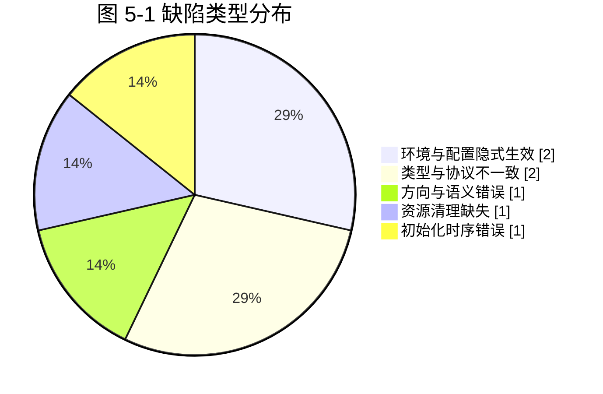

图 5-1 缺陷类型分布图

从缺陷分布可以得到两条工程结论。第一，凡是「由环境隐式决定行为」的设计（D1）都应当改造为显式配置，因为隐式行为在开发机上可能恰好正确，却在他人机器上错误。第二，「静默错误」占比高达一半以上（D1、D4、D5、D6），它们不抛异常、不崩溃，只表现为业务结果不符合预期，因此必须依靠针对业务语义的断言（回执方向、文件是否存在、目录是否正确）而不能只依靠「程序是否报错」来判断测试是否有效。

上述 7 个缺陷来自开发阶段。在此之后的系统测试、验收与答辩前的实机运行中又真实发现并修复了 11 个缺陷，编号 D-08 至 D-18，完整记录见《测试报告》第九节，包括：服务器并发连接上限实际只有 8（长生命周期任务被提交到固定大小线程池）、UDP 自动发现（功能 1）在同机演示场景下始终失败、心跳间隔与文件上限两项配置修改后不生效、集成用例自身的消息竞态、登录成功后连接被登录窗口一并关闭、断连提示重复弹出且原因被覆盖、用户数据文件中残留的头部注释被误报为格式非法（该缺陷已随文件存储方式整体删除而不复存在），以及界面层的好友树选中态被系统外观橙色污染（D-18）。其中两个高严重程度缺陷的暴露路径尤其值得记录：并发上限只有在**真实规模**（9 个以上客户端）下才会出现，登录后断连只有在**经过窗口生命周期**（而非测试代码直接持有客户端对象）时才会出现——前者说明性能与容量指标不能靠单客户端功能测试推断，后者说明界面层与业务层之间的资源所有权必须显式建模，而不能依赖「谁最后关闭谁负责」的隐式约定。

界面皮肤化改造完成后的走查又暴露并修复了三个界面层缺陷，它们共同落在窗口生命周期与 Swing 线程模型这两条规则上。D-15：接收文件时界面整体死锁，文件传输窗口不再重绘、主窗口操作全部挂起，既无异常也无日志；根因是控件创建与文档写入发生在两个线程且持锁顺序相反——网络线程创建窗口时持有 AWT 树锁并等待文档读锁，事件分发线程追加文本时持有文档写锁并等待树锁，线程转储中 chat-receiver 停在 ClientUI.routeFileMessage 的 Window.show 上、AWT-EventQueue-0 停在 FileTransferUI.appendLog 的 JTextArea.append 上，方向正好相反。D-16：同一条私聊或群聊消息被渲染两遍，群聊窗口里两人各发一条却出现 4 行，系统通知也重复；根因是聊天面板既自行注册为 ChatListener、又经主窗口转发一次，叠加服务器把群聊广播回发送者的本地回显。D-17：发送私聊后弹出标题为「与自己私聊」的窗口，根因是服务器的送达回执把发送者与接收者都填成发送者本人，客户端的对端推断在这种自收自发形态下退化成了自己。这三个缺陷由 **Xvfb 虚拟显示加 java.awt.Robot 界面走查**发现，走查共 14 项且全部通过，截图与现场证据见《测试报告》第十二节。

本轮「精简工程」改造又发现并修复了第 18 个缺陷（D-18，严重程度：中）：好友树的选中行除了「头像 + 文字」以外两侧露出橙色，看起来像高亮位置画错了。根因是系统外观与自绘渲染器的叠加——开发机的系统外观是 GTK，GTK 用自己的主题强调色（Ubuntu 为 #E95420 橙色）填充整行选中背景，而自绘渲染器只覆盖图标与文字区域；同时默认渲染器只在树获得焦点时使用选中色、只从图标之后开始填充。修复方法是把树与表格改为基础外观实现、由渲染器把整行填成主题浅蓝、显式覆盖各控件的选中色并改用自绘的展开/收起三角（四步修复的细节见 4.6.6 节）。该缺陷的发现方式与前三个不同：它不是由完整窗口走查发现的，而是由本轮 6 项组件级离屏渲染校验中的「选中行像素断言」发现的（用例编号 UI-03）——断言「选中行不含 #E95420 且含 #CFE9FA 超过 2000 像素」把「颜色不对」这件主观判断变成了可自动判定的事实，这也是把界面缺陷纳入回归体系的可行做法。

从缺陷分布还可以得到第三条工程结论：界面层的缺陷（窗口生命周期、Swing 线程模型、渲染次数、系统外观配色渗透）无法由单元测试与集成测试覆盖——集成测试直接持有客户端对象、不经过窗口，界面渲染次数与配色也不在其断言范围内——必须用真实窗口走查来暴露，因此界面走查是测试体系中不可省略的一环；而当缺陷可以被表述为「某处不应出现某种颜色」时，离屏渲染加像素断言是一种成本更低、可重复执行的补充手段（D-18 即由此发现）。

## 5.7 性能分析

本设计未进行专门的压测，因此本节给出结构性的复杂度与资源边界分析，并说明可复现的测量方法，避免给出无依据的实测数字。

| 维度 | 设计取值或复杂度 | 分析 |
| --- | --- | --- |
| 连接承载 | 单机上限 200 连接，连接线程按需创建、空闲 60 秒回收，等待队列为 SynchronousQueue | 连接处理为 IO 密集型，线程大部分时间阻塞在读取上；按需创建避免了固定线程池让超额连接永久排队的问题，容量上限由配置项显式约束 |
| 登录与鉴权 | 用户查询按主键 O(log n)，口令校验一次 PBKDF2（12 万次迭代） | 12 万次迭代是刻意的抗爆破成本，本机单次散列约几十毫秒，用户几乎无感，攻击者的爆破成本被放大多个数量级 |
| 私聊投递 | 在线表查找 O(1)，单次写操作，另有一次稳定标识判重查询 | 端到端延迟主要由网络往返、判重查询与界面刷新决定；未收到确认时客户端按固定周期重发，上限 3 次 |
| 群聊广播 | O(n)，n 为在线人数 | 广播逐个发送并对单连接异常做隔离，n 为教学规模时无压力 |
| 消息持久化 | 写入一次 INSERT；按用户查询走 sender/receiver 与 create_time 索引；按日期范围查询由索引过滤 | 关系表把「时间范围查询」交给索引而不是全量扫描，记录数增长时仍可维持可控的查询代价 |
| 文件传输 | 发送侧按块随机读取 O(块数)；接收侧顺序写 O(块数)；校验一次流式 SHA-256 O(文件大小) | 内存占用与文件大小无关（单块 64KB）；服务器零存储开销；时间开销的主要构成是一次完整的 SHA-256 计算与网络传输 |
| 内存稳定性 | 每次写对象后调用 reset 释放对象流缓存 | 长时间运行不会因对象流引用缓存而持续增长 |
| 空闲资源回收 | 60 秒超时判定，20 秒扫描周期 | 最坏情况下掉线连接的资源会在 60 至 80 秒内被回收 |

表 5-5 结构性性能分析

可复现的验证方法：单机启动服务器与两个客户端传输一个 100MB 文件，观察服务器进程的内存占用是否保持平稳（验证不缓存文件内容）与传输用时，并结合日志中的块进度计算有效吞吐；同时使用 jcmd 或 jconsole 观察线程数与堆内存曲线，确认对象流未持续增长。上述方法已写入测试报告的执行建议中，但未作为本设计的必测项。

---

# 第六章 总结与展望

## 6.1 完成的工作

本课程设计完成了一个功能完整、可运行的局域网聊天程序，具体成果包括：

1. 需求与设计文档：完成需求分析、系统设计、数据库设计与实现说明四份设计文档，含用例图、架构图、类图、时序图与状态图等 Mermaid 图形。
2. 主源码：约 60 个 Java 文件、约 1.9 万行（含规范中文注释），按九个包分层组织，覆盖公共模型、持久化、业务、服务器、客户端网络与 Swing 界面；界面部分采用无边框自绘窗口、好友树与 Java2D 自绘皮肤，默认头像为平面人形剪影，不使用任何图片资源。
3. 核心功能：局域网自动发现、注册与登录、在线列表实时刷新、私聊、群聊、文件分块传输与完整性校验、历史查询与导出、昵称与密码修改、管理员删除用户、服务器控制台，共 17 项功能需求全部落地；数据持久化统一为 MySQL 三张表，聊天正文加密落盘；可靠投递在网络层与服务端落地，包括稳定消息标识、送达确认、离线消息补投与会话令牌恢复。
4. 测试相关代码 10 个文件，其中 47 个单元测试用例与 7 个集成测试用例全部通过，集成测试真实启动服务器与多个客户端；安全加固另以攻击者视角探针复现攻击路径，17 项断言全部通过。
5. 交付配套：配置文件 config/chat.properties 与模板 config/chat.properties.example、数据库脚本 sql/schema.sql（三张表与升级说明）、IntelliJ IDEA 运行配置 .idea/runConfigurations/、README、测试报告与测试用例表、用户手册、课程设计报告与答辩 PPT 大纲。
6. 工程细节：常量化、配置外部化、口令 PBKDF2 散列与历史散列透明升级、聊天正文 AES-GCM 加密、身份防伪造、反序列化白名单、协议字段边界校验、登录失败限流与账号枚举防护、文件元信息校验与传输登记状态机、UDP 发现限流、文件完整性校验与残缺文件清理、EDT 线程安全、异常与日志体系，以及 18 个真实缺陷的定位与修复记录（D1 至 D7 见本报告 5.6 节，D-08 至 D-18 见《测试报告》第九节）。

## 6.2 技术收获

第一，理解了「协议即约定」的本质。使用对象序列化时，协议的权威定义就是共享的类与枚举，这让我第一次直观看到「双端共用同一份模型代码」如何消除一整类不一致问题，也理解了为什么工业界协议通常需要独立的版本协商与向后兼容设计。

第二，理解了并发不是「加个 synchronized 就完了」。真实项目中需要区分三种不同的共享资源：需要串行化的输出流、需要并发安全但可并行的在线表、需要遍历稳定的观察者列表，它们各自适合不同的并发工具与同步粒度。

第三，理解了「静默错误」比「异常崩溃」更难处理。本设计中被修复的缺陷有一半以上不会报错，只是结果不对。这直接改变了我的测试思路：断言必须针对业务语义（回执方向、文件是否存在、目录是否正确），而不是只判断「有没有抛异常」。

第四，理解了资源清理与失败路径的重要性，以及「安全默认值」的取舍。文件传输在失败时如果不删除残缺文件，用户会得到一个「看起来正常但打不开」的文件，这种问题的危害远大于直接报错；同理，加密口令缺失时宁可让服务器拒绝启动，也不能回退到内置默认口令，因为后者会让密文在用户毫不知情的情况下形同明文。

第五，理解了界面框架的事件模型。Swing 是单线程模型，任何网络回调都必须调度回 EDT；把这条规则固化为基类中的两个方法后，界面代码就不再需要逐个考虑线程问题，这是「用结构约束代替纪律」的一次实践。

## 6.3 不足与改进方向

1. 不支持断点续传。文件传输一旦中断必须重传全部内容。改进方向是在 FILE_REQUEST 中携带已完成块位图，接收方在 FILE_ACCEPT 中回传已接收的块序号，发送方据此跳过已完成块。
2. 协议无版本协商。双端共用同一份类定义，若一端升级而另一端未升级，序列化可能失败。改进方向是在握手阶段交换协议版本号，不一致时给出明确提示而不是抛出序列化异常。
3. 传输层仍不加密。落盘正文已经使用 AES-GCM 加密，但网络传输是 Java 原生序列化的明文 TCP 报文，局域网内抓包可见。改进方向是使用 TLS 封装 Socket，或在应用层引入对称加密与消息认证码。
4. 历史记录分页尚未接入。数据访问层已经具备按主键游标的分页查询能力，但历史查询协议与私聊窗口的「加载更早的消息」入口尚未接线，长会话仍是一次性取回。改进方向是确定分页字段与每页条数，并在界面加载后保持滚动位置不跳动。
5. 消息搜索界面尚未实现。服务端具备关键字检索能力，但客户端没有搜索入口与结果展示。改进方向是复用历史查询的结果渲染，把搜索做成独立的对话框或面板。
6. 消息撤回与已读回执尚未实现。chat_message 已预留 read_flag 与 recalled 两列，协议枚举也已定义对应类型，但业务与界面均未接线。改进方向是结合撤回时限校验与已读状态回写，并在界面标注消息状态。
7. 第 3 轮界面增强只完成了一部分：已交付消息气泡（左右分布、系统消息居中、长文本自动换行）、多行输入（Enter 发送 / Shift+Enter 换行、输入法组合期间不误发）、智能时间戳与空状态；尚未落地未读角标、断线横幅、拖拽与剪贴板发送、表情面板、@ 提醒、引用回复与头像资料卡。本项另经离屏渲染独立验证（16 项断言全部通过）。改进方向是按「先补齐消息状态、再做交互增强」的顺序分批落地，避免一次性改动过大。
8. 会话令牌只保存在服务端内存中，服务器重启后全部失效，断线重连会退化为重新登录。改进方向是把令牌落到数据库或带过期时间的缓存中，并支持主动注销。
9. 广播发现受限于广播域，且部分企业网络会屏蔽 UDP 广播。改进方向是增加静态服务器列表配置与基于组播或服务注册中心的发现方式。
10. 群聊为单一群，不支持自建群与成员管理。改进方向是把群定义为实体（群标识、成员列表、群主），并把广播范围改为群成员集合。
11. 缺乏性能压测与系统化的并发压力测试。改进方向是引入可控的客户端模拟器，测试 200 连接规模下的消息延迟分布与内存曲线。

上述不足构成了本设计继续演进的自然路径，也说明一个「能运行」的教学项目与一个「能上线」的工程系统之间仍有明确差距。

---

# 参考文献

[1] Oracle. Java Platform, Standard Edition 17 API Specification [EB/OL]. https://docs.oracle.com/en/java/javase/17/docs/api/.

[2] Oracle. The Java Tutorials: Custom Networking [EB/OL]. https://docs.oracle.com/javase/tutorial/networking/.

[3] Oracle. The Java Tutorials: Concurrency [EB/OL]. https://docs.oracle.com/javase/tutorial/essential/concurrency/.

[4] Oracle. The Java Tutorials: Creating a GUI With Swing [EB/OL]. https://docs.oracle.com/javase/tutorial/uiswing/.

[5] Oracle. Java Object Serialization Specification [EB/OL]. https://docs.oracle.com/en/java/javase/17/docs/specs/serialization/.

[6] W. Richard Stevens. TCP/IP Illustrated, Volume 1: The Protocols（TCP/IP 详解 卷 1：协议）[M]. 北京：机械工业出版社.

[7] Elliotte Rusty Harold. Java Network Programming（Java 网络编程）[M]. 4th ed. O'Reilly Media.

[8] Cay S. Horstmann. Core Java, Volume I—Fundamentals 与 Volume II—Advanced Features（Java 核心技术 卷 I 基础知识、卷 II 高级特性）[M]. 北京：机械工业出版社.

[9] Joshua Bloch. Effective Java（Effective Java 中文版）[M]. 3rd ed. 北京：机械工业出版社.

[10] Erich Gamma, Richard Helm, Ralph Johnson, John Vlissides. Design Patterns: Elements of Reusable Object-Oriented Software（设计模式：可复用面向对象软件的基础）[M]. 北京：机械工业出版社.

[11] NIST. FIPS PUB 180-4: Secure Hash Standard (SHS) [S]. 2015. https://csrc.nist.gov/publications/detail/fips/180/4/final.

[12] OWASP Foundation. Password Storage Cheat Sheet [EB/OL]. https://cheatsheetseries.owasp.org/cheatsheets/Password_Storage_Cheat_Sheet.html.

[13] J. Postel. RFC 793: Transmission Control Protocol [S]. IETF, 1981. https://www.rfc-editor.org/rfc/rfc793.

[14] J. Postel. RFC 768: User Datagram Protocol [S]. IETF, 1980. https://www.rfc-editor.org/rfc/rfc768.

[15] 张海藩. 软件工程导论[M]. 6 版. 北京：清华大学出版社.

[16] K. Moriarty, B. Kaliski, J. Jonsson, A. Rusch. RFC 8018: PKCS #5: Password-Based Cryptography Specification Version 2.1 [S]. IETF, 2017. https://www.rfc-editor.org/rfc/rfc8018.

[17] NIST. SP 800-38D: Recommendation for Block Cipher Modes of Operation: Galois/Counter Mode (GCM) and GMAC [S]. 2007. https://csrc.nist.gov/publications/detail/sp/800-38d/final.

---

# 附录 A 源文件清单

## A.1 主源码（按包组织，约 60 个文件）

说明：下表按包列出主源码文件及其职责，不逐文件标注行数——源码仍在持续重构与扩展，逐文件行数极易过期；模块级规模以正文表 3-1 的现场统计快照为准。第 3 轮界面增强仍在进行中，其新增文件也在持续加入，完整清单请以仓库现状为准。

| 包 | 文件（相对 src/main/java） | 职责 |
| --- | --- | --- |
| com.chat.common | Message.java | 消息抽象基类，序列化字段、getSummary 抽象方法与广播判定 |
| com.chat.common | TextMessage.java | 文本消息子类，承载聊天内容 |
| com.chat.common | SystemMessage.java | 系统通知与错误消息子类 |
| com.chat.common | FileMessage.java | 文件消息子类，承载传输编号、文件名、大小、块序号、数据与校验和，并做元信息自洽校验 |
| com.chat.common | MessageType.java | 34 种消息类型枚举与安全反查方法 |
| com.chat.common | ChatMessageFactory.java | 消息工厂，统一创建消息、分配全局递增编号，并提供反序列化白名单过滤器与协议字段校验 |
| com.chat.common | User.java | 用户实体，私有字段封装、凭据脱敏与显示名回退 |
| com.chat.common | Constants.java | 全部常量集中定义，消除魔法值 |
| com.chat.common | Config.java | properties 配置加载、系统属性覆盖与语义化配置读取方法 |
| com.chat.common | Result.java | 泛型结果封装，统一表达成功、提示与数据 |
| com.chat.common | UserListCodec.java | 在线用户列表的文本编解码 |
| com.chat.common | FileTransferCodec.java | 文件请求元信息的文本编解码与字段数约束 |
| com.chat.exception | ChatException.java | 受检业务异常基类，携带错误码 |
| com.chat.exception | UserNotFoundException.java | 用户不存在异常 |
| com.chat.exception | FileTransferException.java | 文件传输异常，携带传输编号 |
| com.chat.util | SecurityUtil.java | 盐生成、PBKDF2 口令散列、历史散列兼容校验、常量时间比较与凭据解析 |
| com.chat.util | MessageCipher.java | 聊天正文明文与 AES-GCM 密文之间的加解密与密钥派生 |
| com.chat.util | MessageExporter.java | 聊天记录导出文本的渲染与落盘 |
| com.chat.util | FileUtil.java | 目录创建、大小格式化、流式 SHA-256、分块计算、重名规避、文件名清洗 |
| com.chat.util | DateUtil.java | 线程安全的日期时间格式化与解析 |
| com.chat.dao | BaseDao.java | 泛型数据访问接口 |
| com.chat.dao | UserDao.java | 用户数据访问接口 |
| com.chat.dao | MessageDao.java | 消息数据访问接口，含查询、检索、导出取数与可靠投递支撑方法 |
| com.chat.dao | JdbcUserDao.java | MySQL 用户存储实现，PreparedStatement 防注入 |
| com.chat.dao | JdbcMessageDao.java | MySQL 聊天记录存储实现，写入前加密、读出后解密 |
| com.chat.dao | JdbcFileLogDao.java | MySQL 文件传输日志存储实现 |
| com.chat.service | UserService.java | 注册、登录、口令透明升级、改昵称、改密码、删除与查询业务 |
| com.chat.service | MessageService.java | 消息持久化、历史查询、导出取数、判重与离线补投支撑 |
| com.chat.service | FileService.java | 文件分块发送与接收、序号校验、完整性校验与进度计算 |
| com.chat.service | FileLogService.java | 文件传输结果写入审计表与结果归类 |
| com.chat.server | ChatServer.java | 服务器单例，启动自检、端口绑定、连接线程池、心跳扫描与启动回滚 |
| com.chat.server | ClientHandler.java | 连接处理线程，对象流收发、身份校验、协议边界校验与业务分派 |
| com.chat.server | AbstractMessageHandler.java | 消息分派模板方法基类，显式列举分派类型 |
| com.chat.server | MessageHandler.java | 消息处理接口定义 |
| com.chat.server | UserManager.java | 在线用户表、广播与观察者列表 |
| com.chat.server | DiscoveryResponder.java | UDP 局域网发现应答器，含报文校验与来源限流 |
| com.chat.server | ServerObserver.java | 服务器观察者接口 |
| com.chat.server | ServerUI.java | 服务器 Swing 控制台 |
| com.chat.client | ChatClient.java | 客户端网络门面，接收线程、发送池、心跳、重连与待确认消息重发 |
| com.chat.client | ChatListener.java | 客户端消息与连接状态回调接口 |
| com.chat.client | DiscoveryClient.java | UDP 发现客户端，枚举全部网卡广播地址 |
| com.chat.client | ChatClientApp.java | 客户端命令行入口与日志配置 |
| com.chat.client.ui | BaseUI.java | 界面基类，外观、字体、居中、提示框与 EDT 调度 |
| com.chat.client.ui | BaseChatPanel.java | 聊天面板基类，富文本显示、输入发送与发送文件入口 |
| com.chat.client.ui | LoginUI.java | 登录、注册、发现服务器与修改密码界面 |
| com.chat.client.ui | ClientUI.java | 主界面，好友树、功能按钮与消息分派 |
| com.chat.client.ui | PrivateChatUI.java | 私聊窗口，负责窗口装配与标题 |
| com.chat.client.ui | PrivateChatPanel.java | 私聊面板，覆写过滤条件、发送目标与文件接收方 |
| com.chat.client.ui | GroupChatUI.java | 群聊窗口，负责窗口装配、注入在线用户名单 |
| com.chat.client.ui | GroupChatPanel.java | 群聊面板，接收群聊消息与系统通知，支持群发文件 |
| com.chat.client.ui | FileTransferUI.java | 文件传输界面，进度条、传输日志与立即发送入口 |
| com.chat.client.ui | OnlineUserTree.java | 好友树，分组、过滤、离线置灰与选中态配色 |
| com.chat.client.ui | MessageBubble.java | 消息气泡渲染组件（第 3 轮已交付并提交，见提交 a22c129；经离屏渲染独立验证 16 项断言全部通过） |
| com.chat.client.ui.theme | Theme.java | 配色、字体探测、全局外观与选中色 |
| com.chat.client.ui.theme | Glyphs.java | Java2D 绘制的界面图标与树形三角 |
| com.chat.client.ui.theme | AvatarFactory.java | 默认头像绘制与缓存 |
| com.chat.client.ui.theme | SkinButton.java | 自绘按钮四种形态 |
| com.chat.client.ui.theme | SkinTitleBar.java | 自绘标题栏与窗口按钮 |
| com.chat.client.ui.theme | WindowResizer.java | 无边框窗口缩放手柄 |

## A.2 测试相关代码（10 个文件）

| 文件（相对 src/test/java） | 职责 |
| --- | --- |
| com/chat/test/Test.java | 自定义测试注解，值为用例说明 |
| com/chat/test/TestRunner.java | 反射执行测试、断言方法、临时目录辅助与结果汇总 |
| com/chat/test/TestDatabase.java | 把连接串中的库名替换为独立测试库并保证库存在 |
| com/chat/test/SecurityUtilTest.java | 口令安全 7 个用例 |
| com/chat/test/UserDaoTest.java | 用户持久化 7 个用例 |
| com/chat/test/UserServiceTest.java | 用户业务 9 个用例 |
| com/chat/test/MessageServiceTest.java | 消息模型与持久化 12 个用例 |
| com/chat/test/FileServiceTest.java | 文件传输与工具 12 个用例 |
| com/chat/test/IntegrationTest.java | 端到端集成测试 7 个用例 |
| com/chat/test/JarPackager.java | 把编译产物打成可执行 jar 的打包辅助类 |

说明：单元测试类 5 个（47 个用例），集成测试类 1 个（7 个用例），另有测试注解、反射执行器、测试库辅助与打包辅助各 1 个。

## A.3 其他交付物

| 类别 | 路径 | 说明 |
| --- | --- | --- |
| 配置文件 | config/chat.properties | 端口、发现端口、最大连接数、心跳、接收目录、文件上限、管理员初始口令、数据库连接与聊天记录加密口令 |
| 配置模板 | config/chat.properties.example | 配置模板，不含任何真实口令，供部署时复制修改 |
| 数据库脚本 | sql/schema.sql | 三张表的建表脚本、已有数据库升级说明与常用查询示例 |
| IDE 运行配置 | .idea/runConfigurations/ | 客户端（可多开）、客户端（含内置服务器）、服务器（图形控制台）、单元测试（47 用例）、集成测试（7 用例）五个运行配置；工作目录为项目根目录 |
| 数据目录 | data/ | received 接收文件、export 导出文件（用户与聊天记录存数据库，磁盘上不再保留用户数据与聊天记录文件） |
| 设计文档 | docs/design/ | 需求分析、系统设计、数据库设计、实现说明 |
| 测试文档 | docs/test/ | 测试报告与测试用例表 |
| 报告与答辩 | docs/report/、docs/ppt/ | 课程设计报告与答辩 PPT 大纲 |

# 附录 B 运行截图说明清单

答辩与报告提交时需要附上真实运行截图，建议按下列清单逐张截取，每张注明图号与说明文字。

| 图号 | 截图内容 | 获取步骤 |
| --- | --- | --- |
| 图 B-1 | 服务器控制台启动成功 | 在 IDEA 中运行「服务器（图形控制台）」配置，截取显示监听地址、端口与「服务器已启动」事件日志的窗口 |
| 图 B-2 | 登录界面与自动发现结果 | 打开客户端，点击「发现服务器」，截取服务器地址被自动回填、状态提示为发现成功的界面 |
| 图 B-3 | 主界面好友树 | 使用两个不同账号登录，截取主界面左侧好友树中出现两个用户、底部状态栏显示已连接 |
| 图 B-4 | 两人私聊 | 从用户列表选中对端打开私聊窗口，互发若干条消息，截取带有不同颜色区分的对话记录 |
| 图 B-5 | 群聊广播 | 打开群聊窗口发送一条消息，截取两个客户端窗口同时显示该消息的画面（可并排截图） |
| 图 B-6 | 文件传输进度 | 在私聊窗口中点击「发送文件」发送一个较大文件（群聊窗口的同一按钮则群发给全部在线用户），在传输过程中截取进度条与传输日志；传输完成后截取成功提示与保存路径 |
| 图 B-7 | 文件完整性验证 | 在接收目录查看文件，与源文件对比大小，并截取校验通过的传输日志 |
| 图 B-8 | 历史记录查询与导出 | 打开历史查询对话框，按日期范围查询，截取结果列表；导出后截取 data/export 下的文本文件内容，注意文件头部标注的「数据来源: 服务器 ip:port」 |
| 图 B-9 | 口令安全验证 | 用数据库客户端查询 chat_user 表，截取某用户的 salt 与 password_hash 字段（确认无明文口令、散列带 pbkdf2$ 前缀），注意遮挡无关内容 |
| 图 B-10 | 单元测试全部通过 | 在 IDEA 中运行「单元测试（47 用例）」配置，截取控制台末尾的「通过: 47 失败: 0 结论: 全部通过」 |
| 图 B-11 | 集成测试全部通过 | 在 IDEA 中运行「集成测试（7 用例）」配置，截取 7 个用例逐条通过的控制台输出 |
| 图 B-12 | 异常场景提示 | 分别制造密码错误、连续失败触发锁定、对端离线、超过 200MB 文件四种情况，截取界面上可读的中文错误提示 |

截图命名建议为「图B-编号-内容.png」，统一放入 docs/report/images/ 目录后再插入本报告相应位置。

