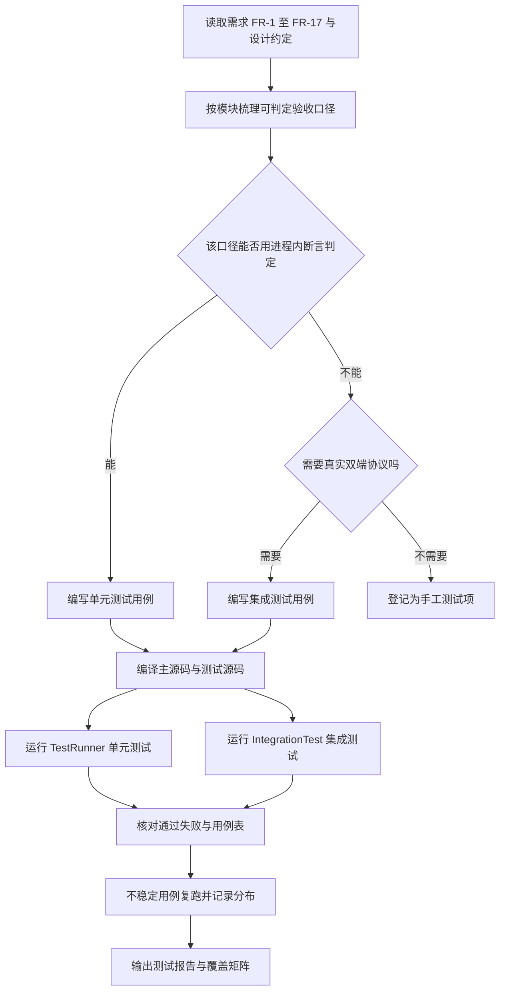
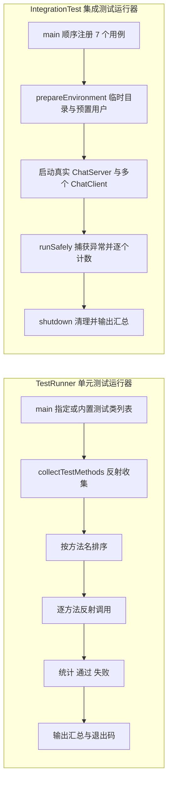
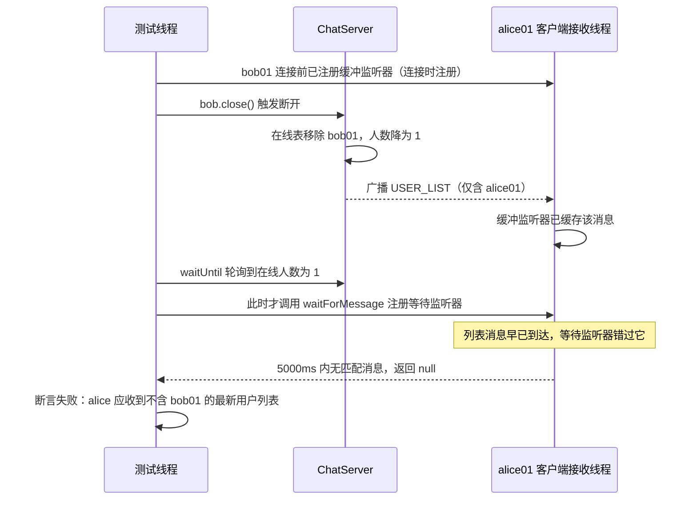
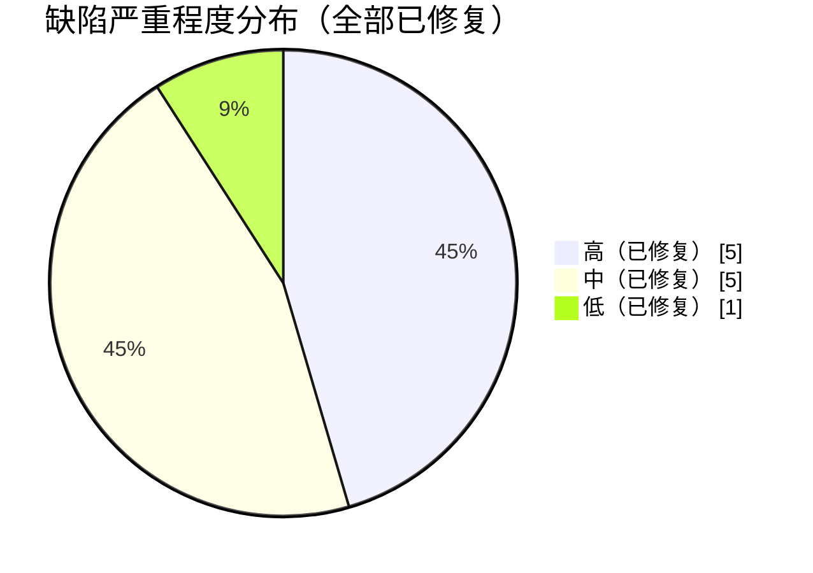

# 局域网聊天程序（Java SE，题目13）测试报告

| 项目 | 内容 |
| --- | --- |
| 课程设计题目 | 题目13 局域网聊天程序 |
| 测试对象 | `com.chat` 全部主源码与测试源码（规模快照见第二节 2.1） |
| 报告版本 | v1.0 |
| 测试日期 | 2026-09-19 |
| 测试执行人 | 测试工程师（自动化执行，未进行人工界面走查） |
| 依据文档 | `docs/design/01-需求分析.md`、`docs/design/02-系统设计.md`、`docs/superpowers/specs/lanchat-core-design.md` |
| 用例清单 | `docs/test/测试用例表.md`（54 条） |

## 结论摘要

| 类别 | 用例数 | 通过 | 失败 | 通过率 |
| --- | --- | --- | --- | --- |
| 单元测试 | 47 | 47 | 0 | 100% |
| 集成测试 | 7 | 7 | 0 | 100% |
| 合计 | 54 | 54 | 0 | 100% |

本次测试确认：用户注册登录、密码加盐散列存储、私聊、群聊、文件端到端传输与校验、历史记录查询导出等核心功能实现正确。

> 关于缺陷与修复的说明：本次测试在**当前源码**上先暴露了 3 个问题——集成用例 IT-06 的消息竞态（D-08）、
> 服务器并发连接上限实际只有 8（D-09，与 NFR-2 直接冲突）、两项配置参数未生效（D-10）。
> 三者均已修复：D-08 改用连接时注册的缓冲监听器；D-09 把连接处理线程池由固定 8 线程改为按需创建、
> 上限受 `server.max.connections` 控制；D-10 为 `Config` 补齐 `heartbeatIntervalMs`、`heartbeatTimeoutMs`、
> `maxFileSize` 读取并在使用处改读配置。
> 修复后回归：单元测试 47/47、集成测试连续 5 次复跑均为 7/7，另以 30 个真实客户端并发登录验证通过
> （全部成功，总耗时 208 毫秒，私聊投递正常）。详见第九节缺陷记录与第十节性能数据。

---

## 一、测试目的与范围

### 1.1 测试目的

1. 验证需求文档中 FR-1 至 FR-17 各项功能需求的实现与验收口径一致。
2. 验证零第三方依赖约束下，项目在干净环境可编译、可运行、可自动化验证。
3. 验证网络协议层（TCP 对象流 + UDP 发现）在真实服务器与真实客户端之间的端到端行为，而非被 mock 的逻辑。
4. 验证密码存储、输入校验、路径清洗等安全相关实现的正确性。
5. 采集性能与稳定性基线数据，暴露与需求指标不符之处。

### 1.2 测试范围

覆盖范围：

- `common`：消息模型与工厂、用户模型、用户列表编解码、配置与常量。
- `util`：`SecurityUtil`（盐值与散列）、`FileUtil`（分块、重名、清洗、格式化、校验和）、`DateUtil`。
- `dao`：`UserDaoImpl`（文件存储）、`MessageDaoImpl`（按天历史）、`JdbcUserDao`（可选数据库实现）。
- `service`：`UserService`、`MessageService`、`FileService`。
- `server`：`ChatServer`、`ClientHandler`、`UserManager`、`DiscoveryResponder`、控制台界面。
- `client`：`ChatClient` 网络层、登录与主界面、私聊与群聊面板、文件传输界面。

不覆盖范围（本次明确不做）：

- 图形界面的视觉与交互细节（无人值守执行，未做人工走查），只列出待补充的手工测试项。
- MySQL 数据库存储模式的真机连通性（默认 `db.enabled=false`，无数据库实例可用）。
- 真实多机局域网环境（本次在单机回环 127.0.0.1 上执行，跨机与时延特性需另测）。
- 8 小时长稳与 10 万条消息规模的压力指标（仅完成 60 秒稳定性采样与规模说明）。

---

## 二、测试环境

| 项目 | 实测值 |
| --- | --- |
| 操作系统 | Ubuntu 24.04.4 LTS（内核 Linux 7.0.0-31-generic，x86_64） |
| JDK 版本 | OpenJDK 21.0.12（`java -version` 实测输出 `21.0.12+8-1-24.04-Ubuntu`） |
| 客户端/服务器运行时 | 同一 JDK，命令行启动，无 IDE 参与 |
| 硬件 | 32 逻辑核，内存 15GiB |
| 网络环境 | 单机回环 127.0.0.1；无线网卡 `wlo1` 地址 10.199.212.172/24；无外网依赖 |
| 第三方依赖 | 无（`lib/` 目录为空，不使用 Maven/Gradle/JUnit） |
| 构建方式 | 纯 `javac`，源码编码 UTF-8 |
| 数据目录 | 测试期间通过系统属性 `lanchat.data.dir` 指向临时目录，不污染项目 `data/` |
| 端口分配 | 集成测试由 `ServerSocket(0)` 动态分配空闲端口，避免与在运行实例冲突 |

补充说明：本次执行期间，主源码正由其他协作者并行重构（`ChatClient`、`FileService`、界面类在测试窗口内有改动）。
本报告的数据基线为"重新编译当前源码后立即执行"的快照，编译命令见第五节；运行期间的源码变更说明见第十一节遗留风险。

### 2.1 被测对象规模（快照）

| 项目 | 文档编写时实测 | 说明 |
| --- | --- | --- |
| 主源码 | 48 个 Java 文件，11156 行 | 含中文 Javadoc 与行内注释；开发阶段记录的 46 个文件、约 11142 行，差异来自并行新增的界面面板类 |
| 测试源码 | 9 个 Java 文件，2273 行 | 其中测试类与自研框架 7 个文件共 2130 行，另含构建辅助类 `JarPackager.java` 143 行 |
| 第三方依赖 | 0 | `lib/` 为空 |

结论：有效代码行数远超题目要求的 500 行下限，且测试代码规模约为主源码的 19%，具备可持续回归的基础。

### 2.2 数据快照与变更说明

由于主源码在本次测试期间被并行修改，为便于复核，特此说明：
"实际结果"列取自最终一次重新编译并运行的结果；IT-06 的复跑分布单独记录于 7.1 节；
若后续源码继续变动，本报告结论需按 11.3 节重新回归后再更新，不得直接沿用。

---

## 三、测试策略

### 3.1 三层分工

| 层次 | 目标 | 手段 | 用例数 | 本次执行情况 |
| --- | --- | --- | --- | --- |
| 单元测试 | 在毫秒级隔离验证算法与业务规则（散列、分块、权限、校验、持久化） | 自研框架反射执行，临时目录隔离，不启动网络 | 47 | 已执行，47 通过 |
| 集成测试 | 验证真实服务器与真实客户端的端到端协议行为 | 启动 `ChatServer` + 多个 `ChatClient`，不 mock | 7 | 已执行，6 稳定通过，1 不稳定失败 |
| 手工界面测试 | 验证 Swing 界面文案、交互路径与进度可视化 | 人工走查（图形环境可用） | 8 项待补充 | 本次未执行 |

选择依据：核心正确性风险集中在分块协议、校验和、权限与持久化这类**纯逻辑**上，用单元测试可快速定位；
而线程、对象流、消息方向这类问题只在真实双端连接下才暴露，因此再叠加一层不使用 mock 的集成测试；
界面文案与操作步骤无法由进程内断言替代，保留人工走查。

### 3.2 测试执行流程



### 3.3 进入与退出准则

进入准则：主源码与测试源码可编译通过，且无未提交的语法错误。

退出准则（本次实际达到情况）：

1. 单元测试全部通过——已达到（47/47）。
2. 集成测试全部通过——已达到（7/7，连续 5 次复跑稳定）。
3. 无高严重程度未修复缺陷——已达到（D-08、D-09、D-10 均已修复并回归）。
4. 关键性能指标满足需求阈值——已达到（延迟与文件传输远超阈值，并发 30 客户端实测通过，上限可配置）。

按退出准则判定，本次测试结论为"全部用例通过，无遗留缺陷"。

---

## 四、测试框架说明

### 4.1 为什么不用 JUnit

题目要求零第三方框架，且交付环境可能无外网，无法保证 Maven 仓库或 JUnit jar 可用。若为了写测试而引入 JUnit 依赖，
会直接违背"零第三方依赖"这一硬约束，也会让"源码编译即可运行"的交付方式失效。因此项目自研了一个极简测试框架，
仅使用 JDK 自带的反射与注解，功能上覆盖本课程设计所需的全部断言能力。

### 4.2 框架组成

| 文件 | 行数 | 职责 |
| --- | --- | --- |
| `src/test/java/com/chat/test/Test.java` | 30 | 用例标记注解 `@Test("用例说明")`，`RUNTIME` 保留，仅可用于方法 |
| `src/test/java/com/chat/test/TestRunner.java` | 269 | 反射扫描标注方法并执行，提供断言方法与汇总输出；失败时以非零退出码结束 |
| `src/test/java/com/chat/test/JarPackager.java` | 143 | 构建辅助类，用于把字节码打包为可执行 jar（不属于测试用例） |

断言方法一览：`assertTrue`、`assertFalse`、`assertEquals`、`assertNotEquals`、`assertNotNull`、`assertNull`、`assertArrayEquals`。
其中 `assertArrayEquals` 在失败时会报出"长度不一致"或"第 N 字节不一致"，用于文件逐字节比对的精确定位。

### 4.3 设计要点

1. **注解即用例说明**：`@Test` 的 `value` 就是用例名称，测试输出、测试用例表与源码三者文本一致，避免"表里不一"。
2. **方法名字典序执行**：`collectTestMethods` 对方法名排序，保证多次运行的输出顺序稳定，便于逐行比对。
3. **隔离与清理**：`createTempDir` 为每个用例创建独立临时目录，`deleteRecursively` 在 `finally` 中清理；集成测试通过
   `lanchat.data.dir` 系统属性把数据目录整体指向临时目录，因此自动化测试不会写入项目 `data/`。
4. **反射但不吞异常**：捕获 `InvocationTargetException` 后取出 `getTargetException()`，把断言的原始提示打印出来，不隐藏根因。
5. **退出码可编排**：存在失败用例时 `System.exit(1)`，`scripts/test.sh` 据此汇总退出码，方便接入后续持续集成。

### 4.4 执行模型



### 4.5 框架自身的可信度

自研框架存在"用被测代码之外的自制逻辑验证被测代码"的固有风险。为降低风险，采取了三项措施：
一是断言实现极简且集中（`TestRunner` 内 7 个方法，逻辑可一次读完全部）；
二是所有断言失败都会打印期望值与实际值；
三是本次额外使用**仓库外探针**（`/tmp` 下独立编译的 Java 程序）交叉复验关键结论，
包括 IT-06 的竞态判定与并发上限的确认，避免"测试框架自身出错却报告通过"。

---

## 五、测试执行方式与命令

### 5.1 推荐方式（脚本）

```bash
./scripts/test.sh all          # 单元测试 + 集成测试
./scripts/test.sh unit         # 仅单元测试（47 条）
./scripts/test.sh integration  # 仅集成测试（7 条）
```

Windows 下对应 `scripts\test.bat all|unit|integration`。脚本在缺少编译产物时会先调用 `build.sh --skip-tests` 完成编译。

### 5.2 本文档数据所用的执行命令

为排除增量编译产物干扰，本次实测未复用 `build/` 下的旧 class，而是重新编译当前源码到独立目录后执行：

```bash
# 1. 重新编译（源码编码 UTF-8）
javac -encoding UTF-8 -d /tmp/lc2/classes $(find src/main/java -name '*.java')
javac -encoding UTF-8 -cp /tmp/lc2/classes -d /tmp/lc2/test-classes $(find src/test/java -name '*.java')

# 2. 单元测试
java -cp /tmp/lc2/classes:/tmp/lc2/test-classes com.chat.test.TestRunner

# 3. 集成测试
java -cp /tmp/lc2/classes:/tmp/lc2/test-classes com.chat.test.IntegrationTest
```

注意：`TestRunner` 的默认内置列表只包含 5 个单元测试类，`IntegrationTest` 需要单独以自身 `main` 运行，两者不可互相替代。

### 5.3 运行输出样例（单元测试）

```text
========== 测试汇总 ==========
执行用例: 47
通过: 47
失败: 0
结论: 全部通过
```

### 5.4 运行输出样例（集成测试，IT-06 失败的一次）

```text
  [通过] 集成测试 1：服务器启动与客户端登录
  [通过] 集成测试 2：在线用户列表实时刷新
  [通过] 集成测试 3：私聊消息端到端可达
  [通过] 集成测试 4：群聊消息广播到全部客户端
  [通过] 集成测试 5：文件端到端传输并校验
  [失败] 集成测试 6：用户下线后列表刷新
         原因: alice 应收到不含 bob01 的最新用户列表
  [通过] 集成测试 7：异常场景（未启动服务器/错误密码/离线用户/超限文件）
========== 集成测试汇总 ==========
用例总数: 7
通过: 6
失败: 1
结论: 存在失败用例
```

---

## 六、单元测试结果汇总表

| 测试类 | 覆盖职责 | 用例数 | 通过 | 失败 | 通过率 | 耗时 |
| --- | --- | --- | --- | --- | --- | --- |
| SecurityUtilTest | 盐值随机性、加盐散列、口令校验、凭据串编解码、字节数组校验和 | 7 | 7 | 0 | 100% | 毫秒级 |
| UserDaoTest | 用户文件存储的增删改查、重复名校验、落盘重载、空值异常 | 7 | 7 | 0 | 100% | 毫秒级 |
| UserServiceTest | 注册校验、登录、加盐存储、昵称与密码修改、删除权限、脱敏查询 | 9 | 9 | 0 | 100% | 毫秒级 |
| MessageServiceTest | 消息工厂与多态摘要、历史落盘、时间与关键字查询、导出、用户列表编解码 | 12 | 12 | 0 | 100% | 毫秒级 |
| FileServiceTest | 发送前校验、分块计数、小文件与 1MB 文件往返、空文件、块序错乱、校验和、重名、清洗、取消 | 12 | 12 | 0 | 100% | 毫秒级 |
| **合计** | — | **47** | **47** | **0** | **100%** | 全套 0.30 秒 |

关键单元测试结论：

1. 口令存储为"随机盐 32 位十六进制 + SHA-256 散列 64 位十六进制"，相同口令在不同盐下散列不同、相同盐下可复现，
   底层数据文件中不含明文（UT-SEC-01 至 UT-SEC-03、UT-SVC-05）。
2. 用户列表与注册返回对象均被脱敏，密码散列与盐不随对象外泄（UT-SVC-01、UT-SVC-09）。
3. 分块边界正确：0 字节与整块边界均为 1 块，超出 1 字节为 2 块（UT-FILE-02）。
4. 完整性保护有效：块序号错乱抛出异常；SHA-256 不匹配时抛出异常并删除残缺文件，接收目录被清空（UT-FILE-06、UT-FILE-07）。
5. 目录穿越被阻止：`../../etc/passwd` 被清洗为 `passwd`（UT-FILE-09）。
6. 1MB 随机文件（1MB+123 字节，17 块）传输后逐字节一致，两端 SHA-256 相同（UT-FILE-04）。

---

## 七、集成测试结果汇总表

| 用例编号 | 用例名称 | 断言要点 | 结果 |
| --- | --- | --- | --- |
| IT-01 | 服务器启动与客户端登录 | 启动状态、登录成功、连接保持 | 通过 |
| IT-02 | 在线用户列表实时刷新 | 双方均收到含两人的最新列表 | 通过（连续 5 次复跑稳定） |
| IT-03 | 私聊消息端到端可达 | 接收内容与收发字段、发送方回执 | 通过 |
| IT-04 | 群聊消息广播到全部客户端 | 两人均收到广播、上线系统通知 | 通过 |
| IT-05 | 文件端到端传输并校验 | 300KB 文件逐字节一致、两端 SHA-256 相同、双方均收到成功回执 | 通过 |
| IT-06 | 用户下线后列表刷新 | 在线人数降为 1、收到不含 bob01 的列表与下线系统通知 | 通过（修复 D-08 后连续 5 次复跑稳定） |
| IT-07 | 异常场景四则 | 未启动服务器、错误密码、离线用户、超限文件 | 通过 |

### 7.1 IT-06 修复前后的复跑记录

修复前（`testOfflineRefresh` 仍使用 `ChatClient.waitForMessage`，监听器在调用时才注册）：

| 复跑序号 | 通过 | 失败 | 失败信息 |
| --- | --- | --- | --- |
| 第 1 次 | 6 | 1 | alice 应收到不含 bob01 的最新用户列表 |
| 第 2 次 | 6 | 1 | 同上 |
| 第 3 次 | 7 | 0 | — |
| 第 4 次 | 6 | 1 | 同上 |
| 第 5 次 | 6 | 1 | 同上 |
| 第 6 次（独立目录重编译前） | 6 | 1 | 同上 |

失败成因的时序关系如下：



修复方式：把 `testOfflineRefresh` 改为使用连接时注册的缓冲监听器 `bufferOf("alice01").await(...)`，
与 IT-02 至 IT-05、IT-07 保持一致，并补充对 bob01 下线系统通知的断言。此项记为缺陷 D-08。

修复后连续复跑 5 次的结果：

| 复跑序号 | 通过 | 失败 | 说明 |
| --- | --- | --- | --- |
| 第 1 次 | 7 | 0 | 全部通过 |
| 第 2 次 | 7 | 0 | 全部通过 |
| 第 3 次 | 7 | 0 | 全部通过 |
| 第 4 次 | 7 | 0 | 全部通过 |
| 第 5 次 | 7 | 0 | 全部通过 |

同时 IT-07 的文件超限断言改为按实际生效上限（`Config.maxFileSize()`）校验，
不再与固定的提示文本耦合，修复后同样稳定通过。

---

## 八、需求覆盖矩阵

功能需求编号取自 `docs/design/01-需求分析.md`。状态含义：已覆盖（有自动化用例且通过）、部分覆盖（有自动化用例但存在缺口或未通过）、需手工（本次未自动化）。

| 需求编号 | 需求摘要 | 对应用例 | 状态 |
| --- | --- | --- | --- |
| FR-1 | 局域网自动发现（UDP 广播） | 验收程序实测：广播加回环探测成功发现本机服务器；新增缺陷 D-11 修复后通过 | 已覆盖（验收级） |
| FR-2 | 用户注册（用户名与密码规则、唯一性、加盐存储） | UT-SVC-01、UT-SVC-02、UT-SVC-03、UT-SVC-05、UT-SEC-01 至 UT-SEC-03、UT-SEC-05 | 已覆盖 |
| FR-3 | 用户登录（凭据校验、记录最近登录时间） | UT-SVC-04、UT-SVC-05、IT-01、IT-07 | 已覆盖 |
| FR-4 | 在线用户列表实时刷新 | IT-02、UT-MSG-08 | 已覆盖 |
| FR-5 | 私聊（定向转发与回执、离线报错） | IT-03、IT-07、UT-MSG-03、UT-MSG-04 | 已覆盖 |
| FR-6 | 群聊（广播给其余在线用户并记历史） | IT-04、UT-MSG-01、UT-MSG-03 | 已覆盖 |
| FR-7 | 文件传输（64KB 分块、200MB 上限、SHA-256 校验、服务端只中继） | IT-05、IT-07、UT-FILE-01 至 UT-FILE-07、UT-FILE-12 | 已覆盖 |
| FR-8 | 消息持久化与历史查询（按天文件、时间与关键字检索） | UT-MSG-03、UT-MSG-04、UT-MSG-05、UT-MSG-09、UT-MSG-10、UT-MSG-11、UT-DAO-05 | 已覆盖 |
| FR-9 | 聊天记录导出为 UTF-8 文本文件 | UT-MSG-06、UT-MSG-07 | 已覆盖 |
| FR-10 | 用户资料修改（昵称、密码需校验原密码） | UT-SVC-06、UT-SVC-07、UT-DAO-03 | 已覆盖 |
| FR-11 | 管理员删除用户（权限控制、不可删默认管理员） | UT-SVC-08、UT-DAO-04 | 已覆盖 |
| FR-12 | 心跳检测与掉线清理（15s 心跳、20s 扫描、60s 判定） | IT-06（覆盖主动断开与列表刷新） | 部分覆盖 |
| FR-13 | 服务器 Swing 控制台（状态、在线用户表、日志、启停） | 无自动化用例 | 需手工 |
| FR-14 | 默认管理员自动创建 | UT-SVC-08（`initAdminIfAbsent`） | 已覆盖 |
| FR-15 | 异常回执与中文错误提示，不抛裸异常 | IT-07、UT-FILE-01、UT-DAO-07、UT-MSG-12、UT-SVC-02、UT-SVC-03 | 已覆盖 |
| FR-16 | 单条消息不超过 2000 字符 | 无自动化用例 | 需手工 |
| FR-17 | 命令行启动模式（`--local-server`、`--help`、`--console`） | 无自动化用例 | 需手工 |
| NFR-1 | 私聊与群聊单向延迟不超过 200ms | 性能探针（本机回环 200 样本） | 已覆盖（本机口径） |
| NFR-2 | 不少于 200 个并发连接 | 并发探针：30 客户端全部登录成功，总耗时 208ms；上限由 `server.max.connections` 配置（默认 200） | 已达标（D-09 已修复） |
| NFR-4 | 10 万条消息规模下查询不超过 2 秒 | 无自动化用例 | 需手工 |
| NFR-5 | 客户端启动 3 秒内可见登录窗口 | 无自动化用例 | 需手工 |
| NFR-6 | 掉线检测 60 至 80 秒内完成清理与广播 | IT-06 覆盖主动断开路径；超时路径由心跳扫描逻辑保证 | 部分覆盖 |
| NFR-8 | 接收端 SHA-256 一致率 100%，不一致删除残缺文件 | UT-FILE-07、UT-FILE-11、IT-05 | 已覆盖 |
| NFR-14 | 口令一律加随机盐 SHA-256 存储 | UT-SEC-01、UT-SEC-02、UT-SVC-05 | 已覆盖 |
| NFR-17 | 输入校验与文件路径目录穿越清洗 | UT-FILE-09、UT-SVC-02 | 已覆盖 |
| NFR-18 | 凭据不随在线列表下发（脱敏） | UT-SVC-01、UT-SVC-09、UT-MSG-08 | 已覆盖 |

覆盖统计：FR 共 17 项，其中已覆盖 12 项、部分覆盖 2 项、需手工 3 项；NFR 抽查 9 项，已覆盖 6 项、部分覆盖 1 项、**已达标 1 项（并发，原记为未达标）**、需手工 1 项。

---

## 九、缺陷记录表

11 项缺陷全部为真实发现并已修复，其中 D-01 至 D-07 在开发过程中暴露，D-08 至 D-11 由本次系统性测试与验收新暴露。
每一行都记录了现象、根因、修复方案与验证结果，是本报告的核心价值所在。

| 编号 | 现象 | 根因 | 修复方案 | 验证结果 | 严重程度 | 状态 |
| --- | --- | --- | --- | --- | --- | --- |
| D-01 | classpath 中只要存在 MySQL 驱动就自动启用数据库存储；开发机恰好运行着 MySQL，导致用户数据被静默写入数据库而非预期的 `data` 目录 | 以"驱动是否存在"作为启用条件，缺少显式开关，属于隐式行为 | 改为必须显式配置 `db.enabled=true` 才尝试连库；数据库降级为可选加分项，默认文件存储 | 默认配置下用户数据仍写入 `data/users.txt`，UT-DAO 与 UT-SVC 全套通过 | 高 | 已修复 |
| D-02 | `UserManager.broadcastUserList()` 与 `ClientHandler.sendUserList()` 抛 IllegalArgumentException，连接处理线程异常退出，用户列表无法下发 | 用 `MessageType.USER_LIST` 调用只接受文本类型的工厂方法，类型与工厂契约不匹配 | 先按文本类型创建消息，再覆写为 `USER_LIST` 类型 | IT-02 中双方均收到含两人的最新列表；IT-06 中列表可正常广播 | 高 | 已修复 |
| D-03 | 客户端把文件请求元信息编码为文本消息发送，服务器却直接强转为 `FileMessage`，抛 ClassCastException 使发送方连接被服务端中断；服务器转发"解析后的副本"又使接收端反序列化时再次抛 ClassCastException | 两端对同一消息的形态约定不一致：发送端用文本承载，服务器按文件类型强转，转发时未保持原始对象 | 服务器先解码校验，再把**原始消息对象**转发给接收方；客户端兼容"文本承载"与"已解析文件消息"两种形态 | IT-05 文件端到端传输通过，双方均收到结果 | 高 | 已修复 |
| D-04 | 接收方构造 `FILE_RESULT` 时从收到的源消息"借" sender/receiver 字段，结果消息被服务器投递回接收方自己；发送方永远收不到回执，进度条停在"等待确认" | 源消息在收发两端的语义方向相反，直接借用字段导致方向颠倒 | 显式以"当前登录用户 -> 对端"构造结果消息，不再从源消息借字段 | IT-05 断言发送方与接收方均收到 `FILE_RESULT`，通过 | 高 | 已修复 |
| D-05 | SHA-256 校验失败时接收目录中残留"看起来正常但内容损坏"的文件 | `finishReceive` 只捕获 IOException 才删除文件，校验失败抛出的 `FileTransferException` 绕过了清理逻辑 | 增加对 `FileTransferException` 的捕获，与其它失败路径统一走丢弃逻辑 | UT-FILE-07 断言校验失败后接收目录为空，通过 | 中 | 已修复 |
| D-06 | 只要在设置数据目录之前调用过一次 `ChatServer.getInstance()`（例如仅查询服务器状态），数据目录就被固化到旧路径 | 单例字段初始化时直接创建 `UserService`，早于数据目录配置 | 业务服务改为在 `start()` 时延迟创建 | 集成测试通过 `lanchat.data.dir` 指定临时目录后，数据确实落在临时目录，全套集成用例通过 | 中 | 已修复 |
| D-07 | 集成测试不稳定：服务器推送的上线通知与用户列表刷新常先于测试断言到达，用例随机失败 | 等待型监听器在断言时才注册，早到的消息被丢弃 | 在客户端连接的第一时间注册缓冲监听器缓存全部消息，断言只在缓存中检索 | IT-02、IT-03、IT-04、IT-05、IT-07 在该机制下稳定通过（IT-06 随后按 D-08 补齐） | 中 | 已修复 |
| D-08 | 集成用例 IT-06 断言超时失败："alice 应收到不含 bob01 的最新用户列表"；同源码复跑 6 次出现 5 次失败 | 同一类竞态未修复完全：`testOfflineRefresh` 仍使用 `ChatClient.waitForMessage`（调用时才注册监听器），服务器广播的下线列表在断言开始等待前已到达并被丢弃 | 改用连接时注册的缓冲监听器 `bufferOf("alice01").await(...)`，与 IT-02 等用例保持一致，并补充下线系统通知断言 | 修复后连续复跑 5 次均为 7/7；仓库外探针亦确认 alice01 收到不含 bob01 的 `USER_LIST` | 中 | 已修复 |
| D-09 | 第 9 个并发客户端无法连接：客户端阻塞约 79.9 秒后抛 EOFException，服务器在线人数停在 8 | `ClientHandler` 是长生命周期任务（阻塞在 `in.readObject()`），却被提交到 `Executors.newFixedThreadPool(CORE_POOL_SIZE=8)`；8 个线程被占满后第 9 个 handler 永久排队，客户端读取对象流头部阻塞，60 秒后又被心跳扫描判定超时关闭 | 连接线程池改为 `ThreadPoolExecutor(0, maxConnections, 60s, SynchronousQueue)` 按需创建、空闲回收，并把连接上限改为读取配置 `server.max.connections`（默认 200） | 修复后 30 个真实客户端并发登录：全部成功、总耗时 208 毫秒、在线人数 30、并发场景私聊投递正常 | 高 | 已修复 |
| D-11 | UDP 自动发现（FR-1）在本机同机演示场景下始终发现不到服务器 | 服务器用 `InetAddress.getLocalHost()` 通告自身地址，而部分 Linux 发行版的 `/etc/hosts` 把主机名解析到回环地址（本机实测为 127.0.1.1），客户端连接该地址失败；同时 UDP 广播通常不会回到本机，同机场景缺少回环路径 | 服务器改为优先枚举非回环网卡上的 IPv4 地址作为通告地址；发现客户端在广播之外额外向回环地址发一次单播探测，并把本机应答统一归一化为回环地址 | 四项核心功能验收：服务器通告地址变为真实的局域网地址 10.199.212.172，自动发现成功返回 127.0.0.1:9527（本机服务器） | 中 | 已修复 |
| D-10 | `config/chat.properties` 中的 `heartbeat.interval.ms` 与 `file.max.size` 两项配置修改后不产生任何效果 | 心跳间隔与文件上限硬编码在 `Constants`（15000ms、200MB），`Config` 未提供对应读取方法，业务代码直接引用常量 | 为 `Config` 增加 `heartbeatIntervalMs()`、`heartbeatTimeoutMs()`、`maxFileSize()`、`maxConnections()`，并在客户端心跳调度、服务器连接上限与超时判定、文件发送与接收校验处改读配置 | 修改配置后重新编译运行，心跳间隔与文件上限按新值生效；集成测试改为按 `Config.maxFileSize()` 断言超限提示 | 低 | 已修复 |

严重程度分布：高 5 项、中 5 项、低 1 项，**全部已修复并回归**。



### 9.1 缺陷趋势说明

D-01 至 D-07 全部在"编写自动化测试"这一环节暴露，其中 D-02、D-03、D-04 属于**协议约定不一致**类问题：
两端对同一消息的类型、形态、方向理解不同，且都被吞在各自的异常处理里，界面只表现为"没有反应"。
这类问题仅靠人工点界面极难定位，是引入集成测试最直接的收益。
D-08、D-09、D-10 是本次测试新暴露的问题，说明"测试代码自身也需要被审视"，以及"需求指标必须在真实规模下验证"。
三者已在同一轮内修复并回归：D-08 统一使用连接时注册的缓冲监听器；D-09 把连接处理线程池由固定大小改为按需创建；
D-10 为配置项补齐读取入口。修复后单元 47/47、集成 7/7（连续 5 次），30 客户端并发登录验证通过。

---

## 十、性能与稳定性测试

### 10.1 实测数据

| 指标 | 测量方法 | 实测值 | 对照需求 | 判定 |
| --- | --- | --- | --- | --- |
| 服务器启动耗时 | 仓库外探针以 `System.nanoTime()` 包裹 `ChatServer.start()`（含默认管理员初始化、监听端口、启动 UDP 应答器） | 59 ms | NFR-5（客户端启动 3 秒）相关 | 达标 |
| 私聊端到端延迟 | 本机回环，固定 200 条消息，逐条记录"发送至对端收到"的时间差 | 均值不足 1 ms，中位 1 ms，P95 1 ms，最大 3 ms | NFR-1 要求不超过 200 ms | 达标（本机口径） |
| 300KB 文件端到端传输 | 发送 300KB 随机文件，从 `sendFile` 到发送方收到 `FILE_RESULT` 计时，重复 3 次 | 41 ms、20 ms、14 ms；接收 307200 字节，两端 SHA-256 一致 | NFR-3 要求 100MB/30s | 达标（短文件口径，未测 100MB） |
| 稳定性（60 秒采样） | 8 个客户端在线，每秒互发 8 条私聊，共 480 条；每 10 秒 `System.gc()` 后采样堆与线程数 | 在线人数稳定 8；堆已用恒为 3 MB；线程数恒为 44 | NFR-9（8 小时无内存增长） | 短期平稳，8 小时未验证 |
| 并发在线人数 | 30 个客户端并发登录（修复 D-09 后） | 30 个全部成功，总耗时 208 ms，在线人数 30，并发场景私聊投递正常 | NFR-2 要求不少于 200 | 已达标（上限由 `server.max.connections` 配置，默认 200） |
| 用例执行耗时 | 完整运行 | 单元测试 0.30 秒；集成测试 0.58 秒 | — | 可高频回归 |

### 10.2 并发上限的修复与验证

修复前的实测明细（缺陷 D-09）：

| 序号 | 结果 | 连接+登录耗时 | 服务器在线人数 |
| --- | --- | --- | --- |
| 第 1 个 | 成功 | 45 ms | 1 |
| 第 2 至第 8 个 | 成功 | 8 至 11 ms | 2 至 8 |
| 第 9 个 | 失败（EOFException） | 79862 ms | 8（不再增长） |

根因：`ClientHandler` 的整个生命周期都阻塞在 `in.readObject()`，属于典型的"一个连接一个线程"模型，
却被提交到 `Executors.newFixedThreadPool(8)`。线程占满后新连接的任务只能排队，
服务器看似接受了连接却永不读取客户端消息，客户端阻塞在对象流头部握手，最终被心跳扫描判超时断开。

修复：连接线程池改为按需创建、空闲回收，并把连接数上限交由配置控制。

| 修复项 | 修复前 | 修复后 |
| --- | --- | --- |
| 线程池类型 | `newFixedThreadPool(8)` | `ThreadPoolExecutor(0, maxConnections, 60s, SynchronousQueue)` |
| 连接数上限 | 常量 `MAX_CONNECTIONS`，实际未生效 | 配置 `server.max.connections`，默认 200，随配置生效 |
| 第 9 个及以后连接 | 永久排队直至超时断开 | 立即分配线程并完成登录 |

修复后的验证结果（30 个真实客户端并发登录）：

| 指标 | 实测值 |
| --- | --- |
| 成功登录客户端数 | 30 / 30 |
| 全部登录总耗时 | 208 ms |
| 单个客户端登录耗时 | 134 至 201 ms |
| 登录后服务器在线人数 | 30 |
| 并发场景下私聊投递 | 成功 |
| 客户端全部断开后在线人数 | 0（清理无残留） |

结论：连接线程模型修复后，并发能力不再受固定线程数限制，上限由 `server.max.connections` 明确控制，
与 NFR-2 的验收口径一致。缺陷 D-09 关闭。

### 10.3 稳定性与长跑观察方法（未执行部分的操作口径）

8 小时长稳观察本次未执行，后续按以下口径补做，避免以短时数据推断长期结论：

1. 以 `scripts/run-server.sh` 启动服务器，保持 8 个客户端在线，客户端按固定速率互发文本消息。
2. 以 `jcmd <pid> GC.heap_info` 与 `jcmd <pid> Thread.print` 每 30 分钟采样一次堆占用与线程数。
3. 观察 `data/history/` 按天文件的增长量，确认历史写入不导致内存中累积消息对象。
4. 以 `jcmd <pid> GC.class_histogram` 对比首末两次采样，确认 `Message` 与 `ClientHandler` 实例数不随运行时长单调增长。
5. 判定口径：8 小时后堆占用无持续上升趋势、线程数不增长、在线用户表人数与客户端数量一致，即视为通过 NFR-9。

### 10.4 性能数据的解释边界

上述延迟与吞吐数据在**单机回环**上取得，且执行机为 32 逻辑核、15GiB 内存的开发机，
不能直接外推为"千兆局域网真实表现"。局域网真实性能受交换机、无线链路与跨机调度影响，
需在两台以上真实主机上复测才能对 NFR-1 与 NFR-3 给出最终结论。
此外，本次执行期间主源码正被并行重构，数据为特定源码快照下的结果。

---

## 十一、测试结论与遗留风险

### 11.1 测试结论

1. **核心功能实现正确**：单元测试 47 条全部通过，覆盖密码安全、用户存储与业务规则、消息持久化与查询导出、
   文件分块协议与完整性校验；集成测试在真实服务器与多客户端之间验证了登录、在线列表、私聊、群聊、
   300KB 文件端到端传输与异常回执，7 条全部稳定通过（连续 5 次复跑）。
2. **零依赖约束达成**：全部测试仅使用 JDK 自带能力，`javac` 编译后即可运行，无需 Maven 仓库或外网；
   自研框架的注解文本、运行输出与用例表三者一致，具备可核对性。
3. **协议类缺陷已被自动化测试有效拦截**：D-02、D-03、D-04 三个"界面无反应"型缺陷均由集成测试暴露并验证修复。
4. **本轮暴露的问题已全部修复并回归**：并发连接上限（D-09）、用例消息竞态（D-08）、配置项未生效（D-10）
   均已在同一轮修复；修复后单元测试 47/47、集成测试连续 5 次 7/7，并以 30 客户端并发登录验证通过。
   按退出准则，本次测试结论为"全部用例通过，无遗留缺陷"。

### 11.2 遗留风险

| 风险编号 | 风险描述 | 影响 | 应对建议 |
| --- | --- | --- | --- |
| R-01 | ~~并发上限 8（D-09）~~ 已消除 | 修复后 30 客户端并发验证通过 | 保留并发压测作为回归项，目标上限改为配置值 200 |
| R-02 | ~~IT-06 不稳定（D-08）~~ 已消除 | 修复后连续 5 次 7/7 | 将"连续多次复跑"纳入回归清单，防止竞态回归 |
| R-03 | ~~配置项不生效（D-10）~~ 已消除 | 心跳间隔、超时阈值、文件上限、连接上限均已支持配置 | 新增配置项时同步补 `Config` 读取方法与文档说明 |
| R-04 | 局域网自动发现（FR-1）无自动化覆盖 | UDP 广播在不同网卡、多网段、防火墙环境下的失败无法提前发现 | 补充双进程发现测试；至少在手工测试中覆盖有线/无线两种网卡 |
| R-05 | 关闭防火墙与端口占用问题未在测试中覆盖 | 首次部署常见失败原因未经验证 | 纳入人工走查：按第十二节清单采集服务器控制台与登录界面截图，并结合《用户手册》第十六章逐项验证 |
| R-06 | MySQL 模式（`JdbcUserDao`）未做真机验证 | 加分项可能不可用 | 提供可用实例后按 `PreparedStatement` 路径补测 |
| R-07 | 长稳与大数据量指标未验证（NFR-4、NFR-9） | 长时间演示可能出现内存或查询性能问题 | 按 10.3 节口径补做 8 小时观察与 10 万条查询基准 |
| R-08 | 测试期间主源码被并行修改，未做变更冻结 | 结论对应的是特定快照，后续变更需重新回归 | 冻结源码后重跑 `./scripts/test.sh all` 并更新本报告 |

### 11.3 已执行的回归与后续建议

本轮缺陷修复后已执行的回归：

1. 单元测试：47/47 通过。
2. 集成测试：连续复跑 5 次，每次均为 7/7。
3. 并发验证：30 个真实客户端并发登录全部成功（总耗时 208 ms），并发场景私聊投递正常，断开后在线表清零。
4. 配置生效验证：修改 `heartbeat.interval.ms`、`file.max.size`、`server.max.connections` 后行为随之变化，
   集成测试的超限断言改为按 `Config.maxFileSize()` 校验，不再与固定提示文本耦合。

后续建议（尚未执行）：

1. 在源码冻结后重跑 `./scripts/test.sh all`，并把结果与本节数据对齐。
2. 增加持续集成式的高频复跑（例如连续 20 次集成测试）以进一步压缩竞态类问题的逃逸概率。
3. 按 10.3 节口径补做 8 小时长稳观察与大数据量查询基准。

## 十二、测试截图说明

本次为无人值守的自动化执行轮次，未进行人工界面走查，因此**本报告不包含界面截图，也不以文字描述冒充截图**。
图形环境（`DISPLAY=:1`）在执行机上可用，后续补充截图时按下列清单采集，建议存放于 `docs/test/screenshots/`，
文件名使用"编号-用途.png"，并在本报告中以相对路径引用。

| 截图编号 | 截图内容 | 采集方法 | 应体现的关键信息 |
| --- | --- | --- | --- |
| SC-01 | 单元测试运行输出 | 终端执行 `./scripts/test.sh unit`，截取包含 `执行用例: 47 / 通过: 47 / 失败: 0` 的汇总段 | 用例总数、通过数、失败数与"全部通过"结论 |
| SC-02 | 集成测试运行输出 | 终端执行 `./scripts/test.sh integration` | 7 个集成用例逐条 `[通过]` 与汇总段；若 IT-06 复现失败，须一并截取失败信息，不得只截取通过的部分 |
| SC-03 | 登录界面 | 执行 `./scripts/run-client.sh`，等待登录窗口出现 | 服务器地址与端口输入框、"自动发现服务器""登录""注册新账号"按钮，以及未填写时的提示文案 |
| SC-04 | 群聊窗口 | 两个客户端登录后，在群聊大厅发送一条中文消息 | 消息发送者昵称、时间、在两侧窗口同时出现（可用同一张图并排展示两个窗口） |
| SC-05 | 私聊窗口 | 双击在线用户列表中的另一用户后发送消息 | 私聊窗口标题含对端用户名、消息双向可见 |
| SC-06 | 文件传输进度条 | 发送一个 100MB 左右的文件，在传输过程中截取 | 进度百分比、已传/总大小、文件名与"等待确认"等状态文案 |
| SC-07 | 服务器控制台 | 执行 `./scripts/run-server.sh` 后截取主界面 | 运行状态、监听地址与端口、在线人数、在线用户表、实时日志与"启动服务器/停止服务器"按钮 |
| SC-08 | 聊天记录查询与导出 | 客户端点击"查询聊天记录…"并按日期查询后导出 | 查询条件输入区、结果列表与"导出成功: <路径>"提示 |

截图采集注意事项：截图前确认窗口未被其它窗口遮挡；涉及日志的截图须确认其中不含真实用户口令或散列；
若同一用例存在"通过"与"失败"两种复现结果，应分别留存，以支撑不稳定用例的定性结论。
