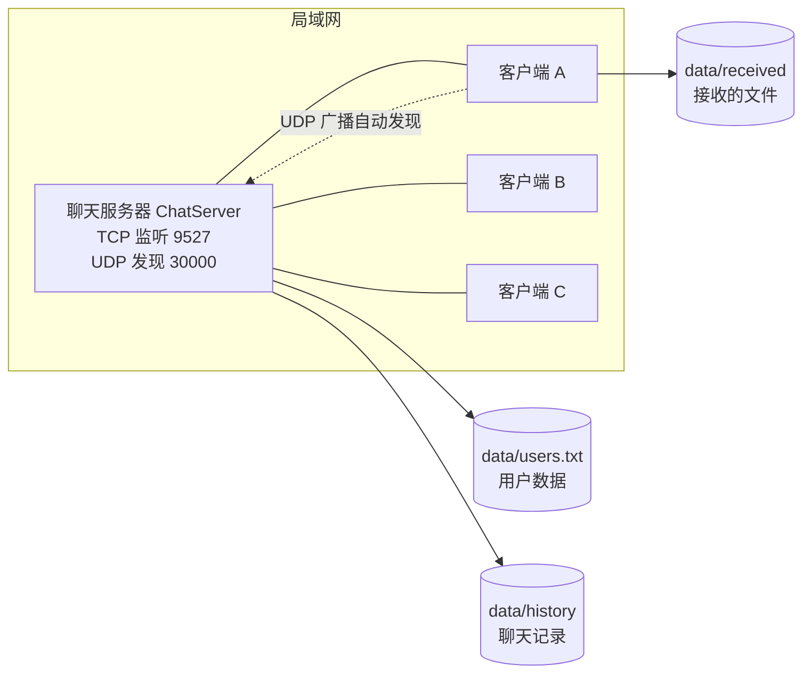
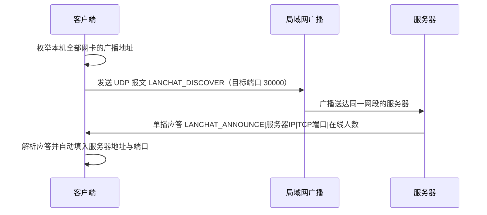

# 局域网聊天程序 用户手册

适用版本：v1.0
适用题目：Java 课程设计 题目13 局域网聊天程序
最后更新：2026-09-19

本手册面向程序的使用者与验收教师，说明如何编译、启动、登录、聊天、传文件、查记录以及排查常见故障。
全部操作命令均在本项目根目录下执行；涉及界面的描述与程序实际文案一致。

---

## 一、系统简介

本程序是一个纯 Java SE 实现的局域网即时通信工具，采用客户端 / 服务器结构，**不依赖任何第三方框架**，
仅使用 JDK 自带的标准库（Swing、Socket、对象序列化、SHA-256、JDBC）。一个服务器进程可以被局域网内多台机器上的客户端同时连接。

### 1.1 主要功能

| 功能 | 说明 |
| --- | --- |
| 局域网自动发现 | 客户端通过 UDP 广播寻找同一网段内的服务器，自动填入 IP 与端口 |
| 用户注册与登录 | 用户名唯一，密码加随机盐做 SHA-256 散列存储，不保存明文 |
| 在线用户列表 | 服务器实时推送，用户上线、下线、改昵称后各客户端列表自动刷新 |
| 私聊 | 与指定在线用户一对一聊天，接收方离线时发送方会收到明确提示 |
| 群聊 | 在群聊大厅发言，所有在线用户均可见 |
| 文件传输 | 支持最大 200MB 的文件，按 64KB 分块经服务器中继，接收端按 SHA-256 校验完整性 |
| 聊天记录 | 按天写入历史文件，支持按用户、日期范围查询与关键字检索 |
| 记录导出 | 把查询结果导出为 UTF-8 文本文件 |
| 用户资料管理 | 修改昵称、修改密码（需验证原密码）；管理员可删除用户 |
| 服务器控制台 | 图形界面展示运行状态、监听地址、在线用户表与实时日志，可启动与停止服务 |
| 数据库存储（可选） | 默认使用文件存储；显式开启后可改用 MySQL 存储 |

### 1.2 总体结构



### 1.3 技术要点（简要）

- 通信协议：TCP + Java 对象流（`ObjectInputStream` / `ObjectOutputStream`），消息对象实现了序列化接口。
- 消息类型：文本私聊、文本群聊、系统通知、用户列表、文件请求、文件分块、文件结束、文件结果、心跳、错误回执等。
- 传输流程：文件正文经服务器中继，服务器不落盘；接收端分块落盘并在结束时校验 SHA-256。
- 心跳机制：客户端每 15 秒发送心跳，服务器每 20 秒扫描一次，超过 60 秒无活动的连接判定为掉线并清理。

---

## 二、运行环境

| 项目 | 要求 | 说明 |
| --- | --- | --- |
| JDK | **JDK 17 或更高版本** | 本项目实际在 OpenJDK 21.0.12 上完成开发与测试；构建脚本会检查版本，低于 17 会直接报错退出 |
| 操作系统 | Windows / Linux / macOS | 本项目在 Ubuntu 24.04.4 LTS 上完成测试；Windows 需使用 `.bat` 脚本 |
| 内存 | 建议 2GB 以上可用内存 | 传输大文件时客户端按 64KB 分块读取，内存占用与文件大小无关 |
| 磁盘 | 建议 5GB 以上 | 需容纳聊天记录、接收文件（单文件上限 200MB）与导出文件 |
| 网络 | 服务器与客户端处于同一局域网，或同一台机器 | 跨网段时 UDP 自动发现会失败，需手动填写服务器 IP |
| 图形环境 | 需要桌面环境 | 服务器与客户端默认启动图形界面；无显示环境可用 `--console` 控制台模式启动服务器 |
| 第三方依赖 | 无 | 项目不含任何第三方 jar，`lib/` 默认为空 |

检查 JDK 是否安装：

```bash
java -version
javac -version
```

两条命令均应输出 17 或更高版本号。若提示"未找到命令"，请先安装 JDK 并配置 `PATH`。

---

## 三、快速开始

只需三步：编译、启动服务器、启动客户端。首次使用请从"第一步"开始；已编译过可直接跳到第二步。

### 第一步：编译

项目自带一键编译脚本，脚本会自动检查 JDK 版本、清理旧产物、编译主源码与测试源码、运行自动化测试，
并调用内置打包工具生成可执行 jar。

Linux / macOS：

```bash
chmod +x scripts/*.sh          # 首次使用需赋予执行权限
./scripts/build.sh
```

Windows（命令提示符或 PowerShell）：

```bat
scripts\build.bat
```

如果希望跳过自动化测试以加快编译：

```bash
./scripts/build.sh --skip-tests      # Linux / macOS
scripts\build.bat --skip-tests       # Windows
```

编译成功后会得到 `build/classes`（主程序字节码）与 `dist/`（可执行 jar 与配置文件）。

手工编译方式（不使用脚本时，效果等价）：

```bash
# Linux / macOS
find src/main/java -name '*.java' > build/main-sources.txt
javac -encoding UTF-8 -d build/classes @build/main-sources.txt

# Windows（PowerShell）
Get-ChildItem -Recurse -Filter *.java src\main\java | ForEach-Object { $_.FullName } > build\main-sources.txt
javac -encoding UTF-8 -d build\classes @build\main-sources.txt
```

### 第二步：启动服务器

在**作为服务器的那台机器**上执行。启动后请留意控制台显示的监听地址与端口。

Linux / macOS：

```bash
./scripts/run-server.sh
```

Windows：

```bat
scripts\run-server.bat
```

无图形环境的机器（如远程 SSH 会话）请使用控制台模式：

```bash
./scripts/run-server.sh --console
```

直接使用编译产物启动（等价方式）：

```bash
java -cp build/classes com.chat.server.ChatServer            # 图形界面
java -cp build/classes com.chat.server.ChatServer --console  # 控制台模式
java -jar dist/chat-server.jar                               # 使用打包后的 jar
```

服务器窗口出现"服务器未启动"字样的状态栏与"启动服务器""停止服务器"按钮后，点击"启动服务器"，
或使用控制台模式时看到"聊天服务器已启动，监听 <地址>:<端口>"即表示就绪。

### 第三步：启动客户端

在**每一台需要聊天的机器**上执行：

Linux / macOS：

```bash
./scripts/run-client.sh
```

Windows：

```bat
scripts\run-client.bat
```

希望在一台机器上同时开服务器与多个客户端做演示时，可让客户端顺带拉起本机服务器：

```bash
./scripts/run-client.sh --local-server     # Linux / macOS
scripts\run-client.bat --local-server      # Windows
```

直接使用编译产物启动（等价方式）：

```bash
java -cp build/classes com.chat.client.ChatClientApp
java -cp build/classes com.chat.client.ChatClientApp --local-server
java -cp build/classes com.chat.client.ChatClientApp --help
java -jar dist/chat-client.jar
```

登录窗口出现后，按第五章"首次登录"或第六章"注册新账号"操作。要开第二个客户端，重复执行第三步即可。

---

## 四、目录结构说明

```text
LANChat/
├── src/
│   ├── main/java/com/chat/
│   │   ├── common/      公共模型：消息基类与各类型消息、用户、配置、常量、编解码工具
│   │   ├── exception/   自定义异常：ChatException、FileTransferException、UserNotFoundException
│   │   ├── util/        工具类：密码安全（盐与散列）、文件工具、日期工具
│   │   ├── dao/         数据访问：用户文件存储、按天历史存储、可选的 JDBC 实现
│   │   ├── service/     业务服务：用户服务、消息服务、文件传输服务
│   │   ├── server/      服务器：监听与连接处理、在线用户管理、UDP 发现应答、控制台界面
│   │   └── client/      客户端：网络层、监听器接口、发现客户端、Swing 界面
│   └── test/java/com/chat/test/   自研测试框架与全部自动化测试
├── config/
│   └── chat.properties  配置文件（端口、路径、管理员口令、数据库开关）
├── data/                运行期数据（首次运行自动创建）
│   ├── users.txt        用户数据（含盐与散列，不含明文口令）
│   ├── history/         聊天记录，按天一个 yyyy-MM-dd.log 文件
│   ├── received/        接收到的文件默认保存目录
│   └── export/          聊天记录导出目录
├── scripts/             一键脚本：构建、运行、清理、测试（.sh 与 .bat 各一套）
├── build/               编译产物（可删除，重新编译会重新生成）
├── dist/                打包后的可执行 jar 与随附配置（构建脚本生成）
├── lib/                 第三方 jar 存放目录（默认空；启用 MySQL 时放驱动）
├── sql/                 数据库建表脚本（启用 MySQL 存储时使用）
└── docs/                文档：需求分析、系统设计、测试报告、测试用例表、本手册
```

各数据文件的用途与删除影响：

| 路径 | 内容 | 删除影响 |
| --- | --- | --- |
| `data/users.txt` | 全部注册用户与管理员 | 删除后所有账号消失，仅剩首次启动重建的默认管理员 |
| `data/history/` | 聊天记录（按天分文件） | 删除后历史消息不可查询与导出 |
| `data/received/` | 接收到的文件 | 删除后已接收的文件消失 |
| `data/export/` | 导出的聊天记录文本 | 删除后导出结果消失 |
| `build/`、`dist/` | 编译与打包产物 | 可安全删除，重新构建即可恢复 |
| `config/chat.properties` | 配置 | 删除后使用内置默认值继续运行 |

---

## 五、首次登录

服务器首次启动时会自动创建默认管理员账号：

| 项目 | 值 |
| --- | --- |
| 用户名 | `admin` |
| 密码 | `admin123` |
| 角色 | 管理员（可删除其他用户） |

操作步骤：

1. 启动服务器，确认其已进入运行状态。
2. 启动客户端，出现登录窗口。
3. 在"服务器地址"填入服务器所在机器的 IP（本机演示可填 `127.0.0.1`），"端口"保持 `9527`。
4. 填入用户名 `admin` 与密码 `admin123`，点击"登录"。

**安全提示（务必执行）**：`admin123` 是公开的默认口令，登录后请立即点击主界面"修改密码…"，
按提示先验证原密码再设置新密码。修改密码需要**退出登录后重新登录**才会以新密码生效。
另外，默认管理员 `admin` 不允许被删除，请另行注册自己的常用账号用于日常聊天。

> 若登录窗口显示"用户名或密码错误"，请确认服务器是否已启动、端口是否与服务器一致、口令是否已被修改过。

---

## 六、注册新账号

1. 启动客户端，在登录窗口填入服务器地址与端口。
2. 在"用户名""密码""昵称（注册用）"三个输入框中填写信息。
3. 点击"注册新账号"。注册成功后即可用同一组用户名与密码点击"登录"。

### 6.1 用户名规则

| 规则 | 说明 |
| --- | --- |
| 首字符 | 必须是英文字母 |
| 其余字符 | 只能是英文字母、数字或下划线 |
| 长度 | 3 至 16 个字符（即首字母加 2 至 15 个后续字符） |
| 唯一性 | 不允许与他人重复，重复注册会提示用户名已存在 |
| 禁止 | 中文、空格、以数字开头、含特殊符号 |

合法示例：`alice`、`bob_01`、`Tom2025`
非法示例：`ab`（过短）、`1abc`（数字开头）、`中文名`（含中文）、`a b`（含空格）

### 6.2 密码规则

| 规则 | 说明 |
| --- | --- |
| 长度 | 6 至 32 个字符 |
| 内容 | 无强制复杂度要求，但建议包含字母与数字 |
| 存储 | 服务器保存的是"随机盐 + SHA-256 散列"，不保存明文；同一密码在不同账号下的散列也不同 |

### 6.3 昵称规则

昵称是聊天窗口中显示的名字，最长 20 个字符，可以留空（留空时通常以用户名显示），可以包含中文。
昵称允许重复，登录与私聊定位以**用户名**为准。

---

## 七、登录

1. 确认服务器已启动且在运行状态。
2. 在登录窗口填写服务器地址与端口：

   - 同一台机器演示：`127.0.0.1`
   - 局域网其它机器：服务器的局域网 IP，如 `192.168.1.100`（可在服务器控制台界面的监听地址处看到）
   - 不确定 IP 时：点击"自动发现服务器"（见第十四章）

3. 填写用户名与密码，点击"登录"。
4. 登录成功后进入主界面，左下角状态栏会显示"服务器: 已连接  用户: <你的用户名>"。

登录失败的常见提示与处理：

| 提示 | 原因 | 处理 |
| --- | --- | --- |
| 用户名或密码错误 | 账号不存在或密码不对 | 核对大小写；确认是否已注册 |
| 该账号已在线 | 同一账号已从别处登录 | 关闭另一处客户端，或改用其它账号 |
| 连接服务器失败 | 服务器未启动、IP 或端口错误、被防火墙拦截 | 参见第十六章排查 |

---

## 八、主界面功能说明

主界面分为左侧"在线用户（双击开始私聊）"面板与右侧"功能"面板，底部为状态栏。

### 8.1 在线用户列表

- 列表中每一行显示用户名、昵称与角色。
- 该列表由服务器实时推送，其他用户上线、下线或修改昵称时会自动刷新，无需手动操作。
- 也可点击"刷新列表"按钮主动向服务器请求一次最新名单。
- 列表包含自己。

### 8.2 双击私聊

在列表中双击某个用户（或选中后点击"发起私聊"）即可打开与该用户的私聊窗口。双击自己时程序会提示"不能与自己私聊，请使用群聊大厅"。

### 8.3 群聊大厅

点击"进入群聊大厅"打开群聊窗口。窗口标题为"局域网聊天程序 - 群聊大厅"，在此发送的消息对所有在线用户可见。

### 8.4 发送文件

两种入口等价：选中在线用户后点击"发送文件"，或点击功能区的"发送文件…"（后者需在弹出的选择框中选择接收方）。

### 8.5 查询聊天记录

点击"查询聊天记录…"，在弹出对话框中填写"用户名（留空查全部）""起始日期""结束日期"（日期格式 `yyyy-MM-dd`），
确认后显示命中的记录。

### 8.6 导出我的聊天记录

点击"导出我的聊天记录"，程序把**当前登录用户**的聊天记录导出为 UTF-8 文本文件，保存到 `data/export/` 目录，
文件名形如 `chat-用户名-时间戳.txt`，导出成功后弹窗显示完整路径。

### 8.7 修改昵称

点击"修改昵称…"，输入新昵称（不超过 20 字符）。修改成功后在线用户列表会同步刷新为你的新昵称。

### 8.8 修改密码

点击"修改密码…"，按提示输入原密码与新密码。原密码不正确会被拒绝；新密码需为 6 至 32 位。
修改后请退出登录并用新密码重新登录。

### 8.9 删除用户（管理员）

仅管理员账号可用。点击"删除用户（管理员）…"，输入目标用户名并确认。存在以下限制：

- 普通用户执行该操作会被服务器拒绝；
- 默认管理员 `admin` 不允许被删除；
- 删除操作不可恢复，删除后该用户无法再登录。

---

## 九、私聊使用

1. 在主界面左侧在线用户列表中找到目标用户（对方必须在线）。
2. 双击该用户，或选中后点击"发起私聊"，打开私聊窗口。
3. 在底部输入框输入消息，点击"发送"或直接回车（以实际界面提示为准）。消息上限 2000 字符。
4. 消息会显示在窗口中，包含发送者与时间；对方窗口会实时出现同样内容。
5. 点击"清空"只清除本窗口的显示内容，不影响服务器保存的历史记录。

说明：私聊消息会写入服务器历史记录，双方均可通过"查询聊天记录…"查到；
若对方在发送瞬间已离线，服务器会返回错误提示，消息不会丢失在无提示状态下。

---

## 十、群聊使用

1. 点击主界面"进入群聊大厅"打开群聊窗口。
2. 输入内容后发送，所有在线用户的群聊窗口都会收到该消息。
3. 用户上线、下线时，服务器会推送系统通知，群聊窗口中可以看到"用户 xxx 上线了"之类的提示。
4. 群聊消息同样记入历史记录，任何用户查询自己的记录时都能看到群聊内容。

---

## 十一、文件传输使用

### 11.1 发送文件

1. 确认接收方在线（文件只能发给在线用户）。
2. 在主界面选中该用户后点击"发送文件"，或点击功能区的"发送文件…"并在弹窗中选择接收方。
3. 在弹出的文件选择框中选中要发送的文件，确认。
4. 发送窗口会显示文件名、可读大小，以及状态提示"已发送传输请求，等待对方确认……"。
5. 对方同意后开始传输，进度条与"等待确认: <文件名>"等状态文字会实时更新。

### 11.2 接收文件

1. 收到文件请求时，接收方会弹出确认框，显示发送者、文件名与大小，内容为"是否接收？"。
2. 点击"是"表示同意接收，开始传输；点击"否"表示拒绝，发送方会收到拒绝结果。
3. 传输完成后接收方会重新计算 SHA-256 与发送端比对，校验通过才认为成功。

### 11.3 进度与结果

- 进度条按已接收/已发送的字节比例推进。
- 传输结束后双方都会收到"结果"消息：成功表示文件已完整落盘并通过校验；失败会给出原因。
- 若传输中断、块序号错乱或校验和不一致，接收端会**删除残缺文件**，避免留下"看起来正常但内容损坏"的文件。

### 11.4 接收目录位置

默认保存到项目根目录下的 `data/received/`（由配置项 `file.received.dir` 指定，默认值 `./data/received`）。
若该目录下已存在同名文件，程序会自动改名而不是覆盖，规则为追加序号：

```text
report.pdf  ->  report(1).pdf  ->  report(2).pdf
```

文件名中的路径部分会被清洗（例如 `../../etc/passwd` 会被处理为 `passwd`），因此文件不会被写到接收目录之外。

### 11.5 限制

| 项目 | 限制 |
| --- | --- |
| 单文件大小 | 最大 200MB，超过时在发送端即被拒绝，并提示"200MB"上限 |
| 分块大小 | 64KB |
| 接收方状态 | 必须在线；对方拒绝或离线时发送失败并给出提示 |
| 服务器存储 | 服务器只中继文件数据，不保存文件内容 |

---

## 十二、聊天记录查询与导出

### 12.1 查询

1. 点击主界面"查询聊天记录…"。
2. 在对话框中填写条件：

   | 字段 | 说明 | 默认值 |
   | --- | --- | --- |
   | 用户名（留空查全部） | 只查看与该用户相关的消息；留空表示不受用户限制 | 当前登录用户名 |
   | 起始日期 | 格式 `yyyy-MM-dd` | 今天减 7 天 |
   | 结束日期 | 格式 `yyyy-MM-dd` | 今天 |

3. 确认后显示命中的记录，包含时间、发送者、接收者与正文摘要。

注意事项：

- 起始日期不能晚于结束日期，否则查询会返回失败。
- 与用户无关的群聊消息、系统通知对所有用户可见；他人之间的私聊不会被无关用户查到。

### 12.2 关键字检索

除按用户与日期过滤外，还支持按关键字检索消息正文（例如输入"测试报告"）。
空关键字会被拒绝。

### 12.3 导出

有两种方式：

- 主界面"导出我的聊天记录"：一键导出当前用户全部记录。
- 查询结果导出：先按条件查询，再把查询结果导出（具体入口以实际界面为准）。

导出结果统一保存在 `data/export/`，为 UTF-8 编码的纯文本，可直接用记事本或任意编辑器打开。
若本次查询没有任何记录，程序会提示导出失败，不会生成空文件。

### 12.4 历史文件位置与格式

聊天记录按天存放在 `data/history/`，文件名为日期，例如 `2026-09-19.log`。
重启服务器后历史记录仍然存在，可继续查询。

---

## 十三、服务器控制台使用

### 13.1 启动控制台

```bash
./scripts/run-server.sh          # Linux / macOS，图形界面
scripts\run-server.bat           # Windows，图形界面
./scripts/run-server.sh --console  # 无图形环境的控制台模式
```

### 13.2 界面元素

| 元素 | 说明 |
| --- | --- |
| 状态栏 | 显示"服务器未启动"或运行中状态 |
| 监听地址与端口 | 启动后显示本机 IP 与 TCP 端口，例如 `192.168.1.100:9527`；把该 IP 告知客户端使用者 |
| 在线人数 | 当前在线用户数量 |
| 在线用户表 | 逐行展示当前在线用户的用户名与昵称 |
| 实时日志 | 连接接入、用户上下线、消息中继、文件传输、异常等事件滚动显示 |
| 启动服务器 / 停止服务器 | 启动或停止监听；停止后端口被释放 |
| 清空日志 | 清空日志显示区，不影响日志文件本身 |

界面提示同时给出："客户端启动后会自动发现本服务器，也可手动输入本机 IP"。

### 13.3 启动与停止的注意事项

- 停止服务器会断开所有在线客户端，客户端需要重新登录。
- 停止后再次启动使用同一端口；若端口被其他程序占用，启动会失败，处理办法见第十六章。
- 控制台模式下按 `Ctrl+C` 退出，程序会注册关闭钩子释放端口与资源。

### 13.4 日志

服务器与客户端使用 JDK 自带的日志框架输出日志（记录器名称前缀 `com.chat`）。
日志中不会输出用户口令或口令散列；如需更详细的日志级别，可在启动命令中调整日志配置。

---

## 十四、局域网自动发现与手动指定 IP

### 14.1 自动发现的原理



要点：服务器启动时会同时监听 UDP 端口 30000（由配置项 `discovery.port` 指定）；
客户端点击"自动发现服务器"后，会向本机各网卡的广播地址分别发送发现报文，收到应答后自动填入 IP 与端口。

### 14.2 使用自动发现

1. 确认服务器已启动，且与客户端处于**同一网段**（例如都在 `192.168.1.x`）。
2. 在登录窗口点击"自动发现服务器"。
3. 若网络允许广播，服务器地址与端口会被自动填入；随后正常登录即可。

### 14.3 自动发现失败的替代做法

以下情况自动发现会失效：客户端与服务器不在同一网段；交换机或无线 AP 禁止广播；操作系统防火墙拦截 UDP 30000；
服务器所在机器有多张网卡而广播未覆盖到目标网段。此时请手动指定服务器 IP：

1. 在**服务器**机器的控制台界面读取监听地址（或执行 `ipconfig`（Windows）/ `ip addr`（Linux）查看局域网 IP）。
2. 在**客户端**登录窗口的"服务器地址"中直接填入该 IP，端口保持与服务器一致（默认 `9527`）。
3. 点击"登录"。

排查建议：先在服务器机器上用 `telnet <服务器IP> 9527`（或客户端登录）验证 TCP 端口可达，再排查 UDP 广播。

---

## 附：五至十四章涉及的关键路径速查

| 我想…… | 去哪里 |
| --- | --- |
| 改端口 | `config/chat.properties` 的 `server.port`，客户端登录窗口"端口"需一致 |
| 改接收文件位置 | `config/chat.properties` 的 `file.received.dir` |
| 改数据存放位置 | `config/chat.properties` 的 `data.dir` |
| 改默认管理员口令 | `config/chat.properties` 的 `admin.password`（仅在 admin 账号尚不存在时生效） |
| 查看聊天记录文件 | `data/history/yyyy-MM-dd.log` |
| 查看导出文件 | `data/export/` |
| 启用 MySQL 存储 | `config/chat.properties` 的 `db.enabled=true` 并准备驱动，见第十五章 |

---

## 十五、配置文件说明

配置文件位于 `config/chat.properties`，编码 UTF-8。**修改后需重启程序生效**。所有配置项均为可选，缺省时使用内置默认值。

| 配置项 | 默认值 | 含义 | 当前版本是否生效 |
| --- | --- | --- | --- |
| `server.port` | `9527` | 服务器 TCP 监听端口，客户端必须与之一致 | 生效 |
| `discovery.port` | `30000` | 局域网自动发现的 UDP 广播端口 | 生效 |
| `heartbeat.interval.ms` | `15000` | 客户端心跳发送间隔（毫秒） | 生效 |
| `data.dir` | `./data`（默认，配置文件中以注释形式给出） | 数据根目录，用户数据、聊天记录、导出文件均在其下 | 生效 |
| `file.received.dir` | `./data/received` | 接收文件的保存目录 | 生效 |
| `file.max.size` | `209715200`（即 200MB） | 单个文件大小上限（字节）；收发两端都会按该值校验 | 生效 |
| `admin.password` | `admin123` | 首次启动创建默认管理员 `admin` 时使用的口令；账号已存在时不覆盖 | 生效 |
| `db.enabled` | `false` | 是否启用 MySQL 存储；必须显式设为 `true` 才会尝试连接数据库 | 生效 |
| `db.driver` | `com.mysql.cj.jdbc.Driver` | JDBC 驱动类名 | 仅在 `db.enabled=true` 时生效 |
| `db.url` | `jdbc:mysql://localhost:3306/lanchat?...` | JDBC 连接串，需按实际主机、库名调整 | 仅在 `db.enabled=true` 时生效 |
| `db.username` | `root` | 数据库用户名 | 仅在 `db.enabled=true` 时生效 |
| `db.password` | 空 | 数据库口令，请按实际填写，不要提交到版本库 | 仅在 `db.enabled=true` 时生效 |
| `heartbeat.timeout.ms` | `60000` | 服务器判定连接掉线的心跳超时阈值（毫秒） | 生效 |
| `server.max.connections` | `200` | 允许的最大并发连接数，超出后拒绝新连接 | 生效 |

数据目录的取值优先级为：系统属性 `lanchat.data.dir` > 配置文件 `data.dir` > 内置默认值 `./data`。
自动化测试与多实例演示可借助该优先级把数据隔离到临时目录。

说明 1：心跳间隔、心跳超时阈值、单文件上限与最大并发连接数均已接入配置读取，
修改后重启程序即生效。需要注意取值合理性：心跳超时阈值应当明显大于心跳间隔（默认 60 秒对 15 秒），
否则会导致连接被误判掉线；最大并发连接数应与部署机器的资源相匹配。

### 15.1 启用 MySQL 存储（可选加分项）

默认情况下程序使用文件存储，**零依赖即可运行**，无需安装数据库。若需要演示数据库存储：

1. 准备一个 MySQL 实例，并创建数据库（参考 `sql/` 目录下的建表脚本）。
2. 下载 `mysql-connector-j` 驱动 jar，放入项目的 `lib/` 目录。
3. 编辑 `config/chat.properties`：

   ```properties
   db.enabled=true
   db.driver=com.mysql.cj.jdbc.Driver
   db.url=jdbc:mysql://localhost:3306/lanchat?useSSL=false&serverTimezone=UTC&allowPublicKeyRetrieval=true
   db.username=root
   db.password=你的数据库口令
   ```

4. 启动服务器时把驱动 jar 加入 classpath，例如：

   ```bash
   java -cp "build/classes:lib/mysql-connector-j-8.x.x.jar" com.chat.server.ChatServer
   ```

   Windows 下分隔符使用分号：`-cp "build\classes;lib\mysql-connector-j-8.x.x.jar"`。

5. 启动后注册一个用户，再确认数据出现在数据库表中。

重要说明：程序**不会**因为"classpath 里有驱动"就自动使用数据库，必须以 `db.enabled=true` 显式开启；
连接失败时会记录日志并回退到文件存储，避免出现"数据被静默写到别处"的情况。

---

## 十六、常见问题排查

### 16.1 无法连接服务器

| 可能原因 | 排查方法 |
| --- | --- |
| 服务器未启动 | 查看服务器窗口状态栏是否为运行中；控制台模式应出现"聊天服务器已启动" |
| 服务器地址或端口填错 | 与服务器控制台显示的监听地址、端口逐字核对；同机演示用 `127.0.0.1` |
| 两台机器不在同一网段 | 分别查看 IP 前三位是否一致（如都是 `192.168.1.x`） |
| 防火墙拦截 | 见 16.5 |
| 端口被占用 | 见 16.6 |
| 使用了错误的服务器 IP | 服务器机器可能有多张网卡（有线、无线、虚拟网卡），确认填的是局域网可达的那个 IP |

### 16.2 自动发现失败

现象：点击"自动发现服务器"后地址栏仍为空或提示失败。

- 确认服务器已启动（发现应答由服务器提供）。
- 确认双方在同一网段；跨网段广播无法送达，请手动填写 IP。
- 确认防火墙允许 UDP 30000 入站。
- 部分企业无线网络禁用了广播或做了客户端隔离，此时只能手动指定 IP。
- 若修改过 `discovery.port`，客户端与服务器必须改为相同的值。

### 16.3 中文乱码

| 现象 | 原因 | 处理 |
| --- | --- | --- |
| Windows 命令行窗口中文显示为乱码 | 控制台代码页不是 UTF-8 | 项目自带的 `.bat` 脚本已执行 `chcp 65001`；手工启动时先执行 `chcp 65001` |
| 导出的聊天记录用记事本打开乱码 | 导出文件为 UTF-8，旧版记事本默认按 ANSI 解析 | 使用 VS Code、Notepad++ 等编辑器并选择 UTF-8 打开 |
| 编译时报"编码 GBK 的不可映射字符" | 未指定源码编码 | 编译时加上 `-encoding UTF-8`（构建脚本已包含） |
| 聊天消息本身乱码 | 修改过源码编码或用非 UTF-8 保存 | 确认源码与 `config/chat.properties` 均以 UTF-8（无 BOM）保存 |

### 16.4 文件传输失败

| 现象 | 原因 | 处理 |
| --- | --- | --- |
| 提示"超过 200MB" | 文件超过单文件上限 | 压缩或拆分后再传 |
| 发送后一直等待确认 | 接收方未在弹窗中作出选择 | 请对方在确认框中选择"是"；若对方窗口无弹窗，确认其客户端是否仍在线 |
| 提示传输失败/校验不通过 | 传输过程中数据被破坏或中途断开 | 重新发送；接收目录中的残缺文件会被自动删除，不会留下损坏文件 |
| 接收方拒绝 | 对方点击了"否" | 与对方确认后重发 |
| 接收目录里找不到文件 | 保存位置不是当前目录 | 默认在项目根目录 `data/received/`；确认 `file.received.dir` 配置 |
| 同名文件"不见了" | 程序为避免覆盖自动改名 | 查找 `report(1).pdf`、`report(2).pdf` 形式的名字 |

### 16.5 防火墙拦截

服务器需要放行 **TCP 9527**（业务通信）与 **UDP 30000**（自动发现）。

Windows：

```bat
netsh advfirewall firewall add rule name="LANChat-TCP" dir=in action=allow protocol=TCP localport=9527
netsh advfirewall firewall add rule name="LANChat-UDP" dir=in action=allow protocol=UDP localport=30000
```

Linux（ufw）：

```bash
sudo ufw allow 9527/tcp
sudo ufw allow 30000/udp
```

临时验证是否为防火墙问题：暂时关闭防火墙后重试；若恢复连接，则说明需要按上述方式放行端口。

### 16.6 端口被占用

现象：服务器启动失败或日志出现"Address already in use"。

排查与处理：

```bash
# Linux / macOS：查看谁占用了 9527
lsof -i :9527
# 或
ss -ltnp | grep 9527

# Windows
netstat -ano | findstr 9527
```

处理方式二选一：结束占用进程；或修改 `config/chat.properties` 的 `server.port` 为其它端口（如 `9528`），
同时把客户端登录窗口的端口改成同一个值。

### 16.7 第 9 个客户端连不上

现象：已经登录 8 个客户端时，第 9 个客户端长时间没有反应，之后报连接失败。

原因：当前版本的服务器把每个连接的读取循环放在一个固定 8 线程的线程池中执行，因此最多只能同时服务 8 个连接。
这一点与设计文档中"支持 200 个并发连接"的目标不一致，属已知问题（《测试报告》缺陷 D-09，严重程度高，尚未修复）。

临时规避：把同时在线人数控制在 8 人以内；课堂演示时提前关闭不用的客户端窗口。

### 16.8 修改了配置文件却不生效

| 检查点 | 说明 |
| --- | --- |
| 是否重启程序 | 配置只在启动时读取一次，修改后必须重启服务器或客户端 |
| 改的是否是当前运行的项目 | `config/chat.properties` 按"程序启动时的工作目录"定位；请从项目根目录启动，或使用自带脚本 |
| 配置取值是否合理 | 心跳超时阈值必须明显大于心跳间隔（默认 60 秒对 15 秒），否则连接会被误判掉线 |
| 是否重启过程序 | 全部配置项均在启动时读取一次，修改后必须重启（见第十五章说明 1） |
| 数据目录是否被系统属性覆盖 | 系统属性 `lanchat.data.dir` 的优先级高于配置文件 |

### 16.9 客户端窗口打不开（无图形环境）

现象：在 SSH 或容器中执行客户端启动命令报 `HeadlessException`。

原因：Swing 需要图形环境。处理：在有桌面的机器上运行客户端；服务器可改用 `--console` 控制台模式运行。

### 16.10 用户数据异常或忘记管理员口令

- 忘记管理员口令：删除 `data/users.txt` 中的 `admin` 记录（或在程序内由其它管理员删除该账号）后重启服务器，
  程序会按 `config/chat.properties` 的 `admin.password` 重新创建管理员。操作前请先备份该文件。
- 用户数据损坏：`data/users.txt` 采用"临时文件 + 原子替换"写入，正常断电不会产生半截文件；如仍怀疑损坏，
  可停服后备份该文件再用文本编辑器检查（文件为 UTF-8 制表符分隔，含表头）。

### 16.11 如何获取更详细的日志

启动时调整 JDK 日志格式，可让日志带上时间与级别，便于排查：

```bash
java -Djava.util.logging.SimpleFormatter.format='%1$tF %1$tT [%4$s] %3$s - %5$s%n' \
     -cp build/classes com.chat.server.ChatServer --console
```

自带脚本 `run-server.sh` / `run-client.sh` 已包含类似的日志格式参数。

---

## 十七、卸载与数据清理

### 17.1 清理构建产物（保留用户数据）

删除 `build/` 与 `dist/`，或使用清理脚本：

```bash
./scripts/clean.sh          # Linux / macOS
scripts\clean.bat           # Windows
```

此操作不会删除 `data/` 下的用户数据、聊天记录与接收文件。

### 17.2 清理运行期数据（会删除用户数据）

```bash
./scripts/clean.sh --all    # Linux / macOS
scripts\clean.bat --all     # Windows
```

该操作会删除 `data/users.txt`、`data/history`、`data/received`、`data/export`，并重建目录骨架。
**执行前请务必备份需要保留的聊天记录与接收文件**，删除后不可恢复。

### 17.3 完全卸载

1. 停止服务器与全部客户端进程。
2. 备份需要保留的内容（如 `data/export/` 下的导出文件、`data/received/` 下的接收文件）。
3. 删除整个项目目录即可。程序不在系统目录写入任何文件，不注册服务、不写注册表。
4. 若曾启用 MySQL 存储，请自行删除数据库中的 `lanchat` 库或相关表。

### 17.4 备份建议

需要保留数据时，备份以下位置即可完整还原使用状态：

```text
config/chat.properties   配置
data/users.txt           账号
data/history/            聊天记录
data/received/           接收到的文件
```

在另一台机器上恢复时，把上述内容放回原相对路径，编译后即可继续使用；账号口令无需重新设置。

### 17.5 多实例演示时的数据隔离

在同一台机器上同时演示多套环境时，用系统属性把数据目录分开，避免互相覆盖：

```bash
java -Dlanchat.data.dir=/tmp/lanchat-demo -cp build/classes com.chat.server.ChatServer
```

客户端同理，把 `-Dlanchat.data.dir` 指向各自的目录即可。

---

## 附录：一页速查

```text
编译        ./scripts/build.sh                                  （Windows: scripts\build.bat）
启动服务器  ./scripts/run-server.sh                             （无界面：加 --console）
启动客户端  ./scripts/run-client.sh                             （单机演示：加 --local-server）
运行测试    ./scripts/test.sh all                               （unit / integration）
清理        ./scripts/clean.sh [--all]
默认管理员  admin / admin123                                    （登录后立即修改）
默认端口    TCP 9527，UDP 发现 30000
接收文件    data/received/
聊天记录    data/history/yyyy-MM-dd.log
导出记录    data/export/
配置文件    config/chat.properties                              （修改后需重启）
```
