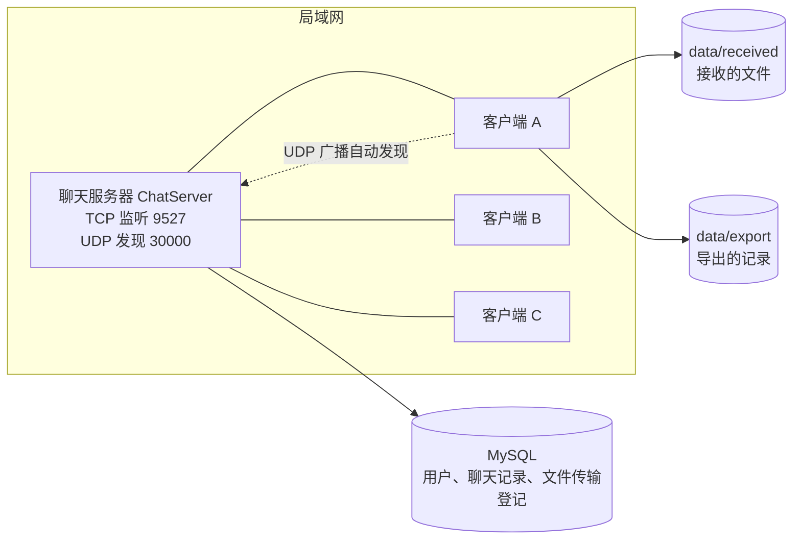
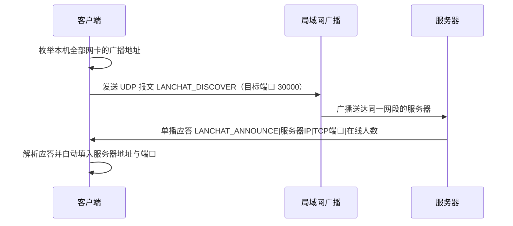

# 局域网聊天程序 用户手册

适用版本：v1.0
适用题目：Java 课程设计 题目13 局域网聊天程序
最后更新：2026-09-20

本手册面向程序的使用者与验收教师，说明如何编译、启动、登录、聊天、传文件、查记录以及排查常见故障。
编译与运行以 IntelliJ IDEA 为例（各运行配置的工作目录均已默认设为项目根目录）；
文中给出的命令行等价方式均需在本项目根目录下执行。涉及界面的描述与程序实际文案一致。

存储与安全要点（先读这两条）：本程序**只使用 MySQL 存储**，不存在文件存储模式，也没有 `db.enabled` 开关；
`security.message.secret` 为**必填**项，留空时服务器拒绝启动。另外，**网络传输仍是明文 TCP，
同一局域网内抓包可见消息内容**，落盘加密只保护数据库中的正文。

---

## 一、系统简介

本程序是一个纯 Java SE 实现的局域网即时通信工具，采用客户端 / 服务器结构，**不使用任何第三方框架**，
仅使用 JDK 自带的标准库（Swing、Socket、对象序列化、PBKDF2、AES-GCM、JDBC）。
唯一需要的外部 jar 是 MySQL 的 JDBC 驱动（仓库内已提供 `lib/mysql-connector-j-8.2.0.jar`）。
一个服务器进程可以被局域网内多台机器上的客户端同时连接。

### 1.1 主要功能

| 功能 | 说明 |
| --- | --- |
| 局域网自动发现 | 客户端通过 UDP 广播寻找同一网段内的服务器，自动填入 IP 与端口 |
| 用户注册与登录 | 用户名唯一，口令以 PBKDF2（12 万次迭代）加盐散列存储，不保存明文；登录失败 5 次锁定 5 分钟 |
| 在线用户列表 | 服务器实时推送，用户上线、下线、改昵称后各客户端列表自动刷新 |
| 私聊 | 与指定在线用户一对一聊天；对方离线时消息先入库，待其上线自动补投 |
| 群聊 | 在群聊大厅发言，所有在线用户均可见 |
| 文件传输 | 支持最大 200MB 的文件，按 64KB 分块经服务器中继，接收端按 SHA-256 校验完整性 |
| 消息可靠性 | 稳定消息标识、送达确认与去重、离线消息补投、断线自动重连（网络层与服务端已实现，界面展示随第 3 轮完善） |
| 聊天记录 | 聊天记录统一存入 MySQL，支持按用户与日期范围查询 |
| 记录导出 | 由服务端查库渲染成文本回传，客户端落盘为 UTF-8 文本文件，导出文本标注数据来源服务器 |
| 用户资料管理 | 修改昵称、修改密码（需验证原密码）；管理员可删除用户 |
| 服务器控制台 | 图形界面展示运行状态、监听地址、在线用户表与实时日志，可启动与停止服务 |
| 数据存储 | 只使用 MySQL 一种存储（启动时自动建表）；磁盘上仅保留接收的文件与导出的记录 |

### 1.2 总体结构



### 1.3 技术要点（简要）

- 通信协议：TCP + Java 对象流（`ObjectInputStream` / `ObjectOutputStream`），消息对象实现了序列化接口。
- 消息类型：共 34 项，涵盖文本私聊、文本群聊、系统通知、用户列表、文件请求、文件分块、文件结束、
  文件结果、心跳、消息确认、离线补投、历史查询、导出、错误回执等。
- 传输流程：文件正文经服务器中继，服务器不落盘；接收端分块落盘并在结束时校验 SHA-256。
- 心跳机制：客户端每 15 秒发送心跳，服务器每 20 秒扫描一次，超过 60 秒无活动的连接判定为掉线并清理。
- 消息可靠性：发送侧为每条消息生成稳定标识，服务端据此幂等去重；接收方以 `MSG_ACK` 回确认；
  对方不在线时消息先置为未投递，待其登录后自动补投，客户端按标识去重；
  连接意外断开后客户端用会话令牌自动重连（令牌有效期 30 分钟）并恢复登录态。
- 数据安全：口令用 PBKDF2 散列（12 万次迭代，常量时间比较），聊天正文以 AES-GCM 密文写入数据库；
  未配置 `security.message.secret` 时服务器拒绝启动。**注意：网络传输本身仍是明文 TCP，
  局域网内抓包可见消息内容**（见 15.2）。

---

## 二、运行环境

| 项目 | 要求 | 说明 |
| --- | --- | --- |
| JDK | **JDK 17 或更高版本** | 本项目实际在 OpenJDK 21.0.12 上完成开发与测试；低于 17 时源码中的语法特性无法编译 |
| 操作系统 | Windows / Linux / macOS | 本项目在 Ubuntu 24.04.4 LTS 上完成测试 |
| 内存 | 建议 2GB 以上可用内存 | 传输大文件时客户端按 64KB 分块读取，内存占用与文件大小无关 |
| 磁盘 | 建议 5GB 以上 | 需容纳接收文件（单文件上限 200MB）与导出文件；聊天记录在数据库中 |
| 网络 | 服务器与客户端处于同一局域网，或同一台机器 | 跨网段时 UDP 自动发现会失败，需手动填写服务器 IP |
| 图形环境 | 需要桌面环境 | 服务器与客户端都只有图形界面一种启动方式，运行它们的机器需要桌面环境 |
| 开发工具 | IntelliJ IDEA（推荐） | 本手册以 IDEA 为例说明编译与运行；不使用 IDE 时也可用 `javac` / `java` 直接编译运行 |
| 数据库 | 一台可连接的 MySQL | 本项目唯一的存储方式；建表由程序启动时自动完成，也可先用 `sql/schema.sql` 手工初始化 |
| 第三方依赖 | 仅 MySQL JDBC 驱动 | 仓库内 `lib/mysql-connector-j-8.2.0.jar`；客户端不连接数据库，运行客户端无需该驱动 |

检查 JDK 是否安装：

```bash
java -version
javac -version
```

两条命令均应输出 17 或更高版本号。若提示"未找到命令"，请先安装 JDK 并配置 `PATH`。

---

## 三、快速开始

只需三步：编译、启动服务器、启动客户端；首次使用请先完成第零步（配置与数据库准备），已配置好可直接跳到第二步。

本章以 IntelliJ IDEA 为例，每一步都同时给出命令行等价方式。用 IDEA 打开项目根目录后按步骤操作即可。

> **首次运行必须先配置 `security.message.secret`（聊天记录加密口令），否则服务器拒绝启动。**
> 配置方法见第零步。

### 第零步：准备配置与数据库

1. 复制配置模板并填写必要项：

   ```bash
   # Linux / macOS
   cp config/chat.properties.example config/chat.properties

   # Windows（PowerShell）
   Copy-Item config\chat.properties.example config\chat.properties
   ```

2. 编辑 `config/chat.properties`，至少填写以下内容：

   | 配置项 | 填写要求 |
   | --- | --- |
   | `security.message.secret` | **必填**。聊天记录加密口令，建议 32 位以上随机字符串（如 `openssl rand -hex 24` 的输出）。留空则服务器拒绝启动 |
   | `db.url` | 数据库连接地址，`serverTimezone` 必须填数据库所在机器的真实时区 |
   | `db.username` / `db.password` | 数据库账号与口令 |
   | `admin.password` | 可选。填写后，若 `admin` 账号不存在则用该口令创建管理员；**留空则不创建管理员**，只在日志中告警 |

3. 准备数据库（程序启动时也会自动建表，此步用于手工初始化或重建）：

   ```bash
   mysql -u root -p < sql/schema.sql
   ```

### 第一步：编译

1. 用 IDEA 打开项目：`File -> Open`，选择项目根目录 `LANChat`（本工程没有 `pom.xml`，直接以普通 Java 工程打开）。
2. 确认 `File -> Project Structure -> Project` 中的 SDK 为 JDK 17 或更高版本。
3. 确认 `src/main/java` 已标记为 `Sources Root`、`src/test/java` 已标记为 `Test Sources Root`
   （右键目录 -> `Mark Directory as`）。测试源码根未标记时，测试类会全部报红。
4. 把 MySQL 驱动加为工程依赖：`File -> Project Structure -> Libraries -> + -> Java`，
   选择仓库内的 `lib/mysql-connector-j-8.2.0.jar`（服务器与测试需要；只运行客户端可以不添加）。
5. 执行菜单 `Build -> Rebuild Project`。

编译成功后，主程序字节码位于 `out/production/LANChat`，测试字节码位于 `out/test/LANChat`。
`out/` 是 IDEA 的编译输出目录，删除后重新执行 `Build -> Rebuild Project` 即可恢复。

不使用 IDE 时，可以用 `javac` 直接编译（效果等价）：

```bash
# Linux / macOS
mkdir -p /tmp/lanchat-classes
find src/main/java -name '*.java' > /tmp/lanchat-sources.txt
javac -encoding UTF-8 -cp lib/mysql-connector-j-8.2.0.jar -d /tmp/lanchat-classes @/tmp/lanchat-sources.txt

# Windows（PowerShell）
New-Item -ItemType Directory -Force $env:TEMP\lanchat-classes | Out-Null
Get-ChildItem -Recurse -Filter *.java src\main\java | ForEach-Object { $_.FullName } > $env:TEMP\lanchat-sources.txt
javac -encoding UTF-8 -cp "lib\mysql-connector-j-8.2.0.jar" -d $env:TEMP\lanchat-classes @$env:TEMP\lanchat-sources.txt
```

### 第二步：启动服务器

在**作为服务器的那台机器**上执行。服务器只有图形控制台一种启动方式，没有命令行控制台模式，
因此服务器所在机器需要有桌面环境。

在 IDEA 的运行配置下拉框中选择 `服务器（图形控制台）`，点击 `Run`。
该配置的工作目录是项目根目录，程序据此定位 `config/chat.properties` 与 `data/` 目录，
请不要修改。

命令行等价方式（需先在 IDEA 中构建过一次）：

```bash
java -cp "out/production/LANChat:lib/mysql-connector-j-8.2.0.jar" com.chat.server.ChatServer
```

服务器窗口出现"服务器未启动"字样的状态栏与"启动服务器""停止服务器"按钮后，点击"启动服务器"，
状态栏显示"服务器运行中"即表示就绪。

若启动失败，先看控制台日志中的中文原因，最常见的是两类：
`security.message.secret` 未填写（服务器拒绝启动以加密聊天记录），
以及数据库不可用或 `db.url`／账号口令不正确（服务器拒绝启动，不会回退到其它存储方式）。

### 第三步：启动客户端

在**每一台需要聊天的机器**上执行。在 IDEA 的运行配置下拉框中选择 `客户端（可多开）`，点击 `Run`。
要开第二个客户端，重复点击 `Run` 即可；若 IDEA 弹出 `Stop and Rerun`，请在 `Modify options`
中勾选 `Allow multiple instances`。

希望在一台机器上同时开服务器与多个客户端做演示时，可直接选择 `客户端（含内置服务器）` 配置，
它会先在本机启动一个服务器再打开登录界面（此时不要再单独启动服务器，否则 9527 端口会被占用）。

命令行等价方式（客户端不连接数据库，类路径无需驱动）：

```bash
java -cp out/production/LANChat com.chat.client.ChatClientApp
java -cp out/production/LANChat com.chat.client.ChatClientApp --local-server
java -cp out/production/LANChat com.chat.client.ChatClientApp --help
```

登录窗口出现后，按第五章"首次登录"或第六章"注册新账号"操作。要开第二个客户端，重复执行第三步即可。

---

## 四、目录结构说明

```text
LANChat/
├── src/
│   ├── main/java/com/chat/
│   │   ├── common/      公共模型：消息基类与各类型消息、用户、配置、常量、编解码工具
│   │   ├── exception/   自定义异常：ChatException、FileTransferException、UserNotFoundException
│   │   ├── util/        工具类：口令散列与密钥派生、消息加解密、导出渲染、文件工具、日期工具
│   │   ├── dao/         数据访问：泛型 DAO 接口与 MySQL（JDBC）实现（唯一的存储实现）
│   │   ├── service/     业务服务：用户服务、消息服务、文件传输服务
│   │   ├── server/      服务器：监听与连接处理、消息处理器、在线用户管理、UDP 发现应答、控制台界面
│   │   └── client/      客户端：网络层、监听器接口、发现客户端、Swing 界面
│   └── test/java/com/chat/test/   自研测试框架与全部自动化测试
├── config/
│   ├── chat.properties          配置文件（端口、路径、管理员口令、数据库与加密口令）
│   └── chat.properties.example  配置模板（不含真实口令，首次使用复制为 chat.properties）
├── data/                运行期数据（首次运行自动创建）
│   ├── received/        接收到的文件默认保存目录
│   └── export/          聊天记录导出目录
├── lib/
│   └── mysql-connector-j-8.2.0.jar  MySQL JDBC 驱动（服务器与测试使用）
├── out/                 IDEA 编译输出目录（主源码 out/production/LANChat，测试 out/test/LANChat）
├── sql/                 schema.sql：建表与升级脚本（程序启动时自动建表，此脚本用于手工初始化或重建）
└── docs/                文档：需求分析、系统设计、测试报告、测试用例表、本手册
```

各数据存放位置的用途与删除影响：

| 路径 | 内容 | 删除影响 |
| --- | --- | --- |
| MySQL `lanchat` 库 | 全部注册用户与管理员、聊天记录、文件传输登记 | 删除后所有账号与历史消息消失；`admin.password` 非空时重启服务器会重建管理员账号 |
| `data/received/` | 接收到的文件 | 删除后已接收的文件消失，聊天记录不受影响 |
| `data/export/` | 导出的聊天记录文本 | 删除后导出结果消失，可重新导出 |
| `out/` | IDEA 编译产物 | 可安全删除，重新 `Build -> Rebuild Project` 即可恢复 |
| `config/chat.properties` | 配置 | 删除后**服务器将拒绝启动**（缺少 `security.message.secret` 等必填项），需重新从模板复制并填写 |

---

## 五、首次登录

服务器启动时**不会**创建任何内置默认账号，管理员是否创建由配置项 `admin.password` 决定：

- 若 `admin.password` 已填写，且数据库中尚不存在 `admin` 账号，则自动创建管理员账号：用户名 `admin`，
  密码为 `admin.password` 的值。
- 若 `admin.password` 留空，则**不创建管理员账号**，服务器只在日志中记一条告警，程序不提供任何内置默认口令。
  此时请先自行注册普通账号使用；如需管理员，填写 `admin.password` 后重启服务器，或直接在数据库中创建。

操作步骤：

1. 启动服务器，确认其已进入运行状态；若配置了 `admin.password`，确认日志中没有"未配置 admin.password"的告警。
2. 启动客户端，出现登录窗口。
3. 在"服务器地址"填入服务器所在机器的 IP（本机演示可填 `127.0.0.1`），"端口"保持 `9527`。
4. 填入用户名 `admin` 与你在 `admin.password` 中设置的口令，点击"登录"。

**安全提示（务必执行）**：若 `admin.password` 使用的是简单口令，请在登录窗口填入服务器地址、用户名 `admin` 与当前口令，
点击"修改密码"并输入新密码，按提示完成修改后再用新密码登录。修改密码需要**退出登录后重新登录**才会以新密码生效。
另外，默认管理员 `admin` 不允许被删除，请另行注册自己的常用账号用于日常聊天。

> 若登录窗口显示"用户名或密码错误"，请确认服务器是否已启动、端口是否与服务器一致、口令是否已被修改过；
> 若从未配置过 `admin.password`，则服务器上没有 `admin` 账号，请先注册普通账号。

另外，同一账号连续登录失败 5 次会被锁定 5 分钟（按用户名与来源地址共同计数），
到期自动解锁；账号不存在与密码错误的提示完全相同，均显示"用户名或密码错误"。

---

## 六、注册新账号

1. 启动客户端，在登录窗口填入服务器地址与端口。
2. 在"用户名""密码""昵称（注册用）"三个输入框中填写信息。
3. 点击"注册新账号"。注册成功后程序会用同一账号自动登录并进入主界面，无需再次输入；若注册失败（如用户名已存在），会弹出提示并停留在登录窗口。

### 6.1 用户名规则

| 规则 | 说明 |
| --- | --- |
| 首字符 | 必须是英文字母 |
| 其余字符 | 只能是英文字母、数字或下划线 |
| 长度 | 3 至 16 个字符（即首字母加 2 至 15 个后续字符） |
| 唯一性 | 不允许与他人重复，重复注册会提示用户名已存在 |
| 禁止 | 中文、空格、以数字开头、含特殊符号 |

合法示例：`alice`、`bob_01`、`Tom2025`
非法示例：`ab`（过短）、`1abc`（数字开头）、`中文名`（含中文）、`a b`（含空格）

### 6.2 密码规则

| 规则 | 说明 |
| --- | --- |
| 长度 | 6 至 32 个字符 |
| 内容 | 无强制复杂度要求，但建议包含字母与数字 |
| 存储 | 服务器保存的是 PBKDF2 散列（`PBKDF2WithHmacSHA256`，迭代 12 万次、派生 256 位），存储格式为 `pbkdf2$120000$<64 位十六进制>`，不保存明文；同一密码在不同账号下的散列也不同 |

历史版本（升级前）写入的"单轮加盐 SHA-256"散列仍可正常登录：登录成功后程序会自动把该账号的散列
重算为 PBKDF2 格式写回数据库，用户无需改密，这一过程是透明的。

### 6.3 昵称规则

昵称是聊天窗口中显示的名字，最长 20 个字符，可以留空（留空时通常以用户名显示），可以包含中文。
昵称允许重复，登录与私聊定位以**用户名**为准。

---

## 七、登录

1. 确认服务器已启动且在运行状态。
2. 在登录窗口填写服务器地址与端口：

   - 同一台机器演示：`127.0.0.1`
   - 局域网其它机器：服务器的局域网 IP，如 `192.168.1.100`（可在服务器控制台界面的监听地址处看到）
   - 不确定 IP 时：点击"自动发现服务器"（见第十四章）

3. 填写用户名与密码，点击"登录"。
4. 登录成功后进入主界面，左下角状态栏会显示"服务器: 已连接  用户: <你的用户名>"。

登录失败的常见提示与处理：

| 提示 | 原因 | 处理 |
| --- | --- | --- |
| 用户名或密码错误 | 账号不存在或密码不对 | 核对大小写；确认是否已注册 |
| 该账号已在线 | 同一账号已从别处登录 | 关闭另一处客户端，或改用其它账号 |
| 连接服务器失败 | 服务器未启动、IP 或端口错误、被防火墙拦截 | 参见第十六章排查 |

### 7.1 登录窗口界面构成

登录窗口为无系统边框的自绘窗口（通用外观见第十八章），自上而下依次为：
蓝色品牌横幅（程序图标、程序名与副标题"局域网即时通讯 · 私聊 / 群聊 / 文件传输"）；
信息表单（服务器地址默认 `127.0.0.1`、端口默认 `9527`、用户名、密码、昵称（注册用））；
按钮区（登录、注册新账号、自动发现服务器，以及文字样式的"修改密码"）；底部状态行（初始为"请输入账号信息或点击'自动发现服务器'"）。

### 7.2 输入不完整时的提示

| 提示文案 | 触发情况 |
| --- | --- |
| 服务器地址与用户名不能为空 | 点击"登录"时地址或用户名为空 |
| 密码不能为空 | 点击"登录"时密码为空 |
| 服务器地址、用户名与密码不能为空 | 点击"注册新账号"时三者任一为空 |
| 请先填写服务器地址、用户名与当前密码 | 点击"修改密码"时缺少上述任一项 |

自动发现的结果会写入底部状态行：只发现一台服务器时直接填入地址与端口；发现多台时弹出列表供选择；一台都没有时提示"未发现在线服务器。请确认服务器已启动，或手动填写服务器 IP 地址。"。

---

## 八、主界面功能说明

主界面自上而下分为三部分：顶部身份卡、中部左右分栏（左侧在线用户树、右侧功能菜单）、底部状态栏。

### 8.1 顶部身份卡

左侧为当前用户的头像（管理员带橙色描边，右下角有绿色在线状态点）；中间第一行是昵称与用户名，第二行是身份、在线人数与离线人数，并附带提示"双击用户开始私聊"（列表未到达时显示"正在获取在线用户……"）；右侧"刷新列表"按钮可主动向服务器请求一次最新名单。

### 8.2 在线用户（好友）树

左侧为树形结构，按角色与状态分为"管理员""普通用户""离线"三个分组，分组名称后带人数，根节点显示"在线用户 N 人"，三个分组默认全部展开。

- 每个用户节点分两行，第一行为昵称，第二行为"用户名 · 角色 · 状态"；管理员归入"管理员"分组，其余在线用户归入"普通用户"分组。
- 头像使用统一的默认头像（圆底人形剪影）：在线用户头像底色较深并带绿色状态圆点，离线用户底色更浅、状态点为灰色，管理员头像带橙色描边；当前已下线的用户整行置灰并归入"离线"分组。
- 选中某一行时该行整行显示浅蓝色高亮；分组名称前的展开/收起三角由程序自绘，不依赖操作系统外观。
- 列表由服务器实时推送，其他用户上线、下线或修改昵称时自动刷新，列表包含自己。
- 程序没有好友关系表，"离线"分组只保留本次登录期间出现过的用户，重新登录后该分组为空。

### 8.3 搜索过滤

好友树上方为搜索框，输入后立即按用户名或昵称过滤（不区分大小写），无需回车；过滤时三个分组名称后的人数同步变化，清空搜索框即恢复完整列表。

### 8.4 双击私聊

在列表中双击某个用户（或选中后点击"发起私聊"）即可打开与该用户的私聊窗口。双击自己时程序会提示"不能与自己私聊，请使用群聊大厅"；未选中用户时提示"请先在左侧列表中选择一个用户"。离线用户也可以双击打开窗口，此时底部状态栏会提示该用户已离线，发出的消息会先入库、待对方上线后自动补投（见第九章）。

### 8.5 群聊大厅

点击"进入群聊大厅"打开群聊窗口。窗口标题为"局域网聊天程序 - 群聊大厅"，在此发送的消息对所有在线用户可见。
登录成功后程序会自动打开一次群聊大厅窗口（不抢占焦点），此后可随时点击该按钮再次打开或置顶。
群聊窗口关闭期间收到的新消息会计入未读数，主界面按钮文字随之变为"进入群聊大厅（N 条未读）"，
重新打开窗口后清零。私聊窗口没有未读角标，属后续计划。

### 8.6 发送文件

发送文件的入口在聊天窗口内，不再需要先选中用户或填写接收方：

- 私聊窗口：点击输入框右侧的"发送文件"按钮，选中的文件直接发给该窗口的聊天对象；
- 群聊窗口：点击"发送文件"按钮，程序先弹出确认框，说明将把文件发送给当前在线的几位用户及其用户名，
  确认后向每一位在线用户各发起一次独立传输，各人分别确认、分别显示进度。

详细步骤与限制见第十一章。

### 8.7 查询聊天记录

点击"查询聊天记录…"，在弹出对话框中填写"用户名（留空查全部）""起始日期""结束日期"（日期格式 `yyyy-MM-dd`），
确认后显示命中的记录。查询对象由**服务端**依据当前登录态确定，客户端填入的用户名不参与越权查询，
因此只能查到本人收发的消息与群聊广播。

### 8.8 导出我的聊天记录

点击"导出我的聊天记录"，客户端向服务器发送导出请求，由**服务端查库并渲染**成文本回传，
客户端只负责把文本落到**本机**的 `data/export/` 目录，文件名形如 `chat-用户名-时间戳.txt`，
导出成功后弹窗显示完整路径。因此换任何一台机器登录都能导出自己的记录，客户端不需要 MySQL 驱动，
也不需要任何数据库配置。

导出文本开头会写明"数据来源: 服务器 <ip>:<port>"，便于确认数据取自哪台服务器。
若 10 秒内没有收到服务端响应，客户端会提示"导出超时：服务端在 10 秒内没有响应……
（旧版服务端不支持导出请求）"。

### 8.9 修改昵称

点击"修改昵称…"，输入新昵称（不超过 20 字符）。修改请求由服务器确认后推送最新用户列表，好友树随即显示新昵称；
顶部身份卡第一行显示的是登录时的昵称，重新登录后才会更新。

### 8.10 修改密码

主界面不直接修改密码：点击"修改密码…"后程序会提示"为保障账号安全，修改密码请在登录界面使用"修改密码"功能，
需要提供原密码进行校验。"（程序原文如此）。请按 7.1 的说明在登录窗口完成修改，修改成功后退出登录并用新密码重新登录。

### 8.11 删除用户（管理员）

仅管理员账号可用。点击"删除用户（管理员）…"，程序取好友树中选中的用户，未选中时弹出输入框要求填写目标用户名，
确认后提示"删除请求已发送"。存在以下限制：

- 普通用户执行该操作会被服务器拒绝；
- 默认管理员 `admin` 不允许被删除；
- 删除操作不可恢复，删除后该用户无法再登录。

### 8.12 底部状态栏

左侧显示操作与连接状态，例如"在线用户 3 人（含自己）""正在查询聊天记录……"以及服务器推送的系统提示；
右侧固定显示"服务器: 已连接    用户: <当前用户名>"。

### 8.13 右侧功能菜单一览

菜单自上而下为：进入群聊大厅（见 8.5）、查询聊天记录…（见 8.7）、导出我的聊天记录（见 8.8）、
修改昵称…（见 8.9）、修改密码…（见 8.10）、删除用户（管理员）…（危险色按钮，见 8.11），下方为只读的"使用提示"文本框。

发送文件不在本菜单里：它的入口在各聊天窗口的输入区（见 8.6）。
---

## 九、私聊使用

1. 在主界面左侧好友树中找到目标用户（对方在线与否都可以打开窗口）。
2. 双击该用户，或选中后点击"发起私聊"，打开私聊窗口。
3. 在底部输入框输入消息，点击"发送"或直接回车。消息上限 2000 字符。
4. 消息会显示在窗口中，包含发送者与时间；对方窗口会实时出现同样内容。
5. 点击"清空"只清除本窗口的显示内容，不影响服务器保存的历史记录。
6. 要给对方发文件，直接点击输入区左侧的"发送文件"按钮，选中文件即可（接收方就是本窗口的聊天对象，不需要再选人），
   详见 11.1。

说明：私聊消息会写入服务器历史记录，双方均可通过"查询聊天记录…"查到。
每条消息都带稳定标识并需要接收方确认：发送后底部状态栏会显示发送状态，
对方在线且已收到时提示"消息已送达"；**对方离线时消息会先存入数据库**，
状态栏提示"对方离线，消息将在其上线后送达"，待对方下次登录时由服务器自动补投，
接收方窗口中该条消息的发送者后面会带"（离线消息）"标记。
若同一消息因重连或补投重复到达，客户端会按标识去重，不会重复显示。

### 9.1 发送与清空按钮

输入区自左至右为"发送文件"（白底描边按钮，带文档图标）、"发送"（主色实心按钮）、"清空"（白底描边按钮）。
发送：发送输入框中的内容，内容为空时不发送，也不产生空消息；在输入框按回车与点击"发送"完全等价，发送成功后输入框自动清空。
清空：只清空本窗口的记录显示，服务器中的历史记录不受影响。
发送文件：把选中的文件发送给本窗口的聊天对象（见 11.1）。
私聊窗口标题为"与 <用户名> 私聊 - 局域网聊天程序"。

### 9.2 断线自动重连

网络抖动或服务端重启导致连接断开时，客户端会自行按退避间隔重试连接，底部状态栏显示断开与重连进度；
重连成功后使用之前签发的会话令牌（有效期 30 分钟）恢复登录态，无需重新输入口令。
只有令牌过期或服务端彻底不可达时才会提示断开并退出程序，此时重新登录即可。
本节描述的是网络层与状态栏行为；第 3 轮计划增加常驻的断线横幅提示，目前尚无该横幅。

---

## 十、群聊使用

1. 点击主界面"进入群聊大厅"打开群聊窗口。
2. 输入内容后发送，所有在线用户的群聊窗口都会收到该消息。
3. 用户上线、下线时，服务器会推送系统通知，群聊窗口中可以看到"用户 xxx 上线了"之类的提示。
4. 群聊消息同样记入历史记录，任何用户查询自己的记录时都能看到群聊内容。
5. 群聊窗口输入区的"发送文件"按钮用于**群发文件**：点击后会先弹出确认框列出当前在线用户与人数，
   确认后向每一位在线用户各发起一次独立传输，各人分别确认、分别显示进度与结果，详见 11.1。

---

## 十一、文件传输使用

### 11.1 发送文件

发送入口在聊天窗口的输入区，接收方由窗口决定，因此不需要先选用户或填写接收方。

私聊发文件：

1. 确认接收方在线（文件只能发给在线用户）。
2. 打开与对方的私聊窗口（双击好友树中的该用户）。
3. 点击输入区左侧的"发送文件"按钮。
4. 在弹出的文件选择框中选中要发送的文件并确认，程序立即发起传输请求，并自动打开（或复用）与该用户的文件传输窗口。
5. 传输窗口会显示文件名、可读大小，以及状态提示"已发送传输请求，等待对方确认……"。
6. 对方同意后开始传输，进度条与"等待确认: <文件名>"等状态文字会实时更新。

群聊群发文件：

1. 打开群聊窗口（主界面"进入群聊大厅"）。
2. 点击输入区左侧的"发送文件"按钮。
3. 程序先弹出确认框，列出"当前在线的 N 位用户"及其用户名，确认后向每位用户各发起一次独立传输；
   若当前没有其他在线用户，群聊记录中会直接提示"当前没有其他在线用户，无法发送文件"。
4. 每位接收方各自确认、各自显示进度，其中一位拒收不影响其他人。

### 11.2 接收文件

1. 收到文件请求时，接收方会弹出确认框，显示发送者、文件名与大小，内容为"是否接收？"。
2. 点击"是"表示同意接收，开始传输；点击"否"表示拒绝，发送方会收到拒绝结果。
3. 传输完成后接收方会重新计算 SHA-256 与发送端比对，校验通过才认为成功。

### 11.3 进度与结果

- 进度条按已完成的块数比例推进（每块 64KB，与字节比例基本一致），并显示百分比。
- 传输结束后双方都会收到"结果"消息：成功表示文件已完整落盘并通过校验；失败会给出原因。
- 若传输中断、块序号错乱或校验和不一致，接收端会**删除残缺文件**，避免留下"看起来正常但内容损坏"的文件。

### 11.4 界面元素与进度条配色

窗口顶部为"接收方"输入框与"选择文件"（白底描边按钮）、"发送"（主色实心按钮）；选中文件后显示"已选择: 文件名（可读大小）"。从聊天窗口的"发送文件"按钮发起时，接收方已自动填好并直接开始传输，本窗口只用于展示进度；也可以在本窗口手动使用：填写接收方、选择文件后点击"发送"。进度条中已完成部分为主题蓝色、剩余部分为浅灰色，中间显示百分比，下方文字随状态变化："等待开始""已发送传输请求，等待对方确认……""等待确认: <文件名>""已传输 3/10 块""对方拒绝接收""传输完成""传输失败"。窗口底部为滚动传输日志，窗口打开时先提示默认接收目录与单文件上限；传输成功后进度条停在 100%，失败则回到 0% 并弹出错误原因。窗口按对端用户名复用，与同一好友的多次传输共用一个窗口；群发文件时每位接收方各有一个窗口。

### 11.5 接收目录位置

默认保存到项目根目录下的 `data/received/`（由配置项 `file.received.dir` 指定，默认值 `./data/received`）。
若该目录下已存在同名文件，程序会自动改名而不是覆盖，规则为追加序号：

```text
report.pdf  ->  report(1).pdf  ->  report(2).pdf
```

文件名中的路径部分会被清洗（例如 `../../etc/passwd` 会被处理为 `passwd`），因此文件不会被写到接收目录之外。

### 11.6 限制

| 项目 | 限制 |
| --- | --- |
| 单文件大小 | 最大 200MB，超过时在发送端即被拒绝，并提示"200MB"上限 |
| 分块大小 | 64KB |
| 接收方状态 | 必须在线；对方拒绝或离线时发送失败并给出提示 |
| 服务器存储 | 服务器只中继文件数据，不保存文件内容 |

---

## 十二、聊天记录查询与导出

### 12.1 查询

1. 点击主界面"查询聊天记录…"。
2. 在对话框中填写条件：

   | 字段 | 说明 | 默认值 |
   | --- | --- | --- |
   | 用户名（留空查全部） | 只查看与该用户相关的消息；留空表示不受用户限制 | 当前登录用户名 |
   | 起始日期 | 格式 `yyyy-MM-dd` | 今天减 7 天 |
   | 结束日期 | 格式 `yyyy-MM-dd` | 今天 |

3. 确认后显示命中的记录，包含时间、发送者、接收者与正文摘要。

注意事项：

- 起始日期不能晚于结束日期，否则查询会返回失败。
- 查询对象一律由服务端按当前登录用户确定，客户端填入的用户名不参与越权判断，
  因此只能看到本人收发的消息与群聊广播；他人之间的私聊不会被无关用户查到。
- 界面会先自动补拉最近一段（当前对话）记录，历史查询对话框用于按条件检索。

### 12.2 关于关键字检索与分页（当前版本不可用）

查询对话框只提供"用户名 + 起始日期 + 结束日期"三个条件，**没有关键字检索入口**，
界面上也没有历史记录翻页入口，一次查询会返回命中范围内的全部记录。
数据访问层与服务层已经具备按关键字模糊检索（`MessageService.search`）与分页查询
（`MessageService.queryPage`）的能力，对应界面属于后续计划。

### 12.3 导出

导出只有一种方式：主界面"导出我的聊天记录"按钮，导出**当前登录用户**的全部记录。

导出链路由服务端完成查库与文本渲染，客户端只负责落盘，因此：

- 任何一台机器上的客户端都能导出，客户端不需要 MySQL 驱动与数据库配置；
- 导出结果保存在**发起导出的那台机器**的 `data/export/`，为 UTF-8 编码的纯文本，
  可直接用记事本、VS Code 等编辑器打开；
- 导出文本开头包含生成时间、记录条数与"数据来源: 服务器 <ip>:<port>"；
- 若本次没有任何记录，程序会提示导出失败，不会生成空文件；
- 若 10 秒内未收到服务端响应，客户端提示导出超时，并说明可能是旧版服务端不支持导出请求。

### 12.4 聊天记录位置与格式

聊天记录存放在 MySQL 的 `chat_message` 表中（不是磁盘文件），正文列 `content` 以 AES-GCM 密文保存，
读取时由程序自动解密；解密失败的消息在界面与导出文本中显示为占位提示，并在日志中记警告。
重启服务器后历史记录仍然存在，可继续查询。

按用户与日期是否命中由 SQL 完成；同一天内按 `id` 升序返回；导出时服务端按时间顺序渲染为文本行，
每行格式为 `[时间] 类型 发送者 -> 接收者 : 内容`，群聊消息的接收者显示为广播标记。

---

## 十三、服务器控制台使用

### 13.1 启动控制台

在 IDEA 的运行配置下拉框中选择 `服务器（图形控制台）` 并点击 `Run`；命令行等价方式（需先构建过一次）：

```bash
java -cp "out/production/LANChat:lib/mysql-connector-j-8.2.0.jar" com.chat.server.ChatServer
```

服务器只有图形控制台一种启动方式，没有命令行控制台模式，因此运行服务器的机器需要有桌面环境。
命令行启动时若漏掉驱动 jar，会在日志中出现驱动类找不到的错误并以"数据库不可用"拒绝启动。

### 13.2 界面元素

窗口上、下两部分由分割条隔开，上为状态区，下为标签页；底部是控制按钮栏。

| 元素 | 说明 |
| --- | --- |
| 标题栏 | 无系统边框的自绘标题栏，显示程序图标与"局域网聊天程序 - 服务器控制台 v1.0"（通用操作见第十八章） |
| 状态区 | 以"服务器状态"为题，逐行显示运行状态、在线人数与使用提示；运行状态取值为"服务器未启动""服务器运行中，监听端口 9527""服务器已停止""服务器启动失败" |
| 监听地址与端口 | 启动后日志中出现本机地址与 TCP 端口，例如 `192.168.1.100:9527`；把该 IP 告知客户端使用者 |
| 运行日志标签页 | 连接接入、用户上下线、消息中继、文件传输、异常等事件带时间戳滚动显示 |
| 在线用户标签页 | 表格逐行展示在线用户的用户名、昵称、角色与远端地址，每 2 秒自动刷新 |
| 启动服务器 / 停止服务器 | 启动或停止监听；停止前会弹出确认框，停止后端口被释放，停止按钮在未运行时为不可用状态 |
| 清空日志 | 清空日志显示区，不影响日志文件本身 |

界面提示同时给出："客户端启动后会自动发现本服务器，也可手动输入本机 IP"。
关闭控制台窗口时，若服务器正在运行会询问"关闭控制台将同时停止服务器，是否继续？"。

### 13.3 启动与停止的注意事项

- 停止服务器会断开所有在线客户端，客户端需要重新登录。
- 停止后再次启动使用同一端口；若端口被其他程序占用，启动会失败，处理办法见第十六章。
- 控制台模式下按 `Ctrl+C` 退出，程序会注册关闭钩子释放端口与资源。

### 13.4 日志

服务器与客户端使用 JDK 自带的日志框架输出日志（记录器名称前缀 `com.chat`）。
日志中不会输出用户口令或口令散列，也不会输出聊天正文的明文；如需更详细的日志级别，
可在启动命令中调整日志配置。安全相关事件（反序列化被拒、协议字段超限、文件名非法、
登录失败计数、解密失败等）都会以 warning 级别记录，便于排查异常。

---

## 十四、局域网自动发现与手动指定 IP

### 14.1 自动发现的原理



要点：服务器启动时会同时监听 UDP 端口 30000（由配置项 `discovery.port` 指定）；
客户端点击"自动发现服务器"后，会向本机各网卡的广播地址分别发送发现报文，收到应答后自动填入 IP 与端口。

### 14.2 使用自动发现

1. 确认服务器已启动，且与客户端处于**同一网段**（例如都在 `192.168.1.x`）。
2. 在登录窗口点击"自动发现服务器"。
3. 若网络允许广播，服务器地址与端口会被自动填入；随后正常登录即可。

### 14.3 自动发现失败的替代做法

以下情况自动发现会失效：客户端与服务器不在同一网段；交换机或无线 AP 禁止广播；操作系统防火墙拦截 UDP 30000；
服务器所在机器有多张网卡而广播未覆盖到目标网段。此时请手动指定服务器 IP：

1. 在**服务器**机器的控制台界面读取监听地址（或执行 `ipconfig`（Windows）/ `ip addr`（Linux）查看局域网 IP）。
2. 在**客户端**登录窗口的"服务器地址"中直接填入该 IP，端口保持与服务器一致（默认 `9527`）。
3. 点击"登录"。

排查建议：先在服务器机器上用 `telnet <服务器IP> 9527`（或客户端登录）验证 TCP 端口可达，再排查 UDP 广播。

---

## 附：五至十四章涉及的关键路径速查

| 我想…… | 去哪里 |
| --- | --- |
| 改端口 | `config/chat.properties` 的 `server.port`，客户端登录窗口"端口"需一致 |
| 改接收文件位置 | `config/chat.properties` 的 `file.received.dir` |
| 改导出文件位置 | 数据根目录 `data.dir`（导出固定放在其下的 `export/`），也可用 `-Dlanchat.data.dir` 覆盖 |
| 配置管理员账号口令 | `config/chat.properties` 的 `admin.password`（留空则不创建管理员；仅在 admin 账号尚不存在时生效） |
| 配置聊天记录加密口令 | `config/chat.properties` 的 `security.message.secret`（**必填**，留空服务器拒绝启动） |
| 查看聊天记录 | 客户端"查询聊天记录…"，或直接查 MySQL 的 `chat_message` 表（正文为密文） |
| 查看导出文件 | 发起导出的那台机器上的 `data/export/` |
| 修改数据库连接 | `config/chat.properties` 的 `db.url` / `db.username` / `db.password`，见第十五章 |

---

## 十五、配置文件说明

配置文件位于 `config/chat.properties`，编码 UTF-8。**修改后需重启程序生效**。
仓库内提供了模板 `config/chat.properties.example`（不含真实口令），首次使用请先复制再填写：

```bash
cp config/chat.properties.example config/chat.properties
```

| 配置项 | 默认值/示例 | 含义 | 是否必填 |
| --- | --- | --- | --- |
| `server.port` | `9527` | 服务器 TCP 监听端口，客户端必须与之一致 | 否 |
| `discovery.port` | `30000` | 局域网自动发现的 UDP 广播端口 | 否 |
| `server.max.connections` | `200` | 允许的最大并发连接数，超出后拒绝新连接 | 否 |
| `heartbeat.interval.ms` | `15000` | 客户端心跳发送间隔（毫秒） | 否 |
| `heartbeat.timeout.ms` | `60000` | 服务器判定连接掉线的心跳超时阈值（毫秒） | 否 |
| `data.dir` | `./data` | 数据根目录（导出目录 `export/` 在其下），模板中以注释形式给出 | 否 |
| `file.received.dir` | `./data/received` | 接收文件的保存目录 | 否 |
| `file.max.size` | `209715200`（即 200MB） | 单个文件大小上限（字节）；收发两端都会按该值校验 | 否 |
| `admin.password` | 空（模板留空） | 仅用于首次创建管理员 `admin`：账号不存在且此项非空时才创建；**留空则不创建管理员，只记告警**，程序不提供任何内置默认口令 | 否 |
| `db.driver` | `com.mysql.cj.jdbc.Driver` | JDBC 驱动类名 | 否 |
| `db.url` | `jdbc:mysql://localhost:3306/lanchat?...` | JDBC 连接串，需按实际主机、库名调整；`serverTimezone` 必须填数据库所在机器的真实时区 | 是 |
| `db.username` / `db.password` | `root` / 空 | 数据库账号与口令（模板中口令留空） | 是 |
| `security.message.secret` | 空（模板留空） | 聊天记录正文加密口令，用于派生 AES-GCM 密钥。**必填，留空则服务器拒绝启动**；口令变更后此前写入的密文无法解密 | 是 |

数据目录的取值优先级为：系统属性 `lanchat.data.dir` > 配置文件 `data.dir` > 内置默认值 `./data`。
自动化测试与多实例演示可借助该优先级把数据隔离到临时目录。

说明 1：心跳间隔、心跳超时阈值、单文件上限与最大并发连接数均已接入配置读取，
修改后重启程序即生效。需要注意取值合理性：心跳超时阈值应当明显大于心跳间隔（默认 60 秒对 15 秒），
否则会导致连接被误判掉线；最大并发连接数应与部署机器的资源相匹配。

说明 2：`db.*` 与 `security.message.secret` 是**必填**项。程序以 MySQL 作为唯一存储，
不会因为缺少配置就退化成其它存储方式；缺少 `security.message.secret` 时也不会回退到内置默认密钥，
而是直接拒绝启动。读写同一数据库的所有程序实例必须使用一致的数据库配置与一致的加密口令，
否则查询到的历史记录会显示为占位文本。

### 15.1 准备 MySQL 存储（唯一存储方式）

程序不存在"文件存储模式"，也没有 `db.enabled` 之类的开关，配置好数据库即可运行：

1. 准备一个 MySQL 实例并创建数据库（程序启动时会自动建表；也可先执行 `mysql -u root -p < sql/schema.sql` 手工初始化）。
2. 把 `lib/mysql-connector-j-8.2.0.jar` 加入工程依赖（IDEA：`File -> Project Structure -> Libraries -> + -> Java`）。
3. 编辑 `config/chat.properties`：

   ```properties
   db.driver=com.mysql.cj.jdbc.Driver
   db.url=jdbc:mysql://localhost:3306/lanchat?useSSL=false&serverTimezone=Asia/Shanghai&allowPublicKeyRetrieval=true&characterEncoding=utf8
   db.username=root
   db.password=你的数据库口令
   security.message.secret=你的聊天记录加密口令
   admin.password=你的管理员口令
   ```

4. 启动服务器。若用命令行启动，需要显式把驱动 jar 加入类路径：

   ```bash
   java -cp "out/production/LANChat:lib/mysql-connector-j-8.2.0.jar" com.chat.server.ChatServer
   ```

   Windows 下分隔符使用分号：`-cp "out\production\LANChat;lib\mysql-connector-j-8.2.0.jar"`。

5. 启动后注册一个用户，再确认 `chat_user` 表中出现了该账号。

### 15.2 时区陷阱（务必核对）

`db.url` 中的 `serverTimezone` 必须填**数据库所在机器**的真实时区（东八区用 `Asia/Shanghai`）。
填错会造成库里的时间整体偏移：例如数据库在东八区而连接串填 `UTC`，程序写入的 09:21 会以 01:21
存进 `DATETIME` 列——程序自身读写一致（界面显示正常），但用 `mysql` 命令行或图形工具直接查库会整整差 8 小时。

### 15.3 加密与安全边界

- 口令散列：`PBKDF2WithHmacSHA256`，迭代 120000 次、派生 256 位，格式 `pbkdf2$120000$<64 位十六进制>`，
  校验使用常量时间比较；兼容历史单轮加盐 SHA-256 散列并在登录成功后透明升级。
- 正文加密：`chat_message.content` 以 `AES/GCM/NoPadding` 密文保存，密钥由 `security.message.secret`
  经 `PBKDF2WithHmacSHA256`（固定盐、65536 次迭代）派生，密文前缀 `enc:v1:`；
  没有该前缀的值按历史明文处理，解密失败显示占位文本并记警告。
- **边界说明（如实告知）**：以上加密只保护"落盘后的正文"，**网络传输本身仍是 Java 原生序列化的
  明文 TCP 报文，在同一局域网内抓包可见消息内容**，传输层没有任何加密或签名，
  不适合在不可信的公共网络上部署。

---

## 十六、常见问题排查

### 16.1 无法连接服务器

| 可能原因 | 排查方法 |
| --- | --- |
| 服务器未启动 | 查看服务器窗口状态栏是否为运行中 |
| 服务器启动即退出 | 查看服务器日志中的中文原因：多为 `security.message.secret` 未填写，或数据库不可用、`db.url`／账号口令错误 |
| 服务器地址或端口填错 | 与服务器控制台显示的监听地址、端口逐字核对；同机演示用 `127.0.0.1` |
| 两台机器不在同一网段 | 分别查看 IP 前三位是否一致（如都是 `192.168.1.x`） |
| 防火墙拦截 | 见 16.5（只需在服务器主机放行入站 TCP 9527、UDP 30000） |
| 端口被占用 | 见 16.6 |
| 使用了错误的服务器 IP | 服务器机器可能有多张网卡（有线、无线、虚拟网卡），确认填的是局域网可达的那个 IP |
| 登录被锁定 | 同一用户名与来源地址连续失败 5 次会锁定 5 分钟，等待自动解锁或更换来源地址 |

### 16.2 自动发现失败

现象：点击"自动发现服务器"后地址栏仍为空或提示失败。

- 确认服务器已启动（发现应答由服务器提供）。
- 确认双方在同一网段；跨网段广播无法送达，请手动填写 IP。
- 确认防火墙允许 UDP 30000 入站。
- 部分企业无线网络禁用了广播或做了客户端隔离，此时只能手动指定 IP。
- 若修改过 `discovery.port`，客户端与服务器必须改为相同的值。

### 16.3 中文乱码

| 现象 | 原因 | 处理 |
| --- | --- | --- |
| Windows 命令行窗口中文显示为乱码 | 控制台代码页不是 UTF-8 | 先执行 `chcp 65001` 再运行；IDEA 的 Run 窗口默认即是 UTF-8 |
| 导出的聊天记录用记事本打开乱码 | 导出文件为 UTF-8，旧版记事本默认按 ANSI 解析 | 使用 VS Code、Notepad++ 等编辑器并选择 UTF-8 打开 |
| 编译时报"编码 GBK 的不可映射字符" | 未指定源码编码 | 命令行编译时加上 `-encoding UTF-8`；IDEA 中确认 `File Encodings` 为 UTF-8 |
| 聊天消息本身乱码 | 修改过源码编码或用非 UTF-8 保存 | 确认源码与 `config/chat.properties` 均以 UTF-8（无 BOM）保存 |

### 16.4 文件传输失败

| 现象 | 原因 | 处理 |
| --- | --- | --- |
| 提示"超过 200MB" | 文件超过单文件上限 | 压缩或拆分后再传 |
| 发送后一直等待确认 | 接收方未在弹窗中作出选择 | 请对方在确认框中选择"是"；若对方窗口无弹窗，确认其客户端是否仍在线 |
| 提示传输失败/校验不通过 | 传输过程中数据被破坏或中途断开 | 重新发送；接收目录中的残缺文件会被自动删除，不会留下损坏文件 |
| 接收方拒绝 | 对方点击了"否" | 与对方确认后重发 |
| 接收目录里找不到文件 | 保存位置不是当前目录 | 默认在项目根目录 `data/received/`；确认 `file.received.dir` 配置 |
| 同名文件"不见了" | 程序为避免覆盖自动改名 | 查找 `report(1).pdf`、`report(2).pdf` 形式的名字 |

### 16.5 防火墙拦截

**只有服务器主机**需要放行入站 **TCP 9527**（业务通信）与 **UDP 30000**（自动发现）。
客户端主机不需要任何入站规则（客户端只发起出站连接，也不需要 MySQL 驱动与数据库配置）。

Windows（在服务器主机上以管理员身份执行）：

```bat
netsh advfirewall firewall add rule name="LANChat-TCP" dir=in action=allow protocol=TCP localport=9527
netsh advfirewall firewall add rule name="LANChat-UDP" dir=in action=allow protocol=UDP localport=30000
```

Linux（ufw，在服务器主机上执行）：

```bash
sudo ufw allow 9527/tcp
sudo ufw allow 30000/udp
```

临时验证是否为防火墙问题：暂时关闭服务器主机的防火墙后重试；若恢复连接，则说明需要按上述方式放行端口。
只有 TCP 被拦截时表现为连不上服务器；只有 UDP 被拦截时表现为自动发现失败但手动填 IP 可以登录。

### 16.6 端口被占用

现象：服务器启动失败或日志出现"Address already in use"。

排查与处理：

```bash
# Linux / macOS：查看谁占用了 9527
lsof -i :9527
# 或
ss -ltnp | grep 9527

# Windows
netstat -ano | findstr 9527
```

处理方式二选一：结束占用进程；或修改 `config/chat.properties` 的 `server.port` 为其它端口（如 `9528`），
同时把客户端登录窗口的端口改成同一个值。

### 16.7 并发连接数受限

早期版本曾把连接读取循环放在固定 8 线程的线程池里，导致第 9 个客户端连不上；
该问题已修复：现在使用"按需创建、空闲回收"的线程池，上限取配置项 `server.max.connections`（默认 200）。
若在人数很多时出现新客户端连不上，请检查该配置值是否被调小，以及服务器资源是否充足。

### 16.8 修改了配置文件却不生效

| 检查点 | 说明 |
| --- | --- |
| 是否重启程序 | 配置只在启动时读取一次，修改后必须重启服务器或客户端 |
| 改的是否是当前运行的项目 | `config/chat.properties` 按"程序启动时的工作目录"定位；请确保运行配置的工作目录是项目根目录 |
| 配置取值是否合理 | 心跳超时阈值必须明显大于心跳间隔（默认 60 秒对 15 秒），否则连接会被误判掉线 |
| 数据目录是否被系统属性覆盖 | 系统属性 `lanchat.data.dir` 的优先级高于配置文件 |
| 必填项是否齐全 | 缺少 `security.message.secret` 或数据库配置不正确时，服务器会拒绝启动并在日志中给出中文原因 |

### 16.9 窗口打不开（无图形环境）

现象：在 SSH 或容器中执行启动命令报 `HeadlessException`。

原因：Swing 需要图形环境。处理：服务器与客户端都只有图形界面一种运行方式，
请在有桌面的机器上运行；服务器端不提供命令行控制台模式。

### 16.10 用户数据异常或忘记管理员口令

- 忘记管理员口令：由另一名管理员在客户端删除 `admin` 账号，或直接在数据库中删除 `chat_user` 表中
  用户名为 `admin` 的记录，然后重启服务器；只要 `config/chat.properties` 的 `admin.password` 非空，
  程序会按该口令重新创建管理员。操作前请先备份数据库。
- 聊天记录无法解密：`chat_message.content` 是 AES-GCM 密文，密钥来自 `security.message.secret`。
  若该口令被改动过，改动前写入的记录会显示为占位提示且无法恢复；恢复原口令即可重新读取。
- 数据库数据损坏：可用 `sql/schema.sql` 中的语句手工修复表结构；
  已有库升级请参考该脚本末尾以注释形式给出的 `ALTER TABLE` 语句（运行期建表只做
  `CREATE TABLE IF NOT EXISTS`，不会修改已存在表的列宽）。

### 16.11 如何获取更详细的日志

启动时调整 JDK 日志格式，可让日志带上时间与级别，便于排查：

```bash
java -Djava.util.logging.SimpleFormatter.format='%1$tF %1$tT [%4$s] %3$s - %5$s%n' \
     -cp "out/production/LANChat:lib/mysql-connector-j-8.2.0.jar" com.chat.server.ChatServer
```

若使用 IDEA 运行，可在运行配置的 `VM options` 中填入同一段
`-Djava.util.logging.SimpleFormatter.format=...` 参数，效果一致。

---

## 十七、卸载与数据清理

### 17.1 清理构建产物（保留用户数据）

删除 IDEA 的编译输出目录 `out/`（或只删 `out/production/LANChat` 与 `out/test/LANChat`），
然后执行菜单 `Build -> Rebuild Project` 重新生成。

此操作不会删除数据库中的账号与聊天记录，也不会删除 `data/received/`、`data/export/` 下的文件。

### 17.2 清理运行期数据（会删除账号与聊天记录）

停止服务器与全部客户端后，按需要处理以下内容：

```text
MySQL lanchat 库      用户账号、聊天记录、文件传输登记（删除后账号与历史全部消失）
data/received/        接收到的文件
data/export/          导出的聊天记录
```

删除数据库内容后重新启动服务器，程序会自动重建表结构；若 `admin.password` 非空，
会按该口令重新创建管理员账号。**执行前请务必备份需要保留的聊天记录与接收文件**，删除后不可恢复。

### 17.3 完全卸载

1. 停止服务器与全部客户端进程。
2. 备份需要保留的内容（如 `data/export/` 下的导出文件、`data/received/` 下的接收文件）。
3. 删除整个项目目录即可。程序不在系统目录写入任何文件，不注册服务、不写注册表。
4. 删除数据库中的 `lanchat` 库或相关表。

### 17.4 备份建议

需要保留数据时，备份以下位置即可完整还原使用状态：

```text
config/chat.properties   配置（含数据库连接与加密口令，请妥善保管）
MySQL lanchat 库         账号与聊天记录（可用 mysqldump 导出）
data/received/           接收到的文件（可选）
```

在另一台机器上恢复时，把配置与数据库恢复到位、放回接收文件，编译后即可继续使用。
**注意：`security.message.secret` 必须与备份时一致，否则历史聊天正文无法解密。**
数据库口令已随 PBKDF2 散列保存在 `chat_user` 表中，账号无需重新设置口令。

### 17.5 多实例演示时的数据隔离

在同一台机器上同时演示多套环境时，用系统属性把数据目录分开，避免接收文件与导出文件互相覆盖：

```bash
java -Dlanchat.data.dir=/tmp/lanchat-demo -cp "out/production/LANChat:lib/mysql-connector-j-8.2.0.jar" com.chat.server.ChatServer
```

客户端同理，把 `-Dlanchat.data.dir` 指向各自的目录即可。
账号与聊天记录存放在数据库，多实例演示时如需完全隔离，请为各实例配置不同的数据库或库名。

---

## 十八、界面外观与窗口操作

本版本统一改造了界面外观：登录窗口、主界面、私聊窗口、群聊窗口、文件传输窗口与服务器控制台使用同一套外观与操作方式。

### 18.1 无系统边框窗口与自绘标题栏

上述窗口都去掉了系统边框，改由程序自绘标题栏，标题栏高度为 38 像素，左侧为程序图标与标题，右侧为窗口按钮：

| 区域 | 操作 | 效果 |
| --- | --- | --- |
| 标题栏空白处 | 按住并拖动 | 移动窗口 |
| 标题栏空白处 | 双击 | 最大化；再次双击还原到最大化前的位置与尺寸 |
| 标题栏"最小化"按钮 | 单击 | 最小化到任务栏 |
| 标题栏"关闭"按钮 | 单击 | 关闭窗口，等同于系统关闭按钮 |

窗口最小尺寸为 480×360 像素。因为不再有系统边框，窗口也就不能通过系统边框缩放，缩放改由右下角的拖拽带完成：窗口右边缘有 5 像素宽的横向拖拽带（水平缩放指针）用于改变宽度，下边缘有 5 像素宽的纵向拖拽带用于改变高度，右下角有 16 像素见方的角区（斜向缩放指针）可同时改变宽高；窗口宽高不会被拖到小于最小尺寸。

### 18.2 图标、头像与配色

- 界面不依赖任何图片资源：程序图标、最小化/关闭/搜索/文件/历史/导出/用户/锁/垃圾桶等小图标，以及全部用户头像，都由 Java2D 在运行时绘制，因此不会出现资源文件缺失或路径错误。
- 所有用户使用同一个默认头像：圆底人形剪影。在线用户头像底色较深、右下角状态点为绿色；离线用户头像底色更浅、状态点为灰色；管理员头像带橙色描边。头像不再按用户名取不同颜色，也不再使用渐变色。
- 主色调为蓝色：标题栏使用蓝色渐变，主操作按钮为主色实心，常规按钮为白底描边，次要操作为文字按钮，删除类操作为危险色，各类按钮都带悬停与按下反馈；字体按系统可用字体自动选择，避免不同平台中文显示不一致。
- 好友树的选中行为浅蓝色整行高亮（包含头像所在的图标区），未选中行为白底；分组名称前的展开/收起三角为程序自绘，颜色随主题，不依赖操作系统外观。

### 18.3 关闭窗口时的既有行为

自绘的"关闭"按钮分发的是标准窗口关闭事件，因此各窗口原有的收尾逻辑不会被绕过：登录窗口只释放尚未交接的连接，登录成功后关闭它不会断开主窗口的连接；主界面会断开服务器连接并关闭全部子窗口后退出程序；私聊、群聊与文件传输窗口只关闭自身；服务器控制台则先询问是否同时停止服务器。

---

## 附录：一页速查

```text
准备配置    复制 config/chat.properties.example 为 config/chat.properties
            必填 security.message.secret（留空服务器拒绝启动）与数据库配置
编译        IDEA: Build -> Rebuild Project                    （产物在 out/production/LANChat）
            IDEA 需先把 lib/mysql-connector-j-8.2.0.jar 加为 Libraries
启动服务器  IDEA 运行配置: 服务器（图形控制台）                （服务器只有图形界面一种方式）
启动客户端  IDEA 运行配置: 客户端（可多开）                    （单机演示: 客户端（含内置服务器））
运行测试    IDEA 运行配置: 单元测试（47 用例）/ 集成测试（7 用例）
清理        out/ 为编译产物，data/ 为运行期文件（见第十七章）
命令行替代  java -cp "out/production/LANChat:lib/mysql-connector-j-8.2.0.jar" com.chat.server.ChatServer
            java -cp out/production/LANChat com.chat.client.ChatClientApp [--local-server]
管理员账号  admin / 你在 admin.password 中设置的口令            （留空则不创建管理员）
默认端口    TCP 9527，UDP 发现 30000（仅服务器主机需放行入站）
数据库      MySQL（唯一存储，启动时自动建表）
接收文件    data/received/
聊天记录    MySQL chat_message 表（content 列为 AES-GCM 密文）
导出记录    发起导出的那台机器上的 data/export/
配置文件    config/chat.properties                              （修改后需重启）
```
